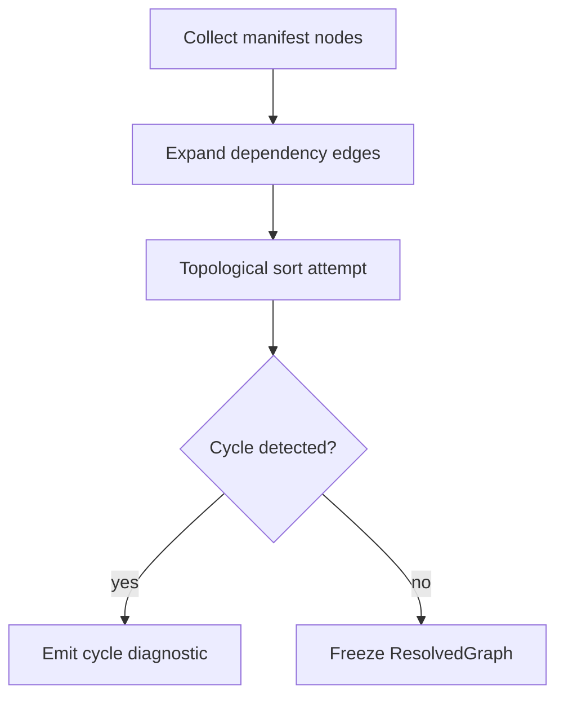

import SpecArticleChrome from '@beskid/beskid-ui/platform-spec/SpecArticleChrome.astro';

<SpecArticleChrome />

## Build algorithm

1. Parse each member `Project.proj` and register a graph node (package id + project type).
2. Add edges for registry and path dependencies; normalize path roots against workspace policy.
3. Run cycle detection on the directed graph; apply configured severity.
4. Expose `ResolvedGraph` to `build_compile_plan_with_policy` and doc workspace scan.
5. **`Mod`** nodes trigger additional capability validation before the graph is considered sound.

## Anchored code paths

- `beskid_analysis::projects::graph::resolver`
- `compiler/crates/beskid_tests/src/projects/corelib/`
- `compiler/crates/beskid_cli/src/commands/doc.rs`
