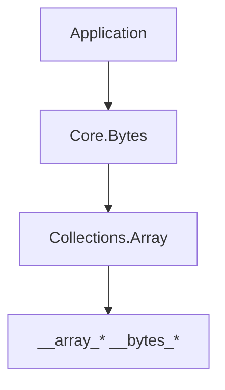

import SpecArticleChrome from '@beskid/beskid-ui/platform-spec/SpecArticleChrome.astro';

<SpecArticleChrome />

## Module layout

| Module | Role |
| --- | --- |
| `Core.Bytes` | Re-export hub |
| `Core.Bytes.Errors` | `BytesError` variants |
| `Core.Bytes.Slice` | `Len`, `Get`, `Set`, `Copy`, `Compare`, `Fill`, `SubSlice`, `New` |
| `Core.Bytes.Convert` | Thin helpers delegating to `Core.Encoding.Utf8` |

## Layering

## Related topics

- [Contracts and edge cases](./contracts-and-edge-cases/)
- [Core.Encoding](/platform-spec/core-library/foundation-and-primitives/core-encoding/)
