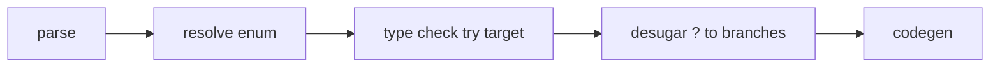

import SpecArticleChrome from '@beskid/beskid-ui/platform-spec/SpecArticleChrome.astro';

<SpecArticleChrome />

## Compile pipeline placement



## Try expression algorithm (normative)

1. **Parse try expression** — `expr?` becomes `TryExpression { expr }`.
2. **Type-check operand** — The operand must be a `Result`-shaped enum (typically `Core.Results.Result<_, _>` with `Ok` / `Error` variants).
3. **Validate try target** — `TypeInvalidTryTarget` (**E1222**) if the operand is not a Result-shaped enum.
4. **Infer success payload** — On the `Ok` path, unwrap the success payload type into the expression context.
5. **Infer failure path** — On the `Error` path, return or translate to the enclosing error type.
6. **Desugar in HIR** — Lowering rewrites `?` using the resolved scrutinee enum (variant names from that enum), not hard-coded identifier strings.
7. **Re-resolve after desugar** — The typed-HIR spine runs resolve, normalize (including `?` desugar), re-resolve, then type-check.

## Lowering `?` to branches

```mermaid
flowchart TB
    try[expr?]
    temp[let temp = expr]
    match[match temp]
    ok[Ok(v) => v]
    err[Error(e) => return Error(e)]
    try --> temp --> match --> ok
    match --> err
```

## LSP / incremental

Re-run try expression checking when the operand expression type or the enclosing function return type changes.
