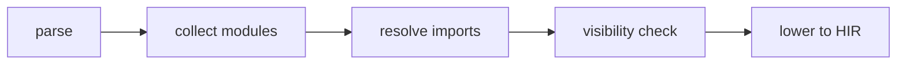
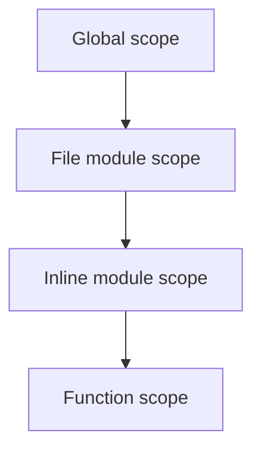

import SpecArticleChrome from '@beskid/beskid-ui/platform-spec/SpecArticleChrome.astro';

<SpecArticleChrome />

## Compile pipeline placement

## Module graph algorithm (normative)

1. **Parse module declarations** — `ModuleDeclaration` stores `path` and `visibility`. `InlineModule` stores nested `items`.
2. **Build file-scoped modules** — If a file starts with `mod path;`, that path becomes the file's module identity. `FileScopedModuleNotFirstItem` (**E1505**) if not first. `DuplicateFileScopedModule` (**E1506**) if multiple.
3. **Derive path modules** — Files without file-scoped `mod` derive module identity from their path relative to the source root.
4. **Build inline modules** — `mod name { items }` creates a nested module scope.
5. **Resolve imports** — `use Path;` and `use Path as Alias;` bind imported symbols. `UnknownImportPath` (**E1105**) for invalid paths. `AmbiguousImport` (**E1104**) for conflicts.
6. **Check visibility** — Accessing a private item from another module emits `VisibilityViolationImportPrivate` (**E1501**) or `ResolvePrivateItemInModule` (**E1107**).
7. **Check re-exports** — `pub use` must refer to accessible items.

## Scope chain

## LSP / incremental

Re-run module and visibility analysis when `mod`, `use`, or `pub` declarations change.
