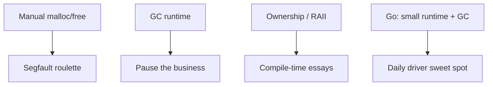

Memory management is where languages stop pretending to be philosophy and start being **accounting**.

## Manual memory — freedom and felony

`malloc` / `free` (and friends) put **you** in charge.

- **Pros:** Predictable when you are competent; minimal runtime; embeddable.
- **Cons:** Use-after-free, double-free, leaks, and that special Friday feeling when prod segfaults and the core dump is your autobiography.

Manual memory is correct for **kernels, drivers, and tight embed**. It is a **liability** for the average business service maintained by rotating humans.

## Garbage collection — the industry's pacifier

GC says: **keep allocating; we will clean up later.**

- **Pros:** Fewer footguns; faster feature velocity; saner onboarding.
- **Cons:** Pauses, memory overhead, tuning, and mysterious latency when someone allocates like it is a competitive sport.

Java and .NET normalized GC for enterprise. That was a legitimate trade: **ship features**, pay **ops tax** later.

## RAII and ownership — discipline as language feature

**RAII** (C++): destruction tied to scope—deterministic cleanup if you structured life correctly.

**Ownership** (Rust): compile-time rules so you cannot double-free—also you cannot double-mutate-borrow without the compiler sending a **personal essay**.

Rust's model is intellectually beautiful. The management layer of your company does not care about your **double mutable borrow** drama. They care that **invoice #4471** updated twice because two handlers raced—GC or not, ownership or not, **that** is the bug that gets you paged.

Ownership solves **memory** and some **concurrency** classes. It does not solve **organizational** concurrency: two teams, one database, no design doc.

## Why Go is the best *approach* for many apps (with honest cons)

Go picked **GC + small runtime + boring syntax**. For services that mostly move JSON and SQL, that is the sweet spot:

| Go strength | Why it matters daily |
| --- | --- |
| Fast compile | CI stays a tool, not a lifestyle |
| Simple deployment | Single binary, fewer moving parts |
| GC you accept | Less memory lawyer, more feature work |
| Concurrency primitives | Good enough for IO-bound glue |

### Go cons (especially at scale)

- **No enforced conventions in the language.** `go fmt` is not architecture. Large repos drift into **package anarchy** without strong review culture.
- **Error handling repetition** scales into noise; teams invent wrappers that become their own framework.
- **Generics arrived late**; years of `interface{}` trauma left scars.
- **Large codebases** without discipline become **copy-paste microservices** with shared `util` packages of doom.
- **Not ideal** when you need deep compile-time abstraction or domain modeling beyond structs and interfaces.

Go proves most teams want **GC and a small runtime**, not a proof assistant. Beskid agrees on the **runtime shape** direction; it disagrees on stopping at **structs and social conventions** when the language could carry more **compile-time truth**.

## Where Beskid lands (preview)

- **AOT-native** output—performance without JIT surprise bills.
- **Compile-time metaprogramming** over reflection—power without opaque runtime discovery.
- Memory strategy aligned with **application reality**, not kernel driver reality (details in platform-spec execution/core-library hubs).

Next: [1.8 Why are we making this so hard?](/book/00-why-beskid-exists/why-are-we-making-this-so-hard/).
