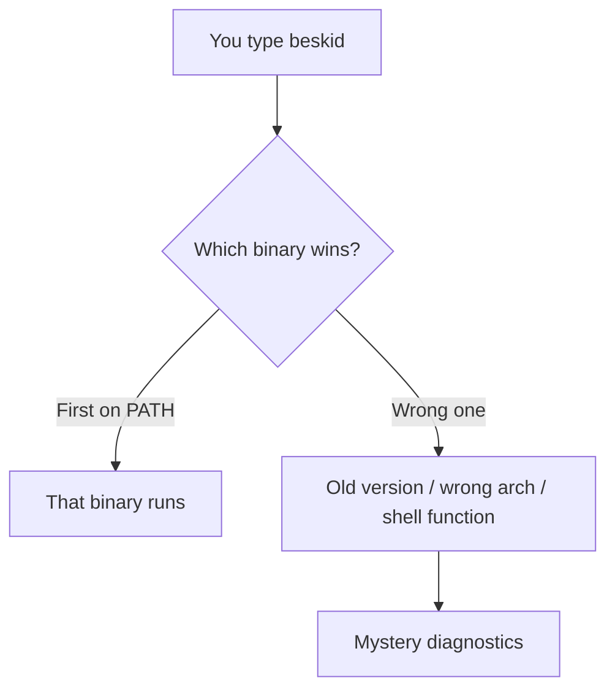

Installing a compiler is two problems: **get bytes onto disk** and **convince your shell to run those bytes** instead of the haunted binary from 2019 in `/usr/local/bin`.

## Install scripts (high level)

The Downloads page exposes platform tabs with a copy-paste command block. Scripts generally:

1. Detect OS/arch (or ask you to pick the right asset).
2. Download the release artifact (GitHub or CDN mirror).
3. Place `beskid` in a predictable directory (often user-local).
4. Print instructions to add that directory to `PATH`.

Follow the tab for your platform on [Downloads](/downloads/); do not cargo-cult a macOS curl line on WSL unless you enjoy surprise architecture mismatches.

## PATH — the silent failure mode

After install, open a **new** terminal (or `source` your profile). Then:

```bash
which beskid
beskid --version
```

If `which` points somewhere unexpected, you have competition:



Common fixes:

- Put the install directory **before** stale paths in `PATH` (profile or `direnv`).
- Remove duplicate installs you forgot about.
- On macOS, check whether Rosetta vs native arch matches the downloaded build.

## Corelib materialization (first run)

On launch, the CLI ensures the **bundled corelib** tree is available and may print a short message when it materializes or updates a copy. Override with `BESKID_CORELIB_SOURCE` when developing against a different corelib checkout (see [CLI command reference](/book/reference/cli/command-reference/)).

That is not "install failed"—it is the toolchain making standard library sources reachable.

## Next

[Build from source](/book/01-it-works-on-my-machine/build-from-source/)
