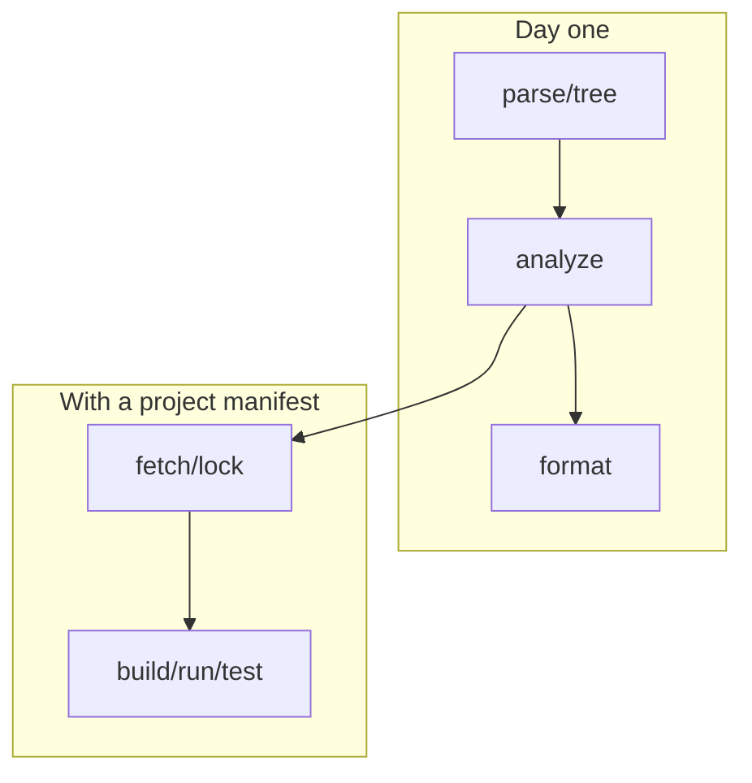

The CLI is the ground truth. Editors are a pretty face on the same pipeline.

## Global behavior

- Response files: `@file` expansion (Rust `argfile` convention).
- Failures: diagnostic report (miette) + non-zero exit unless noted.
- Corelib: implicit in every project, no `use` statement required; `BESKID_CORELIB_SOURCE` only matters if you are developing the standard library itself.

Full tables: [CLI command reference](/book/reference/cli/command-reference/).

## Commands you will actually press

| Command | Why you care |
| --- | --- |
| `parse` / `tree` | "Did the parser see my file?" |
| `analyze` | Semantic diagnostics before you blame codegen |
| `format` | Stop formatting debates |
| `fetch` / `lock` / `update` | Dependencies and reproducibility |
| `build` / `run` | AOT-compile (and, for `run`, execute the resulting binary in a subprocess) |
| `test` | Discover and run `test` items in-process |
| `new` | Templates for projects/workspaces/items |
| `doc` | `api.json` + markdown API output |
| `corelib` | Materialize the embedded corelib template, for standard library development |
| `pckg` | Registry client when you publish packages |

`run` is not a scripting shortcut: it compiles ahead of time and links a real binary, then executes it. The only commands that skip that step are `test`, which runs test items in-process, and `repl`, for interactive snippet evaluation.



## Project-scoped flags

When a manifest exists, prefer explicit roots while learning:

```bash
beskid analyze --project ./App.bproj --target App
```

`--frozen` / `--locked` participate in resolution policy; see [fetch](/book/reference/cli/commands/fetch/) and [lock](/book/reference/cli/commands/lock/).
