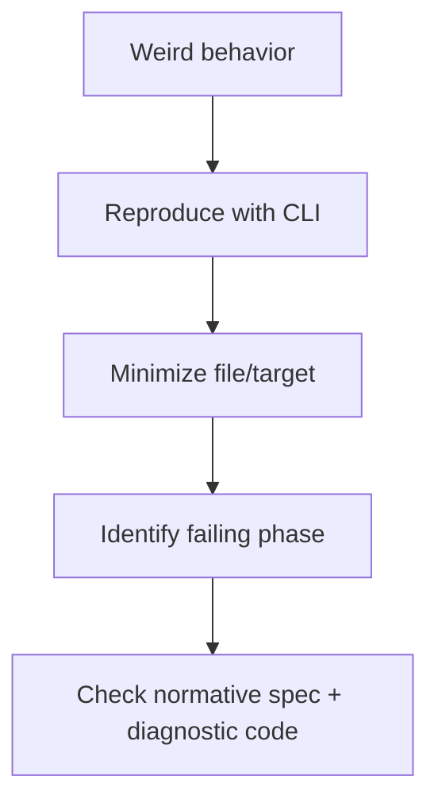

Compiler output should tell you **which phase failed**, not dump an entire IR forest because you typoed one identifier.

## Pipeline progress model

Beskid compiler work is structured into **phases** reported through the shared pipeline model (`beskid_pipeline` phase IDs in the Rust workspace). CLI and analysis surfaces should align with those phases rather than ad-hoc `println!` spam in random crates.

When debugging "why is this slow," look for:

- Which phase repeats (resolution vs semantic vs codegen)
- Whether you are analyzing the whole workspace vs one target

Exact flags evolve with the CLI—cross-check [CLI command reference](/book/reference/cli/command-reference/) and per-command pages (`analyze`, `build`, `run`).

## Practical habits

1. **Reproduce with CLI first** — smaller surface than editor caches.
2. **Shrink the project** — one target, one file, one diagnostic.
3. **Record versions** — `beskid --version`, extension version, git commit if local build.
4. **Compare locked vs floating resolution** — `--frozen` / `--locked` when dependency drift is suspect.

## LSP observability

For editor-only issues, see [LSP testing and observability](/book/reference/lsp/testing-and-observability/) in the reference tree.

## Next

[Reference deep dives](/book/02-path-not-found-tooling-anyway/reference-deep-dives/)
