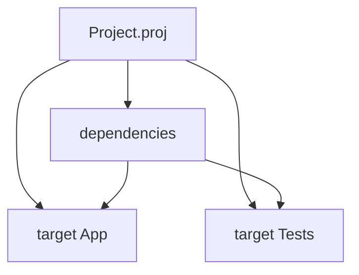

Targets are how you tell the truth about **what** gets built. A repo without targets is just a folder that gaslights CI.

## Target kinds

| `kind` | Typical use |
| --- | --- |
| `App` | Executable entry (`entry` → main module file) |
| `Lib` | Library surface consumed by dependents |
| `Test` | Test harness entry for `beskid test` |

`kind` and `source` on dependencies are enum-like—prefer unquoted identifiers (`App`, `path`) for tooling alignment.

## Entry paths

`entry` is relative to `project.root` (default `Src`). If you set `root = "src"` because you hate consistency, every entry path moves with it—do not mix mental models.

## Multiple targets

Real projects often define both `App` and `Test` (and several libs). CLI commands accept `--target` to select which graph root you mean:

```bash
beskid build --project ./Project.proj --target App
beskid test --project ./Project.proj --target Tests
```



## Outputs and `obj/`

Materialized dependencies land under `obj/beskid/` (layout details in [build workflow](/book/reference/projects/build-workflow/)). Treat `obj/` as generated unless you enjoy merge conflicts.

## Standard reference (informative)

- [Project manifest contract](/platform-spec/tooling/manifests-and-lockfiles/project-manifest-contract/)
- [Build workflow](/book/reference/projects/build-workflow/)

## Next

[`beskid new`](/book/03-project-proj-or-it-didnt-happen/beskid-new/)
