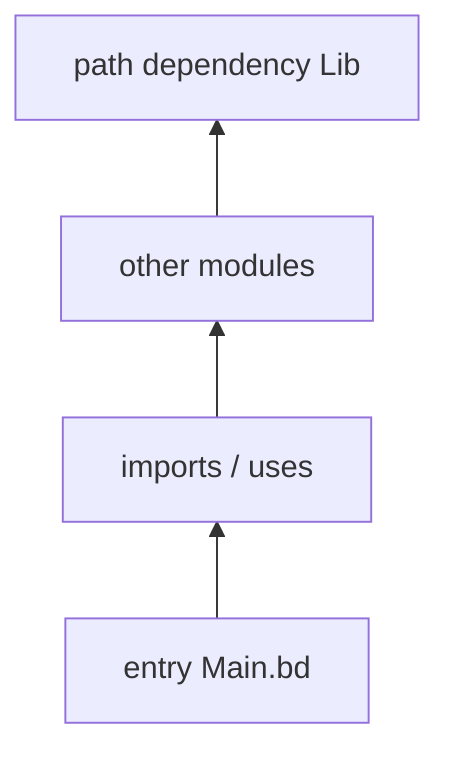

A **target** selects an entry and pulls in the module graph needed to build it. You do not "compile the repo" as an undifferentiated blob—unless you enjoy O(n²) surprise.

## Entry-driven builds

`target.entry` points at a `.bd` file under `project.root`. That entry module anchors reachability analysis: dependencies of the target plus transitive modules from path dependencies.

## Libraries vs apps

- **`App`** — you care about runnable output and main lifecycle.
- **`Lib`** — you care about exported surface consumed by other projects.
- **`Test`** — harness entry; keeps test-only modules out of production graphs when structured well.

## Multiple targets, multiple graphs

Targets can share source files but differ in entry and dependency sets. Changing one target's `entry` does not magically retarget another—explicit `--target` always.

## Analyzer vs builder

`beskid analyze` and `beskid build` share semantic understanding; failures should reproduce across CLI and LSP when roots match. Start analysis on the smallest target while learning.

## Reference

- [Build workflow](/book/reference/projects/build-workflow/)
- [Semantic analysis](/book/reference/analysis/semantic-analysis/)

## Next

[Visibility basics](/book/04-where-does-this-file-go/visibility-basics/)
