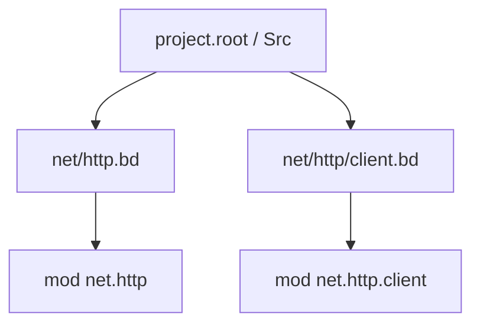

Modules are how humans navigate code. The compiler will enforce the graph whether or not your folders look pretty.

## One file, one module

Default rule: module identity follows the file path relative to `project.root` unless you override with a file-scoped declaration.

Optional file-scoped form at the top of a file:

```beskid
mod net.http;
```

That declares the **entire file** lives in `net.http`. Additional `mod` declarations are **not allowed** in that file—boundaries stay explicit.

## Inline vs file-scoped

| Style | When |
| --- | --- |
| File-scoped `mod a.b;` | Stable package-like files, API surfaces |
| Path-derived module | Quick scripts, small tools |
| Inline `pub mod` (non-file-scoped files) | Nested modules inside a parent file |

## Folder patterns

Map `domain.feature` → `domain/feature.bd` or nested folders as your tree convention demands—stay consistent within a repo so imports do not become a personality test.



## Tutorial pattern

1. Start a boundary file with `mod domain.feature;`.
2. Keep implementation files under matching folders.
3. Re-export only stable types/functions at the boundary (chapter [05](/book/05-names-nobody-agreed-on/)).

## Standard reference (informative)

- [Modules and Visibility](/platform-spec/language-meta/program-structure/modules-and-visibility/)

## Next

[Compilation units](/book/04-where-does-this-file-go/compilation-units/)
