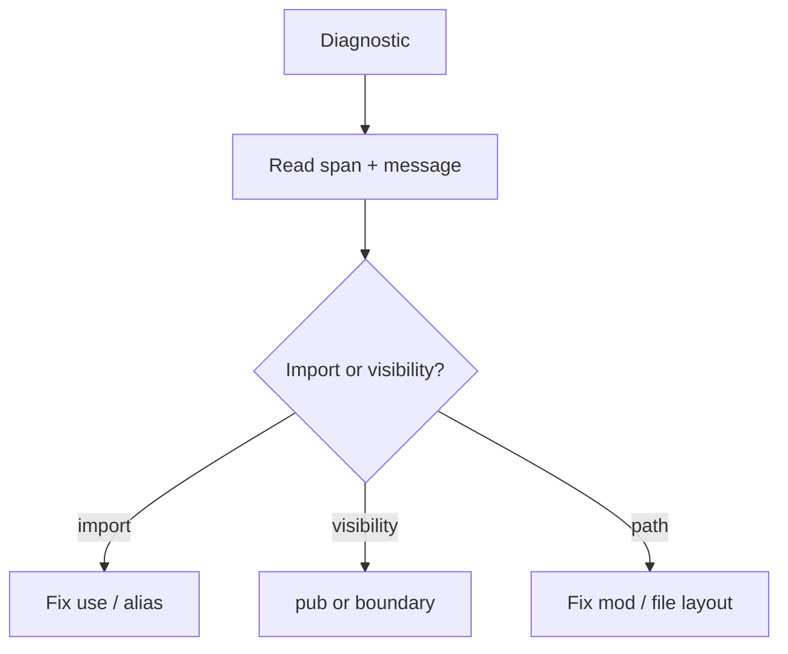

If you only read one page in this chapter, read this. These diagnostics are your daily companions.

## Ambiguous import (E1104)

**Symptom:** two imports expose the same name.

**Fix:** alias at least one (`use a.Parser as AParser`).

<Aside type="caution">

Do not "fix" ambiguity by deleting random imports until the error disappears. You will just ship the wrong `Parser`.

</Aside>

## Unresolved name (E1101)

**Symptom:** symbol not found in scope.

Checklist:

1. Typo in identifier
2. Missing `use`
3. Symbol not `pub` in defining module
4. Wrong module path vs file layout

## Unknown import path (E1105)

**Symptom:** the path in a `use` statement does not resolve to any module at all.

This is a hard error: the compiler stops resolving that import instead of guessing and cascading into a pile of unrelated E1101s. Fix the path first; everything downstream usually clears on its own.

## Missing import (E1109)

**Symptom:** a symbol exists and is `pub`, but nothing imports it into the current scope.

**Fix:** add the `use`. The compiler will not infer it from you having typed the name once elsewhere.

## Cannot access private item (E1107)

**Symptom:** using something that exists but is not exported.

**Fix:** mark `pub` at the definition (if it should be API) or stop reaching into another module's internals.

## File-scoped module violations

**Symptom:** extra `mod` in a file-scoped module file.

**Fix:** move nested modules to another file or drop the file-scoped declaration.

## Reading the report

CLI and LSP share miette-style reports. Read:

- **Span**: which file/line
- **Code**: diagnostic id when present, cross-referenced in the [diagnostic code registry](/platform-spec/compiler/semantic-pipeline/diagnostic-code-registry/)

