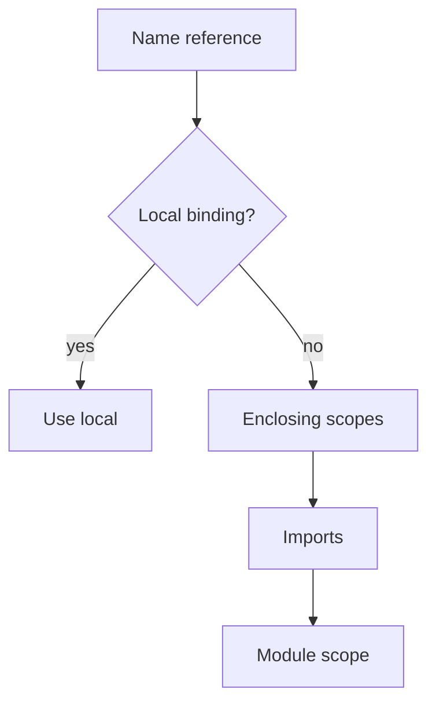

Name resolution is the compiler answering **which declaration did you mean?** When the answer is "more than one," you get an ambiguity error—this is a feature.

## Expression lookup order

1. Local scope (parameters, `let` bindings)
2. Enclosing scopes
3. Imports (including aliases)
4. Module scope

## Ambiguity

If two imports provide the same **unaliased** name, the compiler errors. Fix with `as` aliases—do not rely on import order to "win."

## Imports do not override locals

Assuming `use Foo;` lets you shadow a local `Foo` is a fast path to embarrassment. Locals win.

## Cross-module paths

Fully qualified paths follow module nesting declared by files and `mod` statements. When lost, `beskid analyze` with a one-file repro beats staring at folders.

## Standard reference (informative)

- [Name Resolution](/platform-spec/language-meta/program-structure/name-resolution/)

## Next

[pub use re-exports](/book/05-names-nobody-agreed-on/pub-use-reexports/)
