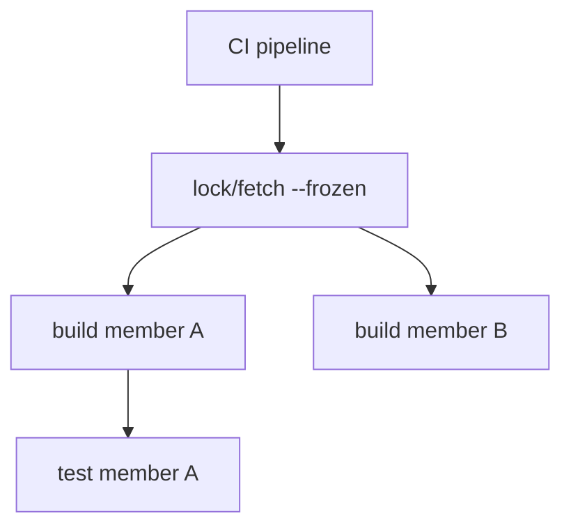

CI for monorepos is where "works on my machine" goes to die publicly. Good.

## Lock discipline

Run `lock` / `fetch` in CI with `--frozen` (or project-equivalent flags) so manifest drift fails the pipeline instead of production.

Commit **per-project** `Project.lock` files (and workspace-level lock artifacts if your layout uses them; follow the [lockfile guide](/book/reference/projects/lockfile/)).

## Matrix strategy

| Approach | Pros | Cons |
| --- | --- | --- |
| One job per member | Clear failures | More CI minutes |
| Single job builds all | Cheaper | Harder to see who broke |
| Affected detection | Fast at scale | Needs tooling investment |

Start simple: build `App` and run `Test` target for each member you ship.

## Path deps in CI

Checkout must include all member folders referenced by relative paths. Shallow clones that omit `libs/` are a classic self-own.

## Superrepo note

The Beskid superrepo itself is an aggregate of submodules; your application monorepo is a smaller cousin. Same lesson: **pin tool versions** (`beskid --version` in logs).

See also [workspace monorepo setup](/book/reference/workspace-monorepo/) and [workspace and lock contracts](/platform-spec/tooling/manifests-and-lockfiles/workspace-and-lock-contracts/).
