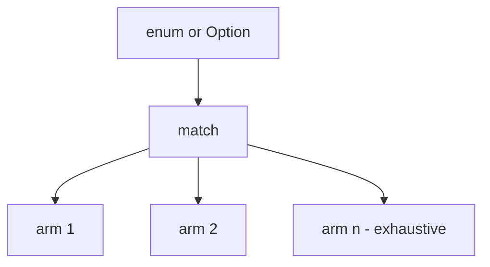

Control flow is how programs admit they have **choices**. Beskid expects you to make those choices explicit enough for the analyzer to follow.

## `if`

Standard conditional binding—exact grammar in [lexical and syntax](/platform-spec/language-meta/surface-syntax/lexical-and-syntax/). Do not use `if` to simulate nullable checks; narrow `Option<T>` with `match`.

## `match`

`match` is the honest tool for enums and `Option<T>`:

- Exhaustive arms are a feature, not bureaucracy
- Combine with [enums and match](/platform-spec/language-meta/type-system/enums-and-match/) for algebraic types

## Loops and fibers

Iteration and concurrency primitives live under evaluation features ([fibers and spawn](/platform-spec/language-meta/evaluation/fibers-and-spawn/) etc.). This tutorial does not pretend to be the concurrency bible—read spec before spawning threads because a blog post said async.

## Control flow vs effects

Branching across contract boundaries may interact with effect tracking—when in doubt, `beskid analyze` and read the diagnostic rather than guessing.

## Next

[Read a diagnostic](/book/07-compiler-is-not-your-therapist/read-a-diagnostic/)
