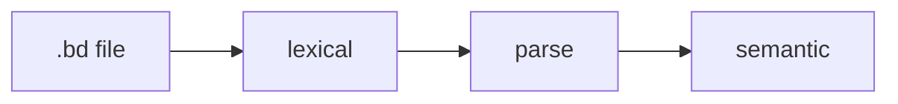

Before types, the lexer decides whether your file is even **language** or performance art.

## Surface shape (informative)

Beskid source uses familiar C-family cues:

- Identifiers and keywords
- Braces and semicolons where the grammar demands
- Line and block comments (`//`, `/* */` per spec)
- String and numeric literals (exact lexical rules: [lexical and syntax](/platform-spec/language-meta/surface-syntax/lexical-and-syntax/))

## Modules still matter lexically

File-scoped `mod` must appear as the first top-level item when used. The parser assumes structure before semantic phases attach module identity.

## Documentation comments

`///` doc comments attach to declarations; `@arg` belongs on **callable parameters** only—not fields you felt like documenting. Tutorial on docs arrives later; normative: [documentation comments](/platform-spec/language-meta/surface-syntax/documentation-comments/).

## Escape hatch

When the lexer/parser disagrees with you, shrink to a five-line file and run:

```bash
beskid parse tiny.bd
beskid tree tiny.bd
```



## Next

[Types and generics](/book/07-compiler-is-not-your-therapist/types-and-generics/)
