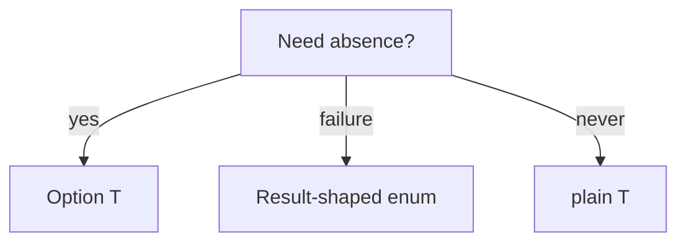

Beskid types are **nominal** and **static**. The compiler is not impressed by your dynamic enlightenment phase.

## Core ideas (v0.1 sketch)

- Records, enums, contracts as declared types
- Generics on types and methods where the grammar allows
- Prefix `mut` for reassignable locals and parameters (`mut i64 x`, `let mut x`)
- No `null` literal, no `optional` keyword—see [Option](/book/07-compiler-is-not-your-therapist/option-and-nullability/)

## Generics

Think `List<T>`, `Map<K,V>`, `Option<T>`—parameterized types must be explicit at boundaries; inference helpers exist but will not save you from ambiguous APIs (see [type inference](/platform-spec/language-meta/type-system/type-inference/)).

## Method dispatch

Instance calls resolve per [method dispatch](/platform-spec/language-meta/type-system/method-dispatch/) rules—no `null` receivers; use `Option<T>` + `match`.

## Decision tree

## Standard reference (informative)

- [Types](/platform-spec/language-meta/type-system/types/)
- [Enums and match](/platform-spec/language-meta/type-system/enums-and-match/)

## Next

[Option and nullability](/book/07-compiler-is-not-your-therapist/option-and-nullability/)
