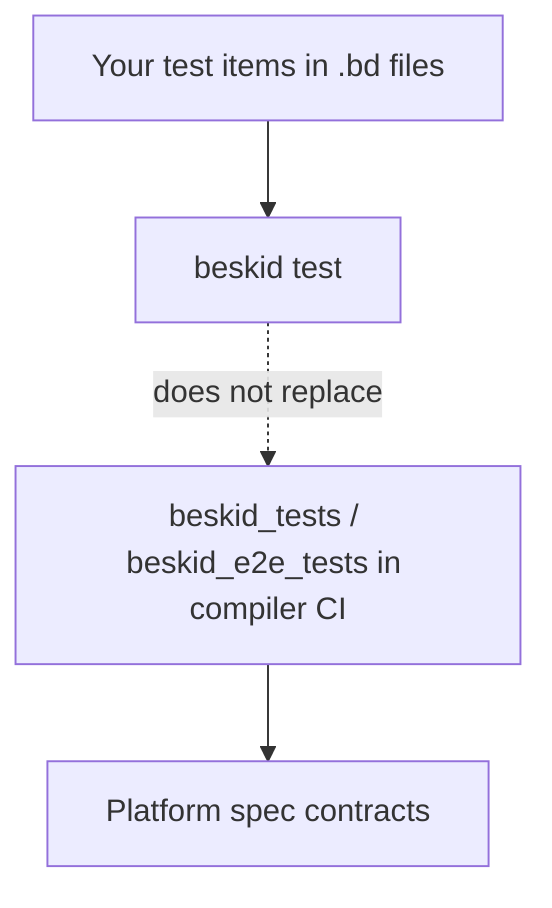

Two different questions:

1. **Does my package behave?** — your `test` items, your CI job.
2. **Does Beskid still mean what the spec says?** — `beskid_tests`, `beskid_e2e_tests`, and the [Conformance](/platform-spec/compiler/conformance/) area.

Confusing them is how you ship a green app on a red language.

## Your unit and integration tests

- Authored as `test` items in **your** repos.
- Run with `beskid test` and your tags/groups.
- Prove **your** contracts, parsers, and business rules.

## Platform conformance harnesses

The reference compiler workspace (`compiler/Cargo.toml`) includes:

| Crate | Role |
| --- | --- |
| `beskid_tests` | Fixture-heavy behavior locks, incremental/mod scheduling |
| `beskid_e2e_tests` | End-to-end CLI and pipeline scenarios |

Normative policy: [Conformance evidence](/platform-spec/compiler/conformance/conformance-evidence-policy/), [Test harnesses and fixtures](/platform-spec/compiler/conformance/test-harnesses-and-fixtures/).

## When to contribute upstream

If you found a **language** or **compiler** bug (diagnostic code wrong, spawn lowering changed, manifest resolution drift), add or extend a conformance fixture in `compiler/` **and** update the spec in the same change set ([spec leads code](/platform-spec/community/spec-maintenance/spec-authority-and-decisions/)).

## Next

[CI and testing](/book/08-green-tests-red-production/ci-testing/)
