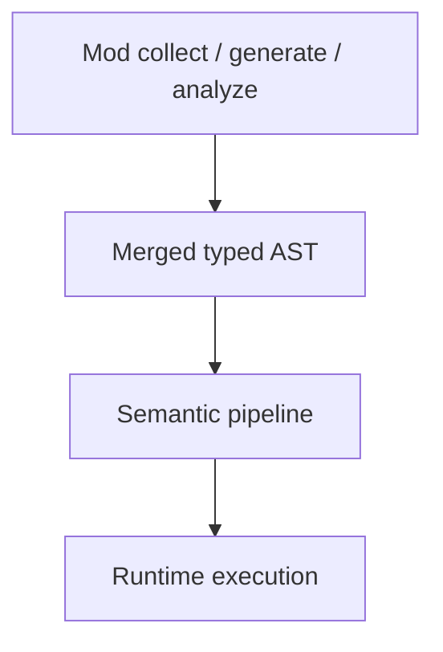

"Effects" in Beskid are not a monad tutorial. They are **boundaries**: what happens at compile time in mods, what happens at runtime in fibers and syscalls, and what the type system can prove before you ship.

## Compile-time effects (mods and macros)

[Metaprogramming](/platform-spec/language-meta/metaprogramming/metaprogramming/) is explicit:

- Mod work runs through **AOT-compiled** `type: Mod` artifacts—no interpreted Beskid at compile time except via linked mod entrypoints.
- Generators emit **typed AST**; analyzers register rewrites; hosts merge and re-parse under bounded rounds.
- Those effects are **compile-time only**; they become ordinary program semantics after lowering.

## Runtime effects

User-visible runtime behavior—**spawn**, channel IO, syscall-backed console, FFI—lives under [Evaluation](/platform-spec/language-meta/evaluation/), [Execution runtime](/platform-spec/execution/runtime/), and [Core library](/platform-spec/core-library/). The language does not pretend `println` is pure; it routes IO through documented surfaces ([panic-io and syscalls](/platform-spec/execution/runtime/panic-io-and-syscalls/)).

## Purity (pragmatic, not academic)

Beskid does not ship Haskell-style `IO` tracking in v0.x tutorials. Practical purity guidance:

| Prefer | When |
| --- | --- |
| Pure functions + explicit `Result` | Domain logic you unit-test |
| `spawn` + channels for concurrency | Cross-fiber communication ([Fibers and spawn](/platform-spec/language-meta/evaluation/fibers-and-spawn/)) |
| `extern` / `[Extern]` only at boundaries | Native libraries with profile rules ([FFI and extern](/platform-spec/language-meta/interop/ffi-and-extern/)) |

## Area hub

Full index: [Contracts and effects](/platform-spec/language-meta/contracts-and-effects/).

## Next

[Panic vs contract](/book/09-contracts-effects-and-polite-threats/panic-vs-contract/)
