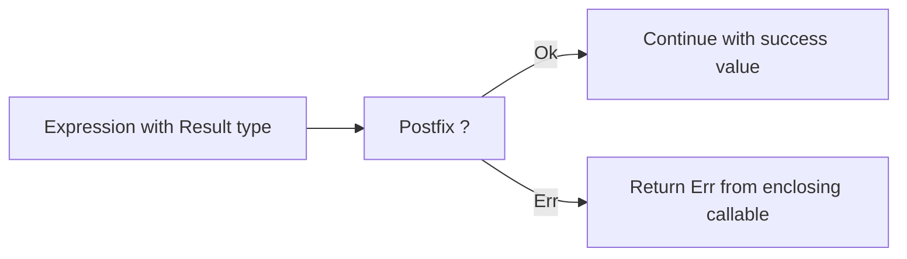

Beskid does not resurrect C# exceptions for breakfast. Recoverable failures are **values** you pattern-match, propagate with **`?`**, and translate at boundaries.

## `Result` and friends

Normative rules: [Error handling](/platform-spec/language-meta/contracts-and-effects/error-handling/).

- Model errors as **`enum`** variants (`Ok` / `Err` or domain-specific shapes).
- **`Option<T>`** is the optional type—there is no `optional` keyword.
- Postfix **`?`** on a `Result`-like expression: success unwraps; `Err` returns or translates from the current function.

## FFI and envelopes

At foreign boundaries, errors become **ABI envelopes**—no silent throw across the wall. See [Interop contracts](/platform-spec/language-meta/interop/interop-contracts/) and [Error and unwind semantics](/platform-spec/language-meta/interop/interop-contracts/error-and-unwind-semantics/).

## What you should do in application code

| Practice | Why |
| --- | --- |
| Named error enums per domain | Callers can handle variants without string archaeology |
| `?` for happy-path plumbing | Less nesting than manual `match` everywhere |
| Translate at module boundaries | Keep internal `Err` types out of public APIs |

## Diagnostics

Type and flow mistakes surface as compiler diagnostics in the **E16xx** band (contract-related) and analysis rules tied to [semantic pipeline](/platform-spec/compiler/semantic-pipeline/).

## Next

[Contracts in source](/book/09-contracts-effects-and-polite-threats/contracts-in-source/)
