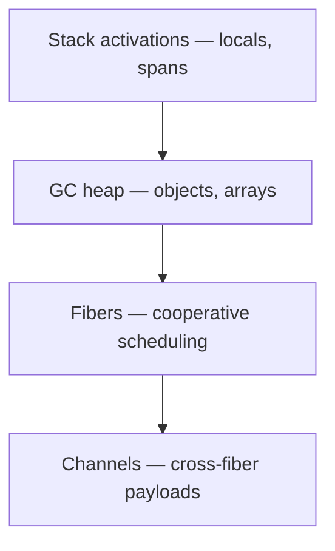

Beskid memory law answers three questions without hand-waving:

1. Where do **locals** live?
2. What is **heap** and who collects it?
3. What may **fibers** share without data races cosplaying as features?

Normative article: [Memory and references](/platform-spec/language-meta/memory-model/memory-and-references/). Collector algorithms defer to [Memory and GC runtime contract](/platform-spec/execution/runtime/memory-and-gc-runtime-contract/) (the `/execution/` tree is a legacy bridge—platform-spec is authoritative).

## Locals and mutability

- Locals live in **function activation records** unless captured by closures ([Lambdas and closures](/platform-spec/language-meta/evaluation/lambdas-and-closures/)).
- Reassignment requires prefix **`mut`** (`mut i64 x = …`, `let mut x = …`) where the reference compiler enforces it (**E1214** when you cheat).

## Heap and GC

Reference types and arrays live on the **GC-managed heap**. The runtime uses a concurrent collector story (tri-color heap work lives under `abfall` in the workspace—see execution ADRs like [ABFALL tri-color heap](/platform-spec/execution/runtime/memory-and-gc-runtime-contract/adr/0006-abfall-tri-color-heap/)).

## Parameter passing

- Parameters pass **by value** in v0.1; use return values or heap/`T[]` handles when callers need updated state.
- Cross-fiber sharing of mutable state goes through **channels**, not shared stacks ([Fibers and spawn](/platform-spec/language-meta/evaluation/fibers-and-spawn/)).

## Domain map

- [Memory model area](/platform-spec/language-meta/memory-model/)
- [Execution runtime](/platform-spec/execution/runtime/)

## Next

[Stack, heap, and spans](/book/10-memory-without-billion-dollar-mistake/stack-heap-and-spans/)
