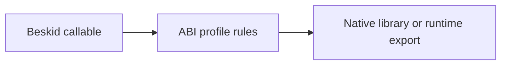

Preview means **read the spec before you ship**. User Beskid is not a daily `unsafe` language; interop is **`[Extern]` contracts**, manifests, and profiles.

## User-facing: FFI and extern

Normative hub: [FFI and extern](/platform-spec/language-meta/interop/ffi-and-extern/).

- Declare foreign surfaces with **`[Extern(...)] contract`** patterns aligned to [Interop contracts](/platform-spec/language-meta/interop/interop-contracts/).
- Link native libraries through tooling ([Foreign library import](/platform-spec/tooling/foreign-library-import/)) and C ABI profiles ([C ABI profile](/platform-spec/language-meta/interop/c-abi-profile/)).
- Errors cross boundaries as **envelopes**, not thrown exceptions ([Error and unwind semantics](/platform-spec/language-meta/interop/interop-contracts/error-and-unwind-semantics/)).

## Host-facing: Rust `unsafe`

Inside `compiler/crates/beskid_runtime`, builtins use `#[unsafe(no_mangle)] pub extern "C-unwind"`—see [Builtins and symbols](/platform-spec/execution/abi-and-host/builtins-and-symbols/). That is **platform maintenance**, not a tutorial pattern for app authors.

## JIT and dynamic loading (engine)

`beskid_engine` may expose platform-specific dynamic resolution paths marked **Proposed** in spec—do not assume Standard behavior without reading the profile ADRs ([C ABI dynamic resolution](/platform-spec/language-meta/interop/c-abi-profile/adr/0003-dynamic-resolution-proposed/)).

## Practical rule

If you typed `unsafe` because you were angry at the type checker, stop. If you need native code, write a thin `extern` boundary and test it like an adversary.

## Next chapter

[11. Fibers: cheaper than threads, still scary](/book/11-fibers-cheaper-than-threads/)
