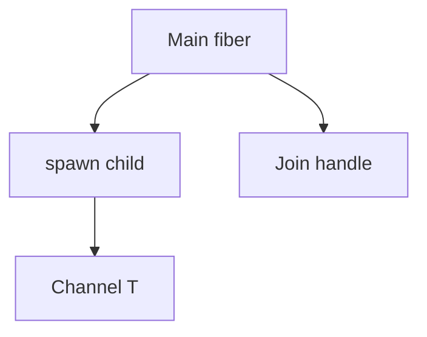

Evaluation in Beskid is **callable-centric**: functions, methods, closures—with control flow and types checked before lowering. Concurrency is **explicit spawn**, not hidden schedulers behind `await`.

## Callables and closures

- Functions and methods are the default unit of work.
- Closures capture environment; captures participate in **GC rooting** when fibers are involved.
- See [Lambdas and closures](/platform-spec/language-meta/evaluation/lambdas-and-closures/) for capture rules.

## No `async` / `await`

The language **rejects** reserved `async` / `await` tokens. Structured concurrency uses:

- **`spawn`** → `Fiber<T>`
- **`Join`** for `Result<T, FiberError>`
- **Channels** for cross-fiber payloads
- **WaitGroup**, **Hub** for coordination ([Concurrency package](/platform-spec/core-library/concurrency/concurrency-package/))

## Compiler anchors

| Crate | Role |
| --- | --- |
| `beskid_analysis` | Spawn typing, capture diagnostics |
| `beskid_codegen` | `fiber_spawn`, stack maps |
| `beskid_engine` / `beskid_runtime` | Scheduler, stacks |

## Area hub

[Evaluation](/platform-spec/language-meta/evaluation/)

## Next

[Fibers and spawn](/book/11-fibers-cheaper-than-threads/fibers-and-spawn/)
