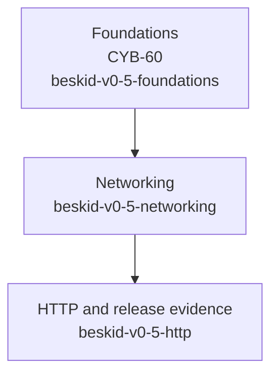

:::caution[Planned release work — not a shipped API reference]
This page records the
v0.5 Foundations delivery boundary as of the current planning revision. It does
not define language or core-library behaviour, and it does not promise that the
names or APIs below compile today. OpenSpec changes become authoritative only
after their accepted deltas are applied to canonical `openspec/specs`.
:::

## Why foundations come first

The v0.5 networking release is intentionally split at executable dependency
boundaries. Portable sockets and HTTP need a scheduler that can safely accept
external wakeups, timers, resource ownership, and typed cross-fiber values. A
temporary detached-worker, scalar-channel, or wall-clock-timeout shortcut would
be a second runtime design to remove later.

The release-level coordination record is
[CYB-59](https://linear.app/cybernomad-it/issue/CYB-59/coordinate-beskid-05-networking-release).
The Foundations conformance gate is
[CYB-60](https://linear.app/cybernomad-it/issue/CYB-60/05-foundations-executable-fibers-ownership-deadlines-and-coreio).
CYB-60 must have its required evidence before the networking gate begins.

## Planned dependency order

`beskid-v0-5-foundations` is the active proposed OpenSpec change. The networking
and HTTP identifiers are planned follow-on change IDs. None is an accepted
platform-spec capability until its deltas are reviewed and applied to canonical
`openspec/specs`; this page remains informative throughout.

## Foundation scope under planning

| Area | Planned outcome | Why networking depends on it |
| --- | --- | --- |
| Fibers | A bindable `spawn` expression and typed `Fiber<T>` result ownership | Socket and server work needs joinable, cancellable work with typed completion. |
| Channels | Generic payload transport that preserves GC tracing and resource ownership | Requests, completions, and buffers cannot be reduced to scalar-only messages. |
| Scheduler | Owner-routed external wakes, wait accounting, monotonic timers, and deadlines | Reactors and DNS completion must wake the correct scheduler without blocking it. |
| Resource scopes | Lexical `use` cleanup through an explicit disposal contract | Native-backed resources need deterministic cleanup on normal and exceptional exits. |
| Bytes and encoding | Hardened bounds, overlap, and invalid-input handling | Network protocols start with untrusted byte streams and encoded text. |
| Core.IO | Planned reader, writer, closer, stream, exact-read, and write-all contracts | Networking and HTTP need one portable stream vocabulary rather than ad hoc syscall paths. |

The table is a release-planning map, not an API checklist. In particular, it
does not establish method signatures, error variants, ownership rules, or
compatibility guarantees.

## Deliberate release boundaries

v0.5 Foundations is a prerequisite, not a partial networking surface. The
following remain outside the planned release chain: TLS, HTTP/2, HTTP/3, QUIC,
WebSocket, client pooling, proxy stacks, multipart streaming, transparent
compression, DNS caching, Unix-domain sockets, raw sockets, multicast
configuration, async iterators, and channel `select`.

## What makes the gate credible

Before CYB-60 can unblock networking, the planned Foundations change must carry
OpenSpec requirements and scenarios, focused compiler/runtime/corelib tests,
and available JIT, AOT, and native-target evidence. The future networking and
HTTP changes must validate independently; the final release evidence is owned
by `beskid-v0-5-http`, not backfilled into Foundations.

For the distinction between this planning material and enforceable behaviour,
see [Informative vs normative](/book/12-the-normative-bible/informative-vs-normative/)
and [How to propose a change](/book/12-the-normative-bible/how-to-propose-a-change/).
