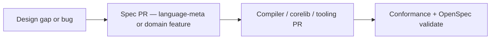

Tests prove the **current** implementation. They do not replace missing contract text. **Spec leads code** means:

> If you change what valid Beskid means or what the CLI must do, you update [Platform specification](/platform-spec/) in the same change set (or immediately before merge).

Authority: [Specification authority and embedded decisions](/platform-spec/community/spec-maintenance/spec-authority-and-decisions/).

## Practical workflow

1. Classify the topic ([language law vs implementation](/book/12-the-normative-bible/language-law-vs-implementation/)).
2. Extend the owning **feature hub** or article—no circular "canonical chapter is this page" stubs.
3. Anchor crates in [implementation map](/platform-spec/compiler/implementation-map/) when touching `compiler/`.
4. Land tests in `beskid_tests` / `beskid_e2e_tests` when behavior is platform-wide.

## Anti-patterns

| Anti-pattern | Why it hurts |
| --- | --- |
| "Docs follow-up ticket" | Shipped behavior without law |
| README-only normative rules | Not searchable, not validated |
| Copy-paste tables across domains | Drift within a sprint |

## Next

[Language law vs implementation](/book/12-the-normative-bible/language-law-vs-implementation/)
