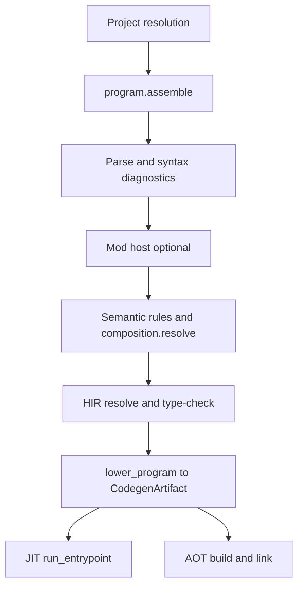

Mirror of the normative [Build pipeline overview](/platform-spec/compiler/build-pipeline/)—same flow, book voice.

## Crate map

| Stage | Primary crates |
| --- | --- |
| Resolution / graph | `beskid_analysis` (`projects`), `beskid_cli` |
| Parse / syntax | `beskid_analysis` (`syntax`, `parser`) |
| Mod host | `beskid_analysis` (`mod_host`) |
| Semantic rules | `beskid_analysis` (`analysis`) |
| Lowering | `beskid_codegen` |
| JIT | `beskid_engine`, `beskid_runtime`, `beskid_abi` |
| AOT | `beskid_aot` |
| Phase IDs | `beskid_pipeline` |

## CLI entry

`beskid build`, `beskid run`, `beskid analyze` orchestrate subsets—contract: [Build / analyze / run](/platform-spec/tooling/cli/build-analyze-run-contract/).

## Diagnostics parity

LSP analysis should match CLI phases for the same snapshot ([LSP diagnostics](/platform-spec/tooling/lsp/diagnostics-and-workspace-analysis/)).

## Next

[Front-end](/book/14-from-source-to-runs/front-end/)
