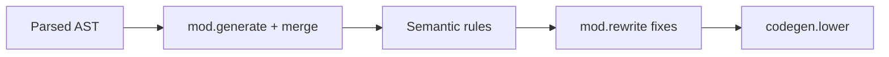

Parsing proves you speak Beskid syntax. **Semantic analysis** proves you meant something allowed.

## Rules pipeline

Hub: [Rules pipeline contract](/platform-spec/compiler/semantic-pipeline/rules-pipeline-contract/).

- Staged rules in `beskid_analysis::analysis::rules::staged`
- Diagnostic codes in [Diagnostic code registry](/platform-spec/compiler/semantic-pipeline/diagnostic-code-registry/)
- Language-meta bands (e.g. **E16xx** contracts) referenced, not duplicated

## Mod phases (semantic-adjacent)

After optional **generate/merge/reparse**, mods run **analyze** and **rewrite** on the merged program:

- [Mod host bridge](/platform-spec/compiler/compiler-mods/mod-host-bridge/)
- [Analysis, query, and diagnostics facades](/platform-spec/compiler/compiler-mods/analysis-query-diagnostics-facade/)

## `beskid analyze`

Runs analysis without requiring a successful JIT—your CI friend for "no, you cannot call that."

Book reference: [Semantic analysis](/book/reference/analysis/semantic-analysis/), [Semantic rules](/book/reference/analysis/semantic-rules/).

## Next

[Codegen and IR](/book/14-from-source-to-runs/codegen-and-ir/)
