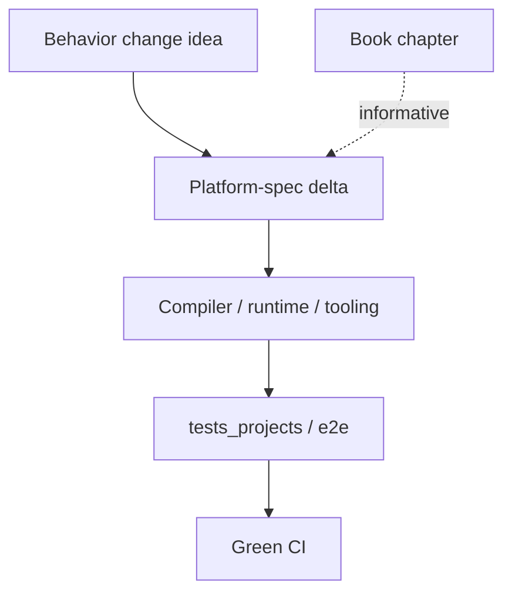

<Aside type="caution">
This chapter is **informative**. Governance and enforceable process live under [Community / spec maintenance](/platform-spec/community/spec-maintenance/).
</Aside>

You read twenty-one chapters. You have opinions. Good. Beskid is not built by people who nod through enterprise standups without screaming internally.

This chapter is the **on-ramp for contributors**: where repos live, how spec-first workflow avoids "surprise, we changed language law in a drive-by PR," and how to run tests without declaring war on CI.

Start with [Repos and submodules](/book/22-so-you-want-to-contribute/repos-and-submodules/) for the layout, then [Spec-first workflow](/book/22-so-you-want-to-contribute/spec-first-workflow/) before touching observable behavior. [Compiler contributor path](/book/22-so-you-want-to-contribute/compiler-contributor-path/) and [Conformance and tests](/book/22-so-you-want-to-contribute/conformance-and-tests/) cover crates and evidence; [Docs and website](/book/22-so-you-want-to-contribute/docs-and-website/) covers the book and platform-spec split; [CI and green builds](/book/22-so-you-want-to-contribute/ci-and-green-builds/) covers Woodpecker steps and retained logs. [Contact](/book/22-so-you-want-to-contribute/contact/) has the maintainer reach-out.

<Aside type="tip">
**Maintainer:** Piotr Mikstacki
- **Email:** [pmikstacki@cybernomad.it](mailto:pmikstacki@cybernomad.it)
- **GitHub:** [@pmikstacki](https://github.com/pmikstacki)
- **Site:** [pmikstacki.me](https://pmikstacki.me)
- **LinkedIn:** see [Contact](/book/22-so-you-want-to-contribute/contact/) — profile URL not pinned in repo yet.
</Aside>

## Finish the book

[Appendix: Spec map](/book/appendix-spec-map/) is the chapter-to-spec-to-crates matrix.
