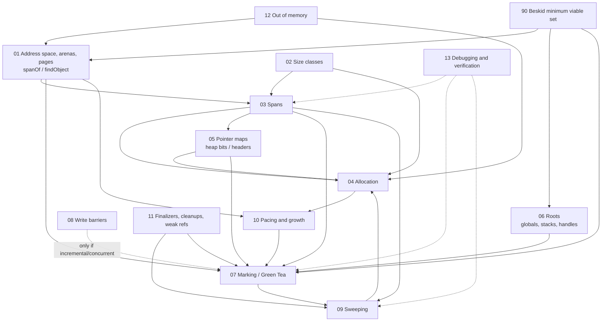

# Span-based non-moving mark-sweep GC: component reference

Date: 2026-09-22
Status: research reference (no builds, no code changes)
Audience: the Beskid v0.5 runtime heap design; cite documents by path, file names are stable.

## Purpose

This directory is a component-by-component reference for a page/span-based, non-moving, mark-sweep garbage collector in the style of the Go runtime, including the "Green Tea" span-queued marking algorithm that became the default in Go 1.26. It describes every component such a collector needs, how Go implements each one, what other non-moving collectors do instead, and what a single-threaded, cooperative-fiber, JIT/AOT-compiled runtime like Beskid's should keep, simplify, or drop.

Sources were read directly, not recalled from memory. Go citations are to the Go 1.26.5 tree (`GOROOT=/opt/homebrew/Cellar/go/1.26.5/libexec`); `runtime/mheap.go:268` means `$GOROOT/src/runtime/mheap.go` line 268 in that release. Beskid citations of the form `Runtime.Mem.Gc.State` refer to `compiler/runtime/beskid/src/Runtime/Mem/Gc/State.bd`; the ISLE root emission is `compiler/crates/beskid_isle/src/context/roots.rs`.

## How to read it

Every component document uses the same template:

1. Purpose
2. Data structures (field-level layout)
3. Algorithm (pseudocode)
4. Invariants
5. Concurrency notes
6. How Go does it (cited, with source file paths)
7. Alternatives in other collectors
8. Beskid adaptation (keep / simplify / drop, and why)
9. References

Read `01` to `05` for the heap (memory layout, allocation, metadata), `06` to `08` for marking (roots, the marker, barriers), `09` and `10` for reclamation and pacing, `11` to `13` for the periphery, and `90` for the decision summary. A reader designing the Beskid heap can start at `90` and follow links back.

## Documents

| File | One-line summary |
|------|------------------|
| [01-address-space-and-pages.md](01-address-space-and-pages.md) | 8 KiB pages, aligned arenas, the arena map, the page allocator, and the address-to-span lookup (`spanOf`, `findObject`). |
| [02-size-classes.md](02-size-classes.md) | The size-class table, rounding, internal fragmentation bounds, division by magic, scan/noscan span classes, and the tiny allocator. |
| [03-spans.md](03-spans.md) | The `mspan` record field by field, allocation and mark bitmaps, the sweep-generation protocol, span states, and the span lifecycle. |
| [04-allocation.md](04-allocation.md) | The allocation fast path (`ctz` on the allocation cache), the slow path through per-P cache, central lists, and heap, large objects, and lazy zeroing. |
| [05-pointer-maps.md](05-pointer-maps.md) | Heap pointer bitmaps in the span, malloc headers, type-data tiling, the `typePointers` iterator, and interior pointers. |
| [06-roots-and-stack-maps.md](06-roots-and-stack-maps.md) | Globals, goroutine stacks with compiler-emitted stack maps and liveness, safe points, stack objects, conservative fallback, runtime roots; contrast with explicit root registration. |
| [07-marking-green-tea.md](07-marking-green-tea.md) | Tri-color marking, work buffers, Green Tea's span queue with per-span marks and scans bits, the single-object shortcut, the dense SIMD path, and mark termination. |
| [08-write-barriers.md](08-write-barriers.md) | The Dijkstra/Yuasa hybrid barrier, the write-barrier buffer, memory ordering, and when a STW or cooperative collector can omit barriers. |
| [09-sweeping.md](09-sweeping.md) | Per-span sweep (bitmap swap, specials, zombies), lazy versus eager sweeping, the span reclaimer, proportional sweep, returning empty spans. |
| [10-pacing-and-growth.md](10-pacing-and-growth.md) | GOGC, heap goal and trigger, runway and assists, the soft memory limit, forced periodic collection, and heap growth. |
| [11-finalization-and-weak-refs.md](11-finalization-and-weak-refs.md) | Specials, finalizers, cleanups, weak handles, their marking and sweeping rules, and whether Beskid needs them. |
| [12-out-of-memory.md](12-out-of-memory.md) | How growth failures surface, the fatal versus typed-trap contract, and what the diagnostic record should carry. |
| [13-debugging-and-verification.md](13-debugging-and-verification.md) | Checkmarks, invalid-pointer and zombie checks, clobbering, tracing, heap dumps, stress modes. |
| [90-beskid-minimum-viable-set.md](90-beskid-minimum-viable-set.md) | The essential component set for Beskid v0.5, what to simplify, what to defer, and the open decisions (roots: stack maps versus growable root stack). |

## Component dependency diagram

ASCII reading of the same graph: address space (01) and size classes (02) define spans (03); spans plus pointer maps (05) define allocation (04); roots (06), pointer maps (05), and spans (03) feed marking (07); marking feeds sweeping (09), which feeds allocation (04) back with free slots; pacing (10) decides when marking starts, using allocation and heap-size signals; barriers (08) are a conditional input to marking; finalization (11) hooks both marking and sweeping; out-of-memory (12) and debugging (13) are cross-cutting.

## Glossary

| Term | Meaning in this reference |
|------|---------------------------|
| Page | The unit of span management, 8 KiB in Go (`PageShift = 13`); not the OS page. |
| Arena | An aligned block of address space (64 MiB on 64-bit Linux/macOS) with one `heapArena` metadata record holding the page-to-span table and per-span bitmaps. |
| Span (`mspan`) | A run of whole pages holding objects of one size class (or one large object), with its own alloc/mark bitmaps and free index. |
| Size class | One of about 67 object sizes; every small object is rounded up to a class so a span holds equal-sized slots. |
| Span class | Size class plus a `noscan` bit; pointer-free objects live on separate spans. |
| Slot / element | One object-sized region of a span; `nelems` slots per span. |
| `freeindex` | The slot index at which the next free-slot search starts; `allocCache` caches 64 inverted alloc bits from there so `ctz` finds a free slot. |
| Alloc bits / mark bits | Per-slot bitmaps: allocated as of the last sweep or since; marked during the current cycle. Sweep replaces alloc bits with mark bits. |
| Heap bits | One bit per pointer-sized word saying "this word is a pointer"; stored at the end of small-object spans in Go. |
| Malloc header | A `*_type` stored in the first word of an allocation slot for objects over 512 bytes; large objects keep the type in the span. |
| Tri-color | White = not seen; gray = seen, not scanned; black = scanned. Marking ends with no gray. |
| Weak tri-color invariant | Any white object pointed to by a black object is reachable from a gray object via white pointers; maintained by Go's hybrid barrier. |
| Shade | Mark an object and, if it has pointers, put it on a work list (make it gray). |
| Work buffer (`workbuf`) | A 2 KiB block of gray object pointers; the classic LIFO gray stack. |
| Green Tea | Go 1.26's marking algorithm: queue small-object spans (FIFO) instead of objects; each span has `marks` (seen) and `scans` (scanned) bits; scan `marks &^ scans` in bulk. |
| Representative | The object whose discovery enqueued a span; scanned alone if no other object was marked while the span was queued (the "hit flag" or `spanScanOneMark`). |
| Oblet | A 128 KiB chunk of a large object, scanned as a separate work item. |
| Root | A pointer held outside the heap: globals, stack slots, registers, host handles, runtime tables. |
| Stack map | A compiler-emitted bitmap per safe point saying which stack slots (locals, args) hold live pointers. |
| Safe point | A PC at which the stack map is valid and the thread may be stopped for scanning; in Go every call site. |
| Root stack / root table | An explicit runtime-maintained list of addresses of pointer slots; the alternative to stack maps; what Beskid uses today. |
| Write barrier | Code the compiler emits around pointer stores so the mutator cannot hide an object from a concurrent or incremental marker. |
| Sweep | Turning mark bits into free slots, span by span; lazy (on demand) or eager (all at once). |
| `sweepgen` | A per-span generation number compared against the heap's to know whether a span is unswept, being swept, or swept; a CAS on it gives a sweeper exclusive ownership. |
| Heap goal | The heap size at which the next cycle should finish: live heap plus (live heap + roots) x GOGC/100. |
| Trigger | The heap size at which the next cycle starts; goal minus estimated runway. |
| Assist | Marking work a Go goroutine does itself in proportion to what it allocates during a cycle. |
| Special | A per-span record attached to an object at an offset: finalizer, cleanup, weak handle, profile record, pin counter. |
| Specials list | The per-span sorted linked list of specials. |
| Checkmark | A debug mode that re-marks the heap into a shadow bitmap during STW and compares. |
| Zombie | A slot with its mark bit set but its alloc bit clear; evidence of a dangling pointer. |
| Fiber | Beskid's cooperative unit of execution; switches only at known points, one OS thread. |

## Source bibliography

Primary Go sources (Go 1.26.5, `$GOROOT/src`):

- `runtime/malloc.go` (allocator hierarchy, virtual memory layout, arena constants, `mallocgc` and its size-specialized paths, tiny allocator comment, `sysAlloc`)
- `runtime/mheap.go` (`heapArena`, `mheap`, `mspan`, span states, `spanOf`, `spanOfHeap`, `arenaIndex`, `grow`, `allocSpan`, `freeSpan`, specials, mark-bit arenas)
- `runtime/mpagealloc.go` (page allocator bitmap and radix-tree summaries)
- `runtime/mcentral.go`, `runtime/mcache.go` (central span sets, per-P cache, `refill`, `cacheSpan`, `allocLarge`)
- `internal/runtime/gc/sizeclasses.go`, `internal/runtime/gc/malloc.go`, `runtime/msize.go` (size-class table, `MinSizeForMallocHeader`, `MallocHeaderSize`)
- `runtime/mbitmap.go` (heap bitmaps, malloc headers, `typePointers`, `findObject`, `badPointer`, `nextFreeIndex`, `bulkBarrierPreWrite`)
- `runtime/mgc.go` (GC phase design comment, `gcStart`, `gcMarkDone`, `gcMarkTermination`, `gctrace`, triggers)
- `runtime/mgcmark.go` (`gcMarkRootPrepare`, `markroot`, `scanstack`, `scanframeworker`, `scanConservative`, `scanobject`, `greyobject`, `gcDrain`, assists, `gcmarknewobject`)
- `runtime/mgcmark_greenteagc.go` (Green Tea: inline mark bits, ownership, span queue, SPMC chain, `scanSpan`, `spanSetScans`, dense kernel dispatch)
- `runtime/mgcwork.go` (work buffers, queue priorities)
- `runtime/mbarrier.go`, `runtime/mwbbuf.go` (hybrid write barrier, per-P barrier buffer)
- `runtime/mgcsweep.go` (sweeper design, `mspan.sweep`, `sweepone`, `bgsweep`, zombies, clobber)
- `runtime/mgcpacer.go` (pacer constants, `gcControllerState`, `heapGoal`, `trigger`)
- `runtime/mfinal.go`, `runtime/mcleanup.go` (finalizers, cleanups, semantics)
- `runtime/stack.go`, `runtime/stkframe.go`, `runtime/symtab.go`, `runtime/mgcstack.go`, `runtime/preempt.go` (stack maps at runtime, `getStackMap`, `stackmap`, stack objects, async safe points)
- `runtime/mcheckmark.go`, `runtime/runtime1.go`, `runtime/heapdump.go` (checkmarks, GODEBUG knobs, heap dump)
- `cmd/compile/internal/liveness/plive.go` (liveness analysis, `OpVarDef`, unsafe points, stack-map emission, clobberdead)
- `internal/abi/symtab.go` (`PCDATA_*` and `FUNCDATA_*` identifiers)

Design documents and articles:

- Go blog, "The Green Tea Garbage Collector" (2025): https://go.dev/blog/greenteagc
- Green Tea design issue, golang/go#73581: https://github.com/golang/go/issues/73581
- Go GC guide: https://go.dev/doc/gc-guide
- GC pacer redesign (proposal 44167): https://github.com/golang/proposal/blob/master/design/44167-gc-pacer-redesign.md
- Eliminate STW stack re-scanning / hybrid write barrier (proposal 17503): https://github.com/golang/proposal/blob/master/design/17503-eliminate-rescan.md
- Dijkstra, Lamport, Martin, Scholten, Steffens, "On-the-fly garbage collection: an exercise in cooperation", CACM 21(11), 1978 (cited by `runtime/mgc.go`)
- Boehm-Demers-Weiser conservative collector, algorithmic overview: https://hboehm.info/gc/gcdescr.html
- Blackburn and McKinley, "Immix: A Mark-Region Garbage Collector with Space Efficiency, Fast Collection, and Mutator Performance", PLDI 2008: https://www.steveblackburn.org/pubs/papers/immix-pldi-2008.pdf

Beskid sources (current runtime, for the adaptation sections):

- `compiler/runtime/beskid/src/Runtime/Mem/Gc/{State,Allocation,Marking,RootsHandles,Sweep,Collection}.bd`
- `compiler/runtime/beskid/src/Runtime/Mem/AbiValue.bd`
- `compiler/runtime/beskid/src/Runtime/Fiber/Scheduler.bd` and submodules
- `compiler/crates/beskid_isle/src/context/roots.rs`
- `compiler/crates/beskid_codegen/src/module_emission/orchestration.rs` (runtime helper imports: `gc_register_root`, `gc_unregister_root`, `beskid_rt_v5_managed_object_allocate`)
