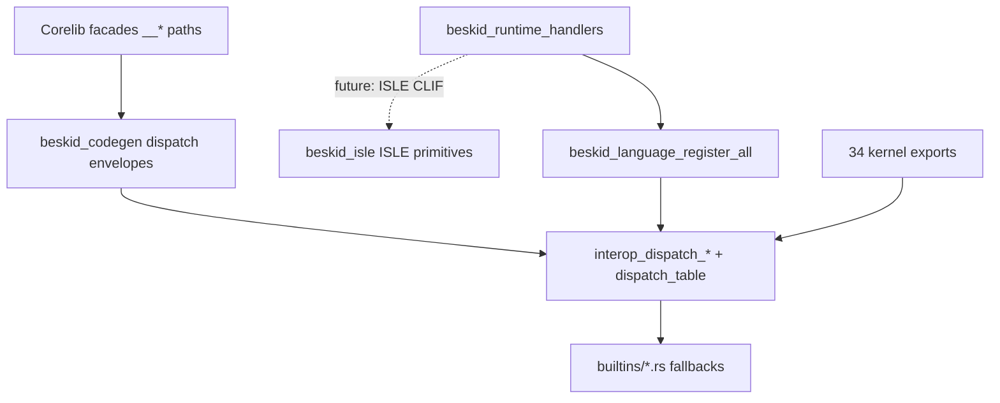

# ISLE Runtime Port — Design

**Status:** Approved
**Date:** 2026-07-11
**Owner:** Piotr Mikstacki
**Plan:** `docs/superpowers/plans/2026-07-11-isle-runtime-port.md`

## 1. Context & problem statement

ABI v4 keeps **34 frozen kernel exports** in Rust (`beskid_runtime`) while routing ~77 soft dispatch ops through `interop_dispatch_*` envelopes. Language-owned dispatch bodies live today in `beskid_runtime/src/builtins/*.rs` as static fallbacks. Host-owned ops register via `beskid_host_register_all()` before user entry.

The approved boundary (`beskid-isle-stock-clif`) adds a **second ISLE layer** at the runtime-handler compilation seam: trusted primitives lower to **stock Cranelift CLIF** via `FunctionBuilder`, without forking Cranelift or adding custom opcodes. General HIR→CLIF lowering in `beskid_codegen` stays hand-written Rust.

## 2. Goals & non-goals

### Goals

1. **`beskid_isle` crate** — ISLE rules + `Context` impl emitting verifiable stock CLIF for a minimal primitive catalog.
2. **Language handler registration** — mirror `beskid_host` pattern: manifest metadata → generated wrappers → `beskid_language_register_all()` at std-profile startup.
3. **Cohort 1 vertical** — `bytes_compare`, `str_eq`, `test_bytes_len`, `test_bytes_ptr` execute via registered handlers with parity tests; Rust fallbacks gated behind `rust_fallback_handlers`.
4. **Migration roadmap** — documented cohorts C1–C5 for remaining language-owned dispatch ops.
5. **Single source of truth preserved** — `runtime_manifest.bsol` → `beskid_manifest` → ABI / analysis / runtime / codegen chain intact.

### Non-goals

- Replacing general expression lowering with ISLE (deferred).
- Porting kernel exports (`alloc`, `gc_*`, `fiber_yield`, `interop_dispatch_*`).
- Porting fibers, channels, GC, composition, syscalls, host-owned ops in this milestone.
- Forking Cranelift or inventing custom CLIF opcodes.
- Self-hosted Beskid compilation of all handler bodies (foundation only; Rust handlers for cohort 1).

## 3. Architecture



### Authority chain (must not break)

```
runtime_manifest.bsol
  → beskid_manifest (codegen.rs)
    → beskid_abi (BUILTIN_SPECS, dispatch tags)
    → beskid_analysis (builtins.inc.rs)
    → beskid_runtime (dispatch_table.rs)
    → beskid_codegen (declare_builtin_imports, dispatch.rs)
```

Normative anchors:

- [D-EXEC-ABI-0003](https://beskid-lang.org/platform-spec/execution/abi-and-host/builtins-and-symbols/adr/0003-builtin-specs-sole-clif-source/) — `BUILTIN_SPECS` sole CLIF import source
- [D-EXEC-RT-0017](https://beskid-lang.org/platform-spec/language-meta/interop/rust-abi-profile/adr/0017-runtime-host-split-v4/) — ABI v4 language/host split
- [D-CORE-COMP-0010](https://beskid-lang.org/platform-spec/core-library/compiler-integration/corelib-injection-and-resolution/adr/0010-runtime-registration-authority/) — registration init order

## 4. ISLE primitive catalog

Initial `beskid_isle/isle/primitives.isle` terms (extensible):

| Term | CLIF emitted | Safety preconditions |
|------|--------------|----------------------|
| `iconst_i64` | `iconst.i64` | — |
| `load_i64` | `load.i64` at offset | base pointer valid for read |
| `store_i64` | `store.i64` at offset | base pointer valid for write |
| `load_i8` | `load.i8` + `uextend` | bounded offset |
| `ptr_add` | `iadd_imm` on pointer | imm within object bounds (caller) |
| `icmp_eq` / `icmp_ne` | `icmp` | — |
| `bounded_memcmp` | loop of `load.i8` + `icmp` | `len` bounded; pointers valid |

All emitted functions pass `cranelift_codegen::verify_function`. No new `ExternalName` conventions; handlers needing `__alloc` call through normal Beskid codegen imports.

Feature flag: `isle_primitives` on consuming crates for staged rollout.

## 5. Handler registration ABI

Language handlers mirror host wrappers:

```rust
unsafe extern "C" fn language_dispatch_bytes_compare(enum_ptr: *const u8) -> i64 {
    // decode envelope payload at offset 16
    crate::bytes_compare(left, right) as i64
}

const LANGUAGE_HANDLERS: [HandlerTableEntry; N] = [
    HandlerTableEntry { group: 3, tag: 0, fn_ptr: language_dispatch_bytes_compare as *const u8 },
    // ...
];

#[unsafe(no_mangle)]
pub extern "C-unwind" fn beskid_language_register_all() -> i32 {
    beskid_runtime::beskid_register_handlers(
        u64::from(beskid_abi::BESKID_RUNTIME_ABI_VERSION),
        LANGUAGE_HANDLERS.as_ptr(),
        LANGUAGE_HANDLERS.len() as u64,
    )
}
```

### Init order (std profile)

1. `scheduler_init()`
2. `bootstrap_dispatch_handlers()` — empty override table
3. `beskid_host_register_all()` — host-owned tags
4. `beskid_language_register_all()` — language-owned handler overrides
5. User entry / JIT compile

Handler overrides are checked **before** Rust fallback in `dispatch_*` functions via `try_dispatch_*`.

### Manifest metadata

Dispatch blocks gain optional `language_handler = true` marking ops eligible for Beskid/Rust handler implementation. Cohort 1:

| `dispatch_key` | tag | group |
|----------------|-----|-------|
| `bytes_compare` | 0 | i64 |
| `str_eq` | 42 | i64 |
| `test_bytes_len` | 43 | i64 |
| `test_bytes_ptr` | 44 | i64 |

## 6. `[Runtime]` attribute

Corelib handler sources declare:

```beskid
[Runtime(DispatchTag: 0, Returns: I64)]
pub i64 Compare(u8[] left, u8[] right) { ... }
```

Analysis merges attributed entries with manifest rows: validate `DispatchTag` matches manifest tag and `Returns` matches dispatch return group. Manifest remains primary SOT for codegen imports; attributes document handler authority for corelib modules under `Runtime.Handlers.*`.

## 7. Migration cohorts

| Cohort | Examples | Blockers |
|--------|----------|----------|
| **C1 Pure compare/copy** | `bytes_compare`, `str_eq`, `bytes_get` | None — **this milestone** |
| **C2 Allocating leaf** | `bytes_from_str`, `bytes_copy`, `str_slice` | Needs `__alloc` from handlers |
| **C3 Clocks** | `clock_*`, `fiber_now_millis` | OS access |
| **C4 Strings mutate** | `str_concat`, `str_new` | GC + alloc |
| **C5 Stateful** | `fiber_*`, `channel_*`, `gc_*` | Phase A scheduler — **out of scope** |

### Parity requirements

- Existing `beskid_tests` runtime and interop tests pass unchanged.
- New `runtime/beskid_handlers.rs` contract tests: handler override invoked before Rust fallback.
- `cargo test -p beskid_tests abi::contracts` — kernel allowlist unchanged (34 symbols).

### Rust fallback policy

`rust_fallback_handlers` feature (default on) keeps `builtins::*` match arms in generated `dispatch_table.rs`. Disable feature to require registered handlers only; remove fallback after one green release cycle.

## 8. Linking

- **JIT / engine:** `beskid_engine` calls `beskid_language_register_all()` for `RuntimeLinkProfile::Std`.
- **AOT:** `beskid_runtime_bridge` staticlib links `beskid_runtime_handlers` and registers in `beskid_runtime_link_anchor()` alongside host registration.

## 9. Verification gates

| Gate | Command |
|------|---------|
| ISLE crate | `cd compiler && cargo test -p beskid_isle` |
| Manifest codegen | `cd compiler && cargo test -p beskid_manifest` |
| ABI contracts | `cd compiler && cargo test -p beskid_tests abi::contracts` |
| Runtime parity | `cd compiler && cargo test -p beskid_tests runtime::` |
| Corelib | `cd compiler && just corelib` |
| Full compiler | `bash scripts/ci/compiler-rust-gate.sh` |

## 10. Risks & mitigations

| Risk | Mitigation |
|------|------------|
| Dispatch router blast radius | Handler overrides additive; Rust fallback until parity |
| `BUILTIN_SPECS` drift | All surfaces through manifest |
| ISLE build integration | Isolated `beskid_isle`; feature-flag consumers |
| `str_len` codegen fast-path | Documented; only port ops routing through dispatch |
| Spec/code drift | Authoritative file is `runtime_manifest.bsol` |
