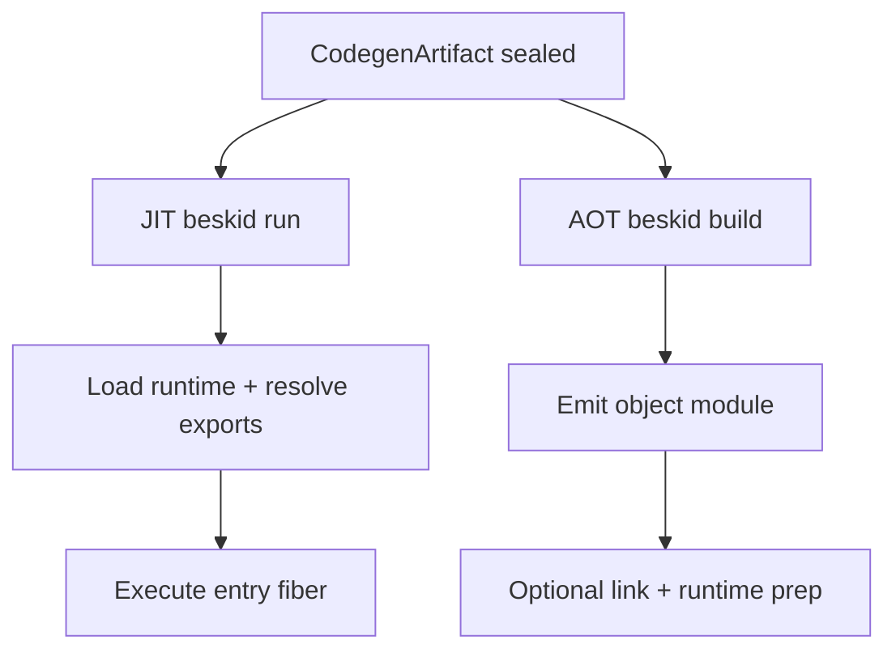
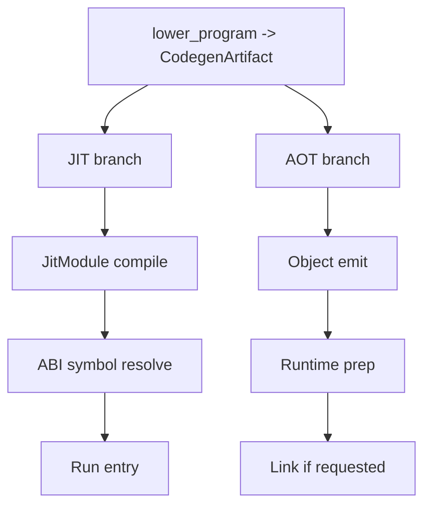

<!-- migrated from the legacy platform spec; canonical OpenSpec source -->
# Backends (JIT and AOT) Specification

## Purpose

Contracts for JIT execution and AOT object/link flows that consume a shared lowering artifact.

## Requirements

### Requirement: Feature hub authority: Decision [D-COMP-BUILD-0001]
The Beskid standard SHALL enforce the following migrated contract section. Accepted ADR decisions are binding; uppercase requirement keywords retain their BCP-14 meaning.

> This feature hub **owns** normative MUST/SHOULD contract text. Sibling articles **must not** redefine hub requirements and **should** link here for authority.

**Stable ID:** `BSP-REQ-76344D316A01`  
**Legacy source:** `site/spec-content/platform-spec/compiler/build-pipeline/backends-jit-aot/adr/0001-feature-hub-authority/content.md`  
**Source SHA-256:** `2bf2b525f2e0bb24376740e4e08fb04a7ce99c032105543ab0c8990aafacfbc1`

#### Scenario: Conformance exercises Decision
- **GIVEN** an implementation claims conformance with this capability
- **WHEN** behavior governed by this contract section is exercised
- **THEN** every MUST, SHALL, REQUIRED, prohibition, and accepted decision in the section is satisfied

### Requirement: Specification over implementation notes: Decision [D-COMP-BUILD-0002]
The Beskid standard SHALL enforce the following migrated contract section. Accepted ADR decisions are binding; uppercase requirement keywords retain their BCP-14 meaning.

> Normative platform-spec prose and ADRs under this feature **supersede** informal comments in implementation crates until explicitly migrated into spec text.

**Stable ID:** `BSP-REQ-C3D8F7D1A384`  
**Legacy source:** `site/spec-content/platform-spec/compiler/build-pipeline/backends-jit-aot/adr/0002-spec-over-implementation-notes/content.md`  
**Source SHA-256:** `81ae3c6b07b225f5b07805021d5f6172956ef30b0f4e790f537e4f71025e1ae0`

#### Scenario: Conformance exercises Decision
- **GIVEN** an implementation claims conformance with this capability
- **WHEN** behavior governed by this contract section is exercised
- **THEN** every MUST, SHALL, REQUIRED, prohibition, and accepted decision in the section is satisfied

### Requirement: Shared CodegenArtifact for JIT and AOT: Decision [D-COMP-BUILD-0003]
The Beskid standard SHALL enforce the following migrated contract section. Accepted ADR decisions are binding; uppercase requirement keywords retain their BCP-14 meaning.

> Both JIT (`beskid_engine::JitModule`) and AOT link flows **must** accept the same schema fields from `beskid_codegen` without forking lowering.

**Stable ID:** `BSP-REQ-CD8B19C86E87`  
**Legacy source:** `site/spec-content/platform-spec/compiler/build-pipeline/backends-jit-aot/adr/0003-shared-codegen-artifact-backends/content.md`  
**Source SHA-256:** `9cdf3332ecbeeb2cb4019aec13798d0e1a693addf80f4f3cd67530adc1aef7e3`

#### Scenario: Conformance exercises Decision
- **GIVEN** an implementation claims conformance with this capability
- **WHEN** behavior governed by this contract section is exercised
- **THEN** every MUST, SHALL, REQUIRED, prohibition, and accepted decision in the section is satisfied

## Informative Source Provenance

The records below preserve migration history and are not normative except where text was extracted into a requirement above.

### Source Record: Backends (JIT and AOT)

**Authority:** informative provenance  
**Legacy path:** `/platform-spec/compiler/build-pipeline/backends-jit-aot/`  
**Source:** `site/spec-content/platform-spec/compiler/build-pipeline/backends-jit-aot/content.md`  
**SHA-256:** `ed109721fcd37a1fbf934b0f54627204af9785ba4b88cf77b6a94b3696c3d7bf`

<details>
<summary>Migrated source text</summary>

``````markdown
This feature hub defines how JIT and AOT diverge after lowering while sharing the same `CodegenArtifact`.

## Implementation anchors
- `compiler/crates/beskid_engine/src/` — JIT execution of `CodegenArtifact` via Cranelift
- `compiler/crates/beskid_aot/src/` — AOT compilation, object emission, and linking
- `compiler/crates/beskid_codegen/src/` — shared `CodegenArtifact` consumed by both backends

## Decisions
<!-- spec:generate:adr-index -->
No open decisions. Closed choices are normative ADRs under **`adr/`** (`D-COMP-BUILD-0001` … `D-COMP-BUILD-0003`); use the reader **ADRs** tab for expandable detail.
<!-- /spec:generate:adr-index -->
## Articles
<!-- spec:generate:article-index -->
- [Backends (JIT and AOT) - Contracts and edge cases](./articles/contracts-and-edge-cases/)
- [Backends (JIT and AOT) - Design model](./articles/design-model/)
- [Backends (JIT and AOT) - Examples](./articles/examples/)
- [Backends (JIT and AOT) - FAQ and troubleshooting](./articles/faq-and-troubleshooting/)
- [Backends (JIT and AOT) - Flow and algorithm](./articles/flow-and-algorithm/)
- [Backends (JIT and AOT) - Verification and traceability](./articles/verification-and-traceability/)
<!-- /spec:generate:article-index -->
``````

</details>

### Source Record: Feature hub authority

**Authority:** informative provenance  
**Legacy path:** `/platform-spec/compiler/build-pipeline/backends-jit-aot/adr/0001-feature-hub-authority/`  
**Source:** `site/spec-content/platform-spec/compiler/build-pipeline/backends-jit-aot/adr/0001-feature-hub-authority/content.md`  
**SHA-256:** `2bf2b525f2e0bb24376740e4e08fb04a7ce99c032105543ab0c8990aafacfbc1`

<details>
<summary>Migrated source text</summary>

``````markdown
## Context

Sibling articles under this feature previously restated requirements in inconsistent forms.

## Decision

This feature hub **owns** normative MUST/SHOULD contract text. Sibling articles **must not** redefine hub requirements and **should** link here for authority.

## Consequences

Contract changes start on the hub or in linked ADRs, then propagate to articles and implementation anchors.

## Verification anchors

- `site/website/src/content/docs/platform-spec/compiler/build-pipeline/backends-jit-aot/index.mdx`
- `article bundle under the same feature directory.`
``````

</details>

### Source Record: Specification over implementation notes

**Authority:** informative provenance  
**Legacy path:** `/platform-spec/compiler/build-pipeline/backends-jit-aot/adr/0002-spec-over-implementation-notes/`  
**Source:** `site/spec-content/platform-spec/compiler/build-pipeline/backends-jit-aot/adr/0002-spec-over-implementation-notes/content.md`  
**SHA-256:** `81ae3c6b07b225f5b07805021d5f6172956ef30b0f4e790f537e4f71025e1ae0`

<details>
<summary>Migrated source text</summary>

``````markdown
## Context

Implementation crates accumulated informal notes that diverged from published contracts.

## Decision

Normative platform-spec prose and ADRs under this feature **supersede** informal comments in implementation crates until explicitly migrated into spec text.

## Consequences

Engineers file spec/ADR updates when behavior changes; crate comments are non-authoritative for conformance arguments.

## Verification anchors

- `compiler/crates/beskid_analysis/`
``````

</details>

### Source Record: Shared CodegenArtifact for JIT and AOT

**Authority:** informative provenance  
**Legacy path:** `/platform-spec/compiler/build-pipeline/backends-jit-aot/adr/0003-shared-codegen-artifact-backends/`  
**Source:** `site/spec-content/platform-spec/compiler/build-pipeline/backends-jit-aot/adr/0003-shared-codegen-artifact-backends/content.md`  
**SHA-256:** `9cdf3332ecbeeb2cb4019aec13798d0e1a693addf80f4f3cd67530adc1aef7e3`

<details>
<summary>Migrated source text</summary>

``````markdown
## Context

Lowering produces one `CodegenArtifact`; backend selection happens after semantic gates complete.

## Decision

Both JIT (`beskid_engine::JitModule`) and AOT link flows **must** accept the same schema fields from `beskid_codegen` without forking lowering.

## Consequences

Backend-specific options attach at execution time; lowering stays single-path.

## Verification anchors

- `compiler/crates/beskid_engine/src/jit_module.rs`
- `compiler/crates/beskid_codegen`
- `compiler/crates/beskid_tests/src/runtime/jit.rs`.
``````

</details>

### Source Record: Backends (JIT and AOT) - Contracts and edge cases

**Authority:** informative provenance  
**Legacy path:** `/platform-spec/compiler/build-pipeline/backends-jit-aot/articles/contracts-and-edge-cases/`  
**Source:** `site/spec-content/platform-spec/compiler/build-pipeline/backends-jit-aot/articles/contracts-and-edge-cases/content.md`  
**SHA-256:** `3a6d2e6da691bac095bf7ffe46bf6ed35068a3c922fd81476f33083040773adc`

<details>
<summary>Migrated source text</summary>

``````markdown
- JIT and AOT must not diverge in front-end semantic results for the same source.
- Entrypoint contract for executables requires symbol `main` in current AOT linker strategy.
- AOT supports `Exe`, `SharedLib`, `StaticLib`, and `ObjectOnly` output kinds, with platform limits enforced by linker strategy checks.
- Static archive merge currently targets Unix-style toolchains (`ar`/`ranlib` or `libtool` on Apple hosts); Windows static archive merge is rejected as unsupported.
- When JIT extern loading is enabled (`extern_dlopen`), symbol resolution must respect configured allow/deny policy filters (`BESKID_EXTERN_ALLOW`, `BESKID_EXTERN_DENY`).
- Backend failures should report compile/build diagnostics, not silently fallback to alternate modes.
``````

</details>

### Source Record: Backends (JIT and AOT) - Design model

**Authority:** informative provenance  
**Legacy path:** `/platform-spec/compiler/build-pipeline/backends-jit-aot/articles/design-model/`  
**Source:** `site/spec-content/platform-spec/compiler/build-pipeline/backends-jit-aot/articles/design-model/content.md`  
**SHA-256:** `d047bb3c81bcb6c93d43ec7b7cec15cdc9ea2e36200076a77818f046d09aca40`

<details>
<summary>Migrated source text</summary>

``````markdown
## Backend split



- **JIT path** (`beskid run`): compile artifact in-process and execute resolved entrypoint.
- **AOT path** (`beskid build`): emit object, optionally prepare runtime, optionally link native output.

Both paths **must** consume the same lowering artifact contract. JIT and AOT **must not** rebuild [`ProgramAssembly`](/platform-spec/compiler/build-pipeline/program-assembly/) or re-resolve `CompilePlan`; assembly is owned by `beskid_analysis` front-end services only.
``````

</details>

### Source Record: Backends (JIT and AOT) - Examples

**Authority:** informative provenance  
**Legacy path:** `/platform-spec/compiler/build-pipeline/backends-jit-aot/articles/examples/`  
**Source:** `site/spec-content/platform-spec/compiler/build-pipeline/backends-jit-aot/articles/examples/content.md`  
**SHA-256:** `f20b5ea3bf4f6a4b9a4328e5443461486d3ba8160a47631391d6d1085703e7d2`

<details>
<summary>Migrated source text</summary>

``````markdown
- **`beskid run` success:** JIT compiles and runs `main`, returning a formatted value string.
- **`beskid build --kind exe`:** AOT emits object, prepares runtime artifacts, then links executable.
- **`beskid build --kind object`:** AOT stops after object emission and skips link stage.
- **Bad entrypoint:** backend reports entrypoint resolution/signature diagnostic.
``````

</details>

### Source Record: Backends (JIT and AOT) - FAQ and troubleshooting

**Authority:** informative provenance  
**Legacy path:** `/platform-spec/compiler/build-pipeline/backends-jit-aot/articles/faq-and-troubleshooting/`  
**Source:** `site/spec-content/platform-spec/compiler/build-pipeline/backends-jit-aot/articles/faq-and-troubleshooting/content.md`  
**SHA-256:** `a5f549adc63d6971b07e30fcfc847b680d700589f943b66035045e21af3f9eac`

<details>
<summary>Migrated source text</summary>

``````markdown
## Why does `run` pass but `build --kind exe` fail?
Linking and runtime packaging are AOT-only steps; inspect linker/runtime preparation diagnostics.

## Why does object-only build skip runtime files?
`ObjectOnly` intentionally omits runtime preparation and native linking.

## Why does `build --kind static` fail on Windows targets?
Current static archive merge is implemented for Unix-style toolchains (`ar`/`ranlib`, and `libtool` on Apple hosts). Windows static archive merge currently returns an unsupported-linker-strategy error.

## Why does `build --kind exe --entrypoint foo` fail?
Current executable linker strategy requires entrypoint symbol `main`; alternate executable entrypoint names are rejected.

## Can JIT use a different lowering path?
Not in the current contract; both backends share the same lowering entrypoint.
``````

</details>

### Source Record: Backends (JIT and AOT) - Flow and algorithm

**Authority:** informative provenance  
**Legacy path:** `/platform-spec/compiler/build-pipeline/backends-jit-aot/articles/flow-and-algorithm/`  
**Source:** `site/spec-content/platform-spec/compiler/build-pipeline/backends-jit-aot/articles/flow-and-algorithm/content.md`  
**SHA-256:** `2a6e757568624578c5b135919d0dcc47cdfe6b8c80b92af00e7a8c907de45088`

<details>
<summary>Migrated source text</summary>

``````markdown


## JIT flow

1. Lower source with diagnostics.
2. Compile artifact in `JitModule`.
3. Resolve and validate entrypoint against manifest.
4. Execute and return formatted result.

## AOT flow

1. Lower source with diagnostics.
2. Build request from CLI flags.
3. Emit object module.
4. Prepare runtime and link when output kind requires it.
``````

</details>

### Source Record: Backends (JIT and AOT) - Verification and traceability

**Authority:** informative provenance  
**Legacy path:** `/platform-spec/compiler/build-pipeline/backends-jit-aot/articles/verification-and-traceability/`  
**Source:** `site/spec-content/platform-spec/compiler/build-pipeline/backends-jit-aot/articles/verification-and-traceability/content.md`  
**SHA-256:** `9543f5b06b0738d9a991cd3a59e9884655f2989fe01b9c8477e0656a226a71c9`

<details>
<summary>Migrated source text</summary>

``````markdown
Implementation anchors:

- `compiler/crates/beskid_engine/src/services.rs`
- `compiler/crates/beskid_engine/src/jit_module.rs`
- `compiler/crates/beskid_aot/src/api.rs`
- `compiler/crates/beskid_aot/src/linker.rs`
- `compiler/crates/beskid_cli/src/commands/build.rs`

Evidence should include JIT runtime tests in `compiler/crates/beskid_tests/src/runtime/` and AOT contract tests in `compiler/crates/beskid_tests/src/aot/`.

CI anchors:

- Compiler pipeline checks in `compiler/.github/workflows/ci.yml` (`test`, `e2e-*`, `extern-engine-security`).
- Superrepo runtime orchestration in `.github/workflows/runtime-ci.yml`.
``````

</details>
