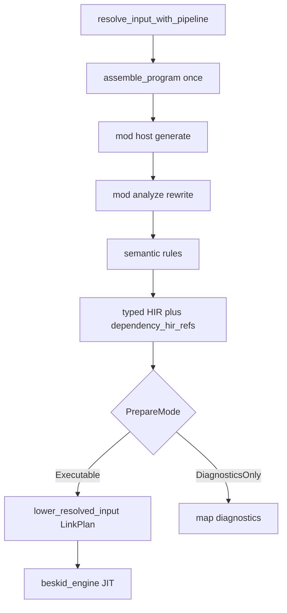

<!-- migrated from the legacy platform spec; canonical OpenSpec source -->
# Build and run orchestration Specification

## Purpose

Feature hub for the build and run orchestration in the reference compiler.

## Requirements

### Requirement: Feature hub authority: Decision [D-COMP-BUILD-0004]
The Beskid standard SHALL enforce the following migrated contract section. Accepted ADR decisions are binding; uppercase requirement keywords retain their BCP-14 meaning.

> This feature hub **owns** normative MUST/SHOULD contract text. Sibling articles **must not** redefine hub requirements and **should** link here for authority.

**Stable ID:** `BSP-REQ-39B41FF16390`  
**Legacy source:** `site/spec-content/platform-spec/compiler/build-pipeline/build-and-run-orchestration/adr/0001-feature-hub-authority/content.md`  
**Source SHA-256:** `369f710d392b14b2d31bfbd4ab0fe2adce9970432976358a1c15f21d2e2cb4ac`

#### Scenario: Conformance exercises Decision
- **GIVEN** an implementation claims conformance with this capability
- **WHEN** behavior governed by this contract section is exercised
- **THEN** every MUST, SHALL, REQUIRED, prohibition, and accepted decision in the section is satisfied

### Requirement: Specification over implementation notes: Decision [D-COMP-BUILD-0005]
The Beskid standard SHALL enforce the following migrated contract section. Accepted ADR decisions are binding; uppercase requirement keywords retain their BCP-14 meaning.

> Normative platform-spec prose and ADRs under this feature **supersede** informal comments in implementation crates until explicitly migrated into spec text.

**Stable ID:** `BSP-REQ-4B1849F18798`  
**Legacy source:** `site/spec-content/platform-spec/compiler/build-pipeline/build-and-run-orchestration/adr/0002-spec-over-implementation-notes/content.md`  
**Source SHA-256:** `9e06792fbfe9883bce1adf99f7651ac0232bc61b83acff639554a947cae9861b`

#### Scenario: Conformance exercises Decision
- **GIVEN** an implementation claims conformance with this capability
- **WHEN** behavior governed by this contract section is exercised
- **THEN** every MUST, SHALL, REQUIRED, prohibition, and accepted decision in the section is satisfied

### Requirement: Primary contract for Build and run orchestration: Decision [D-COMP-BUILD-0006]
The Beskid standard SHALL enforce the following migrated contract section. Accepted ADR decisions are binding; uppercase requirement keywords retain their BCP-14 meaning.

> The reference compiler **must** implement Build and run orchestration as documented in this feature hub and its article bundle.

**Stable ID:** `BSP-REQ-B108F2EF68B5`  
**Legacy source:** `site/spec-content/platform-spec/compiler/build-pipeline/build-and-run-orchestration/adr/0003-primary-contract-choice/content.md`  
**Source SHA-256:** `b5490cb24ffb44251f7703f3bf6e7d3af8e553a8d9675bdb4c629ca9ad12e216`

#### Scenario: Conformance exercises Decision
- **GIVEN** an implementation claims conformance with this capability
- **WHEN** behavior governed by this contract section is exercised
- **THEN** every MUST, SHALL, REQUIRED, prohibition, and accepted decision in the section is satisfied

### Requirement: Single prepared compilation spine: Decision [D-COMP-BUILD-0019]
The Beskid standard SHALL enforce the following migrated contract section. Accepted ADR decisions are binding; uppercase requirement keywords retain their BCP-14 meaning.

> The reference compiler **must** expose one production front-end—`prepare_compilation` (or the existing `compile_front_end_from_resolved_input` name until renamed)—that returns a **`PreparedCompilation`** artifact (typed HIR, resolution, assembly cache, mod session metadata).
> 
> | Rule | Detail |
> | --- | --- |
> | Sole spine | Analyze, run, build, test, clif, LSP project diagnostics, and doc export **must** call this function; mode flags (`DiagnosticsOnly` vs `Executable`) select early exit only—**not** alternate pipelines |
> | No parallel analyze | `analyze_program_with_options_and_plan` and paths that run semantic rules on pre-rewrite AST **must not** remain production gates |
> | Cached assembly | `ResolvedInput.assembly` **must** be populated once at resolve and reused; re-assembly on every consumer is forbidden |

**Stable ID:** `BSP-REQ-83C05E597144`  
**Legacy source:** `site/spec-content/platform-spec/compiler/build-pipeline/build-and-run-orchestration/adr/0004-single-prepared-compilation-spine/content.md`  
**Source SHA-256:** `294c6742ac01f825ade50188a9b0633e896321fada4022b5325d4714f8390ce8`

#### Scenario: Conformance exercises Decision
- **GIVEN** an implementation claims conformance with this capability
- **WHEN** behavior governed by this contract section is exercised
- **THEN** every MUST, SHALL, REQUIRED, prohibition, and accepted decision in the section is satisfied

### Requirement: beskid test shared prepare: Decision [D-COMP-BUILD-0021]
The Beskid standard SHALL enforce the following migrated contract section. Accepted ADR decisions are binding; uppercase requirement keywords retain their BCP-14 meaning.

> | Rule | Detail |
> | --- | --- |
> | Discovery | Enumerate `test` definitions from the **post-rewrite** entry program produced by `prepare_compilation` |
> | Entrypoints | Resolve and execute tests by **`qualified_name`** (nested inline modules included), matching resolution item names |
> | One prepare per target | Each selected test target **must** run through one `PreparedCompilation` (or shared prepare + per-test `LinkPlan` entry) before JIT; ad-hoc `lower_source` on raw buffer text is forbidden for project-backed tests |
> | Pipeline | `beskid test` **must** emit the same `beskid_pipeline` phases as `beskid run` through the shared observer |

**Stable ID:** `BSP-REQ-28078CFCF6F5`  
**Legacy source:** `site/spec-content/platform-spec/compiler/build-pipeline/build-and-run-orchestration/adr/0005-beskid-test-shared-prepare/content.md`  
**Source SHA-256:** `a3c08b5cd60d451d9eb0372556b3a588eb9389409bc1c86c0603345611526277`

#### Scenario: Conformance exercises Decision
- **GIVEN** an implementation claims conformance with this capability
- **WHEN** behavior governed by this contract section is exercised
- **THEN** every MUST, SHALL, REQUIRED, prohibition, and accepted decision in the section is satisfied

## Informative Source Provenance

The records below preserve migration history and are not normative except where text was extracted into a requirement above.

### Source Record: Build and run orchestration

**Authority:** informative provenance  
**Legacy path:** `/platform-spec/compiler/build-pipeline/build-and-run-orchestration/`  
**Source:** `site/spec-content/platform-spec/compiler/build-pipeline/build-and-run-orchestration/content.md`  
**SHA-256:** `cf92289f5ef47a9365fd3638a2c1beb8806d84d7ae4c8741a1a0b2d9bb7dc137`

<details>
<summary>Migrated source text</summary>

``````markdown
This feature hub defines the normative contract for **build and run orchestration** and links newcomer-oriented reference articles.

## Implementation anchors
- `compiler/crates/beskid_cli/src/commands/` coordinates compile, run, and doc commands.
- `compiler/crates/beskid_engine/src/jit_module.rs` executes JIT pipelines from compiled artifacts.
- `compiler/crates/beskid_tests/src/runtime/jit.rs` and e2e fixtures verify orchestration behavior.

## Decisions
<!-- spec:generate:adr-index -->
No open decisions. Closed choices are normative ADRs under **`adr/`** (`D-COMP-BUILD-0004` … `D-COMP-BUILD-0021`); use the reader **ADRs** tab for expandable detail.
<!-- /spec:generate:adr-index -->
## Articles
<!-- spec:generate:article-index -->
- [Build and run orchestration - Contracts and edge cases](./articles/contracts-and-edge-cases/)
- [Build and run orchestration - Design model](./articles/design-model/)
- [Build and run orchestration - Examples](./articles/examples/)
- [Build and run orchestration - FAQ and troubleshooting](./articles/faq-and-troubleshooting/)
- [Build and run orchestration - Flow and algorithm](./articles/flow-and-algorithm/)
- [Build and run orchestration - Verification and traceability](./articles/verification-and-traceability/)
<!-- /spec:generate:article-index -->
``````

</details>

### Source Record: Feature hub authority

**Authority:** informative provenance  
**Legacy path:** `/platform-spec/compiler/build-pipeline/build-and-run-orchestration/adr/0001-feature-hub-authority/`  
**Source:** `site/spec-content/platform-spec/compiler/build-pipeline/build-and-run-orchestration/adr/0001-feature-hub-authority/content.md`  
**SHA-256:** `369f710d392b14b2d31bfbd4ab0fe2adce9970432976358a1c15f21d2e2cb4ac`

<details>
<summary>Migrated source text</summary>

``````markdown
## Context

Sibling articles under this feature previously restated requirements in inconsistent forms.

## Decision

This feature hub **owns** normative MUST/SHOULD contract text. Sibling articles **must not** redefine hub requirements and **should** link here for authority.

## Consequences

Contract changes start on the hub or in linked ADRs, then propagate to articles and implementation anchors.

## Verification anchors

- `site/website/src/content/docs/platform-spec/compiler/build-pipeline/build-and-run-orchestration/index.mdx`
- `article bundle under the same feature directory.`
``````

</details>

### Source Record: Specification over implementation notes

**Authority:** informative provenance  
**Legacy path:** `/platform-spec/compiler/build-pipeline/build-and-run-orchestration/adr/0002-spec-over-implementation-notes/`  
**Source:** `site/spec-content/platform-spec/compiler/build-pipeline/build-and-run-orchestration/adr/0002-spec-over-implementation-notes/content.md`  
**SHA-256:** `9e06792fbfe9883bce1adf99f7651ac0232bc61b83acff639554a947cae9861b`

<details>
<summary>Migrated source text</summary>

``````markdown
## Context

Implementation crates accumulated informal notes that diverged from published contracts.

## Decision

Normative platform-spec prose and ADRs under this feature **supersede** informal comments in implementation crates until explicitly migrated into spec text.

## Consequences

Engineers file spec/ADR updates when behavior changes; crate comments are non-authoritative for conformance arguments.

## Verification anchors

- `compiler/crates/beskid_cli/src/commands/`
- `compiler/crates/beskid_engine/src/jit_module.rs`
- `compiler/crates/beskid_tests/src/runtime/jit.rs`
``````

</details>

### Source Record: Primary contract for Build and run orchestration

**Authority:** informative provenance  
**Legacy path:** `/platform-spec/compiler/build-pipeline/build-and-run-orchestration/adr/0003-primary-contract-choice/`  
**Source:** `site/spec-content/platform-spec/compiler/build-pipeline/build-and-run-orchestration/adr/0003-primary-contract-choice/content.md`  
**SHA-256:** `b5490cb24ffb44251f7703f3bf6e7d3af8e553a8d9675bdb4c629ca9ad12e216`

<details>
<summary>Migrated source text</summary>

``````markdown
## Context

This feature hub defines the normative contract for **build and run orchestration** and links newcomer-oriented reference articles.

## Decision

The reference compiler **must** implement Build and run orchestration as documented in this feature hub and its article bundle.

## Consequences

Changes require hub/ADR updates and verification anchor extensions.

## Verification anchors

- `compiler/crates/beskid_cli/src/commands/`
- `compiler/crates/beskid_engine/src/jit_module.rs`
- `compiler/crates/beskid_tests/src/runtime/jit.rs`
``````

</details>

### Source Record: Single prepared compilation spine

**Authority:** informative provenance  
**Legacy path:** `/platform-spec/compiler/build-pipeline/build-and-run-orchestration/adr/0004-single-prepared-compilation-spine/`  
**Source:** `site/spec-content/platform-spec/compiler/build-pipeline/build-and-run-orchestration/adr/0004-single-prepared-compilation-spine/content.md`  
**SHA-256:** `294c6742ac01f825ade50188a9b0633e896321fada4022b5325d4714f8390ce8`

<details>
<summary>Migrated source text</summary>

``````markdown
## Context

CLI analyze gates, LSP document analysis, and execute paths (`run`, `build`, `test`) previously scheduled mod host, rewrite, semantic, and typed HIR through parallel entry points. That allowed diagnostic and AST drift between “check only” and “compile and run.”

## Decision

The reference compiler **must** expose one production front-end—`prepare_compilation` (or the existing `compile_front_end_from_resolved_input` name until renamed)—that returns a **`PreparedCompilation`** artifact (typed HIR, resolution, assembly cache, mod session metadata).

| Rule | Detail |
| --- | --- |
| Sole spine | Analyze, run, build, test, clif, LSP project diagnostics, and doc export **must** call this function; mode flags (`DiagnosticsOnly` vs `Executable`) select early exit only—**not** alternate pipelines |
| No parallel analyze | `analyze_program_with_options_and_plan` and paths that run semantic rules on pre-rewrite AST **must not** remain production gates |
| Cached assembly | `ResolvedInput.assembly` **must** be populated once at resolve and reused; re-assembly on every consumer is forbidden |

## Consequences

Command and LSP refactors converge on `beskid_analysis::services::prepare_compilation`. New surfaces add `PrepareMode` flags instead of duplicating mod/semantic/HIR scheduling.

## Verification anchors

- `compiler/crates/beskid_analysis/src/services/front_end.rs`
- `compiler/crates/beskid_analysis/src/services/analyze.rs`
- `compiler/crates/beskid_cli/src/frontend.rs`
- `compiler/crates/beskid_analysis/src/services/input.rs`
``````

</details>

### Source Record: beskid test shared prepare

**Authority:** informative provenance  
**Legacy path:** `/platform-spec/compiler/build-pipeline/build-and-run-orchestration/adr/0005-beskid-test-shared-prepare/`  
**Source:** `site/spec-content/platform-spec/compiler/build-pipeline/build-and-run-orchestration/adr/0005-beskid-test-shared-prepare/content.md`  
**SHA-256:** `a3c08b5cd60d451d9eb0372556b3a588eb9389409bc1c86c0603345611526277`

<details>
<summary>Migrated source text</summary>

``````markdown
## Context

`beskid test` previously discovered `test` items from pre-rewrite AST and invoked JIT entrypoints by short names, diverging from `beskid run` assembly, linking, and pipeline phases.

## Decision

| Rule | Detail |
| --- | --- |
| Discovery | Enumerate `test` definitions from the **post-rewrite** entry program produced by `prepare_compilation` |
| Entrypoints | Resolve and execute tests by **`qualified_name`** (nested inline modules included), matching resolution item names |
| One prepare per target | Each selected test target **must** run through one `PreparedCompilation` (or shared prepare + per-test `LinkPlan` entry) before JIT; ad-hoc `lower_source` on raw buffer text is forbidden for project-backed tests |
| Pipeline | `beskid test` **must** emit the same `beskid_pipeline` phases as `beskid run` through the shared observer |

## Consequences

Corelib and workspace test matrices exercise the same spine as production run/build. Test filtering (`--include-tag`, `--group`) applies after post-rewrite discovery.

## Verification anchors

- `compiler/crates/beskid_cli/src/commands/test.rs`
- `compiler/crates/beskid_codegen/src/linking/plan.rs`
- `compiler/corelib/ci/run_corelib_tests.py`
``````

</details>

### Source Record: Build and run orchestration - Contracts and edge cases

**Authority:** informative provenance  
**Legacy path:** `/platform-spec/compiler/build-pipeline/build-and-run-orchestration/articles/contracts-and-edge-cases/`  
**Source:** `site/spec-content/platform-spec/compiler/build-pipeline/build-and-run-orchestration/articles/contracts-and-edge-cases/content.md`  
**SHA-256:** `c3aa8238c888e8278bdd61a4a4c63ce1bf839c57a67efc578f6af26487f69cc8`

<details>
<summary>Migrated source text</summary>

``````markdown
This article documents **contracts and edge cases** for **build and run orchestration** in the reference compiler.

## What this covers
For newcomers, this page explains where the contract shows up in day-to-day compiler work and which code paths are most useful first reads.

## Anchored code paths
- `compiler/crates/beskid_cli/src/commands/` coordinates compile, run, and doc commands.
- `compiler/crates/beskid_engine/src/jit_module.rs` executes JIT pipelines from compiled artifacts.
- `compiler/crates/beskid_tests/src/runtime/jit.rs` and e2e fixtures verify orchestration behavior.

## Practical notes
- Prefer tracing from CLI/test entry points into analysis/codegen crates before changing internals.
- Treat diagnostics and tests as part of the contract, not optional implementation details.
- If behavior changes, update this article and add/adjust tests in `compiler/crates/beskid_tests` or `compiler/crates/beskid_e2e_tests`.
``````

</details>

### Source Record: Build and run orchestration - Design model

**Authority:** informative provenance  
**Legacy path:** `/platform-spec/compiler/build-pipeline/build-and-run-orchestration/articles/design-model/`  
**Source:** `site/spec-content/platform-spec/compiler/build-pipeline/build-and-run-orchestration/articles/design-model/content.md`  
**SHA-256:** `d4ed485c6ce5c32b47352906c511026728543a9f08f1dbb2c55f248988eab754`

<details>
<summary>Migrated source text</summary>

``````markdown
This article documents the **design model** for **build and run orchestration**: one prepared front-end consumed by every command surface.

## Core objects

| Object | Role |
|--------|------|
| `ResolvedInput` | Source path/text, `CompilePlan`, materialized `PreparedProjectWorkspace`, and cached `ProgramAssembly` from resolve |
| `PreparedCompilation` | Output of `prepare_compilation`: post-rewrite entry AST, typed entry HIR, `Resolution`, `TypeResult`, mod session metadata, and shared `ProgramAssembly` |
| `PrepareMode` | `DiagnosticsOnly` (analyze, LSP) vs `Executable` (run, build, test, clif)—same code path, different early exit |
| `CodegenArtifact` | Cranelift IR bundle from `lower_resolved_input_with_pipeline` after `LinkPlan` (see lowering-contract ADRs) |

## PreparedCompilation flow



1. **Resolve** — `beskid_cli` / LSP build `ResolvedInput`; populate `assembly` once (no silent re-assemble per consumer).
2. **Prepare** — `prepare_compilation` (alias: `compile_front_end_from_resolved_input`) runs mod rewrite **before** semantic rules (D-COMP-BUILD-0020).
3. **Execute** — `run`, `build`, `test`, and `clif` share one prepare per target; `test` discovers items from post-rewrite AST and runs `qualified_name` entrypoints (D-COMP-BUILD-0021).
4. **Backend** — JIT/AOT load `CodegenArtifact` only; they do not rebuild `CompilePlan` or rediscover modules.

## Anchored code paths

- `compiler/crates/beskid_analysis/src/services/front_end.rs` — prepare / typed HIR spine
- `compiler/crates/beskid_analysis/src/services/input.rs` — `ResolvedInput` and assembly cache
- `compiler/crates/beskid_cli/src/commands/` — run, build, test, analyze, clif
- `compiler/crates/beskid_codegen/src/services.rs` — `lower_resolved_input_with_pipeline`
- `compiler/crates/beskid_engine/src/engine.rs` — JIT from artifact

## Practical notes

- Trace from `resolve_input_with_pipeline` through `prepare_compilation`; avoid parallel analyze-only schedulers.
- If behavior changes, update ADRs D-COMP-BUILD-0019 … D-COMP-BUILD-0021 and spine parity fixtures (D-COMP-CONF-0007).
``````

</details>

### Source Record: Build and run orchestration - Examples

**Authority:** informative provenance  
**Legacy path:** `/platform-spec/compiler/build-pipeline/build-and-run-orchestration/articles/examples/`  
**Source:** `site/spec-content/platform-spec/compiler/build-pipeline/build-and-run-orchestration/articles/examples/content.md`  
**SHA-256:** `bdb03b288087ec1b63793d016aee8dc5ce4f0408325e1ee4b63de5a3333c3788`

<details>
<summary>Migrated source text</summary>

``````markdown
This article documents **examples** for **build and run orchestration** in the reference compiler.

## What this covers
For newcomers, this page explains where the contract shows up in day-to-day compiler work and which code paths are most useful first reads.

## Anchored code paths
- `compiler/crates/beskid_cli/src/commands/` coordinates compile, run, and doc commands.
- `compiler/crates/beskid_engine/src/jit_module.rs` executes JIT pipelines from compiled artifacts.
- `compiler/crates/beskid_tests/src/runtime/jit.rs` and e2e fixtures verify orchestration behavior.

## Practical notes
- Prefer tracing from CLI/test entry points into analysis/codegen crates before changing internals.
- Treat diagnostics and tests as part of the contract, not optional implementation details.
- If behavior changes, update this article and add/adjust tests in `compiler/crates/beskid_tests` or `compiler/crates/beskid_e2e_tests`.
``````

</details>

### Source Record: Build and run orchestration - FAQ and troubleshooting

**Authority:** informative provenance  
**Legacy path:** `/platform-spec/compiler/build-pipeline/build-and-run-orchestration/articles/faq-and-troubleshooting/`  
**Source:** `site/spec-content/platform-spec/compiler/build-pipeline/build-and-run-orchestration/articles/faq-and-troubleshooting/content.md`  
**SHA-256:** `fd1e4f0755c6f2118d23517b4c368530649d9a8aa518f82a290ebb865a7eaac3`

<details>
<summary>Migrated source text</summary>

``````markdown
This article documents **faq and troubleshooting** for **build and run orchestration** in the reference compiler.

## What this covers
For newcomers, this page explains where the contract shows up in day-to-day compiler work and which code paths are most useful first reads.

## Anchored code paths
- `compiler/crates/beskid_cli/src/commands/` coordinates compile, run, and doc commands.
- `compiler/crates/beskid_engine/src/jit_module.rs` executes JIT pipelines from compiled artifacts.
- `compiler/crates/beskid_tests/src/runtime/jit.rs` and e2e fixtures verify orchestration behavior.

## Practical notes
- Prefer tracing from CLI/test entry points into analysis/codegen crates before changing internals.
- Treat diagnostics and tests as part of the contract, not optional implementation details.
- If behavior changes, update this article and add/adjust tests in `compiler/crates/beskid_tests` or `compiler/crates/beskid_e2e_tests`.
``````

</details>

### Source Record: Build and run orchestration - Flow and algorithm

**Authority:** informative provenance  
**Legacy path:** `/platform-spec/compiler/build-pipeline/build-and-run-orchestration/articles/flow-and-algorithm/`  
**Source:** `site/spec-content/platform-spec/compiler/build-pipeline/build-and-run-orchestration/articles/flow-and-algorithm/content.md`  
**SHA-256:** `c47f4f6805cc16aec421e559c5f39e95667d6ce7202eecd6e089a572f8cc54bd`

<details>
<summary>Migrated source text</summary>

``````markdown
This article documents **flow and algorithm** for **build and run orchestration** in the reference compiler.

## What this covers
For newcomers, this page explains where the contract shows up in day-to-day compiler work and which code paths are most useful first reads.

## Anchored code paths
- `compiler/crates/beskid_cli/src/commands/` coordinates compile, run, and doc commands.
- `compiler/crates/beskid_engine/src/jit_module.rs` executes JIT pipelines from compiled artifacts.
- `compiler/crates/beskid_tests/src/runtime/jit.rs` and e2e fixtures verify orchestration behavior.

## Practical notes
- Prefer tracing from CLI/test entry points into analysis/codegen crates before changing internals.
- Treat diagnostics and tests as part of the contract, not optional implementation details.
- If behavior changes, update this article and add/adjust tests in `compiler/crates/beskid_tests` or `compiler/crates/beskid_e2e_tests`.
``````

</details>

### Source Record: Build and run orchestration - Verification and traceability

**Authority:** informative provenance  
**Legacy path:** `/platform-spec/compiler/build-pipeline/build-and-run-orchestration/articles/verification-and-traceability/`  
**Source:** `site/spec-content/platform-spec/compiler/build-pipeline/build-and-run-orchestration/articles/verification-and-traceability/content.md`  
**SHA-256:** `8a2c987f37767786d1ba5b847e35f4e8475756dae65d2a6ea6a82a6ec81e8d36`

<details>
<summary>Migrated source text</summary>

``````markdown
This article documents **verification and traceability** for **build and run orchestration** in the reference compiler.

## What this covers
For newcomers, this page explains where the contract shows up in day-to-day compiler work and which code paths are most useful first reads.

## Anchored code paths
- `compiler/crates/beskid_cli/src/commands/` coordinates compile, run, and doc commands.
- `compiler/crates/beskid_engine/src/jit_module.rs` executes JIT pipelines from compiled artifacts.
- `compiler/crates/beskid_tests/src/runtime/jit.rs` and e2e fixtures verify orchestration behavior.

## Practical notes
- Prefer tracing from CLI/test entry points into analysis/codegen crates before changing internals.
- Treat diagnostics and tests as part of the contract, not optional implementation details.
- If behavior changes, update this article and add/adjust tests in `compiler/crates/beskid_tests` or `compiler/crates/beskid_e2e_tests`.
``````

</details>
