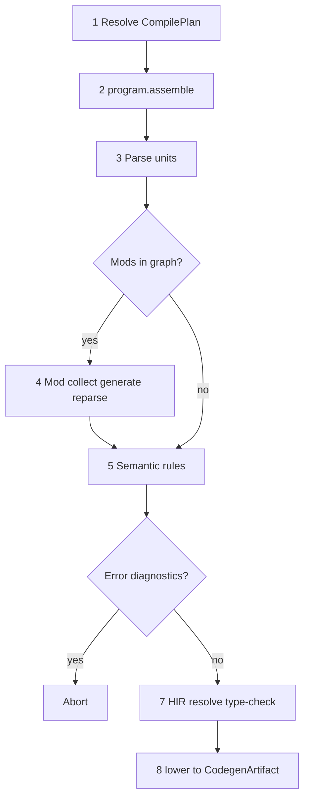

<!-- migrated from the legacy platform spec; canonical OpenSpec source -->
# Stage ordering and lowering Specification

## Purpose

Canonical ordering from resolved source through lowering into a backend-ready CodegenArtifact.

## Requirements

### Requirement: Feature hub authority: Decision [D-COMP-BUILD-0016]
The Beskid standard SHALL enforce the following migrated contract section. Accepted ADR decisions are binding; uppercase requirement keywords retain their BCP-14 meaning.

> This feature hub **owns** normative MUST/SHOULD contract text. Sibling articles **must not** redefine hub requirements and **should** link here for authority.

**Stable ID:** `BSP-REQ-3C5C35E5E53F`  
**Legacy source:** `site/spec-content/platform-spec/compiler/build-pipeline/stage-ordering/adr/0001-feature-hub-authority/content.md`  
**Source SHA-256:** `2f64cfcc711c24ca642c0fa917f6c17f22eeadaf3d6c4c2ad7a6fb3499b11c53`

#### Scenario: Conformance exercises Decision
- **GIVEN** an implementation claims conformance with this capability
- **WHEN** behavior governed by this contract section is exercised
- **THEN** every MUST, SHALL, REQUIRED, prohibition, and accepted decision in the section is satisfied

### Requirement: Specification over implementation notes: Decision [D-COMP-BUILD-0017]
The Beskid standard SHALL enforce the following migrated contract section. Accepted ADR decisions are binding; uppercase requirement keywords retain their BCP-14 meaning.

> Normative platform-spec prose and ADRs under this feature **supersede** informal comments in implementation crates until explicitly migrated into spec text.

**Stable ID:** `BSP-REQ-11A2A6C7F761`  
**Legacy source:** `site/spec-content/platform-spec/compiler/build-pipeline/stage-ordering/adr/0002-spec-over-implementation-notes/content.md`  
**Source SHA-256:** `694a0f40ccd29866f0d0e4d68227d2fc40150ef3450b0f8befb344bea2e858ac`

#### Scenario: Conformance exercises Decision
- **GIVEN** an implementation claims conformance with this capability
- **WHEN** behavior governed by this contract section is exercised
- **THEN** every MUST, SHALL, REQUIRED, prohibition, and accepted decision in the section is satisfied

### Requirement: Canonical parse-to-lowering phase DAG: Decision [D-COMP-BUILD-0018]
The Beskid standard SHALL enforce the following migrated contract section. Accepted ADR decisions are binding; uppercase requirement keywords retain their BCP-14 meaning.

> Phase literals are defined in `compiler/crates/beskid_pipeline/src/phases.rs` and asserted by conformance tests; CLI/LSP observers rely on the same ids.

**Stable ID:** `BSP-REQ-3269537641D5`  
**Legacy source:** `site/spec-content/platform-spec/compiler/build-pipeline/stage-ordering/adr/0003-canonical-phase-dag/content.md`  
**Source SHA-256:** `50d76231aca191c15fe0b99fea13de68ad19e61e49a8fb5c00b2d138cf12df1b`

#### Scenario: Conformance exercises Decision
- **GIVEN** an implementation claims conformance with this capability
- **WHEN** behavior governed by this contract section is exercised
- **THEN** every MUST, SHALL, REQUIRED, prohibition, and accepted decision in the section is satisfied

### Requirement: Mod rewrite before semantic gate: Decision [D-COMP-BUILD-0020]
The Beskid standard SHALL enforce the following migrated contract section. Accepted ADR decisions are binding; uppercase requirement keywords retain their BCP-14 meaning.

> In **all** hosts (CLI gate, LSP, `prepare_compilation`, codegen front-end):
> 
> 1. Mod collect → generate → **rewrite** (`MOD_REWRITE` / `run_analyze_rewrite`) **must** finish before `SEMANTIC` staged rules.
> 2. Semantic snapshot and typed HIR lowering **must** observe the post-rewrite entry program.
> 3. Running rewrite after semantic/typecheck, or discarding rewrite in analyze-only mode, is **forbidden**.
> 
> Phase ids in `beskid_pipeline::phases` **must** reflect this ordering for observers and conformance tests.

**Stable ID:** `BSP-REQ-81D7D7A879F6`  
**Legacy source:** `site/spec-content/platform-spec/compiler/build-pipeline/stage-ordering/adr/0004-mod-rewrite-before-semantic-gate/content.md`  
**Source SHA-256:** `1ce7eaf3af13e0a146f95b52be1a3e487e5d49d7b55ae6b566a8f1e6cfba3961`

#### Scenario: Conformance exercises Decision
- **GIVEN** an implementation claims conformance with this capability
- **WHEN** behavior governed by this contract section is exercised
- **THEN** every MUST, SHALL, REQUIRED, prohibition, and accepted decision in the section is satisfied

### Requirement: Salsa database owns incremental analysis memoization: Decision [D-COMP-BUILD-0021]
The Beskid standard SHALL enforce the following migrated contract section. Accepted ADR decisions are binding; uppercase requirement keywords retain their BCP-14 meaning.

> 1. **`beskid_queries::BeskidDatabase`** is the single incremental host for analysis memoization (Salsa 0.26 inputs + tracked queries + on-disk persistence under `{project}/obj/beskid/cache/salsa/`).
> 2. **CLI, LSP, and tests** route prepare/assembly through `beskid_queries` entry points—CLI via process-scoped session in `beskid_queries::session`, LSP via workspace `State.compilation_db`, tests via local or session handles—no second analysis spine.
> 3. **Unit materialization** during program assembly uses Salsa-backed unit queries (`parse_and_expand_unit_tracked`, `unit_hir_tracked`, `unit_imports`); legacy `obj/beskid/cache/units/` JSON records are retired in favor of `obj/beskid/cache/salsa/units/{content_fp}/` (see [unit artifact cache schema](/platform-spec/compiler/build-pipeline/stage-ordering/unit-artifact-cache/)).
> 4. **Pipeline observers** emit `salsa.query_hit`, `salsa.query_miss`, `salsa.revision_bump`, `salsa.artifact_disk_hit`, and `salsa.artifact_disk_miss` counters for verification.

**Stable ID:** `BSP-REQ-410BCAE574BA`  
**Legacy source:** `site/spec-content/platform-spec/compiler/build-pipeline/stage-ordering/adr/0005-salsa-database-incremental-memoization/content.md`  
**Source SHA-256:** `0ffcb3796c687c3d1eb21bbb4e51d9db247a1465bacc5ac642e4a46a62ea50a8`

#### Scenario: Conformance exercises Decision
- **GIVEN** an implementation claims conformance with this capability
- **WHEN** behavior governed by this contract section is exercised
- **THEN** every MUST, SHALL, REQUIRED, prohibition, and accepted decision in the section is satisfied

## Informative Source Provenance

The records below preserve migration history and are not normative except where text was extracted into a requirement above.

### Source Record: Stage ordering and lowering

**Authority:** informative provenance  
**Legacy path:** `/platform-spec/compiler/build-pipeline/stage-ordering/`  
**Source:** `site/spec-content/platform-spec/compiler/build-pipeline/stage-ordering/content.md`  
**SHA-256:** `af9cfd6b6601b3b1dd2dde22a0618f3f699e70372426af1b36c1b7e864970c5d`

<details>
<summary>Migrated source text</summary>

``````markdown
This feature hub defines the stage ordering contract for parse, semantic gates, HIR/resolution/typing, and Cranelift lowering into `CodegenArtifact`.

## Implementation anchors
- `compiler/crates/beskid_pipeline/src/phases.rs` — canonical phase DAG and stage ordering
- `compiler/crates/beskid_analysis/src/services/` — pipeline orchestration across compiler stages
- `compiler/crates/beskid_codegen/src/services.rs` — lowering entry from HIR to `CodegenArtifact`

## Decisions
<!-- spec:generate:adr-index -->
No open decisions. Closed choices are normative ADRs under **`adr/`** (`D-COMP-BUILD-0016` … `D-COMP-BUILD-0021`); use the reader **ADRs** tab for expandable detail.
<!-- /spec:generate:adr-index -->
## Articles
<!-- spec:generate:article-index -->
- [Stage ordering and lowering - Contracts and edge cases](./articles/contracts-and-edge-cases/)
- [Stage ordering and lowering - Design model](./articles/design-model/)
- [Stage ordering and lowering - Examples](./articles/examples/)
- [Stage ordering and lowering - FAQ and troubleshooting](./articles/faq-and-troubleshooting/)
- [Stage ordering and lowering - Flow and algorithm](./articles/flow-and-algorithm/)
- [Unit artifact cache schema](./articles/unit-artifact-cache/)
- [Stage ordering and lowering - Verification and traceability](./articles/verification-and-traceability/)
<!-- /spec:generate:article-index -->
``````

</details>

### Source Record: Feature hub authority

**Authority:** informative provenance  
**Legacy path:** `/platform-spec/compiler/build-pipeline/stage-ordering/adr/0001-feature-hub-authority/`  
**Source:** `site/spec-content/platform-spec/compiler/build-pipeline/stage-ordering/adr/0001-feature-hub-authority/content.md`  
**SHA-256:** `2f64cfcc711c24ca642c0fa917f6c17f22eeadaf3d6c4c2ad7a6fb3499b11c53`

<details>
<summary>Migrated source text</summary>

``````markdown
## Context

Sibling articles under this feature previously restated requirements in inconsistent forms.

## Decision

This feature hub **owns** normative MUST/SHOULD contract text. Sibling articles **must not** redefine hub requirements and **should** link here for authority.

## Consequences

Contract changes start on the hub or in linked ADRs, then propagate to articles and implementation anchors.

## Verification anchors

- `site/website/src/content/docs/platform-spec/compiler/build-pipeline/stage-ordering/index.mdx`
- `article bundle under the same feature directory.`
``````

</details>

### Source Record: Specification over implementation notes

**Authority:** informative provenance  
**Legacy path:** `/platform-spec/compiler/build-pipeline/stage-ordering/adr/0002-spec-over-implementation-notes/`  
**Source:** `site/spec-content/platform-spec/compiler/build-pipeline/stage-ordering/adr/0002-spec-over-implementation-notes/content.md`  
**SHA-256:** `694a0f40ccd29866f0d0e4d68227d2fc40150ef3450b0f8befb344bea2e858ac`

<details>
<summary>Migrated source text</summary>

``````markdown
## Context

Implementation crates accumulated informal notes that diverged from published contracts.

## Decision

Normative platform-spec prose and ADRs under this feature **supersede** informal comments in implementation crates until explicitly migrated into spec text.

## Consequences

Engineers file spec/ADR updates when behavior changes; crate comments are non-authoritative for conformance arguments.

## Verification anchors

- `compiler/crates/beskid_analysis/`
``````

</details>

### Source Record: Canonical parse-to-lowering phase DAG

**Authority:** informative provenance  
**Legacy path:** `/platform-spec/compiler/build-pipeline/stage-ordering/adr/0003-canonical-phase-dag/`  
**Source:** `site/spec-content/platform-spec/compiler/build-pipeline/stage-ordering/adr/0003-canonical-phase-dag/content.md`  
**SHA-256:** `50d76231aca191c15fe0b99fea13de68ad19e61e49a8fb5c00b2d138cf12df1b`

<details>
<summary>Migrated source text</summary>

``````markdown
## Context

Reference compiler **must** emit stable `beskid_pipeline` phase events from parse through `lower.ready` without reordering semantic gates relative to mod boundaries.

## Decision

Phase literals are defined in `compiler/crates/beskid_pipeline/src/phases.rs` and asserted by conformance tests; CLI/LSP observers rely on the same ids.

## Consequences

Reordering phases requires an ADR and registry updates.

## Verification anchors

- `compiler/crates/beskid_pipeline/`
- `compiler/crates/beskid_analysis/src/services/`.
``````

</details>

### Source Record: Mod rewrite before semantic gate

**Authority:** informative provenance  
**Legacy path:** `/platform-spec/compiler/build-pipeline/stage-ordering/adr/0004-mod-rewrite-before-semantic-gate/`  
**Source:** `site/spec-content/platform-spec/compiler/build-pipeline/stage-ordering/adr/0004-mod-rewrite-before-semantic-gate/content.md`  
**SHA-256:** `1ce7eaf3af13e0a146f95b52be1a3e487e5d49d7b55ae6b566a8f1e6cfba3961`

<details>
<summary>Migrated source text</summary>

``````markdown
## Context

Analyze-only paths ran staged semantic rules and type-check gates on pre-rewrite AST, then discarded mod `analyze` rewrite output. Execute paths applied rewrite first—producing different diagnostics and HIR for the same source.

## Decision

In **all** hosts (CLI gate, LSP, `prepare_compilation`, codegen front-end):

1. Mod collect → generate → **rewrite** (`MOD_REWRITE` / `run_analyze_rewrite`) **must** finish before `SEMANTIC` staged rules.
2. Semantic snapshot and typed HIR lowering **must** observe the post-rewrite entry program.
3. Running rewrite after semantic/typecheck, or discarding rewrite in analyze-only mode, is **forbidden**.

Phase ids in `beskid_pipeline::phases` **must** reflect this ordering for observers and conformance tests.

## Consequences

`flow-and-algorithm` mermaid and phase DAG tests align analyze with run/build. Mod host integration changes require ADR updates if reordering is proposed.

## Verification anchors

- `compiler/crates/beskid_pipeline/src/phases.rs`
- `compiler/crates/beskid_analysis/src/mod_host/`
- `compiler/crates/beskid_analysis/src/services/analyze.rs`
- `compiler/crates/beskid_analysis/src/services/front_end.rs`
``````

</details>

### Source Record: Salsa database owns incremental analysis memoization

**Authority:** informative provenance  
**Legacy path:** `/platform-spec/compiler/build-pipeline/stage-ordering/adr/0005-salsa-database-incremental-memoization/`  
**Source:** `site/spec-content/platform-spec/compiler/build-pipeline/stage-ordering/adr/0005-salsa-database-incremental-memoization/content.md`  
**SHA-256:** `0ffcb3796c687c3d1eb21bbb4e51d9db247a1465bacc5ac642e4a46a62ea50a8`

<details>
<summary>Migrated source text</summary>

``````markdown
## Context

Within-run deduplication and ad-hoc JSON unit caches did not provide dependency-tracked invalidation. LSP and CLI paths recomputed assembly and typing independently; session caches could return stale assemblies after edits.

## Decision

1. **`beskid_queries::BeskidDatabase`** is the single incremental host for analysis memoization (Salsa 0.26 inputs + tracked queries + on-disk persistence under `{project}/obj/beskid/cache/salsa/`).
2. **CLI, LSP, and tests** route prepare/assembly through `beskid_queries` entry points—CLI via process-scoped session in `beskid_queries::session`, LSP via workspace `State.compilation_db`, tests via local or session handles—no second analysis spine.
3. **Unit materialization** during program assembly uses Salsa-backed unit queries (`parse_and_expand_unit_tracked`, `unit_hir_tracked`, `unit_imports`); legacy `obj/beskid/cache/units/` JSON records are retired in favor of `obj/beskid/cache/salsa/units/{content_fp}/` (see [unit artifact cache schema](/platform-spec/compiler/build-pipeline/stage-ordering/unit-artifact-cache/)).
4. **Pipeline observers** emit `salsa.query_hit`, `salsa.query_miss`, `salsa.revision_bump`, `salsa.artifact_disk_hit`, and `salsa.artifact_disk_miss` counters for verification.

## Consequences

- File text edits invalidate only affected units and dependents via import edges.
- LSP `didChange` sets `file_text` inputs; diagnostics and IDE snapshots share the same database.
- Mod-host invalidation keys (`syntax_generation_id`, `manifest_generation_id`, `capability_set_id`) map to Salsa inputs in `beskid_queries::modhost`.

## Status

Accepted — implemented in `compiler/crates/beskid_queries/` and `compiler/crates/beskid_artifacts/`. Legacy `units/` JSON cache is retired; disk persistence uses content-addressed `salsa/units/` snapshots.
``````

</details>

### Source Record: Stage ordering and lowering - Contracts and edge cases

**Authority:** informative provenance  
**Legacy path:** `/platform-spec/compiler/build-pipeline/stage-ordering/articles/contracts-and-edge-cases/`  
**Source:** `site/spec-content/platform-spec/compiler/build-pipeline/stage-ordering/articles/contracts-and-edge-cases/content.md`  
**SHA-256:** `28e5c9a3f0738ff1e108f297079a056324fc222631db4243b809bfe9dc70f62f`

<details>
<summary>Migrated source text</summary>

``````markdown
- Build and run command paths must use the same lowering order for parity.
- Semantic error diagnostics must stop lowering before backend code generation.
- Parse diagnostics source naming differences must be documented (`path` vs `"<memory>"`).
- Entrypoint lookup must use post-resolution typed metadata from the same lowering result.
``````

</details>

### Source Record: Stage ordering and lowering - Design model

**Authority:** informative provenance  
**Legacy path:** `/platform-spec/compiler/build-pipeline/stage-ordering/articles/design-model/`  
**Source:** `site/spec-content/platform-spec/compiler/build-pipeline/stage-ordering/articles/design-model/content.md`  
**SHA-256:** `efb1881a52b0d701cc561694d9bb8e7a07d03c9245b6a190dd0f92d194fa95ee`

<details>
<summary>Migrated source text</summary>

``````markdown
## Phase handoff model


The compile model has a strict handoff chain:

`resolve_input` -> **`program.assemble`** -> parse (entry + indexed units) -> **`macro.expand`** -> **mod collect/generate (when enabled)** -> semantic rules gate -> **`composition.resolve`** (app host DI; see [Native dependency injection](/platform-spec/language-meta/composition/dependency-injection/)) -> analyzer/rewriter passes -> HIR normalization -> resolution (with **`ModuleIndex`**) -> typing -> `lower_program` -> `CodegenArtifact`.

Backends (JIT and AOT) consume this artifact and must not reorder semantic phases.

## Language macro expansion

**[Language macros](/platform-spec/language-meta/metaprogramming/macros/)** expand in **`macro.expand`**, immediately after **`parse`** and **before `mod.load`**. The phase:

1. Resolves `name!` invocations to in-scope **`macro`** definitions.
2. Substitutes fragment arguments for **`$param`** in macro bodies (typed AST only).
3. Repeats until no invocations remain or **`maxMacroExpansionDepth`** (default 32) is exceeded.

When **`mod.generate`** re-parses merged syntax, hosts **must** run **`macro.expand`** again before the next **`mod.collect`** / semantic gate (same syntax generation). Emit **`syntax.generation`** when either macros or mods mutate the program snapshot.

## Mod phases and stable phase identifiers

**Compiler mods** (see **[Compiler Mods](/platform-spec/compiler/compiler-mods/)**) run as explicit host-driven phases after **`macro.expand`** and before lowering.

1. **Phase vocabulary** — Register stable string ids in `compiler/crates/beskid_pipeline/src/phases.rs` and update `PIPELINE.md` in the same change.
2. **Observer parity** — CLI and codegen entrypoints must bracket mod phases with `PhaseStart`/`PhaseEnd` (or documented `WorkUnit` ids).
3. **Bounded generation** — `Generator` is incremental by default and runs with a bounded replay loop (`maxGeneratorRounds`). On each replay, host merges typed AST contributions and re-parses affected units.
4. **Analyzer/rewrite ordering** — `Analyzer` runs on merged host+generated code; `Rewriter` applies typed replacements and is surfaced as fix-oriented behavior.
5. **No lowering on torn trees** — lowering runs only on a consistent post-merge snapshot.

## Placement relative to `beskid_codegen` services

The reference lowering path orders parse, semantic diagnostics, lower, and codegen. Mod phases are inserted after parse: collect/generate, then semantic, then analyze/rewrite, then lowering.

## Normative mod phase id strings (`beskid_pipeline`)

These literals must match **[Compiler Mods / Mod projects and pipeline phase ids](/platform-spec/compiler/compiler-mods/#mod-projects)**.

**Full build (`FULL_BUILD_PHASE_ORDER`)** — After parse, insert `macro.expand`, then `mod.load`, `mod.collect`, `mod.generate` (plus `syntax.generation` on replay), then semantic phases, then `mod.analyze`, optional `mod.rewrite`, then lower/codegen/link.

**JIT run (`JIT_RUN_PHASE_ORDER`)** — No JIT mod execution path is normative for compiler mods; mod execution is AOT-hosted only.

**Semantic sub-phases (`semantic`)** — Under the parent `semantic` phase, `SemanticPipelineRule` emits these ordered observer ids (see `SEMANTIC_SUB_PHASE_ORDER` in `beskid_tools`): `semantic.ast_lower`, `semantic.definitions`, `semantic.control_flow`, `semantic.name_resolution`, `semantic.visibility`, `semantic.contracts`, `semantic.error_handling`, `semantic.type_check`, `semantic.naming_style`.

**Auxiliary ids** — `workspace.graph_changed` and `semantic.snapshot` are emitted by workspace refresh and semantic pipeline orchestration respectively; they **must** use the same string literals when represented as phases (or as documented `WorkUnit` `id` prefixes if only work units are used—pick one representation per id and document it in `PIPELINE.md`).

**`lower.ready`** — Emitted immediately before the existing **`lower`** phase entrypoint runs on a merged program; hosts **must** emit it even when no mods ran (no-op instant) so observers can assert ordering uniformly.
``````

</details>

### Source Record: Stage ordering and lowering - Examples

**Authority:** informative provenance  
**Legacy path:** `/platform-spec/compiler/build-pipeline/stage-ordering/articles/examples/`  
**Source:** `site/spec-content/platform-spec/compiler/build-pipeline/stage-ordering/articles/examples/content.md`  
**SHA-256:** `2c0efd08a5838064d1813f368a6cfd77d445fe92dd162b98689bcdec11ead4f4`

<details>
<summary>Migrated source text</summary>

``````markdown
- **Successful run:** parse + rules + typing succeed; artifact is sent to JIT and executed.
- **Build with semantic error:** rules emit an error; lowering exits before object emission.
- **Parse failure:** parse stage emits diagnostics and no HIR or backend stages run.
``````

</details>

### Source Record: Stage ordering and lowering - FAQ and troubleshooting

**Authority:** informative provenance  
**Legacy path:** `/platform-spec/compiler/build-pipeline/stage-ordering/articles/faq-and-troubleshooting/`  
**Source:** `site/spec-content/platform-spec/compiler/build-pipeline/stage-ordering/articles/faq-and-troubleshooting/content.md`  
**SHA-256:** `428302084a35c7cd93a5b206c1cb1fa3920a0d368794e0c3cf8faa63e304b0a3`

<details>
<summary>Migrated source text</summary>

``````markdown
## Why did `beskid run` and `beskid build` fail at different points?
Check whether both paths enabled diagnostics and used the same source input path.

## Why do parse source names differ in output?
Lowering can report parse diagnostics with `"<memory>"`, while CLI parse uses file paths.

## Can I skip semantic stages for faster compile?
Not for normative build/run behavior; skipping semantics is outside this contract.
``````

</details>

### Source Record: Stage ordering and lowering - Flow and algorithm

**Authority:** informative provenance  
**Legacy path:** `/platform-spec/compiler/build-pipeline/stage-ordering/articles/flow-and-algorithm/`  
**Source:** `site/spec-content/platform-spec/compiler/build-pipeline/stage-ordering/articles/flow-and-algorithm/content.md`  
**SHA-256:** `4e08f1ddd935e26c31332f73c1e1ea8ce517f543e072ac94f7786a7dbc9466dd`

<details>
<summary>Migrated source text</summary>

``````markdown
## End-to-end lowering spine



## Ordered steps

1. Resolve source path/text through services (manifest, workspace graph, `CompilePlan`, optional materialized workspace).
2. **Assemble program** — Build `ProgramAssembly` from effective roots (`program.assemble`); discover and parse compilation units per **[Program assembly](/platform-spec/compiler/build-pipeline/program-assembly/)**.
3. Parse entry (and indexed units) and produce syntax diagnostics.
4. **Mod host (when transitive `Mod` dependencies exist)** — Load AOT artifacts, discover contracts, run collect → generate → analyze → rewrite under **[Mod host bridge](/platform-spec/compiler/compiler-mods/mod-host-bridge/)** policy, merge typed AST contributions, and re-parse as required (bounded by `maxGeneratorRounds`). Skip when no mod dependencies apply.
5. Run builtin staged semantic rules when diagnostics are enabled (same diagnostic channel as mod diagnostics).
6. Abort on error diagnostics.
7. Transform to HIR, resolve symbols against **`ModuleIndex`**, and type-check the entry unit.
8. Lower typed program to backend artifact for JIT/AOT.

The canonical lowering entrypoint remains `beskid_codegen::services::lower_source` (and `_with_pipeline`); mod orchestration **must** live in `beskid_analysis` services (or a dedicated host module re-exported there) so CLI, LSP, and codegen share one scheduling spine.
``````

</details>

### Source Record: Unit artifact cache schema

**Authority:** informative provenance  
**Legacy path:** `/platform-spec/compiler/build-pipeline/stage-ordering/articles/unit-artifact-cache/`  
**Source:** `site/spec-content/platform-spec/compiler/build-pipeline/stage-ordering/articles/unit-artifact-cache/content.md`  
**SHA-256:** `eb27f4cac7f4a26d8b7ba8b18ea8ef2a4dc50c2b597eff80c5a2183e152131b5`

<details>
<summary>Migrated source text</summary>

``````markdown
## Layout

Unit artifacts live under `{project}/obj/beskid/cache/salsa/`:

| Path | Content |
|------|---------|
| `manifest.json` | `grammar_rev`, `compiler_version`, `schema_version`, `persisted_units` |
| `units/{content_fp}/meta.json` | `UnitArtifactMeta` (logical name, source path, source length, imports) |
| `units/{content_fp}/ast.bin` | Postcard `Spanned<Program>` snapshot |
| `units/{content_fp}/hir.bin` | HIR cache marker (HIR rebuilt from AST on cold load) |

Legacy `obj/beskid/cache/units/*.json` records are **retired**; tooling ignores them.

## Fingerprint rule

`content_fp = hash(grammar_rev, source_bytes)` — **not** absolute path. Path is metadata only. `grammar_rev` is the workspace constant shared by `beskid_pipeline`, `beskid_artifacts`, and `beskid_queries`.

## Invalidation

1. **File edit** — `FileText` revision bump clears fingerprints for old and new content; `reverse_dependents` propagates to import closure.
2. **Grammar bump** — `GrammarRevision` input invalidates all unit tracked queries globally.
3. **Lockfile / manifest** — `ProjectSession.lockfile_digest` change invalidates `program_assembly` for that entry.

## Hot path

Production assembly uses Salsa in-memory `unit_cache` (parse + HIR tokens). Disk artifacts are read on cold start; writes occur on direct-parse paths without the Salsa delegate. Manifest `persisted_units` is refreshed once per assembly batch, not per unit.
``````

</details>

### Source Record: Stage ordering and lowering - Verification and traceability

**Authority:** informative provenance  
**Legacy path:** `/platform-spec/compiler/build-pipeline/stage-ordering/articles/verification-and-traceability/`  
**Source:** `site/spec-content/platform-spec/compiler/build-pipeline/stage-ordering/articles/verification-and-traceability/content.md`  
**SHA-256:** `ee5d93e8b1db98cb7051d8c2699aba139c0bf06c9e02bd75d52132673934df50`

<details>
<summary>Migrated source text</summary>

``````markdown
Implementation anchors:

- `compiler/crates/beskid_analysis/src/projects/assembly/`
- `compiler/crates/beskid_analysis/src/services/front_end.rs`
- `compiler/crates/beskid_codegen/src/services.rs`
- `compiler/crates/beskid_analysis/src/services/`
- `compiler/crates/beskid_cli/src/commands/build.rs`
- `compiler/crates/beskid_engine/src/services.rs`
- `compiler/crates/beskid_tests/src/projects/assembly.rs`

Traceability should include tests that assert semantic failures stop before backend stages.

## Mod phase ordering tests

When the mod host ships, add integration tests under `compiler/crates/beskid_tests/` that:

1. Install a test `PipelineObserver` collecting `PhaseStart` / `PhaseEnd` ids.
2. Assert the substring `parse` → `mod.load` → `mod.collect` → `mod.generate` → `semantic` → `mod.analyze` → `lower.ready` → `lower` appears in order for a workspace fixture with a transitive `Mod` dependency (see **[Project manifest contract / verification](/platform-spec/tooling/manifests-and-lockfiles/project-manifest-contract/verification-and-traceability/)** for manifest fixture layout).

Any change to `FULL_BUILD_PHASE_ORDER` or mod insertion rules **must** update these expectations in the same commit.
``````

</details>
