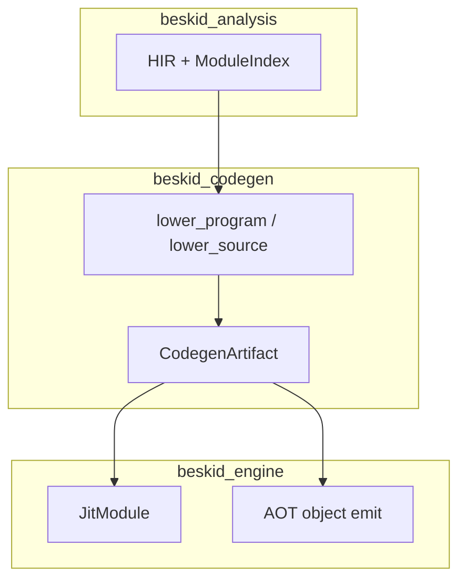

<!-- migrated from the legacy platform spec; canonical OpenSpec source -->
# Lowering contract Specification

## Purpose

Contract for lowering parsed and analyzed source into backend-ready `CodegenArtifact`.

## Requirements

### Requirement: Feature hub authority: Decision [D-COMP-IR-0007]
The Beskid standard SHALL enforce the following migrated contract section. Accepted ADR decisions are binding; uppercase requirement keywords retain their BCP-14 meaning.

> This feature hub **owns** normative MUST/SHOULD contract text. Sibling articles **must not** redefine hub requirements and **should** link here for authority.

**Stable ID:** `BSP-REQ-4B2ACFCBDE6D`  
**Legacy source:** `site/spec-content/platform-spec/compiler/codegen-and-ir/lowering-contract/adr/0001-feature-hub-authority/content.md`  
**Source SHA-256:** `91d6cf7215da0f43a3f42fb78906176f71613967ddac13b09aa4d2d1edd5b691`

#### Scenario: Conformance exercises Decision
- **GIVEN** an implementation claims conformance with this capability
- **WHEN** behavior governed by this contract section is exercised
- **THEN** every MUST, SHALL, REQUIRED, prohibition, and accepted decision in the section is satisfied

### Requirement: Specification over implementation notes: Decision [D-COMP-IR-0008]
The Beskid standard SHALL enforce the following migrated contract section. Accepted ADR decisions are binding; uppercase requirement keywords retain their BCP-14 meaning.

> Normative platform-spec prose and ADRs under this feature **supersede** informal comments in implementation crates until explicitly migrated into spec text.

**Stable ID:** `BSP-REQ-376C8C28EE35`  
**Legacy source:** `site/spec-content/platform-spec/compiler/codegen-and-ir/lowering-contract/adr/0002-spec-over-implementation-notes/content.md`  
**Source SHA-256:** `413c58a0b2f9caf7d5936fc0bc6458d99ebd8e536fe645797bbad2d07a8241bf`

#### Scenario: Conformance exercises Decision
- **GIVEN** an implementation claims conformance with this capability
- **WHEN** behavior governed by this contract section is exercised
- **THEN** every MUST, SHALL, REQUIRED, prohibition, and accepted decision in the section is satisfied

### Requirement: Cranelift lowering via lower_source: Decision [D-COMP-IR-0009]
The Beskid standard SHALL enforce the following migrated contract section. Accepted ADR decisions are binding; uppercase requirement keywords retain their BCP-14 meaning.

> `beskid_codegen::lower_source` is the single lowering entry producing `CodegenArtifact` consumed by `JitModule`.

**Stable ID:** `BSP-REQ-97DCBB75281D`  
**Legacy source:** `site/spec-content/platform-spec/compiler/codegen-and-ir/lowering-contract/adr/0003-cranelift-lowering-single-entry/content.md`  
**Source SHA-256:** `bcb0f8c4f4f2a37682490d5299812f6df9084ab9c491390c79278c11a3ba9bdd`

#### Scenario: Conformance exercises Decision
- **GIVEN** an implementation claims conformance with this capability
- **WHEN** behavior governed by this contract section is exercised
- **THEN** every MUST, SHALL, REQUIRED, prohibition, and accepted decision in the section is satisfied

### Requirement: Reachability link plan: Decision [D-COMP-IR-0010]
The Beskid standard SHALL enforce the following migrated contract section. Accepted ADR decisions are binding; uppercase requirement keywords retain their BCP-14 meaning.

> Production lowering **must**:
> 
> 1. Build `FunctionDefIndex` from `Resolution` and `assembly.hir_units` (all units in the assembly cache).
> 2. Construct `LinkPlan` for declared entry symbols (tests, `main`, qualified run/build entrypoints) including transitive callees and monomorphized instances.
> 3. Lower only symbols listed in the plan (no on-demand span-global fallback in release paths).
> 4. Run `beskid_codegen::validate_artifact` before `beskid_engine` / `beskid_aot` consume the artifact.

**Stable ID:** `BSP-REQ-B6767E7BCD69`  
**Legacy source:** `site/spec-content/platform-spec/compiler/codegen-and-ir/lowering-contract/adr/0004-reachability-link-plan/content.md`  
**Source SHA-256:** `fb88cef261ae0149ea45fa0f323e7667a8a839818b121220b39c1147fd0bcce2`

#### Scenario: Conformance exercises Decision
- **GIVEN** an implementation claims conformance with this capability
- **WHEN** behavior governed by this contract section is exercised
- **THEN** every MUST, SHALL, REQUIRED, prohibition, and accepted decision in the section is satisfied

### Requirement: Supersede lower_source production entry: Decision [D-COMP-IR-0011]
The Beskid standard SHALL enforce the following migrated contract section. Accepted ADR decisions are binding; uppercase requirement keywords retain their BCP-14 meaning.

> | Rule | Detail |
> | --- | --- |
> | Production entry | `lower_resolved_input_with_pipeline` (after `prepare_compilation` / `compile_front_end_from_resolved_input`) is the **only** production path to `CodegenArtifact` |
> | Legacy ban | `lower_source_single_unit_legacy` and pre-assembly mod/semantic scheduling **must not** run in CLI, LSP, or engine production paths |
> | Test-only `lower_source` | `lower_source` / in-memory helpers **may** remain for unit tests by constructing a minimal single-unit `ProgramAssembly` and delegating to `lower_resolved_input` |
> | Link plan | Production paths **must** satisfy [D-COMP-IR-0010](./0004-reachability-link-plan/) |

**Stable ID:** `BSP-REQ-C3FAA264B707`  
**Legacy source:** `site/spec-content/platform-spec/compiler/codegen-and-ir/lowering-contract/adr/0005-supersede-lower-source-entry/content.md`  
**Source SHA-256:** `40e340860e138423670c51116794b83f21f19303541aa3a356106f6a55d20442`

#### Scenario: Conformance exercises Decision
- **GIVEN** an implementation claims conformance with this capability
- **WHEN** behavior governed by this contract section is exercised
- **THEN** every MUST, SHALL, REQUIRED, prohibition, and accepted decision in the section is satisfied

### Requirement: ISLE lowering rule coverage: Decision [D-COMP-IR-0012]
The Beskid standard SHALL enforce that every `IsleLowered` syntax kind has a corresponding ISLE rule in `compiler/crates/beskid_isle/isle/`.

> The 28 `NodeKind` variants tagged `IsleLowered` SHALL have complete rule coverage: 25 production rules, 2 deferred rules, and 1 indirect rule. Missing rule coverage SHALL be detected at compile time via the ISLE codegen verification step. A deferred rule documents a known gap with a tracking issue (e.g. CYB-179); an indirect rule covers a syntax kind that is lowered through a parent or sibling rule rather than its own top-level match arm.

**Stable ID:** `BSP-REQ-70E3A1D2C8F4`
**Legacy source:** `beskid_isle/src/classify_syntax_node_kind` and `compiler/crates/beskid_isle/isle/*.isle`
**Source SHA-256:** `0000000000000000000000000000000000000000000000000000000000000000`

#### Scenario: All IsleLowered kinds resolve to an ISLE term
- **GIVEN** the `syntax_node_kind_catalogue` function enumerates `NodeKind` variants
- **WHEN** `classify_syntax_node_kind` is called for any `NodeKind` tagged `IsleLowered`
- **THEN** there exists exactly one `(decl ...)` or `(rule ...)` in `compiler/crates/beskid_isle/isle/` that handles that variant, OR the variant is listed in the deferred/indirect catalogue with a tracking issue

#### Scenario: Deferred lowering is documented
- **GIVEN** a `NodeKind` variant is classified as `IsleLowered` but deferred
- **WHEN** the ISLE verifier walks the rule set
- **THEN** the variant is matched by a stub rule annotated with the tracking issue (e.g. `CYB-179`) and SHALL produce a compile-time diagnostic if encountered in user code

### Requirement: ForStatement iterator lowering: Decision [D-COMP-IR-0013]
The Beskid 0.4 standard SHALL support `for` loops over range expressions via `emit_range_for`. Iterator-based `for` is deferred to post-0.4.

> `ForStatement` lowering SHALL inspect the iterable expression at the ISLE boundary using the `ForIterableKind` enum. Range iterables (`start..end` or `start..=end`) SHALL lower through `emit_range_for`, producing a counted loop with induction variable. Non-range iterables (arrays, slices, user-defined iterators) SHALL report `InvalidRangeFor` at lowering time, referencing tracking issue CYB-179.

**Stable ID:** `BSP-REQ-81F4B2E3D9A5`
**Legacy source:** `beskid_isle` ISLE rules for `ForStatement`
**Source SHA-256:** `0000000000000000000000000000000000000000000000000000000000000000`

#### Scenario: Range-based for loop lowers to counted loop
- **GIVEN** a `ForStatement` whose iterable is classified as `ForIterableKind::Range`
- **WHEN** the ISLE lowering rule for `ForStatement` executes
- **THEN** `emit_range_for` is called with the range bounds and loop body, producing a Cranelift counted-loop structure with an induction variable

#### Scenario: Non-range iterable reports InvalidRangeFor
- **GIVEN** a `ForStatement` whose iterable is classified as `ForIterableKind::Other`
- **WHEN** the ISLE lowering rule for `ForStatement` executes
- **THEN** an `InvalidRangeFor` compile error is reported at lowering time with a diagnostic referencing CYB-179

#### Scenario: ForIterableKind enum distinguishes iterable types
- **GIVEN** the ISLE boundary receives a `ForStatement` node
- **WHEN** the iterable expression kind is inspected
- **THEN** the `ForIterableKind` enum SHALL have exactly two variants: `Range` (for `RangeExpression` syntax) and `Other` (for all other iterable expressions)

### Requirement: Zero-division traps: Decision [D-COMP-IR-0014]
The Beskid standard SHALL emit Cranelift `trapnz` with the `int_divz` trap code for integer division and remainder operations when the divisor is zero at runtime.

> Integer `/` and `%` operators SHALL lower to CLIF `trapnz v1, v2, int_divz` where `v1` is the divisor value. The trap fires before the division instruction executes, preventing undefined behavior on all target architectures. The `int_divz` trap code SHALL be surfaced in runtime diagnostics as a division-by-zero error.

**Stable ID:** `BSP-REQ-92C5A3F4E0B6`
**Legacy source:** `beskid_isle` ISLE rules for integer arithmetic
**Source SHA-256:** `0000000000000000000000000000000000000000000000000000000000000000`

#### Scenario: Integer division by zero traps
- **GIVEN** an integer division expression `a / b` where `b` is zero at runtime
- **WHEN** the ISLE lowering rule for binary division executes
- **THEN** the emitted CLIF contains `trapnz b, b, int_divz` before the `sdiv` or `udiv` instruction

#### Scenario: Integer remainder by zero traps
- **GIVEN** an integer remainder expression `a % b` where `b` is zero at runtime
- **WHEN** the ISLE lowering rule for binary remainder executes
- **THEN** the emitted CLIF contains `trapnz b, b, int_divz` before the `srem` or `urem` instruction

#### Scenario: Non-zero divisor proceeds normally
- **GIVEN** an integer division or remainder expression with a non-zero divisor
- **WHEN** the ISLE lowering rule executes
- **THEN** the `trapnz` check passes and the arithmetic instruction executes without trapping

### Requirement: Bitwise NOT semantics: Decision [D-COMP-IR-0015]
The Beskid standard SHALL emit a real bitwise NOT for the `!` unary operator via CLIF `bxor` with an all-ones mask.

> The `!` prefix operator SHALL NOT be lowered as a boolean `icmp_imm eq val, 0` comparison. Instead, it SHALL produce `bxor val, -1` (or equivalently `bxor_imm val, -1_iNN` for the appropriate integer width), computing a true bitwise complement. This ensures `!!0u8 == 0xFFu8` rather than `!!0u8 == 1u8`.

**Stable ID:** `BSP-REQ-A3D6B4F5E1C7`
**Legacy source:** `beskid_isle` ISLE rules for unary operators
**Source SHA-256:** `0000000000000000000000000000000000000000000000000000000000000000`

#### Scenario: Bitwise NOT on integer produces complement
- **GIVEN** a unary `!` expression applied to an integer operand `x`
- **WHEN** the ISLE lowering rule for unary NOT executes
- **THEN** the emitted CLIF instruction is `bxor_imm x, -1` (or `bxor x, all_ones_constant`), producing the bitwise complement of `x`

#### Scenario: Double NOT is not a boolean coercion
- **GIVEN** the expression `!!x` where `x` is an integer type
- **WHEN** both `!` operators are lowered
- **THEN** the result is `x` with all bits preserved (not truncated to `0` or `1`), because each `!` is a true bitwise complement

### Requirement: MethodDefinition ISLE lowering: Decision [D-COMP-IR-0016]
The Beskid standard SHALL lower `MethodDefinition` syntax through the ISLE path rather than bypassing ISLE through the HIR `NodeLoweringContext`.

> `MethodDefinition` nodes SHALL invoke `emit_method_body` at the ISLE boundary. The implicit `self` receiver SHALL be materialized by `materialize_parameters` as the first parameter, matching the ABI convention where the receiver is passed as an explicit leading argument. This ensures method lowering follows the same ISLE-driven code path as free functions, with consistent parameter handling, block termination, and debug info emission.

**Stable ID:** `BSP-REQ-B4E7C5F6D2A8`
**Legacy source:** `beskid_isle` ISLE rules and `materialize_parameters`
**Source SHA-256:** `0000000000000000000000000000000000000000000000000000000000000000`

#### Scenario: MethodDefinition lowers through emit_method_body
- **GIVEN** a `MethodDefinition` syntax node
- **WHEN** the ISLE lowering dispatcher selects the rule for `MethodDefinition`
- **THEN** `emit_method_body` is called as the top-level ISLE term, not a direct `NodeLoweringContext` call bypassing ISLE

#### Scenario: Self-receiver is materialized as first parameter
- **GIVEN** a `MethodDefinition` with an implicit `self` receiver
- **WHEN** `materialize_parameters` processes the method's parameter list
- **THEN** the `self` parameter is materialized as the first Cranelift function parameter with the receiver's type (by-value, `&T`, or `&mut T`), matching the ABI calling convention

#### Scenario: Method body lowering is consistent with free functions
- **GIVEN** a `MethodDefinition` and an equivalent `FunctionDefinition` with `self` as an explicit first parameter
- **WHEN** both are lowered through their respective ISLE rules
- **THEN** the resulting CLIF function signatures and body structures are identical modulo name mangling

## Informative Source Provenance

The records below preserve migration history and are not normative except where text was extracted into a requirement above.

### Source Record: Lowering contract

**Authority:** informative provenance  
**Legacy path:** `/platform-spec/compiler/codegen-and-ir/lowering-contract/`  
**Source:** `site/spec-content/platform-spec/compiler/codegen-and-ir/lowering-contract/content.md`  
**SHA-256:** `37bacb7a36547fce77e0e9574fe8553a71ac8b350c2aac85efd3b3e0dc1517bb`

<details>
<summary>Migrated source text</summary>

``````markdown
<SpecSection title="What this feature specifies" id="what-this-feature-specifies">
This feature explains how source text becomes a backend-ready artifact without changing language semantics late in the pipeline. It is organized into newcomer-friendly articles that move from model, to flow, to contracts, then practical verification and debugging guidance.
</SpecSection>

<SpecSection title="Implementation anchors" id="implementation-anchors">
- `beskid_codegen::lower_source` in `compiler/crates/beskid_codegen`
- `CodegenArtifact` construction in `compiler/crates/beskid_codegen`
- `JitModule` consumption in `compiler/crates/beskid_engine/src/jit_module.rs`
- Runtime execution coverage in `compiler/crates/beskid_tests/src/runtime/jit.rs`
</SpecSection>

## Decisions
<!-- spec:generate:adr-index -->
No open decisions. Closed choices are normative ADRs under **`adr/`** (`D-COMP-IR-0007` … `D-COMP-IR-0011`); use the reader **ADRs** tab for expandable detail.
<!-- /spec:generate:adr-index -->
## Articles
<!-- spec:generate:article-index -->
- [Contracts and edge cases](./articles/contracts-and-edge-cases/)
- [Design model](./articles/design-model/)
- [Examples](./articles/examples/)
- [FAQ and troubleshooting](./articles/faq-and-troubleshooting/)
- [Flow and algorithm](./articles/flow-and-algorithm/)
- [Verification and traceability](./articles/verification-and-traceability/)
<!-- /spec:generate:article-index -->
``````

</details>

### Source Record: Feature hub authority

**Authority:** informative provenance  
**Legacy path:** `/platform-spec/compiler/codegen-and-ir/lowering-contract/adr/0001-feature-hub-authority/`  
**Source:** `site/spec-content/platform-spec/compiler/codegen-and-ir/lowering-contract/adr/0001-feature-hub-authority/content.md`  
**SHA-256:** `91d6cf7215da0f43a3f42fb78906176f71613967ddac13b09aa4d2d1edd5b691`

<details>
<summary>Migrated source text</summary>

``````markdown
## Context

Sibling articles under this feature previously restated requirements in inconsistent forms.

## Decision

This feature hub **owns** normative MUST/SHOULD contract text. Sibling articles **must not** redefine hub requirements and **should** link here for authority.

## Consequences

Contract changes start on the hub or in linked ADRs, then propagate to articles and implementation anchors.

## Verification anchors

- `site/website/src/content/docs/platform-spec/compiler/codegen-and-ir/lowering-contract/index.mdx`
- `article bundle under the same feature directory.`
``````

</details>

### Source Record: Specification over implementation notes

**Authority:** informative provenance  
**Legacy path:** `/platform-spec/compiler/codegen-and-ir/lowering-contract/adr/0002-spec-over-implementation-notes/`  
**Source:** `site/spec-content/platform-spec/compiler/codegen-and-ir/lowering-contract/adr/0002-spec-over-implementation-notes/content.md`  
**SHA-256:** `413c58a0b2f9caf7d5936fc0bc6458d99ebd8e536fe645797bbad2d07a8241bf`

<details>
<summary>Migrated source text</summary>

``````markdown
## Context

Implementation crates accumulated informal notes that diverged from published contracts.

## Decision

Normative platform-spec prose and ADRs under this feature **supersede** informal comments in implementation crates until explicitly migrated into spec text.

## Consequences

Engineers file spec/ADR updates when behavior changes; crate comments are non-authoritative for conformance arguments.

## Verification anchors

- `compiler/crates/beskid_codegen`
- `compiler/crates/beskid_codegen`
- `compiler/crates/beskid_engine/src/jit_module.rs`
``````

</details>

### Source Record: Cranelift lowering via lower_source

**Authority:** informative provenance  
**Legacy path:** `/platform-spec/compiler/codegen-and-ir/lowering-contract/adr/0003-cranelift-lowering-single-entry/`  
**Source:** `site/spec-content/platform-spec/compiler/codegen-and-ir/lowering-contract/adr/0003-cranelift-lowering-single-entry/content.md`  
**SHA-256:** `bcb0f8c4f4f2a37682490d5299812f6df9084ab9c491390c79278c11a3ba9bdd`

<details>
<summary>Migrated source text</summary>

``````markdown
## Context

Lowering was split across experimental paths.

## Decision

`beskid_codegen::lower_source` is the single lowering entry producing `CodegenArtifact` consumed by `JitModule`.

## Consequences

Experimental IR dumps must not bypass this entry in release builds.

## Verification anchors

- `compiler/crates/beskid_codegen`
- `compiler/crates/beskid_engine/src/jit_module.rs`.
``````

</details>

### Source Record: Reachability link plan

**Authority:** informative provenance  
**Legacy path:** `/platform-spec/compiler/codegen-and-ir/lowering-contract/adr/0004-reachability-link-plan/`  
**Source:** `site/spec-content/platform-spec/compiler/codegen-and-ir/lowering-contract/adr/0004-reachability-link-plan/content.md`  
**SHA-256:** `fb88cef261ae0149ea45fa0f323e7667a8a839818b121220b39c1147fd0bcce2`

<details>
<summary>Migrated source text</summary>

``````markdown
## Context

Codegen lowered entry functions on demand from span tables, emitting callees that JIT link could not resolve. A reachability `LinkPlan` exists for tests but was not required for run/build entrypoints.

## Decision

Production lowering **must**:

1. Build `FunctionDefIndex` from `Resolution` and `assembly.hir_units` (all units in the assembly cache).
2. Construct `LinkPlan` for declared entry symbols (tests, `main`, qualified run/build entrypoints) including transitive callees and monomorphized instances.
3. Lower only symbols listed in the plan (no on-demand span-global fallback in release paths).
4. Run `beskid_codegen::validate_artifact` before `beskid_engine` / `beskid_aot` consume the artifact.

## Consequences

`lower_program_with_assembly` and linking modules own completeness. Undefined callees fail at validate time with deterministic diagnostics.

## Verification anchors

- `compiler/crates/beskid_codegen/src/linking/plan.rs`
- `compiler/crates/beskid_codegen/src/linking/def_index.rs`
- `compiler/crates/beskid_codegen/src/linking/validate.rs`
- `compiler/crates/beskid_codegen/src/lowering/lowerable.rs`
- `compiler/crates/beskid_codegen/tests/array_tests_linking.rs`
- `compiler/crates/beskid_engine/src/engine.rs`
``````

</details>

### Source Record: Supersede lower_source production entry

**Authority:** informative provenance  
**Legacy path:** `/platform-spec/compiler/codegen-and-ir/lowering-contract/adr/0005-supersede-lower-source-entry/`  
**Source:** `site/spec-content/platform-spec/compiler/codegen-and-ir/lowering-contract/adr/0005-supersede-lower-source-entry/content.md`  
**SHA-256:** `40e340860e138423670c51116794b83f21f19303541aa3a356106f6a55d20442`

<details>
<summary>Migrated source text</summary>

``````markdown
## Context

[D-COMP-IR-0009](./0003-cranelift-lowering-single-entry/) named `beskid_codegen::lower_source` the single lowering entry. Project-backed commands still fell through to `lower_source_single_unit_legacy`, bypassing assembly, dependency HIR, and `LinkPlan`.

## Decision

| Rule | Detail |
| --- | --- |
| Production entry | `lower_resolved_input_with_pipeline` (after `prepare_compilation` / `compile_front_end_from_resolved_input`) is the **only** production path to `CodegenArtifact` |
| Legacy ban | `lower_source_single_unit_legacy` and pre-assembly mod/semantic scheduling **must not** run in CLI, LSP, or engine production paths |
| Test-only `lower_source` | `lower_source` / in-memory helpers **may** remain for unit tests by constructing a minimal single-unit `ProgramAssembly` and delegating to `lower_resolved_input` |
| Link plan | Production paths **must** satisfy [D-COMP-IR-0010](./0004-reachability-link-plan/) |

## Consequences

[D-COMP-IR-0009](./0003-cranelift-lowering-single-entry/) is superseded for production semantics; JIT/AOT still consume `CodegenArtifact` from the resolved-input entry only.

## Verification anchors

- `compiler/crates/beskid_codegen/src/services.rs`
- `compiler/crates/beskid_cli/src/commands/`
- `compiler/crates/beskid_engine/tests/`
``````

</details>

### Source Record: Contracts and edge cases

**Authority:** informative provenance  
**Legacy path:** `/platform-spec/compiler/codegen-and-ir/lowering-contract/articles/contracts-and-edge-cases/`  
**Source:** `site/spec-content/platform-spec/compiler/codegen-and-ir/lowering-contract/articles/contracts-and-edge-cases/content.md`  
**SHA-256:** `4c2461347b3781457f98ae0645f3d0a6f5fbfb5099041d77e885dccd8e5d8ea0`

<details>
<summary>Migrated source text</summary>

``````markdown
## Normative contracts

- Producer crates must emit data in a shape accepted by downstream consumers.
- Consumer crates must not silently reinterpret the contract surface.
- Contract regressions must be captured as compile-time or test-time failures, not hidden runtime drift.

## Edge cases to monitor

- Partial refactors that update only one side of a crate boundary.
- Symbol/name changes that compile locally but break cross-crate integration.
- Fixtures that pass in isolation but fail in end-to-end harnesses.

## Failure handling expectations

When contract checks fail, diagnostics should point contributors to the responsible boundary crate and to the corresponding conformance fixture.
``````

</details>

### Source Record: Design model

**Authority:** informative provenance  
**Legacy path:** `/platform-spec/compiler/codegen-and-ir/lowering-contract/articles/design-model/`  
**Source:** `site/spec-content/platform-spec/compiler/codegen-and-ir/lowering-contract/articles/design-model/content.md`  
**SHA-256:** `6466c2dbcd6db053e15c8ea920f646b04224610c43adfdd4f9ed4364a6da44e6`

<details>
<summary>Migrated source text</summary>

``````markdown
## Lowering boundary

Lowering is the **last semantic gate** before any backend runs. Inputs are a post-merge program snapshot (HIR + `ModuleIndex` + resolved types); output is an immutable **`CodegenArtifact`** containing Cranelift modules, data descriptors, extern imports, and debug metadata.

Backends **must not** re-run parse, mod host, or semantic rules on the artifact.



## Artifact contents

| Slice | Role |
| --- | --- |
| CLIF modules | Per-compilation-unit functions and globals |
| Builtin imports | `declare_builtin_imports` from `BUILTIN_SPECS` |
| `ExternImport` rows | User contract symbols for link step |
| Type descriptors | GC layout + array/string shapes for `alloc` |

## Invariants

- Lowering runs only when `syntax_generation_id` matches the merged tree used by semantic rules ([stage ordering](/platform-spec/compiler/build-pipeline/stage-ordering/)).
- Panic/abort paths use `AbiReturnKind::Never` imports so unreachable blocks are correct.
- JIT and AOT consume the **same** artifact type; divergence happens only after `CodegenArtifact` is sealed.

## Code anchors

- `beskid_codegen::lower_source` in `compiler/crates/beskid_codegen`
- `CodegenArtifact` construction in `compiler/crates/beskid_codegen`
- `JitModule` in `compiler/crates/beskid_engine/src/jit_module.rs`
- Runtime smoke: `compiler/crates/beskid_tests/src/runtime/jit.rs`
``````

</details>

### Source Record: Examples

**Authority:** informative provenance  
**Legacy path:** `/platform-spec/compiler/codegen-and-ir/lowering-contract/articles/examples/`  
**Source:** `site/spec-content/platform-spec/compiler/codegen-and-ir/lowering-contract/articles/examples/content.md`  
**SHA-256:** `d247967b9c691182df4bd04d113bb690419ecb1c2c3cfff8996d2a438b392f5b`

<details>
<summary>Migrated source text</summary>

``````markdown
## Example 1: Happy path

A standard project exercises the expected producer -> consumer handoff with no contract violations. Trace this via:

- ``beskid_codegen::lower_source` in `compiler/crates/beskid_codegen``
- ``JitModule` consumption in `compiler/crates/beskid_engine/src/jit_module.rs``

## Example 2: Contract mismatch

Intentionally alter a boundary definition (for example, a symbol or structure shape), then run the related conformance suite. The expected result is a deterministic failure that identifies the mismatched boundary.

## Example 3: Regression-proofing a fix

After applying a fix, add or update a focused fixture in the nearest test crate and rerun wider suites so the behavior remains locked for future refactors.
``````

</details>

### Source Record: FAQ and troubleshooting

**Authority:** informative provenance  
**Legacy path:** `/platform-spec/compiler/codegen-and-ir/lowering-contract/articles/faq-and-troubleshooting/`  
**Source:** `site/spec-content/platform-spec/compiler/codegen-and-ir/lowering-contract/articles/faq-and-troubleshooting/content.md`  
**SHA-256:** `9a78ff35504bc3f31d6108e702aae870b46b5032c839694ac6da37faa2502cf7`

<details>
<summary>Migrated source text</summary>

``````markdown
## Why did a change pass locally but fail in CI?

Most often, one crate boundary changed but the corresponding fixture or downstream consumer was not updated. Re-run the nearest conformance suite and inspect cross-crate handoff points.

## Where should I start debugging?

1. Confirm the target requirement in this feature hub.
2. Step through ``beskid_codegen::lower_source` in `compiler/crates/beskid_codegen`` and ``CodegenArtifact` construction in `compiler/crates/beskid_codegen``.
3. Validate consumer behavior at ``JitModule` consumption in `compiler/crates/beskid_engine/src/jit_module.rs``.
4. Reproduce with `Runtime execution coverage in `compiler/crates/beskid_tests/src/runtime/jit.rs``.

## How do I add a new rule safely?

Document the new contract in the relevant article, update implementation in the owning crate, and add a fixture proving both happy-path and failure-path behavior.
``````

</details>

### Source Record: Flow and algorithm

**Authority:** informative provenance  
**Legacy path:** `/platform-spec/compiler/codegen-and-ir/lowering-contract/articles/flow-and-algorithm/`  
**Source:** `site/spec-content/platform-spec/compiler/codegen-and-ir/lowering-contract/articles/flow-and-algorithm/content.md`  
**SHA-256:** `7f8299180884ad9dbe4fca94d12101234581d3179c3a1caca28236c511303148`

<details>
<summary>Migrated source text</summary>

``````markdown
## End-to-end flow

1. Input enters compiler/runtime boundary at a stable entrypoint.
2. The responsible crate enforces the expected shape and emits stable structures.
3. Downstream crates consume those structures without redefining semantics.
4. Conformance tests assert behavior at integration boundaries.

## Algorithm notes for newcomers

- Prefer tracing one fixture end-to-end before reading all modules.
- Verify where shape conversion happens; avoid assuming all crates mutate data.
- Keep an eye on handoff points where diagnostics or ABI constraints are locked.

## Where to step through code

- Start with ``beskid_codegen::lower_source` in `compiler/crates/beskid_codegen``.
- Then inspect ``CodegenArtifact` construction in `compiler/crates/beskid_codegen``.
- Follow consumption path at ``JitModule` consumption in `compiler/crates/beskid_engine/src/jit_module.rs``.
- Validate expectations using `Runtime execution coverage in `compiler/crates/beskid_tests/src/runtime/jit.rs``.
``````

</details>

### Source Record: Verification and traceability

**Authority:** informative provenance  
**Legacy path:** `/platform-spec/compiler/codegen-and-ir/lowering-contract/articles/verification-and-traceability/`  
**Source:** `site/spec-content/platform-spec/compiler/codegen-and-ir/lowering-contract/articles/verification-and-traceability/content.md`  
**SHA-256:** `f9055fc5fe1239f3880fa914038b87ccae82de6ca4c8dc9a0cc733e56eefcd07`

<details>
<summary>Migrated source text</summary>

``````markdown
## Verification strategy

- Unit-level checks validate local transformations.
- Integration tests validate crate-to-crate contracts.
- End-to-end fixtures validate user-visible behavior.

## Traceability map

- Spec requirement source: `/platform-spec/compiler/codegen-and-ir/lowering-contract/`.
- Core implementation anchors:
  - `beskid_codegen::lower_source` in `compiler/crates/beskid_codegen`
  - `CodegenArtifact` construction in `compiler/crates/beskid_codegen`
  - `JitModule` consumption in `compiler/crates/beskid_engine/src/jit_module.rs`
- Conformance anchor:
  - Runtime execution coverage in `compiler/crates/beskid_tests/src/runtime/jit.rs`

## Review checklist

- Requirement text and test expectation describe the same boundary.
- Crate ownership updates are reflected in spec links.
- Newly introduced edge cases include at least one reproducible fixture.
``````

</details>
