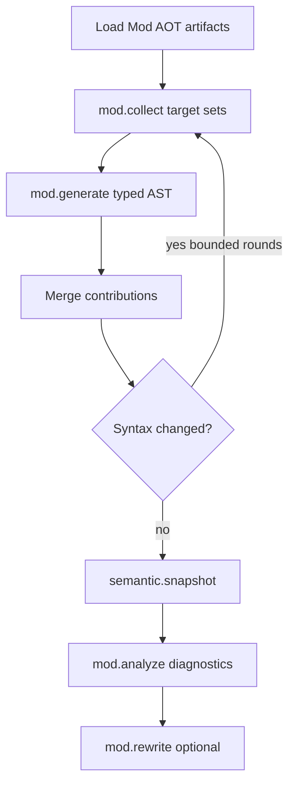

<!-- migrated from the legacy platform spec; canonical OpenSpec source -->
# Mod host bridge Specification

## Purpose

Reference compiler-owned execution, capability policy, and communication with compile-time Beskid modules.

## Requirements

### Requirement: Feature hub authority: Decision [D-COMP-MODS-0010]
The Beskid standard SHALL enforce the following migrated contract section. Accepted ADR decisions are binding; uppercase requirement keywords retain their BCP-14 meaning.

> This feature hub **owns** normative MUST/SHOULD contract text. Sibling articles **must not** redefine hub requirements and **should** link here for authority.

**Stable ID:** `BSP-REQ-847B3421C406`  
**Legacy source:** `site/spec-content/platform-spec/compiler/compiler-mods/mod-host-bridge/adr/0001-feature-hub-authority/content.md`  
**Source SHA-256:** `fe02ec04a412e99592a0515f5cf2fcc9196dd11a6337394b72b4a2908775d313`

#### Scenario: Conformance exercises Decision
- **GIVEN** an implementation claims conformance with this capability
- **WHEN** behavior governed by this contract section is exercised
- **THEN** every MUST, SHALL, REQUIRED, prohibition, and accepted decision in the section is satisfied

### Requirement: Specification over implementation notes: Decision [D-COMP-MODS-0011]
The Beskid standard SHALL enforce the following migrated contract section. Accepted ADR decisions are binding; uppercase requirement keywords retain their BCP-14 meaning.

> Normative platform-spec prose and ADRs under this feature **supersede** informal comments in implementation crates until explicitly migrated into spec text.

**Stable ID:** `BSP-REQ-18C731BA3BCD`  
**Legacy source:** `site/spec-content/platform-spec/compiler/compiler-mods/mod-host-bridge/adr/0002-spec-over-implementation-notes/content.md`  
**Source SHA-256:** `879eec7a560a004c3a9dd0a09453b7d6535d6ec64acba241353265fb110c0adc`

#### Scenario: Conformance exercises Decision
- **GIVEN** an implementation claims conformance with this capability
- **WHEN** behavior governed by this contract section is exercised
- **THEN** every MUST, SHALL, REQUIRED, prohibition, and accepted decision in the section is satisfied

### Requirement: Mod host AOT-only with descriptor registration: Decision [D-COMP-MODS-0012]
The Beskid standard SHALL enforce the following migrated contract section. Accepted ADR decisions are binding; uppercase requirement keywords retain their BCP-14 meaning.

> Contract discovery uses `(contractId, typeId, entrySymbol)` tuples; failures emit E1821–E1870 before `mod.collect`.

**Stable ID:** `BSP-REQ-58DE9BF21A00`  
**Legacy source:** `site/spec-content/platform-spec/compiler/compiler-mods/mod-host-bridge/adr/0003-mod-aot-only-registration/content.md`  
**Source SHA-256:** `29299dc25ad28c5686b6990d6c7075053bb61dea568818db8b36d390315f9ccd`

#### Scenario: Conformance exercises Decision
- **GIVEN** an implementation claims conformance with this capability
- **WHEN** behavior governed by this contract section is exercised
- **THEN** every MUST, SHALL, REQUIRED, prohibition, and accepted decision in the section is satisfied

## Informative Source Provenance

The records below preserve migration history and are not normative except where text was extracted into a requirement above.

### Source Record: Mod host bridge

**Authority:** informative provenance  
**Legacy path:** `/platform-spec/compiler/compiler-mods/mod-host-bridge/`  
**Source:** `site/spec-content/platform-spec/compiler/compiler-mods/mod-host-bridge/content.md`  
**SHA-256:** `535f7823dec0e8113efac01466a1bc5b864db50e9702f5180b92fcd49713c2c8`

<details>
<summary>Migrated source text</summary>

``````markdown
This feature hub defines Rust-side mod-host execution: `Mod` project registration, contract discovery, AOT artifact lifecycle, compilation-event orchestration, and capability policy.

## Language alignment
Implements language-meta compiler-mod contracts (`Collector`, `Generator`, `Analyzer`, `Rewriter`, `AttributeGenerator`) for manifest-driven `Mod` orchestration.

## Implementation anchors
- `compiler/crates/beskid_analysis/src/mod_host/` — mod discovery, registration validation, contract dispatch through `ContractInvoker`, typed merge / reparse, analyze / rewrite orchestration.
- `compiler/crates/beskid_analysis/src/mod_host/invoker.rs` — **`ContractInvoker`** trait with **`StubContractInvoker`** / **`ScriptedContractInvoker`** for host bring-up and tests.
- `compiler/crates/beskid_analysis/src/mod_host/validate.rs` — pre-`mod.collect` cross-artifact validation that short-circuits scheduling on **E1828**, **E1829**, **E1851**, **E1852**, **E1853**, **E1854**, **E1855**.
- `compiler/crates/beskid_codegen/src/services.rs` — lowering boundaries after typed mod contributions.
- `compiler/crates/beskid_engine/tests/mod_host.rs` — engine integration test driving the full pipeline through `Engine::compile_artifact`.

## Decisions
<!-- spec:generate:adr-index -->
No open decisions. Closed choices are normative ADRs under **`adr/`** (`D-COMP-MODS-0010` … `D-COMP-MODS-0012`); use the reader **ADRs** tab for expandable detail.
<!-- /spec:generate:adr-index -->
## Articles
<!-- spec:generate:article-index -->
- [Mod host bridge - AOT artifact contract](./articles/aot-artifact-contract/)
- [mod host bridge - Contracts and edge cases](./articles/contracts-and-edge-cases/)
- [mod host bridge - Design model](./articles/design-model/)
- [mod host bridge - Examples](./articles/examples/)
- [mod host bridge - FAQ and troubleshooting](./articles/faq-and-troubleshooting/)
- [mod host bridge - Flow and algorithm](./articles/flow-and-algorithm/)
- [mod host bridge - Verification and traceability](./articles/verification-and-traceability/)
<!-- /spec:generate:article-index -->
``````

</details>

### Source Record: Feature hub authority

**Authority:** informative provenance  
**Legacy path:** `/platform-spec/compiler/compiler-mods/mod-host-bridge/adr/0001-feature-hub-authority/`  
**Source:** `site/spec-content/platform-spec/compiler/compiler-mods/mod-host-bridge/adr/0001-feature-hub-authority/content.md`  
**SHA-256:** `fe02ec04a412e99592a0515f5cf2fcc9196dd11a6337394b72b4a2908775d313`

<details>
<summary>Migrated source text</summary>

``````markdown
## Context

Sibling articles under this feature previously restated requirements in inconsistent forms.

## Decision

This feature hub **owns** normative MUST/SHOULD contract text. Sibling articles **must not** redefine hub requirements and **should** link here for authority.

## Consequences

Contract changes start on the hub or in linked ADRs, then propagate to articles and implementation anchors.

## Verification anchors

- `site/website/src/content/docs/platform-spec/compiler/compiler-mods/mod-host-bridge/index.mdx`
- `article bundle under the same feature directory.`
``````

</details>

### Source Record: Specification over implementation notes

**Authority:** informative provenance  
**Legacy path:** `/platform-spec/compiler/compiler-mods/mod-host-bridge/adr/0002-spec-over-implementation-notes/`  
**Source:** `site/spec-content/platform-spec/compiler/compiler-mods/mod-host-bridge/adr/0002-spec-over-implementation-notes/content.md`  
**SHA-256:** `879eec7a560a004c3a9dd0a09453b7d6535d6ec64acba241353265fb110c0adc`

<details>
<summary>Migrated source text</summary>

``````markdown
## Context

Implementation crates accumulated informal notes that diverged from published contracts.

## Decision

Normative platform-spec prose and ADRs under this feature **supersede** informal comments in implementation crates until explicitly migrated into spec text.

## Consequences

Engineers file spec/ADR updates when behavior changes; crate comments are non-authoritative for conformance arguments.

## Verification anchors

- `compiler/crates/beskid_analysis/`
- `compiler/crates/beskid_codegen/`
- `compiler/crates/beskid_analysis/src/services/`
``````

</details>

### Source Record: Mod host AOT-only with descriptor registration

**Authority:** informative provenance  
**Legacy path:** `/platform-spec/compiler/compiler-mods/mod-host-bridge/adr/0003-mod-aot-only-registration/`  
**Source:** `site/spec-content/platform-spec/compiler/compiler-mods/mod-host-bridge/adr/0003-mod-aot-only-registration/content.md`  
**SHA-256:** `29299dc25ad28c5686b6990d6c7075053bb61dea568818db8b36d390315f9ccd`

<details>
<summary>Migrated source text</summary>

``````markdown
## Context

`Mod` packages **must** export public Beskid types implementing SDK contracts; host loads AOT artifacts and `mod.descriptor.json` registrations—not manifest attach metadata.

## Decision

Contract discovery uses `(contractId, typeId, entrySymbol)` tuples; failures emit E1821–E1870 before `mod.collect`.

## Consequences

JIT mod execution is not normative; rebuild uses `beskid mod rebuild`.

## Verification anchors

- `compiler/crates/beskid_analysis/`
- `mod artifact store paths in analysis services.`
``````

</details>

### Source Record: Mod host bridge - AOT artifact contract

**Authority:** informative provenance  
**Legacy path:** `/platform-spec/compiler/compiler-mods/mod-host-bridge/articles/aot-artifact-contract/`  
**Source:** `site/spec-content/platform-spec/compiler/compiler-mods/mod-host-bridge/articles/aot-artifact-contract/content.md`  
**SHA-256:** `f9f8d9272d5cfb75b1755f8a13f5a9c194f78e3b0ca121ce682a32699747b317`

<details>
<summary>Migrated source text</summary>

``````markdown
This article is the normative **AOT artifact contract** for `type: Mod` packages. It complements **[Mod host bridge / design model](./design-model/)** lifecycle steps and **[Compiler Mod SDK](/platform-spec/language-meta/metaprogramming/compiler-mod-sdk/)** contract discovery.

## Artifact directory layout

Hosts **must** store each built mod artifact under the workspace **object store** using a content-addressed layout:

```text
<workspaceRoot>/.beskid/obj/mods/<packageId>/<artifactKey>/<targetTriple>/
  mod.o              # or platform archive (mod.a / mod.so) — native object for AOT load
  mod.descriptor.json
```

| Path segment | Meaning |
| --- | --- |
| `<packageId>` | Stable package identity from lock/manifest (normalized, case-sensitive as resolved). |
| `<artifactKey>` | Lowercase hex SHA-256 of the **cache key tuple** (see below). |
| `<targetTriple>` | LLVM-style triple string for the built artifact (e.g. `aarch64-apple-darwin`). |

Registry-fetched mods use the same layout under the workspace object store after materialization; global package caches **may** mirror the tuple but the host **must** treat the workspace path above as authoritative for an active compilation.

## Cache key tuple

Rebuild is required when any component of the tuple changes:

| Field | Source |
| --- | --- |
| `lock_hash` | Hash of relevant lockfile bytes for the mod package slice. |
| `mod_source_hash` | Hash of mod project sources + `Project.proj` / `project.mod` bytes. |
| `target_triple` | Active host target for AOT link/load. |
| `compiler_version` | Reference compiler version token (CLI `--version` / embedded build id). |

**`artifactKey`** = `SHA256(canonical_json({ lock_hash, mod_source_hash, target_triple, compiler_version }))`.

`beskid mod rebuild` **must** invalidate entries whose tuple diverges; `beskid mod clean` **must** remove `.beskid/obj/mods/` (or the documented subset for named projects).

## Export descriptor (`mod.descriptor.json`)

The sidecar **must** be UTF-8 JSON. Hosts **must** reject artifacts when the descriptor is missing, unreadable, or fails schema validation (**E1821–E1835**).

### Schema (v1)

| Field | Type | Required | Meaning |
| --- | --- | --- | --- |
| `schemaVersion` | integer | yes | Must be `1` for this contract revision. |
| `packageId` | string | yes | Matches resolved package id. |
| `packageVersion` | string | no | Registry-assigned version when known. |
| `modSourceHash` | string (hex) | yes | Must match cache tuple `mod_source_hash`. |
| `lockHash` | string (hex) | yes | Must match cache tuple `lock_hash`. |
| `targetTriple` | string | yes | Must match directory `<targetTriple>`. |
| `compilerVersion` | string | yes | Must match cache tuple `compiler_version`. |
| `objectFile` | string | yes | Relative path within the artifact directory (typically `mod.o`). |
| `registrations` | array | yes | Contract export table (may be empty only when the mod exports no contracts). |

Each **`registrations[]`** element:

| Field | Type | Required | Meaning |
| --- | --- | --- | --- |
| `contractId` | string | yes | Stable contract name (e.g. `Beskid.Compiler.Collect.Collector`). |
| `typeId` | string | yes | Public Beskid type implementing the contract in the mod assembly. |
| `entrySymbol` | string | yes | AOT export symbol used to invoke the contract entrypoint. |

Example:

```json
{
  "schemaVersion": 1,
  "packageId": "compiler_sdk_test_mod",
  "packageVersion": "0.0.0-local",
  "modSourceHash": "a1b2…",
  "lockHash": "c3d4…",
  "targetTriple": "aarch64-apple-darwin",
  "compilerVersion": "0.2.0-dev",
  "objectFile": "mod.o",
  "registrations": [
    {
      "contractId": "Beskid.Compiler.Collect.Collector",
      "typeId": "TestMod.DemoCollector",
      "entrySymbol": "beskid_mod_entry_TestMod_DemoCollector"
    }
  ]
}
```

Hosts **may** also read an embedded export table inside the native object, but **`mod.descriptor.json` is authoritative** for discovery when present.

## Load sequence (`mod.load`)

1. Resolve transitive `Mod` nodes from `CompilePlan`.
2. Locate artifact directory for `(packageId, artifactKey, targetTriple)`.
3. Verify `modSourceHash`, `lockHash`, `targetTriple`, and `compilerVersion` against the active tuple.
4. Load native object and parse `registrations`.
5. Bind `(contractId, typeId, entrySymbol)` tuples into the mod host schedule before `mod.collect`.

Any failure **must** emit a diagnostic from **E1821–E1835** and **must not** partially schedule contracts.

## Load-failure diagnostics (**E1821–E1835**)

| Code | When emitted |
| --- | --- |
| **E1821** | Artifact directory or `objectFile` missing. |
| **E1822** | `mod.descriptor.json` missing or not valid UTF-8 JSON. |
| **E1823** | `schemaVersion` unsupported or required field absent. |
| **E1824** | `modSourceHash` or `lockHash` does not match active cache tuple (stale artifact). |
| **E1825** | `targetTriple` does not match host compilation target. |
| **E1826** | `compilerVersion` does not match active compiler build. |
| **E1827** | Native object load/link failed (platform loader error). |
| **E1828** | `entrySymbol` not found in loaded object export table. |
| **E1829** | Duplicate `(contractId, typeId)` registration in one artifact. |
| **E1830** | `registrations` empty but mod package declared required contracts in manifest metadata. |
| **E1831** | Capability required at load time not granted in `project.mod.capabilities`. |
| **E1832** | `maxGeneratorRounds` exceeded during host compilation (runtime policy). |
| **E1833** | Sandbox / FFI bridge violation during mod bootstrap. |
| **E1834** | Artifact built for different `packageId` than resolved graph node. |
| **E1835** | Catch-all mod-host bootstrap failure when no more specific **E1821–E1834** code applies. |

Register each code in `diagnostic_kinds.rs` when implementation lands; extend this table if new load paths need distinct identities.

## Scheduling-conflict diagnostics (**E1851–E1870**)

After **`mod.load`** but **before** **`mod.collect`**, the host **must** validate cross-artifact and cross-registration consistency. Failures in this band short-circuit scheduling and are reported as **`ModHostDiagnostics`** in `compiler/crates/beskid_analysis/src/mod_host/diagnostics.rs`.

| Code | When emitted |
| --- | --- |
| **E1851** | Same `(contractId, typeId)` is provided by multiple mod artifacts. |
| **E1852** | Two distinct artifacts export the same `entrySymbol` for different `(contractId, typeId)` tuples. |
| **E1853** | Unknown `contractId` value in a registration (not a recognized SDK contract suffix: `Collector`, `Generator`, `AttributeGenerator`, `Analyzer`, `Rewriter`). |
| **E1854** | `Rewriter` registration without an attached `Analyzer` registration in the same artifact. |
| **E1855** | Catch-all scheduling-stage failure when no narrower **E1851–E1870** code applies. |
| **E1856–E1870** | Reserved for future scheduling-stage failures. |

These diagnostics carry artifact-level locations (descriptor sidecar path or manifest path) rather than Beskid source spans because the conflict is detected on the loaded registration table, not on user source. Implementations **must** report **all** issues found in a single load pass deterministically before aborting.

## Related contracts

- **[Contract discovery](./design-model/#contract-discovery)** — how registrations map to host scheduling.
- **[Diagnostic code registry](/platform-spec/compiler/semantic-pipeline/diagnostic-code-registry/design-model/)** — full **E1801–E1899** band.
- **[Workspace resolution](/platform-spec/compiler/resolution-and-projects/workspace-resolution-contract/design-model/)** — graph discovery before load.
``````

</details>

### Source Record: mod host bridge - Contracts and edge cases

**Authority:** informative provenance  
**Legacy path:** `/platform-spec/compiler/compiler-mods/mod-host-bridge/articles/contracts-and-edge-cases/`  
**Source:** `site/spec-content/platform-spec/compiler/compiler-mods/mod-host-bridge/articles/contracts-and-edge-cases/content.md`  
**SHA-256:** `06af5303804532f166e4ab5cf86e1c7a57c89eaa89a1b957f9a51cb32bc28b99`

<details>
<summary>Migrated source text</summary>

``````markdown
This article states **contracts and edge cases** for **mod host bridge**.

## Hard requirements
- **Deterministic ordering** — discovery and execution order must be reproducible from equal inputs (path-normalized roots, sorted files, stable tie-breaks).
- **Bounded work** — host enforces step limits, allocation caps, and recursion depth across nested mod contract invocations.
- **Versioned facades** — `Beskid.Compiler` surface is tied to compiler language version tokens exposed on the compilation instance.

## Edge cases
- **Partial programs** — facades must tolerate incomplete syntax where the language permits; diagnostics are preferred over host panics.
- **Conflicting edits** — multiple generator contributors touching the same declaration identity produce a deterministic merge failure surfaced as structured diagnostics.
``````

</details>

### Source Record: mod host bridge - Design model

**Authority:** informative provenance  
**Legacy path:** `/platform-spec/compiler/compiler-mods/mod-host-bridge/articles/design-model/`  
**Source:** `site/spec-content/platform-spec/compiler/compiler-mods/mod-host-bridge/articles/design-model/content.md`  
**SHA-256:** `2c0023c006b5ddc51c0fb244f5ff0b9b38645a210def472b7218328d07979339`

<details>
<summary>Migrated source text</summary>

``````markdown
This article documents the **design model** for the **Mod host bridge**.

## Language alignment

Executes **`Collector` → `Generator` → semantic gate → `Analyzer` → `Rewriter`** for `Mod` packages discovered from the dependency graph. Scope narrowing is owned by **`Collector`** contracts, not manifest attach fields.

## Persistent entities

- **Compilation instance** — active host compilation under transformation.
- **Mod artifact** — AOT-compiled output for a `Mod` package, cached under object/package store paths.
- **Syntax snapshot** — immutable tree with stable node identities for incremental keys.
- **Capability tokens** — host-granted permissions for diagnostics, typed emit, rewrite, and optional source/semantic reads.

## Boundaries

- Mod SDK facades never bypass the host bridge for effects.
- Compiler composition / IoC remains Rust-owned (**[Pipeline composition](/platform-spec/compiler/pipeline-composition/)**).
- Mod execution is **AOT-only**; no compile-time JIT path is normative.

## Mod artifact lifecycle

1. **Discovery** — Resolve all transitive `type: Mod` dependencies from host `CompilePlan`.
2. **Build** — On first detection or hash change, compile mod package AOT and store artifact.
3. **Registry fetch** — Package manager fetched mods: build once, cache artifact by lock hash + target triple.
4. **Workspace edit** — Local `Mod` projects rebuild on source/config hash change (eager incremental check).
5. **Load** — Host loads artifacts before `mod.collect` for the active compilation.

CLI commands **`beskid mod rebuild`** (clean + build mod artifacts) and **`beskid mod clean`** manage object-store mod outputs. **`beskid mod generate`** is **not** normative—typed generation and optional disk materialization are scheduled by the host during compilation (see **Target-driven materialization** below).

## Target-driven materialization

Generation and optional on-disk writes run when **observed Collector targets** change (new target, removed target, or content-hash delta)—not via a standalone CLI generate step.

| Step | Behavior |
| --- | --- |
| **`mod.collect`** | Mod returns a `CollectTargetSet` with stable target ids (file paths, symbol ids, attribute roots). |
| **Host fingerprint** | Computes **`capture_fingerprint`** per registration (see **[Incremental scheduling and determinism](/platform-spec/compiler/compiler-mods/incremental-scheduling-determinism/design-model/)**). |
| **On miss** | Run **`mod.generate`**, merge typed items into the host program, and when the mod declares **`generatedOutputs`** in its manifest, write files through the generic layout writer (`generate.layout.json` + root). |
| **On hit** | Skip generator execution and disk write for that registration. |

The generic output writer is **mod-agnostic**—it maps typed emit results to on-disk paths from manifest layout metadata; generation logic stays in Beskid mod contracts.

**`artifactPolicy`** on the mod manifest (`reuse`, `rebuild`, `clean_rebuild`) governs when fetched mod artifacts are invalidated before collect/generate; hosts **must** honor it during **`beskid mod rebuild`** and host build entrypoints.

## Contract discovery

Mod packages **must** export contract implementations as **public Beskid types** implementing SDK `contract` interfaces. The host **must not** rely on manifest attach lists or language-level meta items for registration.

At **`mod.load`**, for each resolved `Mod` package the host:

1. Opens the AOT artifact for the active target triple (**[AOT artifact contract](./aot-artifact-contract/)**).
2. Parses `mod.descriptor.json` (authoritative when present) and validates the embedded **`registrations`** array.
3. Schedules one host entry per **`(contractId, typeId, entrySymbol)`** tuple.

| Field | Role |
| --- | --- |
| `contractId` | Stable SDK contract identity (`Beskid.Compiler.Collect.Collector`, etc.). |
| `typeId` | Public type in the mod assembly implementing the contract. |
| `entrySymbol` | Native export used to invoke the contract at the mod boundary. |

Conflicting registrations or bootstrap failures **must** emit **E1821–E1835** / **E1851–E1870** and abort scheduling before `mod.collect`. Scope narrowing remains in **`Collector`** implementations, not manifest metadata.

## Capability matrix (normative vocabulary)

Manifest `project.mod.capabilities` lists entries from this closed set. Defaults when omitted: **`diagnostics`** only.

| Capability | Grants |
| --- | --- |
| `diagnostics` | Emit compiler-native diagnostics. |
| `read_project_sources` | Read UTF-8 from resolved module roots of the host compilation. |
| `emit_syntax` | Apply typed AST contributions from `Generator`. |
| `query_semantic_snapshot` | Read semantic snapshot after the diagnostics gate. |
| `rewrite_syntax` | Apply typed `Rewriter` replacements. |
| `extern_ffi` | Opt-in FFI bridge per **[FFI and extern](/platform-spec/language-meta/interop/ffi-and-extern/)**. |

## Pipeline observation

Host boundaries **must** emit `beskid_pipeline` phase ids: `mod.load`, `mod.collect`, `mod.generate`, `syntax.generation`, `semantic.snapshot`, `mod.analyze`, `mod.rewrite`, `lower.ready`. See **[Compiler Mods / phase ids](/platform-spec/compiler/compiler-mods/#mod-projects)**.

## Anchored code paths

- `compiler/crates/beskid_analysis/src/mod_host/` — collection, typed merge, contract dispatch, analyzer / rewrite orchestration.
- `compiler/crates/beskid_analysis/src/mod_host/generate_output.rs` — mod-agnostic generic layout writer for **`generatedOutputs`** disk materialization.
- `compiler/crates/beskid_analysis/src/mod_host/invoker.rs` — **`ContractInvoker`** trait + Stub / Scripted invokers used by host pipeline and tests.
- `compiler/crates/beskid_analysis/src/mod_host/validate.rs` — pre-`mod.collect` registration validation pass that emits **E1828**, **E1829**, **E1851**, **E1852**, **E1853**, **E1854**, **E1855**.
- `compiler/crates/beskid_analysis/src/mod_host/diagnostics.rs` — structured **`ModHostIssue`** / **`ModHostDiagnostics`** carriers.
- `compiler/crates/beskid_analysis/src/services/front_end.rs` — front-end session hook for `run_through_generate` / `run_analyze_rewrite`.
- `compiler/crates/beskid_pipeline/` — phase ids and observers.
- `compiler/crates/beskid_codegen/src/services.rs` — lowering after consistent merged program.
``````

</details>

### Source Record: mod host bridge - Examples

**Authority:** informative provenance  
**Legacy path:** `/platform-spec/compiler/compiler-mods/mod-host-bridge/articles/examples/`  
**Source:** `site/spec-content/platform-spec/compiler/compiler-mods/mod-host-bridge/articles/examples/content.md`  
**SHA-256:** `c25ebe2903fe3de31016c880b3e58cef2b338e376e6b8b2cd0bdc0bb1f34fcab`

<details>
<summary>Migrated source text</summary>

``````markdown
This article collects **examples** for **mod host bridge** (informative sketches aligned with contracts).

## Example A — Minimal query
A compile-time module reads a syntax attribute using the query API, then emits a diagnostic without mutating syntax.

## Example B — Emitter sketch
A contributor constructs a new method declaration through `Beskid.Compiler.Emit`, attaches trivia, and registers it with the incremental graph.

> Executable snippets will track the reference implementation as mod host execution lands in the compiler; until then, treat these as specification fixtures.
``````

</details>

### Source Record: mod host bridge - FAQ and troubleshooting

**Authority:** informative provenance  
**Legacy path:** `/platform-spec/compiler/compiler-mods/mod-host-bridge/articles/faq-and-troubleshooting/`  
**Source:** `site/spec-content/platform-spec/compiler/compiler-mods/mod-host-bridge/articles/faq-and-troubleshooting/content.md`  
**SHA-256:** `030a72d342e63bbfdfb572ed338ee8b5b1ce3e759f7e66e62d66f746b36c7099`

<details>
<summary>Migrated source text</summary>

``````markdown
This article collects **FAQ** entries for **mod host bridge**.

## Why separate language-meta and compiler pages?
Language-meta defines Beskid-side mod contracts; this compiler area defines how the Rust host executes them safely and incrementally.

## Can meta call arbitrary FFI?
No — unless explicitly granted by platform policy and declared in compilation capabilities. Default contracts deny ambient FFI.

Authoritative split: **[FFI and extern](/platform-spec/language-meta/interop/ffi-and-extern/)** (language `Extern` contracts), **[Interop.Contracts](/platform-spec/language-meta/interop/interop-contracts/)** (abstract primitives), **[C ABI profile](/platform-spec/language-meta/interop/c-abi-profile/)** / **[Rust ABI profile](/platform-spec/language-meta/interop/rust-abi-profile/)** (concrete profiles). Meta does not implicitly satisfy any of these without host-granted capabilities.

## Where do Roslyn/KSP parallels apply?
Only as rationale for incremental caches and typed models; Beskid contracts are authoritative here, not foreign tool behavior.
``````

</details>

### Source Record: mod host bridge - Flow and algorithm

**Authority:** informative provenance  
**Legacy path:** `/platform-spec/compiler/compiler-mods/mod-host-bridge/articles/flow-and-algorithm/`  
**Source:** `site/spec-content/platform-spec/compiler/compiler-mods/mod-host-bridge/articles/flow-and-algorithm/content.md`  
**SHA-256:** `6de11f6f40ab9dd4b32c0511d209a1f12836fd5a31c45703f871155293a0f217`

<details>
<summary>Migrated source text</summary>

``````markdown
## Mod host orchestration



## Primary flow

1. After **`parse`** (and **`macro.expand`**), **`mod.load`** registers contracts from resolved **`Mod`** projects in the dependency graph.
2. **`mod.collect`** records generator/analyzer/rewriter target sets per mod.
3. **`mod.generate`** emits typed AST contributions; the host merges and **re-parses** affected units when syntax changed (bounded by **`maxGeneratorRounds`**).
4. Builtin **semantic rules** run on the merged program; emit **`semantic.snapshot`** before analyzers read frozen state.
5. **`mod.analyze`** publishes diagnostics; **`mod.rewrite`** applies typed replacements when enabled.
6. Emit **`lower.ready`** only when the merged tree is consistent for HIR lowering.

## Ordering constraints

- No mod body runs before a parseable **`Program`** snapshot exists for its compilation unit.
- Analyzers **must not** mutate syntax after **`semantic.snapshot`**; rewrites go through **`mod.rewrite`** only.
- Capability checks and step budgets are enforced in the Rust host before Beskid mod entrypoints run (see [Incremental scheduling and determinism](/platform-spec/compiler/compiler-mods/incremental-scheduling-determinism/)).
``````

</details>

### Source Record: mod host bridge - Verification and traceability

**Authority:** informative provenance  
**Legacy path:** `/platform-spec/compiler/compiler-mods/mod-host-bridge/articles/verification-and-traceability/`  
**Source:** `site/spec-content/platform-spec/compiler/compiler-mods/mod-host-bridge/articles/verification-and-traceability/content.md`  
**SHA-256:** `c7462e7f4da05d6f8be231254655cb5a4084b0148537f64bd70ebe751021a84e`

<details>
<summary>Migrated source text</summary>

``````markdown
This article documents **verification and traceability** for **mod host bridge**.

## Traceability matrix

| Anchor | Role |
| --- | --- |
| `compiler/crates/beskid_aot/src/mod_artifact.rs` | Mod AOT artifact build, cache key tuple, descriptor emission. |
| `compiler/crates/beskid_analysis/src/mod_host/` | Reference mod host orchestration: discovery, capabilities, validation, contract dispatch, typed merge / reparse, analyze / rewrite. |
| `compiler/crates/beskid_analysis/src/mod_host/diagnostics.rs` | Structured **`ModHostIssue`** / **`ModHostDiagnostics`** with **E1828**, **E1829**, **E1830**, **E1831**, **E1851**, **E1852**, **E1853**, **E1854**, **E1855**. |
| `compiler/crates/beskid_analysis/src/mod_host/validate.rs` | Pre-`mod.collect` cross-artifact validation pass. |
| `compiler/crates/beskid_analysis/src/mod_host/invoker.rs` | **`ContractInvoker`** trait + **`StubContractInvoker`** / **`ScriptedContractInvoker`** test surfaces. |
| `compiler/crates/beskid_analysis/src/services/front_end.rs` | Front-end integration for `run_through_generate` before semantic diagnostics and `run_analyze_rewrite` after semantic work. |
| `compiler/crates/beskid_codegen/src/services.rs` | Lowering / codegen integration for mod host phases before `lower.ready`. |
| `compiler/crates/beskid_pipeline/src/phases.rs` | Literal `mod.load`, `mod.collect`, `mod.generate`, `mod.analyze`, `mod.rewrite` phase ids. |

## Test anchors

| Anchor | Coverage |
| --- | --- |
| `compiler/crates/beskid_analysis/src/mod_host/api.rs` (unit tests) | Skip mod phases on no-mod plans, dispatch all four contract kinds through `StubContractInvoker`, abort on duplicate `(contractId, typeId)` registration with **E1829**. |
| `compiler/crates/beskid_analysis/src/mod_host/validate.rs` (unit tests) | Per-issue assertions for **E1828**, **E1829**, **E1851**, **E1852**, **E1853**, **E1854**, plus a clean-load pass. |
| `compiler/crates/beskid_tests/src/mods/contract_dispatch.rs` | End-to-end dispatch through every contract kind against the `sample_mod` fixture; canonical pipeline phase order. |
| `compiler/crates/beskid_tests/src/mods/conflicts.rs` | End-to-end **E1828**, **E1829**, **E1853**, **E1854** scheduling abort tests against the `sample_mod` fixture. |
| `compiler/crates/beskid_tests/fixtures/mods/sample_mod/` | Reference compiler-mod fixture exercising `Collector`, `Generator`, `AttributeGenerator`, `Analyzer`, `Rewriter`. |
| `compiler/crates/beskid_engine/tests/mod_host.rs` | Engine-level integration: drives the full pipeline and JIT-compiles the lowered host program. |
| `compiler/crates/beskid_tests/src/analysis/pipeline/mod_phases.rs` | Pipeline-phase ordering subsequence assertions and `FULL_BUILD_PHASE_ORDER` regression. |

## Verification expectations

- **Phase ids** — Unit or integration tests **must** assert the literal strings from **[Compiler Mods / Mod projects and pipeline phase ids](/platform-spec/compiler/compiler-mods/#mod-projects)** appear in `beskid_pipeline` observations (see **[Stage ordering / verification](/platform-spec/compiler/build-pipeline/stage-ordering/verification-and-traceability/)**).
- **Contract dispatch** — `ContractInvoker` is dispatched once per scheduled `(contractId, typeId, entrySymbol)` tuple per phase, with `Collector` / `Generator` outcomes returned from `run_through_generate` and `Analyzer` / `Rewriter` outcomes returned from `run_analyze_rewrite_with_invoker`.
- **Capabilities** — Table-driven tests in `compiler/crates/beskid_analysis/src/mod_host/capabilities.rs` verify each capability grants / denies the documented effect and emits codes from the **E1821–E1835** band on denial.
- **AOT artifacts** — Tests assert descriptor schema, cache key invalidation, and **E1821–E1835** on deliberate load failures (**[AOT artifact contract](./aot-artifact-contract/)**).
- **Scheduling conflicts** — Tests assert **E1828**, **E1829**, **E1851–E1855** short-circuit scheduling **before** `mod.collect` is observed (see **`compiler/crates/beskid_tests/src/mods/conflicts.rs`** and the scheduling-conflict band in **[AOT artifact contract](./aot-artifact-contract/#scheduling-conflict-diagnostics-e1851e1870)**).
- **Merge** — Tests assert atomic typed-emit commit at `syntax.generation`: partial emit never reaches `lower.ready` (pair with **[Typed emitter / verification](/platform-spec/compiler/compiler-mods/typed-emitter-and-transforms/verification-and-traceability/)** once populated).
- **Incremental traces** — Optional goldens validate invalidation when syntax edits move spans tied to mod contract registrations (**[Incremental scheduling / verification](/platform-spec/compiler/compiler-mods/incremental-scheduling-determinism/verification-and-traceability/)**).

## Review cadence
- Update this bundle whenever public `Beskid.Compiler.*` shapes or host policies change.
``````

</details>
