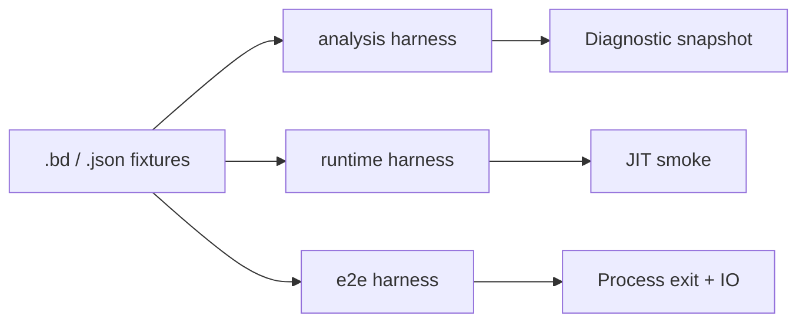

<!-- migrated from the legacy platform spec; canonical OpenSpec source -->
# Test harnesses and fixtures Specification

## Purpose

Conformance and regression fixture contracts across compiler unit, integration, and end-to-end test crates.

## Requirements

### Requirement: Feature hub authority: Decision [D-COMP-CONF-0004]
The Beskid standard SHALL enforce the following migrated contract section. Accepted ADR decisions are binding; uppercase requirement keywords retain their BCP-14 meaning.

> This feature hub **owns** normative MUST/SHOULD contract text. Sibling articles **must not** redefine hub requirements and **should** link here for authority.

**Stable ID:** `BSP-REQ-8722371EC588`  
**Legacy source:** `site/spec-content/platform-spec/compiler/conformance/test-harnesses-and-fixtures/adr/0001-feature-hub-authority/content.md`  
**Source SHA-256:** `8a71e5c469be41db8a5793518163498df20fb913bb81ffc0d2027d3b1f36ac89`

#### Scenario: Conformance exercises Decision
- **GIVEN** an implementation claims conformance with this capability
- **WHEN** behavior governed by this contract section is exercised
- **THEN** every MUST, SHALL, REQUIRED, prohibition, and accepted decision in the section is satisfied

### Requirement: Specification over implementation notes: Decision [D-COMP-CONF-0005]
The Beskid standard SHALL enforce the following migrated contract section. Accepted ADR decisions are binding; uppercase requirement keywords retain their BCP-14 meaning.

> Normative platform-spec prose and ADRs under this feature **supersede** informal comments in implementation crates until explicitly migrated into spec text.

**Stable ID:** `BSP-REQ-0BB25326BACC`  
**Legacy source:** `site/spec-content/platform-spec/compiler/conformance/test-harnesses-and-fixtures/adr/0002-spec-over-implementation-notes/content.md`  
**Source SHA-256:** `590c975704fd5de8b164e578cb15d526da01dc1b3380f9d0c99cdeacdfb8e2c1`

#### Scenario: Conformance exercises Decision
- **GIVEN** an implementation claims conformance with this capability
- **WHEN** behavior governed by this contract section is exercised
- **THEN** every MUST, SHALL, REQUIRED, prohibition, and accepted decision in the section is satisfied

### Requirement: Primary contract for Test harnesses and fixtures: Decision [D-COMP-CONF-0006]
The Beskid standard SHALL enforce the following migrated contract section. Accepted ADR decisions are binding; uppercase requirement keywords retain their BCP-14 meaning.

> The reference compiler **must** implement Test harnesses and fixtures as documented in this feature hub and its article bundle.

**Stable ID:** `BSP-REQ-7C0145D4C45C`  
**Legacy source:** `site/spec-content/platform-spec/compiler/conformance/test-harnesses-and-fixtures/adr/0003-primary-contract-choice/content.md`  
**Source SHA-256:** `df9a11a7604d52d5dfdac3550c72e0abbcdbb93f7a07c3c09ca3854f91622eb6`

#### Scenario: Conformance exercises Decision
- **GIVEN** an implementation claims conformance with this capability
- **WHEN** behavior governed by this contract section is exercised
- **THEN** every MUST, SHALL, REQUIRED, prohibition, and accepted decision in the section is satisfied

### Requirement: Spine parity fixtures: Decision [D-COMP-CONF-0007]
The Beskid standard SHALL enforce the following migrated contract section. Accepted ADR decisions are binding; uppercase requirement keywords retain their BCP-14 meaning.

> The reference compiler **must** maintain:
> 
> | Fixture class | Requirement |
> | --- | --- |
> | Diagnostics parity | For a fixed corpus (≥20 project fixtures), CLI analyze / semantic gate diagnostics **must** equal `prepare_compilation(DiagnosticsOnly)` diagnostics (codes and presence; path labels may differ per D-COMP-BUILD-0012) |
> | Link completeness | Project-backed run/test/build fixtures **must** pass `validate_artifact` with no undefined callees |
> | Corelib matrix | Every `corelib_tests` target in `beskid_corelib/tests/corelib_tests` **must** pass under `beskid test` using the workspace-built CLI in CI |
> 
> New spine regressions **must** add a fixture in `beskid_tests` before closing related ADRs.

**Stable ID:** `BSP-REQ-2988A4F997DB`  
**Legacy source:** `site/spec-content/platform-spec/compiler/conformance/test-harnesses-and-fixtures/adr/0004-spine-parity-fixtures/content.md`  
**Source SHA-256:** `31d99570ba3a88dcb7c7a0181104a85e1542cb83461d22c9322100e8d456b2cc`

#### Scenario: Conformance exercises Decision
- **GIVEN** an implementation claims conformance with this capability
- **WHEN** behavior governed by this contract section is exercised
- **THEN** every MUST, SHALL, REQUIRED, prohibition, and accepted decision in the section is satisfied

## Informative Source Provenance

The records below preserve migration history and are not normative except where text was extracted into a requirement above.

### Source Record: Test harnesses and fixtures

**Authority:** informative provenance  
**Legacy path:** `/platform-spec/compiler/conformance/test-harnesses-and-fixtures/`  
**Source:** `site/spec-content/platform-spec/compiler/conformance/test-harnesses-and-fixtures/content.md`  
**SHA-256:** `a28c6a1603603ce9d097aadb96264b53d5f8b799391a203cc53cd977b276150b`

<details>
<summary>Migrated source text</summary>

``````markdown
<SpecSection title="What this feature specifies" id="what-this-feature-specifies">
This feature explains how the project proves that implemented behavior remains stable release over release. It is organized into newcomer-friendly articles that move from model, to flow, to contracts, then practical verification and debugging guidance.
</SpecSection>

<SpecSection title="Implementation anchors" id="implementation-anchors">
- `compiler/crates/beskid_tests/src/analysis` fixture-driven semantic assertions
- `compiler/crates/beskid_tests/src/runtime` runtime behavior checks
- `compiler/crates/beskid_e2e_tests/src/tests/runtime_cases.rs` source-to-runtime outcomes
- `compiler/crates/beskid_tests/src/doc_tests.rs` docs-driven verification
- `compiler/crates/beskid_tests/src/mods` compiler-mod tests (manifest goldens, pipeline ordering, incremental replay, analyzer coverage)
- `compiler/crates/beskid_tests/src/spine` spine parity and diagnostics round-trip tests
- `compiler/crates/beskid_tests/src/lsp` LSP integration tests (completion, hover, references, semantic tokens)
</SpecSection>

## Decisions
<!-- spec:generate:adr-index -->
No open decisions. Closed choices are normative ADRs under **`adr/`** (`D-COMP-CONF-0004` … `D-COMP-CONF-0007`); use the reader **ADRs** tab for expandable detail.
<!-- /spec:generate:adr-index -->
## Articles
<!-- spec:generate:article-index -->
- [Contracts and edge cases](./articles/contracts-and-edge-cases/)
- [Design model](./articles/design-model/)
- [Examples](./articles/examples/)
- [FAQ and troubleshooting](./articles/faq-and-troubleshooting/)
- [Flow and algorithm](./articles/flow-and-algorithm/)
- [Verification and traceability](./articles/verification-and-traceability/)
<!-- /spec:generate:article-index -->
``````

</details>

### Source Record: Feature hub authority

**Authority:** informative provenance  
**Legacy path:** `/platform-spec/compiler/conformance/test-harnesses-and-fixtures/adr/0001-feature-hub-authority/`  
**Source:** `site/spec-content/platform-spec/compiler/conformance/test-harnesses-and-fixtures/adr/0001-feature-hub-authority/content.md`  
**SHA-256:** `8a71e5c469be41db8a5793518163498df20fb913bb81ffc0d2027d3b1f36ac89`

<details>
<summary>Migrated source text</summary>

``````markdown
## Context

Sibling articles under this feature previously restated requirements in inconsistent forms.

## Decision

This feature hub **owns** normative MUST/SHOULD contract text. Sibling articles **must not** redefine hub requirements and **should** link here for authority.

## Consequences

Contract changes start on the hub or in linked ADRs, then propagate to articles and implementation anchors.

## Verification anchors

- `site/website/src/content/docs/platform-spec/compiler/conformance/test-harnesses-and-fixtures/index.mdx`
- `article bundle under the same feature directory.`
``````

</details>

### Source Record: Specification over implementation notes

**Authority:** informative provenance  
**Legacy path:** `/platform-spec/compiler/conformance/test-harnesses-and-fixtures/adr/0002-spec-over-implementation-notes/`  
**Source:** `site/spec-content/platform-spec/compiler/conformance/test-harnesses-and-fixtures/adr/0002-spec-over-implementation-notes/content.md`  
**SHA-256:** `590c975704fd5de8b164e578cb15d526da01dc1b3380f9d0c99cdeacdfb8e2c1`

<details>
<summary>Migrated source text</summary>

``````markdown
## Context

Implementation crates accumulated informal notes that diverged from published contracts.

## Decision

Normative platform-spec prose and ADRs under this feature **supersede** informal comments in implementation crates until explicitly migrated into spec text.

## Consequences

Engineers file spec/ADR updates when behavior changes; crate comments are non-authoritative for conformance arguments.

## Verification anchors

- `compiler/crates/beskid_tests/src/analysis`
- `compiler/crates/beskid_tests/src/runtime`
- `compiler/crates/beskid_e2e_tests/src/tests/runtime_cases.rs`
``````

</details>

### Source Record: Primary contract for Test harnesses and fixtures

**Authority:** informative provenance  
**Legacy path:** `/platform-spec/compiler/conformance/test-harnesses-and-fixtures/adr/0003-primary-contract-choice/`  
**Source:** `site/spec-content/platform-spec/compiler/conformance/test-harnesses-and-fixtures/adr/0003-primary-contract-choice/content.md`  
**SHA-256:** `df9a11a7604d52d5dfdac3550c72e0abbcdbb93f7a07c3c09ca3854f91622eb6`

<details>
<summary>Migrated source text</summary>

``````markdown
## Context

This feature explains how the project proves that implemented behavior remains stable release over release. It is organized into newcomer-friendly articles that move from model, to flow, to contracts, then practical verification and debugging guidance.

## Decision

The reference compiler **must** implement Test harnesses and fixtures as documented in this feature hub and its article bundle.

## Consequences

Changes require hub/ADR updates and verification anchor extensions.

## Verification anchors

- `compiler/crates/beskid_tests/src/analysis`
- `compiler/crates/beskid_tests/src/runtime`
- `compiler/crates/beskid_e2e_tests/src/tests/runtime_cases.rs`
``````

</details>

### Source Record: Spine parity fixtures

**Authority:** informative provenance  
**Legacy path:** `/platform-spec/compiler/conformance/test-harnesses-and-fixtures/adr/0004-spine-parity-fixtures/`  
**Source:** `site/spec-content/platform-spec/compiler/conformance/test-harnesses-and-fixtures/adr/0004-spine-parity-fixtures/content.md`  
**SHA-256:** `31d99570ba3a88dcb7c7a0181104a85e1542cb83461d22c9322100e8d456b2cc`

<details>
<summary>Migrated source text</summary>

``````markdown
## Context

Regressions in parallel analyze vs execute paths and incomplete codegen linking were not gated by a single conformance suite tied to the unified spine ADRs.

## Decision

The reference compiler **must** maintain:

| Fixture class | Requirement |
| --- | --- |
| Diagnostics parity | For a fixed corpus (≥20 project fixtures), CLI analyze / semantic gate diagnostics **must** equal `prepare_compilation(DiagnosticsOnly)` diagnostics (codes and presence; path labels may differ per D-COMP-BUILD-0012) |
| Link completeness | Project-backed run/test/build fixtures **must** pass `validate_artifact` with no undefined callees |
| Corelib matrix | Every `corelib_tests` target in `beskid_corelib/tests/corelib_tests` **must** pass under `beskid test` using the workspace-built CLI in CI |

New spine regressions **must** add a fixture in `beskid_tests` before closing related ADRs.

## Consequences

`compiler/crates/beskid_tests/src/spine/` hosts parity tests. Engine and codegen integration tests migrate off raw `lower_source` per D-COMP-IR-0011.

## Verification anchors

- `compiler/crates/beskid_tests/src/spine/`
- `compiler/crates/beskid_codegen/tests/array_tests_linking.rs`
- `compiler/corelib/ci/run_corelib_tests.py`
- `compiler/crates/beskid_tests/src/runtime/jit.rs`
``````

</details>

### Source Record: Contracts and edge cases

**Authority:** informative provenance  
**Legacy path:** `/platform-spec/compiler/conformance/test-harnesses-and-fixtures/articles/contracts-and-edge-cases/`  
**Source:** `site/spec-content/platform-spec/compiler/conformance/test-harnesses-and-fixtures/articles/contracts-and-edge-cases/content.md`  
**SHA-256:** `5aac516ab36538f01bc70423f0bdcb8e3392daf673a9522a8ff7821e3c224f72`

<details>
<summary>Migrated source text</summary>

``````markdown
## Normative contracts

- Producer crates must emit data in a shape accepted by downstream consumers.
- Consumer crates must not silently reinterpret the contract surface.
- Contract regressions must be captured as compile-time or test-time failures, not hidden runtime drift.

## Edge cases to monitor

- Partial refactors that update only one side of a crate boundary.
- Symbol/name changes that compile locally but break cross-crate integration.
- Fixtures that pass in isolation but fail in end-to-end harnesses.

## Failure handling expectations

When contract checks fail, diagnostics should point contributors to the responsible boundary crate and to the corresponding conformance fixture.
``````

</details>

### Source Record: Design model

**Authority:** informative provenance  
**Legacy path:** `/platform-spec/compiler/conformance/test-harnesses-and-fixtures/articles/design-model/`  
**Source:** `site/spec-content/platform-spec/compiler/conformance/test-harnesses-and-fixtures/articles/design-model/content.md`  
**SHA-256:** `505a12632c0b0e008ee6e0815a94f7144d28721a090a5a25f60fda3b47cf395a`

<details>
<summary>Migrated source text</summary>

``````markdown
## Harness layers

Conformance is split so failures localize quickly:

| Layer | Crate path | Pins |
| --- | --- | --- |
| **Analysis fixtures** | `beskid_tests/src/analysis` | Diagnostic codes, resolver graphs, staged rules |
| **Runtime JIT** | `beskid_tests/src/runtime` | Builtin dispatch, GC, fibers |
| **E2E sources** | `beskid_e2e_tests` | Full `.bd` programs through CLI backends |
| **Doc tests** | `beskid_tests/src/doc_tests.rs` | Spec snippets compile and match asserted output |



## Fixture conventions

- Prefer **minimal** `.bd` files per diagnostic or rule; share `Project.proj` layouts via `beskid_tests/src/projects` builders.
- Golden diagnostics **must** cite stable codes from [diagnostic code registry](/platform-spec/compiler/semantic-pipeline/diagnostic-code-registry/).
- Runtime tests **must** negotiate the same ABI version as production `beskid run`.

## Code anchors

- `compiler/crates/beskid_tests/src/analysis`
- `compiler/crates/beskid_tests/src/runtime`
- `compiler/crates/beskid_e2e_tests/src/tests/runtime_cases.rs`
- `compiler/crates/beskid_tests/src/doc_tests.rs`
``````

</details>

### Source Record: Examples

**Authority:** informative provenance  
**Legacy path:** `/platform-spec/compiler/conformance/test-harnesses-and-fixtures/articles/examples/`  
**Source:** `site/spec-content/platform-spec/compiler/conformance/test-harnesses-and-fixtures/articles/examples/content.md`  
**SHA-256:** `620553591ccb251ac68697a24d02579e566a823e8427e702ea0cbb61b5724b04`

<details>
<summary>Migrated source text</summary>

``````markdown
## Example 1: Happy path

A standard project exercises the expected producer -> consumer handoff with no contract violations. Trace this via:

- `compiler/crates/beskid_tests/src/analysis` for fixture-driven semantic assertions
- `compiler/crates/beskid_e2e_tests/src/tests/runtime_cases.rs` for source-to-runtime outcomes

## Example 2: Contract mismatch

Intentionally alter a boundary definition (for example, a symbol or structure shape), then run the related conformance suite. The expected result is a deterministic failure that identifies the mismatched boundary.

## Example 3: Regression-proofing a fix

After applying a fix, add or update a focused fixture in the nearest test crate and rerun wider suites so the behavior remains locked for future refactors.
``````

</details>

### Source Record: FAQ and troubleshooting

**Authority:** informative provenance  
**Legacy path:** `/platform-spec/compiler/conformance/test-harnesses-and-fixtures/articles/faq-and-troubleshooting/`  
**Source:** `site/spec-content/platform-spec/compiler/conformance/test-harnesses-and-fixtures/articles/faq-and-troubleshooting/content.md`  
**SHA-256:** `f884f9f10c8e674dd165fa26952cefb345053e258c4617854d7c93215311c0ac`

<details>
<summary>Migrated source text</summary>

``````markdown
## Why did a change pass locally but fail in CI?

Most often, one crate boundary changed but the corresponding fixture or downstream consumer was not updated. Re-run the nearest conformance suite and inspect cross-crate handoff points.

## Where should I start debugging?

1. Confirm the target requirement in this feature hub.
2. Step through `compiler/crates/beskid_tests/src/analysis` and `compiler/crates/beskid_tests/src/runtime`.
3. Validate consumer behavior at `compiler/crates/beskid_e2e_tests/src/tests/runtime_cases.rs`.
4. Reproduce with `compiler/crates/beskid_tests/src/doc_tests.rs`.

## How do I add a new rule safely?

Document the new contract in the relevant article, update implementation in the owning crate, and add a fixture proving both happy-path and failure-path behavior.
``````

</details>

### Source Record: Flow and algorithm

**Authority:** informative provenance  
**Legacy path:** `/platform-spec/compiler/conformance/test-harnesses-and-fixtures/articles/flow-and-algorithm/`  
**Source:** `site/spec-content/platform-spec/compiler/conformance/test-harnesses-and-fixtures/articles/flow-and-algorithm/content.md`  
**SHA-256:** `c9e473ed2a5848069954d0f49225708d92856eee01ff937a8b6b52a742092793`

<details>
<summary>Migrated source text</summary>

``````markdown
## End-to-end flow

1. Input enters compiler/runtime boundary at a stable entrypoint.
2. The responsible crate enforces the expected shape and emits stable structures.
3. Downstream crates consume those structures without redefining semantics.
4. Conformance tests assert behavior at integration boundaries.

## Algorithm notes for newcomers

- Prefer tracing one fixture end-to-end before reading all modules.
- Verify where shape conversion happens; avoid assuming all crates mutate data.
- Keep an eye on handoff points where diagnostics or ABI constraints are locked.

## Where to step through code

- Start with `compiler/crates/beskid_tests/src/analysis` for fixture-driven semantic assertions.
- Then inspect `compiler/crates/beskid_tests/src/runtime` for runtime behavior checks.
- Follow consumption at `compiler/crates/beskid_e2e_tests/src/tests/runtime_cases.rs` for source-to-runtime outcomes.
- Validate expectations using `compiler/crates/beskid_tests/src/doc_tests.rs` for docs-driven verification.
``````

</details>

### Source Record: Verification and traceability

**Authority:** informative provenance  
**Legacy path:** `/platform-spec/compiler/conformance/test-harnesses-and-fixtures/articles/verification-and-traceability/`  
**Source:** `site/spec-content/platform-spec/compiler/conformance/test-harnesses-and-fixtures/articles/verification-and-traceability/content.md`  
**SHA-256:** `deea4567e573be4d5ffb2509addcab4ebe3c9b2f1d03ee116bc30b81e9de9860`

<details>
<summary>Migrated source text</summary>

``````markdown
## Verification strategy

- Unit-level checks validate local transformations.
- Integration tests validate crate-to-crate contracts.
- End-to-end fixtures validate user-visible behavior.

## Traceability map

- Spec requirement source: `/platform-spec/compiler/conformance/test-harnesses-and-fixtures/`.
- Core implementation anchors:
  - `compiler/crates/beskid_tests/src/analysis` fixture-driven semantic assertions
  - `compiler/crates/beskid_tests/src/runtime` runtime behavior checks
  - `compiler/crates/beskid_e2e_tests/src/tests/runtime_cases.rs` source-to-runtime outcomes
- Conformance anchor:
  - `compiler/crates/beskid_tests/src/doc_tests.rs` docs-driven verification

## Review checklist

- Requirement text and test expectation describe the same boundary.
- Crate ownership updates are reflected in spec links.
- Newly introduced edge cases include at least one reproducible fixture.
``````

</details>
