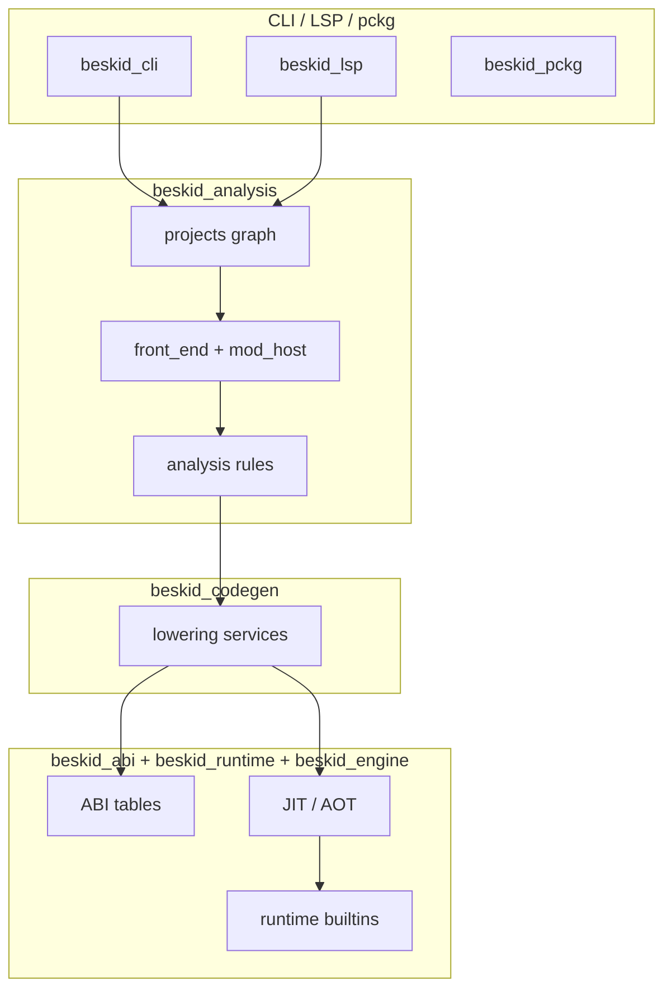

<!-- migrated from the legacy platform spec; canonical OpenSpec source -->
# Crate-to-spec anchors Specification

## Purpose

Formal mapping from compiler crates to platform-spec areas and feature leaves.

## Requirements

### Requirement: Feature hub authority: Decision [D-COMP-MAP-0001]
The Beskid standard SHALL enforce the following migrated contract section. Accepted ADR decisions are binding; uppercase requirement keywords retain their BCP-14 meaning.

> This feature hub **owns** normative MUST/SHOULD contract text. Sibling articles **must not** redefine hub requirements and **should** link here for authority.

**Stable ID:** `BSP-REQ-B76FA1659138`  
**Legacy source:** `site/spec-content/platform-spec/compiler/implementation-map/crate-to-spec-anchors/adr/0001-feature-hub-authority/content.md`  
**Source SHA-256:** `8b8049e7a956d85ba800fc4889e8fa704e9091b4a70c654c68ed52cec14a58d1`

#### Scenario: Conformance exercises Decision
- **GIVEN** an implementation claims conformance with this capability
- **WHEN** behavior governed by this contract section is exercised
- **THEN** every MUST, SHALL, REQUIRED, prohibition, and accepted decision in the section is satisfied

### Requirement: Specification over implementation notes: Decision [D-COMP-MAP-0002]
The Beskid standard SHALL enforce the following migrated contract section. Accepted ADR decisions are binding; uppercase requirement keywords retain their BCP-14 meaning.

> Normative platform-spec prose and ADRs under this feature **supersede** informal comments in implementation crates until explicitly migrated into spec text.

**Stable ID:** `BSP-REQ-CB7C4A26A1A8`  
**Legacy source:** `site/spec-content/platform-spec/compiler/implementation-map/crate-to-spec-anchors/adr/0002-spec-over-implementation-notes/content.md`  
**Source SHA-256:** `4d28a4ef0d7fcd65e173c0967e0096486fdd08d4d77ae89aa4e5967c875ee42d`

#### Scenario: Conformance exercises Decision
- **GIVEN** an implementation claims conformance with this capability
- **WHEN** behavior governed by this contract section is exercised
- **THEN** every MUST, SHALL, REQUIRED, prohibition, and accepted decision in the section is satisfied

### Requirement: Crate-to-spec anchor map is canonical index: Decision [D-COMP-MAP-0003]
The Beskid standard SHALL enforce the following migrated contract section. Accepted ADR decisions are binding; uppercase requirement keywords retain their BCP-14 meaning.

> This feature hub is the canonical map from `compiler/crates/*` to platform-spec features; other pages link here instead of duplicating tables.

**Stable ID:** `BSP-REQ-B218585DF6F8`  
**Legacy source:** `site/spec-content/platform-spec/compiler/implementation-map/crate-to-spec-anchors/adr/0003-crate-map-single-index/content.md`  
**Source SHA-256:** `fded24d64223a8ee3382e6f699beba933d4776070538350789c19bbb930e52b4`

#### Scenario: Conformance exercises Decision
- **GIVEN** an implementation claims conformance with this capability
- **WHEN** behavior governed by this contract section is exercised
- **THEN** every MUST, SHALL, REQUIRED, prohibition, and accepted decision in the section is satisfied

## Informative Source Provenance

The records below preserve migration history and are not normative except where text was extracted into a requirement above.

### Source Record: Crate-to-spec anchors

**Authority:** informative provenance  
**Legacy path:** `/platform-spec/compiler/implementation-map/crate-to-spec-anchors/`  
**Source:** `site/spec-content/platform-spec/compiler/implementation-map/crate-to-spec-anchors/content.md`  
**SHA-256:** `ff45d7fa3bab3374afa95d7544d08a6114b7931a6163bfdfcf6389f58ca95b26`

<details>
<summary>Migrated source text</summary>

``````markdown
<SpecSection title="What this feature specifies" id="what-this-feature-specifies">
This feature explains how maintainers trace each normative statement to a concrete crate boundary. It is organized into newcomer-friendly articles that move from model, to flow, to contracts, then practical verification and debugging guidance.
</SpecSection>

<SpecSection title="Implementation anchors" id="implementation-anchors">
- `beskid_analysis` -> parser/resolution/semantic leaves
- `beskid_codegen` -> lowering contract leaves
- `beskid_abi` and `beskid_runtime` -> execution ABI/runtime leaves
- `beskid_engine` -> JIT execution of CodegenArtifact
- `beskid_aot` -> AOT compilation and object emission
- `beskid_pipeline` -> stable pipeline phase ordering and composition
- `beskid_graph` -> project graph model
- `beskid_queries` -> Salsa incremental query engine
- `beskid_cli` -> command surface and build/run orchestration
- `beskid_lsp` -> language server and diagnostics parity
- `beskid_pckg` -> package registry client
- `beskid_runtime_bridge` -> arch/OS interop (extern dispatch)
- `beskid_template` -> project scaffolding templates
- `abfall` -> garbage-collector allocator (Sweep, Mark, Compact)
- `beskid_tests` and `beskid_e2e_tests` -> conformance leaves
- `beskid_ast_derive`, `beskid_ast_reflect_gen` -> internal code-generation utilities (no normative spec surface)
</SpecSection>

## Decisions
<!-- spec:generate:adr-index -->
No open decisions. Closed choices are normative ADRs under **`adr/`** (`D-COMP-MAP-0001` … `D-COMP-MAP-0003`); use the reader **ADRs** tab for expandable detail.
<!-- /spec:generate:adr-index -->
## Articles
<!-- spec:generate:article-index -->
- [Contracts and edge cases](./articles/contracts-and-edge-cases/)
- [Design model](./articles/design-model/)
- [Examples](./articles/examples/)
- [FAQ and troubleshooting](./articles/faq-and-troubleshooting/)
- [Flow and algorithm](./articles/flow-and-algorithm/)
- [Verification and traceability](./articles/verification-and-traceability/)
<!-- /spec:generate:article-index -->
``````

</details>

### Source Record: Feature hub authority

**Authority:** informative provenance  
**Legacy path:** `/platform-spec/compiler/implementation-map/crate-to-spec-anchors/adr/0001-feature-hub-authority/`  
**Source:** `site/spec-content/platform-spec/compiler/implementation-map/crate-to-spec-anchors/adr/0001-feature-hub-authority/content.md`  
**SHA-256:** `8b8049e7a956d85ba800fc4889e8fa704e9091b4a70c654c68ed52cec14a58d1`

<details>
<summary>Migrated source text</summary>

``````markdown
## Context

Sibling articles under this feature previously restated requirements in inconsistent forms.

## Decision

This feature hub **owns** normative MUST/SHOULD contract text. Sibling articles **must not** redefine hub requirements and **should** link here for authority.

## Consequences

Contract changes start on the hub or in linked ADRs, then propagate to articles and implementation anchors.

## Verification anchors

- `site/website/src/content/docs/platform-spec/compiler/implementation-map/crate-to-spec-anchors/index.mdx`
- `article bundle under the same feature directory.`
``````

</details>

### Source Record: Specification over implementation notes

**Authority:** informative provenance  
**Legacy path:** `/platform-spec/compiler/implementation-map/crate-to-spec-anchors/adr/0002-spec-over-implementation-notes/`  
**Source:** `site/spec-content/platform-spec/compiler/implementation-map/crate-to-spec-anchors/adr/0002-spec-over-implementation-notes/content.md`  
**SHA-256:** `4d28a4ef0d7fcd65e173c0967e0096486fdd08d4d77ae89aa4e5967c875ee42d`

<details>
<summary>Migrated source text</summary>

``````markdown
## Context

Implementation crates accumulated informal notes that diverged from published contracts.

## Decision

Normative platform-spec prose and ADRs under this feature **supersede** informal comments in implementation crates until explicitly migrated into spec text.

## Consequences

Engineers file spec/ADR updates when behavior changes; crate comments are non-authoritative for conformance arguments.

## Verification anchors

- `compiler/crates/beskid_analysis/`
``````

</details>

### Source Record: Crate-to-spec anchor map is canonical index

**Authority:** informative provenance  
**Legacy path:** `/platform-spec/compiler/implementation-map/crate-to-spec-anchors/adr/0003-crate-map-single-index/`  
**Source:** `site/spec-content/platform-spec/compiler/implementation-map/crate-to-spec-anchors/adr/0003-crate-map-single-index/content.md`  
**SHA-256:** `fded24d64223a8ee3382e6f699beba933d4776070538350789c19bbb930e52b4`

<details>
<summary>Migrated source text</summary>

``````markdown
## Context

Crate references were scattered across hubs without a single ownership surface.

## Decision

This feature hub is the canonical map from `compiler/crates/*` to platform-spec features; other pages link here instead of duplicating tables.

## Consequences

New crates require anchor rows before Standard promotion of dependent features.

## Verification anchors

- Implementation-map articles and `compiler/Cargo.toml` workspace layout.
``````

</details>

### Source Record: Contracts and edge cases

**Authority:** informative provenance  
**Legacy path:** `/platform-spec/compiler/implementation-map/crate-to-spec-anchors/articles/contracts-and-edge-cases/`  
**Source:** `site/spec-content/platform-spec/compiler/implementation-map/crate-to-spec-anchors/articles/contracts-and-edge-cases/content.md`  
**SHA-256:** `4b8cedec5226dd01d7335724775f1b4ef189f301c41b2273c2b04b8e1e031b30`

<details>
<summary>Migrated source text</summary>

``````markdown
## Normative contracts

- Producer crates must emit data in a shape accepted by downstream consumers.
- Consumer crates must not silently reinterpret the contract surface.
- Contract regressions must be captured as compile-time or test-time failures, not hidden runtime drift.

## Edge cases to monitor

- Partial refactors that update only one side of a crate boundary.
- Symbol/name changes that compile locally but break cross-crate integration.
- Fixtures that pass in isolation but fail in end-to-end harnesses.

## Failure handling expectations

When contract checks fail, diagnostics should point contributors to the responsible boundary crate and to the corresponding conformance fixture.
``````

</details>

### Source Record: Design model

**Authority:** informative provenance  
**Legacy path:** `/platform-spec/compiler/implementation-map/crate-to-spec-anchors/articles/design-model/`  
**Source:** `site/spec-content/platform-spec/compiler/implementation-map/crate-to-spec-anchors/articles/design-model/content.md`  
**SHA-256:** `5e394db6b057c16bc178bfeca9efd87b1de042387e058df022ca2590b248c127`

<details>
<summary>Migrated source text</summary>

``````markdown
## Map role

This feature is the **maintenance index** between Rust crates and normative spec leaves. When you change behavior in a crate, update the linked spec article in the same change set; when you add a spec contract, anchor it to the owning crate here.



## Primary actors

| Actor | Responsibility |
| --- | --- |
| **Producer crates** | Emit diagnostics, artifacts, and ABI metadata (`beskid_analysis`, `beskid_codegen`) |
| **Consumer crates** | Execute or validate artifacts (`beskid_engine`, `beskid_runtime`, tooling) |
| **Tooling crates** | CLI binary, shared command framework, LSP, package client (`beskid_cli`, `beskid_tools`, `beskid_lsp`, `beskid_pckg`) |
| **Infrastructure crates** | Pipeline ordering, graph model, queries, codegen utilities (`beskid_pipeline`, `beskid_graph`, `beskid_queries`, `beskid_ast_derive`, `beskid_ast_reflect_gen`, `beskid_runtime_bridge`, `beskid_template`, `abfall`) |
| **Conformance crates** | Pin observable behavior (`beskid_tests`, `beskid_e2e_tests`) |

## Crate quick anchors

- `beskid_analysis` — parser, resolution, semantic pipeline, mod host
- `beskid_codegen` — lowering contract
- `beskid_abi` + `beskid_runtime` — execution ABI/runtime leaves
- `beskid_engine` — JIT execution of CodegenArtifact
- `beskid_aot` — AOT compilation and object emission
- `beskid_pipeline` — stable pipeline phase ordering
- `beskid_graph` — project graph model
- `beskid_queries` — Salsa incremental query engine
- `beskid_cli` — Clap command surface and thin dispatch
- `beskid_tools` — pipeline UI, diagnostics, `CommandSession`, corelib provision, registry helpers
- `beskid_lsp` — language server, diagnostics parity
- `beskid_pckg` — package registry client
- `beskid_runtime_bridge` — arch/OS interop bridge
- `beskid_template` — project scaffolding templates
- `abfall` — GC allocator (Sweep, Mark, Compact)
- `beskid_tests` + `beskid_e2e_tests` — conformance leaves
- `beskid_ast_derive`, `beskid_ast_reflect_gen` — internal codegen utilities

## Compiler mod anchors (reference compiler)

| Concern | Primary crates | Spec leaves |
| --- | --- | --- |
| Stable pipeline phase ids | `beskid_pipeline` | **[Stage ordering](/platform-spec/compiler/build-pipeline/stage-ordering/)** |
| Manifest + graph + `CompilePlan` | `beskid_analysis::projects` | **[Project manifest contract](/platform-spec/tooling/manifests-and-lockfiles/project-manifest-contract/)**, **[Workspace resolution contract](/platform-spec/compiler/resolution-and-projects/workspace-resolution-contract/)** |
| Program assembly + effective roots | `beskid_analysis::projects::assembly`, `beskid_analysis::services::front_end` | **[Program assembly](/platform-spec/compiler/build-pipeline/program-assembly/)** |
| Parse + SyntaxMirror | `beskid_analysis::syntax`, `beskid_analysis::parser` | **[Syntax domain model generation](/platform-spec/compiler/compiler-mods/syntax-domain-model-generation/)**, **[SyntaxMirror facade](/platform-spec/compiler/compiler-mods/beskid-compiler-syntax-facade/)** |
| Mod host orchestration | `beskid_analysis::mod_host` (`discovery`, `load`, `capabilities`, `collect`, `generate`, `merge`, `reparse`, `analyze`, `rewrite`) | **[Mod host bridge](/platform-spec/compiler/compiler-mods/mod-host-bridge/)**, **[Incremental scheduling and determinism](/platform-spec/compiler/compiler-mods/incremental-scheduling-determinism/)** |
| Mod host service integration | `beskid_analysis::services::analyze`, `beskid_codegen::services` | **[Stage ordering](/platform-spec/compiler/build-pipeline/stage-ordering/)**, **[Typed emitter and transforms](/platform-spec/compiler/compiler-mods/typed-emitter-and-transforms/)** |
| Mod diagnostics + facades | `beskid_analysis::analysis`, `beskid_analysis::query` | **[Analysis, query, and diagnostics facades](/platform-spec/compiler/compiler-mods/analysis-query-diagnostics-facade/)**, **[Diagnostic code registry](/platform-spec/compiler/semantic-pipeline/diagnostic-code-registry/)** |
| Analyzer/rewriter staging | `beskid_analysis::analysis::rules::staged` | **[Rules pipeline contract](/platform-spec/compiler/semantic-pipeline/rules-pipeline-contract/)** |
| Type checking (authoritative) | `beskid_analysis::services::lower` (`lower.type_check`) | **[Semantic pipeline / Stage ordering](/platform-spec/compiler/semantic-pipeline/stage-ordering/)**, **[Type-system pass contract](/platform-spec/compiler/semantic-pipeline/type-system-pass-contract/)** |
| Lowering after typed merge | `beskid_codegen::services` | **[Stage ordering](/platform-spec/compiler/build-pipeline/stage-ordering/)**, **[Typed emitter and transforms](/platform-spec/compiler/compiler-mods/typed-emitter-and-transforms/)** |
| LSP parity | `beskid_lsp` | **[Diagnostics and workspace analysis](/platform-spec/tooling/lsp/diagnostics-and-workspace-analysis/)** |
| Incremental tests | `beskid_tests` | **[Incremental scheduling and determinism](/platform-spec/compiler/compiler-mods/incremental-scheduling-determinism/)** |
| Pipeline composition (Rust) | `beskid_pipeline`, `beskid_analysis` | **[Pipeline composition](/platform-spec/compiler/pipeline-composition/)** |
| AOT compilation and linking | `beskid_aot` | **[Backends (JIT/AOT)](/platform-spec/compiler/build-pipeline/backends-jit-aot/)** |
| Project graph model | `beskid_graph` | **[Workspace resolution contract](/platform-spec/compiler/resolution-and-projects/workspace-resolution-contract/)**, **[Pipeline composition](/platform-spec/compiler/pipeline-composition/)** |
| Salsa incremental queries | `beskid_queries` | **[Analysis, query, and diagnostics facades](/platform-spec/compiler/compiler-mods/analysis-query-diagnostics-facade/)** |
| Runtime bridge (arch/OS interop) | `beskid_runtime_bridge` | **[Rust ABI profile](/platform-spec/language-meta/interop/rust-abi-profile/)**, **[C ABI profile](/platform-spec/language-meta/interop/c-abi-profile/)** |
| Template scaffold | `beskid_template` | **[Project templates](/platform-spec/tooling/project-scaffolding/project-templates/)**, **[beskid new](/platform-spec/tooling/project-scaffolding/beskid-new/)** |
| Garbage-collector allocator | `abfall` | **[Memory and GC runtime contract](/platform-spec/execution/runtime/memory-and-gc-runtime-contract/)** |
| AST derive macros (internal) | `beskid_ast_derive` | Internal codegen utility — no normative spec surface |
| AST reflection/visitor gen (internal) | `beskid_ast_reflect_gen` | Internal codegen utility — no normative spec surface |
``````

</details>

### Source Record: Examples

**Authority:** informative provenance  
**Legacy path:** `/platform-spec/compiler/implementation-map/crate-to-spec-anchors/articles/examples/`  
**Source:** `site/spec-content/platform-spec/compiler/implementation-map/crate-to-spec-anchors/articles/examples/content.md`  
**SHA-256:** `1573e95238f967e4a5a156adb426fe3a76dce32affe039ee1c1e8caa3923857a`

<details>
<summary>Migrated source text</summary>

``````markdown
## Example 1: Happy path

A standard project exercises the expected producer -> consumer handoff with no contract violations. Trace this via:

- ``beskid_analysis` -> parser/resolution/semantic leaves`
- ``beskid_abi` and `beskid_runtime` -> execution ABI/runtime leaves`

## Example 2: Contract mismatch

Intentionally alter a boundary definition (for example, a symbol or structure shape), then run the related conformance suite. The expected result is a deterministic failure that identifies the mismatched boundary.

## Example 3: Regression-proofing a fix

After applying a fix, add or update a focused fixture in the nearest test crate and rerun wider suites so the behavior remains locked for future refactors.
``````

</details>

### Source Record: FAQ and troubleshooting

**Authority:** informative provenance  
**Legacy path:** `/platform-spec/compiler/implementation-map/crate-to-spec-anchors/articles/faq-and-troubleshooting/`  
**Source:** `site/spec-content/platform-spec/compiler/implementation-map/crate-to-spec-anchors/articles/faq-and-troubleshooting/content.md`  
**SHA-256:** `426facb8d7dea2ad60d7fa66c5e861859c76701bdc8338a35bb13fdf39f22f95`

<details>
<summary>Migrated source text</summary>

``````markdown
## Why did a change pass locally but fail in CI?

Most often, one crate boundary changed but the corresponding fixture or downstream consumer was not updated. Re-run the nearest conformance suite and inspect cross-crate handoff points.

## Where should I start debugging?

1. Confirm the target requirement in this feature hub.
2. Step through ``beskid_analysis` -> parser/resolution/semantic leaves` and ``beskid_codegen` -> lowering contract leaves`.
3. Validate consumer behavior at ``beskid_abi` and `beskid_runtime` -> execution ABI/runtime leaves`.
4. Reproduce with ``beskid_tests` and `beskid_e2e_tests` -> conformance leaves`.

## How do I add a new rule safely?

Document the new contract in the relevant article, update implementation in the owning crate, and add a fixture proving both happy-path and failure-path behavior.
``````

</details>

### Source Record: Flow and algorithm

**Authority:** informative provenance  
**Legacy path:** `/platform-spec/compiler/implementation-map/crate-to-spec-anchors/articles/flow-and-algorithm/`  
**Source:** `site/spec-content/platform-spec/compiler/implementation-map/crate-to-spec-anchors/articles/flow-and-algorithm/content.md`  
**SHA-256:** `eb643d8b392317a75f42c9daa50a2ccf445c839df8ab08f1fc0e245361505851`

<details>
<summary>Migrated source text</summary>

``````markdown
## End-to-end flow

1. Input enters compiler/runtime boundary at a stable entrypoint.
2. The responsible crate enforces the expected shape and emits stable structures.
3. Downstream crates consume those structures without redefining semantics.
4. Conformance tests assert behavior at integration boundaries.

## Algorithm notes for newcomers

- Prefer tracing one fixture end-to-end before reading all modules.
- Verify where shape conversion happens; avoid assuming all crates mutate data.
- Keep an eye on handoff points where diagnostics or ABI constraints are locked.

## Where to step through code

- Start with ``beskid_analysis` -> parser/resolution/semantic leaves`.
- Then inspect ``beskid_codegen` -> lowering contract leaves`.
- Follow consumption path at ``beskid_abi` and `beskid_runtime` -> execution ABI/runtime leaves`.
- Validate expectations using ``beskid_tests` and `beskid_e2e_tests` -> conformance leaves`.
``````

</details>

### Source Record: Verification and traceability

**Authority:** informative provenance  
**Legacy path:** `/platform-spec/compiler/implementation-map/crate-to-spec-anchors/articles/verification-and-traceability/`  
**Source:** `site/spec-content/platform-spec/compiler/implementation-map/crate-to-spec-anchors/articles/verification-and-traceability/content.md`  
**SHA-256:** `b6da41dd5552266a06821899f395e9200978a0c697308e9dd82faaddad980db4`

<details>
<summary>Migrated source text</summary>

``````markdown
## Verification strategy

- Unit-level checks validate local transformations.
- Integration tests validate crate-to-crate contracts.
- End-to-end fixtures validate user-visible behavior.

## Traceability map

- Spec requirement source: `/platform-spec/compiler/implementation-map/crate-to-spec-anchors/`.
- Core implementation anchors:
  - `beskid_analysis` -> parser/resolution/semantic leaves
  - `beskid_codegen` -> lowering contract leaves
  - `beskid_abi` and `beskid_runtime` -> execution ABI/runtime leaves
- Conformance anchor:
  - `beskid_tests` and `beskid_e2e_tests` -> conformance leaves
  - `beskid_tests/src/spine/` -> unified spine diagnostics parity (D-COMP-CONF-0007)
  - `beskid_codegen/tests/array_tests_linking.rs` -> `LinkPlan` / `validate_artifact` (D-COMP-IR-0010)
  - `compiler/corelib/ci/run_corelib_tests.py` -> full `corelib_tests` matrix via `beskid test`

## Review checklist

- Requirement text and test expectation describe the same boundary.
- Crate ownership updates are reflected in spec links.
- Newly introduced edge cases include at least one reproducible fixture.
``````

</details>
