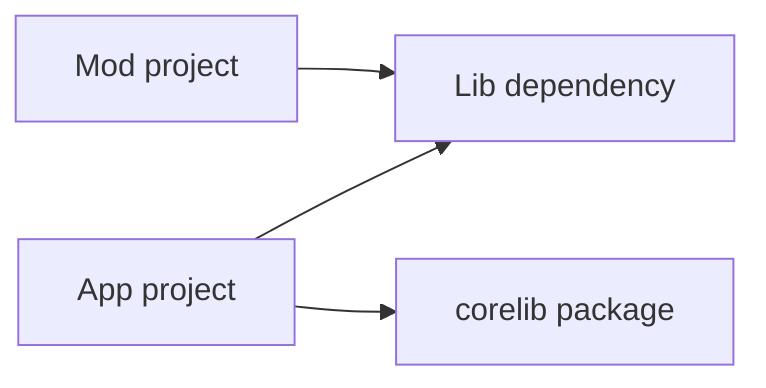
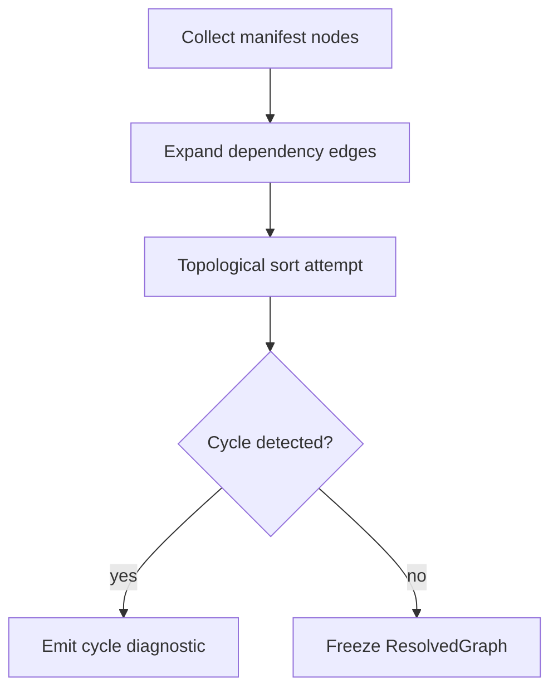

<!-- migrated from the legacy platform spec; canonical OpenSpec source -->
# Dependency graph and cycle policy Specification

## Purpose

Feature hub for the dependency graph and cycle policy in the reference compiler.

## Requirements

### Requirement: Feature hub authority: Decision [D-COMP-PROJ-0001]
The Beskid standard SHALL enforce the following migrated contract section. Accepted ADR decisions are binding; uppercase requirement keywords retain their BCP-14 meaning.

> This feature hub **owns** normative MUST/SHOULD contract text. Sibling articles **must not** redefine hub requirements and **should** link here for authority.

**Stable ID:** `BSP-REQ-9CBEE5BBAE79`  
**Legacy source:** `site/spec-content/platform-spec/compiler/resolution-and-projects/dependency-graph-and-cycle-policy/adr/0001-feature-hub-authority/content.md`  
**Source SHA-256:** `5e62f1e694e15dab211235868512335909343bf25384e8fbbacf956b16d5ac17`

#### Scenario: Conformance exercises Decision
- **GIVEN** an implementation claims conformance with this capability
- **WHEN** behavior governed by this contract section is exercised
- **THEN** every MUST, SHALL, REQUIRED, prohibition, and accepted decision in the section is satisfied

### Requirement: Specification over implementation notes: Decision [D-COMP-PROJ-0002]
The Beskid standard SHALL enforce the following migrated contract section. Accepted ADR decisions are binding; uppercase requirement keywords retain their BCP-14 meaning.

> Normative platform-spec prose and ADRs under this feature **supersede** informal comments in implementation crates until explicitly migrated into spec text.

**Stable ID:** `BSP-REQ-02703EA0AE7E`  
**Legacy source:** `site/spec-content/platform-spec/compiler/resolution-and-projects/dependency-graph-and-cycle-policy/adr/0002-spec-over-implementation-notes/content.md`  
**Source SHA-256:** `cc75873be736901caf34d2581d6f171d9f799271ca000b1be8719c798c4f2d2b`

#### Scenario: Conformance exercises Decision
- **GIVEN** an implementation claims conformance with this capability
- **WHEN** behavior governed by this contract section is exercised
- **THEN** every MUST, SHALL, REQUIRED, prohibition, and accepted decision in the section is satisfied

### Requirement: Dependency cycles reported at graph build: Decision [D-COMP-PROJ-0003]
The Beskid standard SHALL enforce the following migrated contract section. Accepted ADR decisions are binding; uppercase requirement keywords retain their BCP-14 meaning.

> Directed cycles **must** be reported during graph build; `Mod` cycles **must** include mod id in the diagnostic path.

**Stable ID:** `BSP-REQ-91263D96C2F8`  
**Legacy source:** `site/spec-content/platform-spec/compiler/resolution-and-projects/dependency-graph-and-cycle-policy/adr/0003-cycles-reported-at-graph-build/content.md`  
**Source SHA-256:** `e17b6ce4d72447523979a2a8119946f91151b09b067b9351ffc941b4399d2000`

#### Scenario: Conformance exercises Decision
- **GIVEN** an implementation claims conformance with this capability
- **WHEN** behavior governed by this contract section is exercised
- **THEN** every MUST, SHALL, REQUIRED, prohibition, and accepted decision in the section is satisfied

## Informative Source Provenance

The records below preserve migration history and are not normative except where text was extracted into a requirement above.

### Source Record: Dependency graph and cycle policy

**Authority:** informative provenance  
**Legacy path:** `/platform-spec/compiler/resolution-and-projects/dependency-graph-and-cycle-policy/`  
**Source:** `site/spec-content/platform-spec/compiler/resolution-and-projects/dependency-graph-and-cycle-policy/content.md`  
**SHA-256:** `0324aa0c932fbdf290f9c0c72ca154ab15b10a172aebad9defaa5f1805aac63d`

<details>
<summary>Migrated source text</summary>

``````markdown
This feature hub defines the normative contract for **dependency graph and cycle policy** and links newcomer-oriented reference articles.

## Implementation anchors
- `compiler/crates/beskid_tests/src/projects/corelib/layout.rs` models multi-project dependency layouts.
- `compiler/crates/beskid_tests/src/projects/corelib/mod.rs` checks graph expectations.
- `compiler/crates/beskid_cli/src/commands/doc.rs` consumes resolved dependency context for docs.

## Decisions
<!-- spec:generate:adr-index -->
No open decisions. Closed choices are normative ADRs under **`adr/`** (`D-COMP-PROJ-0001` … `D-COMP-PROJ-0003`); use the reader **ADRs** tab for expandable detail.
<!-- /spec:generate:adr-index -->
## Articles
<!-- spec:generate:article-index -->
- [Dependency graph and cycle policy - Contracts and edge cases](./articles/contracts-and-edge-cases/)
- [Dependency graph and cycle policy - Design model](./articles/design-model/)
- [Dependency graph and cycle policy - Examples](./articles/examples/)
- [Dependency graph and cycle policy - FAQ and troubleshooting](./articles/faq-and-troubleshooting/)
- [Dependency graph and cycle policy - Flow and algorithm](./articles/flow-and-algorithm/)
- [Dependency graph and cycle policy - Verification and traceability](./articles/verification-and-traceability/)
<!-- /spec:generate:article-index -->
``````

</details>

### Source Record: Feature hub authority

**Authority:** informative provenance  
**Legacy path:** `/platform-spec/compiler/resolution-and-projects/dependency-graph-and-cycle-policy/adr/0001-feature-hub-authority/`  
**Source:** `site/spec-content/platform-spec/compiler/resolution-and-projects/dependency-graph-and-cycle-policy/adr/0001-feature-hub-authority/content.md`  
**SHA-256:** `5e62f1e694e15dab211235868512335909343bf25384e8fbbacf956b16d5ac17`

<details>
<summary>Migrated source text</summary>

``````markdown
## Context

Sibling articles under this feature previously restated requirements in inconsistent forms.

## Decision

This feature hub **owns** normative MUST/SHOULD contract text. Sibling articles **must not** redefine hub requirements and **should** link here for authority.

## Consequences

Contract changes start on the hub or in linked ADRs, then propagate to articles and implementation anchors.

## Verification anchors

- `site/website/src/content/docs/platform-spec/compiler/resolution-and-projects/dependency-graph-and-cycle-policy/index.mdx`
- `article bundle under the same feature directory.`
``````

</details>

### Source Record: Specification over implementation notes

**Authority:** informative provenance  
**Legacy path:** `/platform-spec/compiler/resolution-and-projects/dependency-graph-and-cycle-policy/adr/0002-spec-over-implementation-notes/`  
**Source:** `site/spec-content/platform-spec/compiler/resolution-and-projects/dependency-graph-and-cycle-policy/adr/0002-spec-over-implementation-notes/content.md`  
**SHA-256:** `cc75873be736901caf34d2581d6f171d9f799271ca000b1be8719c798c4f2d2b`

<details>
<summary>Migrated source text</summary>

``````markdown
## Context

Implementation crates accumulated informal notes that diverged from published contracts.

## Decision

Normative platform-spec prose and ADRs under this feature **supersede** informal comments in implementation crates until explicitly migrated into spec text.

## Consequences

Engineers file spec/ADR updates when behavior changes; crate comments are non-authoritative for conformance arguments.

## Verification anchors

- `compiler/crates/beskid_tests/src/projects/corelib/layout.rs`
- `compiler/crates/beskid_tests/src/projects/corelib/mod.rs`
- `compiler/crates/beskid_cli/src/commands/doc.rs`
``````

</details>

### Source Record: Dependency cycles reported at graph build

**Authority:** informative provenance  
**Legacy path:** `/platform-spec/compiler/resolution-and-projects/dependency-graph-and-cycle-policy/adr/0003-cycles-reported-at-graph-build/`  
**Source:** `site/spec-content/platform-spec/compiler/resolution-and-projects/dependency-graph-and-cycle-policy/adr/0003-cycles-reported-at-graph-build/content.md`  
**SHA-256:** `e17b6ce4d72447523979a2a8119946f91151b09b067b9351ffc941b4399d2000`

<details>
<summary>Migrated source text</summary>

``````markdown
## Context

Silent cycle handling broke workspace diagnostics parity.

## Decision

Directed cycles **must** be reported during graph build; `Mod` cycles **must** include mod id in the diagnostic path.

## Consequences

Policy knobs (`error`, `warn`, permissive) select abort vs continue; default remains fail-closed for release builds.

## Verification anchors

- `beskid_analysis::projects::graph`
- `compiler/crates/beskid_tests/src/projects/corelib/layout.rs`.
``````

</details>

### Source Record: Dependency graph and cycle policy - Contracts and edge cases

**Authority:** informative provenance  
**Legacy path:** `/platform-spec/compiler/resolution-and-projects/dependency-graph-and-cycle-policy/articles/contracts-and-edge-cases/`  
**Source:** `site/spec-content/platform-spec/compiler/resolution-and-projects/dependency-graph-and-cycle-policy/articles/contracts-and-edge-cases/content.md`  
**SHA-256:** `1c1a941b1b6a9b7ecee9f10ab6c46075964b43763c91200efd31116e6e54d4f0`

<details>
<summary>Migrated source text</summary>

``````markdown
This article documents **contracts and edge cases** for **dependency graph and cycle policy** in the reference compiler.

## What this covers
For newcomers, this page explains where the contract shows up in day-to-day compiler work and which code paths are most useful first reads.

## Anchored code paths
- `compiler/crates/beskid_tests/src/projects/corelib/layout.rs` models multi-project dependency layouts.
- `compiler/crates/beskid_tests/src/projects/corelib/mod.rs` checks graph expectations.
- `compiler/crates/beskid_cli/src/commands/doc.rs` consumes resolved dependency context for docs.

## Practical notes
- Prefer tracing from CLI/test entry points into analysis/codegen crates before changing internals.
- Treat diagnostics and tests as part of the contract, not optional implementation details.
- If behavior changes, update this article and add/adjust tests in `compiler/crates/beskid_tests` or `compiler/crates/beskid_e2e_tests`.
``````

</details>

### Source Record: Dependency graph and cycle policy - Design model

**Authority:** informative provenance  
**Legacy path:** `/platform-spec/compiler/resolution-and-projects/dependency-graph-and-cycle-policy/articles/design-model/`  
**Source:** `site/spec-content/platform-spec/compiler/resolution-and-projects/dependency-graph-and-cycle-policy/articles/design-model/content.md`  
**SHA-256:** `273c6e90c027ae5b3511af9bdc8518819a87e3a020014240d888832be0be5081`

<details>
<summary>Migrated source text</summary>

``````markdown
## Graph model

Each workspace node is a **`Project.proj`** with typed edges:

| Edge kind | Meaning |
| --- | --- |
| Registry dependency | Resolved version pin from lockfile |
| Path dependency | Relative project root inside workspace |
| Transitive closure | Used for `CompilePlan` and doc workspace scan |



## Cycle policy

Directed cycles **must** be reported during graph build. Policy knobs (`error`, `warn`, permissive) select whether resolution aborts or continues with diagnostics. Cycles involving **`Mod`** projects **must** include the mod id in the diagnostic path.

## Mermaid presentation

User-visible dependency graphs **must** be emitted through `beskid_graph::adapters::project` from the built `ProjectGraph`. The analysis resolver remains the build authority; Mermaid is presentation-only.

## Anchored code paths

- `beskid_analysis::projects::graph` resolver and validator
- `beskid_graph::adapters::project` — canonical Mermaid emitter
- `compiler/crates/beskid_tests/src/projects/corelib/layout.rs` — multi-project layouts
- `compiler/crates/beskid_tests/src/projects/corelib/mod.rs` — graph expectations
- `compiler/crates/beskid_cli/src/commands/doc.rs` — docs consume resolved graph
``````

</details>

### Source Record: Dependency graph and cycle policy - Examples

**Authority:** informative provenance  
**Legacy path:** `/platform-spec/compiler/resolution-and-projects/dependency-graph-and-cycle-policy/articles/examples/`  
**Source:** `site/spec-content/platform-spec/compiler/resolution-and-projects/dependency-graph-and-cycle-policy/articles/examples/content.md`  
**SHA-256:** `7171822b90243f072dc5a7e7610a7d52085130c14b04d8486d31deeb2b030833`

<details>
<summary>Migrated source text</summary>

``````markdown
This article documents **examples** for **dependency graph and cycle policy** in the reference compiler.

## What this covers
For newcomers, this page explains where the contract shows up in day-to-day compiler work and which code paths are most useful first reads.

## Anchored code paths
- `compiler/crates/beskid_tests/src/projects/corelib/layout.rs` models multi-project dependency layouts.
- `compiler/crates/beskid_tests/src/projects/corelib/mod.rs` checks graph expectations.
- `compiler/crates/beskid_cli/src/commands/doc.rs` consumes resolved dependency context for docs.

## Practical notes
- Prefer tracing from CLI/test entry points into analysis/codegen crates before changing internals.
- Treat diagnostics and tests as part of the contract, not optional implementation details.
- If behavior changes, update this article and add/adjust tests in `compiler/crates/beskid_tests` or `compiler/crates/beskid_e2e_tests`.
``````

</details>

### Source Record: Dependency graph and cycle policy - FAQ and troubleshooting

**Authority:** informative provenance  
**Legacy path:** `/platform-spec/compiler/resolution-and-projects/dependency-graph-and-cycle-policy/articles/faq-and-troubleshooting/`  
**Source:** `site/spec-content/platform-spec/compiler/resolution-and-projects/dependency-graph-and-cycle-policy/articles/faq-and-troubleshooting/content.md`  
**SHA-256:** `bd1ef2644acea7e30ca796c269a1ce3c9c4f2a7c2456845bbc49d4740cd5e93b`

<details>
<summary>Migrated source text</summary>

``````markdown
This article documents **faq and troubleshooting** for **dependency graph and cycle policy** in the reference compiler.

## What this covers
For newcomers, this page explains where the contract shows up in day-to-day compiler work and which code paths are most useful first reads.

## Anchored code paths
- `compiler/crates/beskid_tests/src/projects/corelib/layout.rs` models multi-project dependency layouts.
- `compiler/crates/beskid_tests/src/projects/corelib/mod.rs` checks graph expectations.
- `compiler/crates/beskid_cli/src/commands/doc.rs` consumes resolved dependency context for docs.

## Practical notes
- Prefer tracing from CLI/test entry points into analysis/codegen crates before changing internals.
- Treat diagnostics and tests as part of the contract, not optional implementation details.
- If behavior changes, update this article and add/adjust tests in `compiler/crates/beskid_tests` or `compiler/crates/beskid_e2e_tests`.
``````

</details>

### Source Record: Dependency graph and cycle policy - Flow and algorithm

**Authority:** informative provenance  
**Legacy path:** `/platform-spec/compiler/resolution-and-projects/dependency-graph-and-cycle-policy/articles/flow-and-algorithm/`  
**Source:** `site/spec-content/platform-spec/compiler/resolution-and-projects/dependency-graph-and-cycle-policy/articles/flow-and-algorithm/content.md`  
**SHA-256:** `f31301caa4ea244d2f5ba19d806d5fd9eab0a7322c1ed1cd134813212f383c5f`

<details>
<summary>Migrated source text</summary>

``````markdown
## Build algorithm



1. Parse each member `Project.proj` and register a graph node (package id + project type).
2. Add edges for registry and path dependencies; normalize path roots against workspace policy.
3. Run cycle detection on the directed graph; apply configured severity.
4. Expose `ResolvedGraph` to `build_compile_plan_with_policy` and doc workspace scan.
5. **`Mod`** nodes trigger additional capability validation before the graph is considered sound.

## Anchored code paths

- `beskid_analysis::projects::graph::resolver`
- `compiler/crates/beskid_tests/src/projects/corelib/`
- `compiler/crates/beskid_cli/src/commands/doc.rs`
``````

</details>

### Source Record: Dependency graph and cycle policy - Verification and traceability

**Authority:** informative provenance  
**Legacy path:** `/platform-spec/compiler/resolution-and-projects/dependency-graph-and-cycle-policy/articles/verification-and-traceability/`  
**Source:** `site/spec-content/platform-spec/compiler/resolution-and-projects/dependency-graph-and-cycle-policy/articles/verification-and-traceability/content.md`  
**SHA-256:** `896f66a5e8905a7f11674f4f2876dc10dbde4568ad7b34dc0a7be03791490d28`

<details>
<summary>Migrated source text</summary>

``````markdown
This article documents **verification and traceability** for **dependency graph and cycle policy** in the reference compiler.

## What this covers
For newcomers, this page explains where the contract shows up in day-to-day compiler work and which code paths are most useful first reads.

## Anchored code paths
- `compiler/crates/beskid_tests/src/projects/corelib/layout.rs` models multi-project dependency layouts.
- `compiler/crates/beskid_tests/src/projects/corelib/mod.rs` checks graph expectations.
- `compiler/crates/beskid_cli/src/commands/doc.rs` consumes resolved dependency context for docs.

## Practical notes
- Prefer tracing from CLI/test entry points into analysis/codegen crates before changing internals.
- Treat diagnostics and tests as part of the contract, not optional implementation details.
- If behavior changes, update this article and add/adjust tests in `compiler/crates/beskid_tests` or `compiler/crates/beskid_e2e_tests`.
``````

</details>
