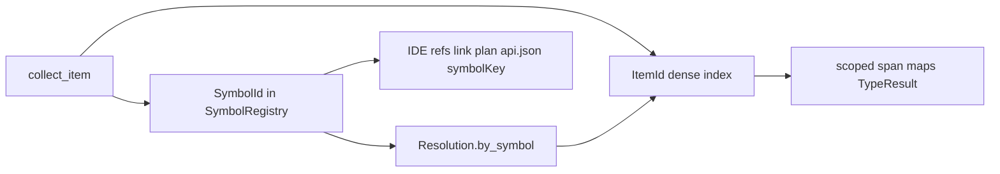

<!-- migrated from the legacy platform spec; canonical OpenSpec source -->
# Resolver contract Specification

## Purpose

Feature hub for the resolver contract in the reference compiler.

## Requirements

### Requirement: Feature hub authority: Decision [D-COMP-SEM-0004]
The Beskid standard SHALL enforce the following migrated contract section. Accepted ADR decisions are binding; uppercase requirement keywords retain their BCP-14 meaning.

> This feature hub **owns** normative MUST/SHOULD contract text. Sibling articles **must not** redefine hub requirements and **should** link here for authority.

**Stable ID:** `BSP-REQ-B5F854523D5E`  
**Legacy source:** `site/spec-content/platform-spec/compiler/semantic-pipeline/resolver-contract/adr/0001-feature-hub-authority/content.md`  
**Source SHA-256:** `03cf89affc7a248e891b5ba2f07540d93823792b74ae725b6aaa4fd3785c02ac`

#### Scenario: Conformance exercises Decision
- **GIVEN** an implementation claims conformance with this capability
- **WHEN** behavior governed by this contract section is exercised
- **THEN** every MUST, SHALL, REQUIRED, prohibition, and accepted decision in the section is satisfied

### Requirement: Specification over implementation notes: Decision [D-COMP-SEM-0005]
The Beskid standard SHALL enforce the following migrated contract section. Accepted ADR decisions are binding; uppercase requirement keywords retain their BCP-14 meaning.

> Normative platform-spec prose and ADRs under this feature **supersede** informal comments in implementation crates until explicitly migrated into spec text.

**Stable ID:** `BSP-REQ-D9CBC5457D7E`  
**Legacy source:** `site/spec-content/platform-spec/compiler/semantic-pipeline/resolver-contract/adr/0002-spec-over-implementation-notes/content.md`  
**Source SHA-256:** `faf2123ff577c529800ce9319775acfdbcd41f0e3c638175978a11d6d2656ebe`

#### Scenario: Conformance exercises Decision
- **GIVEN** an implementation claims conformance with this capability
- **WHEN** behavior governed by this contract section is exercised
- **THEN** every MUST, SHALL, REQUIRED, prohibition, and accepted decision in the section is satisfied

### Requirement: Primary contract for Resolver contract: Decision [D-COMP-SEM-0006]
The Beskid standard SHALL enforce the following migrated contract section. Accepted ADR decisions are binding; uppercase requirement keywords retain their BCP-14 meaning.

> The reference compiler **must** implement Resolver contract as documented in this feature hub and its article bundle.

**Stable ID:** `BSP-REQ-51C7F0268218`  
**Legacy source:** `site/spec-content/platform-spec/compiler/semantic-pipeline/resolver-contract/adr/0003-primary-contract-choice/content.md`  
**Source SHA-256:** `b5ccb0f8b8c2add1783f6fd951cb1bfafe3ba4e5498cc3c73fff4d4c3ffb1a48`

#### Scenario: Conformance exercises Decision
- **GIVEN** an implementation claims conformance with this capability
- **WHEN** behavior governed by this contract section is exercised
- **THEN** every MUST, SHALL, REQUIRED, prohibition, and accepted decision in the section is satisfied

### Requirement: Use imports public types: Decision [D-COMP-SEM-0007]
The Beskid standard SHALL enforce the following migrated contract section. Accepted ADR decisions are binding; uppercase requirement keywords retain their BCP-14 meaning.

> When resolving `use Logical.Module.Path` (with optional `as Alias`):
> 
> | Binding | Rule |
> | --- | --- |
> | Module alias | Existing `module_imports` behavior for qualified member access **remains** |
> | Public types | Each `public type` exported from the target module **must** bind in type scope under its simple name (or alias) |
> | Enum constructors | Each public enum constructor **must** bind in value scope as `Type::Variant` and, when the type name is in scope, as unqualified constructor names per language-meta visibility rules |
> | Non-public items | **Must not** be introduced into scope via `use` |

**Stable ID:** `BSP-REQ-B0391EE7114A`  
**Legacy source:** `site/spec-content/platform-spec/compiler/semantic-pipeline/resolver-contract/adr/0004-use-imports-public-types/content.md`  
**Source SHA-256:** `747c7975d24b3ee2b9d02d0eca3a398a38e86a23c4017751595d985175ad17de`

#### Scenario: Conformance exercises Decision
- **GIVEN** an implementation claims conformance with this capability
- **WHEN** behavior governed by this contract section is exercised
- **THEN** every MUST, SHALL, REQUIRED, prohibition, and accepted decision in the section is satisfied

### Requirement: Package-prefixed symbol identity: Decision [D-COMP-SEM-0016]
The Beskid standard SHALL enforce the following migrated contract section. Accepted ADR decisions are binding; uppercase requirement keywords retain their BCP-14 meaning.

> Introduce **package-prefixed canonical symbol identity** parallel to `ItemId`:
> 
> | Type | Role |
> | --- | --- |
> | **`SymbolQualifier`** | `{ package, shape }` — package is `CompilePlan.project_name` for the entry/host unit or the dependency `project_name` for prefetched units; builtins use fixed package `beskid` |
> | **`SymbolShape`** | Encodes module items, members, methods, and builtins into one `::`-separated string |
> | **`SymbolId`** | Interned key into **`SymbolRegistry`** |
> | **`Resolution.by_symbol`** | Maps `SymbolId` → authoritative `ItemId` after collect |
> 
> **Hot paths keep `ItemId`.** Type maps, scoped span tables, and `LocalId` stay unchanged. Symbol identity is authoritative for:
> 
> - cross-unit **definition identity** (IDE references, link-plan callee discovery),
> - **`api.json` `symbolKey`** when the row is registry-backed,
> - **`@ref` / type-ref lookup** by full package-prefixed path.
> 
> Collection assigns `ItemInfo.symbol` for exportable rows; duplicate `SymbolQualifier` values **must** surface as structured resolve errors instead of silent last-wins in name scans.
> 
> Canonical lookup helpers live in `resolve/symbol_lookup.rs` (`symbol_for_item`, `item_id_for_symbol`, `canonical_item_id`, `qualified_name`).

**Stable ID:** `BSP-REQ-8C2DE6CF3411`  
**Legacy source:** `site/spec-content/platform-spec/compiler/semantic-pipeline/resolver-contract/adr/0005-package-prefixed-symbol-identity/content.md`  
**Source SHA-256:** `da043da6c0e4fe622325472abe4797aa0e71c5fe20d5fb85a5f11fd5e98ab928`

#### Scenario: Conformance exercises Decision
- **GIVEN** an implementation claims conformance with this capability
- **WHEN** behavior governed by this contract section is exercised
- **THEN** every MUST, SHALL, REQUIRED, prohibition, and accepted decision in the section is satisfied

## Informative Source Provenance

The records below preserve migration history and are not normative except where text was extracted into a requirement above.

### Source Record: Resolver contract

**Authority:** informative provenance  
**Legacy path:** `/platform-spec/compiler/semantic-pipeline/resolver-contract/`  
**Source:** `site/spec-content/platform-spec/compiler/semantic-pipeline/resolver-contract/content.md`  
**SHA-256:** `b88f0c731cd84c3cd00970b87d0dca758d7079ffe8face481b43db8d37a3e3a1`

<details>
<summary>Migrated source text</summary>

``````markdown
This feature hub defines the normative contract for **resolver contract** and links newcomer-oriented reference articles.

## Implementation anchors
- `compiler/crates/beskid_analysis/src/resolve/resolver.rs` owns name resolution and scope lookup.
- `compiler/crates/beskid_analysis/src/resolve/symbol.rs` and `resolve/symbol_lookup.rs` own **SymbolRegistry** and package-prefixed identity.
- `compiler/crates/beskid_analysis/src/resolve/items.rs` resolves item-level references and stores `ItemInfo.symbol`.
- `compiler/crates/beskid_tests/src/analysis/resolve.rs` exercises resolver behavior in tests.

## Decisions
<!-- spec:generate:adr-index -->
No open decisions. Closed choices are normative ADRs under **`adr/`** (`D-COMP-SEM-0004` … `D-COMP-SEM-0016`); use the reader **ADRs** tab for expandable detail.
<!-- /spec:generate:adr-index -->
## Articles
<!-- spec:generate:article-index -->
- [Resolver contract - Contracts and edge cases](./articles/contracts-and-edge-cases/)
- [Resolver contract - Design model](./articles/design-model/)
- [Resolver contract - Examples](./articles/examples/)
- [Resolver contract - FAQ and troubleshooting](./articles/faq-and-troubleshooting/)
- [Resolver contract - Flow and algorithm](./articles/flow-and-algorithm/)
- [Resolver contract - Verification and traceability](./articles/verification-and-traceability/)
<!-- /spec:generate:article-index -->
``````

</details>

### Source Record: Feature hub authority

**Authority:** informative provenance  
**Legacy path:** `/platform-spec/compiler/semantic-pipeline/resolver-contract/adr/0001-feature-hub-authority/`  
**Source:** `site/spec-content/platform-spec/compiler/semantic-pipeline/resolver-contract/adr/0001-feature-hub-authority/content.md`  
**SHA-256:** `03cf89affc7a248e891b5ba2f07540d93823792b74ae725b6aaa4fd3785c02ac`

<details>
<summary>Migrated source text</summary>

``````markdown
## Context

Sibling articles under this feature previously restated requirements in inconsistent forms.

## Decision

This feature hub **owns** normative MUST/SHOULD contract text. Sibling articles **must not** redefine hub requirements and **should** link here for authority.

## Consequences

Contract changes start on the hub or in linked ADRs, then propagate to articles and implementation anchors.

## Verification anchors

- `site/website/src/content/docs/platform-spec/compiler/semantic-pipeline/resolver-contract/index.mdx`
- `article bundle under the same feature directory.`
``````

</details>

### Source Record: Specification over implementation notes

**Authority:** informative provenance  
**Legacy path:** `/platform-spec/compiler/semantic-pipeline/resolver-contract/adr/0002-spec-over-implementation-notes/`  
**Source:** `site/spec-content/platform-spec/compiler/semantic-pipeline/resolver-contract/adr/0002-spec-over-implementation-notes/content.md`  
**SHA-256:** `faf2123ff577c529800ce9319775acfdbcd41f0e3c638175978a11d6d2656ebe`

<details>
<summary>Migrated source text</summary>

``````markdown
## Context

Implementation crates accumulated informal notes that diverged from published contracts.

## Decision

Normative platform-spec prose and ADRs under this feature **supersede** informal comments in implementation crates until explicitly migrated into spec text.

## Consequences

Engineers file spec/ADR updates when behavior changes; crate comments are non-authoritative for conformance arguments.

## Verification anchors

- `compiler/crates/beskid_analysis/src/resolve/resolver.rs`
- `compiler/crates/beskid_analysis/src/resolve/items.rs`
- `compiler/crates/beskid_tests/src/analysis/resolve.rs`
``````

</details>

### Source Record: Primary contract for Resolver contract

**Authority:** informative provenance  
**Legacy path:** `/platform-spec/compiler/semantic-pipeline/resolver-contract/adr/0003-primary-contract-choice/`  
**Source:** `site/spec-content/platform-spec/compiler/semantic-pipeline/resolver-contract/adr/0003-primary-contract-choice/content.md`  
**SHA-256:** `b5ccb0f8b8c2add1783f6fd951cb1bfafe3ba4e5498cc3c73fff4d4c3ffb1a48`

<details>
<summary>Migrated source text</summary>

``````markdown
## Context

This feature hub defines the normative contract for **resolver contract** and links newcomer-oriented reference articles.

## Decision

The reference compiler **must** implement Resolver contract as documented in this feature hub and its article bundle.

## Consequences

Changes require hub/ADR updates and verification anchor extensions.

## Verification anchors

- `compiler/crates/beskid_analysis/src/resolve/resolver.rs`
- `compiler/crates/beskid_analysis/src/resolve/items.rs`
- `compiler/crates/beskid_tests/src/analysis/resolve.rs`
``````

</details>

### Source Record: Use imports public types

**Authority:** informative provenance  
**Legacy path:** `/platform-spec/compiler/semantic-pipeline/resolver-contract/adr/0004-use-imports-public-types/`  
**Source:** `site/spec-content/platform-spec/compiler/semantic-pipeline/resolver-contract/adr/0004-use-imports-public-types/content.md`  
**SHA-256:** `747c7975d24b3ee2b9d02d0eca3a398a38e86a23c4017751595d985175ad17de`

<details>
<summary>Migrated source text</summary>

``````markdown
## Context

`use Core.Results` registered module aliases for member completion (`IO.PrintLine`) but did not import public **types** or **enum constructors** into unqualified value/type scope—breaking patterns such as `Result::Ok` after `use Core.Results`.

## Decision

When resolving `use Logical.Module.Path` (with optional `as Alias`):

| Binding | Rule |
| --- | --- |
| Module alias | Existing `module_imports` behavior for qualified member access **remains** |
| Public types | Each `public type` exported from the target module **must** bind in type scope under its simple name (or alias) |
| Enum constructors | Each public enum constructor **must** bind in value scope as `Type::Variant` and, when the type name is in scope, as unqualified constructor names per language-meta visibility rules |
| Non-public items | **Must not** be introduced into scope via `use` |

## Consequences

Resolver and `items.rs` grow `use`-import registration beyond alias tables. Analysis fixtures cover `Core.Results` / `Result::Ok` patterns.

## Verification anchors

- `compiler/crates/beskid_analysis/src/resolve/resolver.rs`
- `compiler/crates/beskid_analysis/src/resolve/items.rs`
- `compiler/crates/beskid_tests/src/analysis/resolve.rs`
- `compiler/corelib/beskid_corelib/tests/corelib_tests/src/core/ResultsTests.bd`
``````

</details>

### Source Record: Package-prefixed symbol identity

**Authority:** informative provenance  
**Legacy path:** `/platform-spec/compiler/semantic-pipeline/resolver-contract/adr/0005-package-prefixed-symbol-identity/`  
**Source:** `site/spec-content/platform-spec/compiler/semantic-pipeline/resolver-contract/adr/0005-package-prefixed-symbol-identity/content.md`  
**SHA-256:** `da043da6c0e4fe622325472abe4797aa0e71c5fe20d5fb85a5f11fd5e98ab928`

<details>
<summary>Migrated source text</summary>

``````markdown
## Context

`ItemId(usize)` is a dense, phase-local index into `Resolution.items`. It works for span tables and type maps inside one merged resolution, but cross-unit tooling (LSP workspace references, link-plan discovery, registry docs) needs a **stable definition key** that survives per-unit re-resolve and prefetch/entry merge.

Qualified names were previously recomputed post-hoc in doc emission (`qualified_names.rs`) without a single authoritative registry. Duplicate export names could last-win silently in helper scans.

## Decision

Introduce **package-prefixed canonical symbol identity** parallel to `ItemId`:

| Type | Role |
| --- | --- |
| **`SymbolQualifier`** | `{ package, shape }` — package is `CompilePlan.project_name` for the entry/host unit or the dependency `project_name` for prefetched units; builtins use fixed package `beskid` |
| **`SymbolShape`** | Encodes module items, members, methods, and builtins into one `::`-separated string |
| **`SymbolId`** | Interned key into **`SymbolRegistry`** |
| **`Resolution.by_symbol`** | Maps `SymbolId` → authoritative `ItemId` after collect |

**Hot paths keep `ItemId`.** Type maps, scoped span tables, and `LocalId` stay unchanged. Symbol identity is authoritative for:

- cross-unit **definition identity** (IDE references, link-plan callee discovery),
- **`api.json` `symbolKey`** when the row is registry-backed,
- **`@ref` / type-ref lookup** by full package-prefixed path.

Collection assigns `ItemInfo.symbol` for exportable rows; duplicate `SymbolQualifier` values **must** surface as structured resolve errors instead of silent last-wins in name scans.

Canonical lookup helpers live in `resolve/symbol_lookup.rs` (`symbol_for_item`, `item_id_for_symbol`, `canonical_item_id`, `qualified_name`).

## Encoding (normative examples)

| Shape | Example key |
| --- | --- |
| Module export | `corelib::Std::Console::Capabilities::ShouldEmitAnsi` |
| Member | `corelib::Std::Console::Capabilities::colorDisabled` |
| Method | `corelib::Capabilities::ShouldEmitAnsi` (receiver string + method name) |
| Builtin | `beskid::range` |

`qualifiedName` on `api.json` rows **may** retain legacy module-relative strings for display; **`symbolKey`** carries the registry string when present ([D-TOOL-CLI-0003](/platform-spec/tooling/cli/api-json-contract/adr/0003-symbol-key-field/)).

## Consequences

- `ModuleIndex` prefetch clones one shared registry into entry and per-unit resolve paths.
- IDE `references_at_offset_workspace` matches references by **`SymbolId`** when both sides have registry symbols, not raw `ItemId` equality across unit re-resolve.
- Codegen `FunctionDefIndex` and link-plan visitation use `by_symbol` as the primary callee index; span scans are fallback only.
- Tests and golden `api.json` fixtures gain `symbolKey` on exportable symbols when re-emitted with a current CLI.

## Verification anchors

- `compiler/crates/beskid_analysis/src/resolve/symbol.rs`
- `compiler/crates/beskid_analysis/src/resolve/symbol_lookup.rs`
- `compiler/crates/beskid_analysis/src/resolve/collect.rs`
- `compiler/crates/beskid_analysis/src/projects/assembly/module_index.rs`
- `compiler/crates/beskid_analysis/src/services/document.rs` (symbol-aware references)
- `compiler/crates/beskid_codegen/src/linking/def_index.rs`
``````

</details>

### Source Record: Resolver contract - Contracts and edge cases

**Authority:** informative provenance  
**Legacy path:** `/platform-spec/compiler/semantic-pipeline/resolver-contract/articles/contracts-and-edge-cases/`  
**Source:** `site/spec-content/platform-spec/compiler/semantic-pipeline/resolver-contract/articles/contracts-and-edge-cases/content.md`  
**SHA-256:** `b74ae2150889594dc5e7c3d7ff463364262ce48b67fe874010d381cea5c48f84`

<details>
<summary>Migrated source text</summary>

``````markdown
## Registry invariants

1. Every interned **`SymbolQualifier`** in a merged resolution **must** map to exactly one **`ItemId`** in `by_symbol` for that resolution pass.
2. Duplicate exportable symbols with the same qualifier **must** fail collect with a structured error — not silent last-wins in name scans.
3. Prefetch symbols from dependency units **must** reuse the same `SymbolId` / `ItemId` pair when entry resolve imports them (no duplicate registry rows for one logical export).

## Cross-unit reference matching (IDE)

When `ProgramAssembly` is available, workspace find-references **must** treat two `ResolvedValue::Item` occurrences as the same target when:

- both resolve to the same **`SymbolId`** via `symbol_for_item`, even if dense **`ItemId`** differs across per-unit `resolve_unit_hir` tables, or
- fallback: raw `ItemId` equality when neither side has an exportable symbol (parameters, synthetics), or
- **`LocalId`** equality for locals.

Go-to-definition **must** map item targets through **`canonical_item_id`** so `by_symbol` remains authoritative when duplicate dense rows exist.

## `qualifiedName` vs `symbolKey`

| Field | Source | Cross-package stable? |
| --- | --- | --- |
| `qualifiedName` (api.json / display) | Registry first, legacy module-path fallback | Not guaranteed for all rows |
| `symbolKey` (api.json, when present) | Registry only | Yes — package-prefixed canonical string |

Consumers **must not** infer registry identity by parsing `qualifiedName` alone when `symbolKey` is present.

## Edge cases

| Case | Expected behavior |
| --- | --- |
| Entry-defined symbol referenced from dependency unit | Workspace refs match via shared **`SymbolId`** |
| Prefetch-only symbol (e.g. `WriteLine` in IO module) | Same `ItemId` in prefetch table; symbol match still applies when ids align |
| Row with no exportable shape | No `ItemInfo.symbol`; IDE falls back to `ItemId` / span identity |
| Builtin intrinsics | Package `beskid`; encoded as `SymbolShape::Builtin` |
| Re-resolve single file without assembly | No prefetch registry merge; symbol keys limited to entry-local collect |

## Anchored code paths

- `compiler/crates/beskid_analysis/src/resolve/symbol.rs`
- `compiler/crates/beskid_analysis/src/services/document.rs`
- `compiler/crates/beskid_analysis/src/doc/qualified_names.rs`
- `compiler/crates/beskid_analysis/src/doc/refs.rs`
``````

</details>

### Source Record: Resolver contract - Design model

**Authority:** informative provenance  
**Legacy path:** `/platform-spec/compiler/semantic-pipeline/resolver-contract/articles/design-model/`  
**Source:** `site/spec-content/platform-spec/compiler/semantic-pipeline/resolver-contract/articles/design-model/content.md`  
**SHA-256:** `0ddc9efa63648a0b0e18535e053f46e7dee8aff5d5b90b2ae3b9abc2a366ce4c`

<details>
<summary>Migrated source text</summary>

``````markdown
## What this covers

Persistent entities produced by **`beskid_analysis::resolve`** and consumed by type checking, codegen, LSP document queries, and `api.json` emission.

## Dual identity model

Two complementary identifiers serve different consumers:



| Identifier | Stable across units? | Primary use |
| --- | --- | --- |
| **`ItemId`** | Within one merged `Resolution.items` table when prefetch ids are preserved | Span maps, `TypeResult`, locals-adjacent rows |
| **`SymbolId` / `SymbolQualifier`** | Yes — package-prefixed registry key | Workspace references, link-plan callee index, `symbolKey`, `@ref` by full path |

**Rule:** Hot paths **must not** replace `ItemId` in type maps. Symbol identity is additive ([D-COMP-SEM-0016](/platform-spec/compiler/semantic-pipeline/resolver-contract/adr/0005-package-prefixed-symbol-identity/)).

## `Resolution` bundle

| Field | Purpose |
| --- | --- |
| `items` | Flat `ItemInfo` table (declaration metadata + spans) |
| `module_graph` | Module tree and per-module `scope: name → ItemId` |
| `tables` | Span → `ResolvedValue` / `ResolvedType`, locals, conformances |
| `symbols` | **`SymbolRegistry`** — interned `SymbolQualifier` entries |
| `by_symbol` | Authoritative **`SymbolId → ItemId`** after collect |
| `module_imports` | `use` alias → logical module path |
| `builtin_items` | Builtin row → `BuiltinSpec` index |

Each exportable `ItemInfo` **may** carry `symbol: Option<SymbolId>`. Lookup helpers in `resolve/symbol_lookup.rs` are the single authority for `qualified_name(res, item)` strings.

## Package assignment

| Unit | `SymbolQualifier.package` |
| --- | --- |
| Entry / host source | `CompilePlan.project_name` |
| Prefetched dependency unit | Declaring dependency's `project_name` |
| Compiler intrinsics | Fixed `beskid` (`SymbolShape::Builtin`) |

`ModuleIndex::build` collects dependency units into the shared registry before entry resolve; entry collect adds entry-local symbols without re-interning prefetch keys.

## Symbol shapes and string encoding

`symbol_to_string(registry, qualifier)` produces canonical `::`-separated keys:

- **ModuleItem** — `package::Module::Path::Name`
- **Member** — parent key + `::` + member short name
- **Method** — `package::ReceiverType::method`
- **Builtin** — `beskid::path::segments`

These strings appear as **`symbolKey`** in `api.json` when emitted ([design model / api.json](/platform-spec/tooling/cli/api-json-contract/design-model/)).

## IDE and tooling consumption

`beskid_analysis::services::document`:

- **Go to definition** canonicalizes `ResolvedValue::Item` through `canonical_item_id` before reading `ItemInfo`.
- **Find references** (including `references_at_offset_workspace`) matches registry symbols by **`SymbolId`** across per-unit re-resolve, falling back to `ItemId` / `LocalId` when no exportable symbol exists.

## Anchored code paths

- `compiler/crates/beskid_analysis/src/resolve/symbol.rs` — shapes, registry, encoding
- `compiler/crates/beskid_analysis/src/resolve/symbol_lookup.rs` — public lookup API
- `compiler/crates/beskid_analysis/src/resolve/resolver.rs` — collect + resolve driver
- `compiler/crates/beskid_analysis/src/resolve/items.rs` — `ItemInfo.symbol`
- `compiler/crates/beskid_analysis/src/resolve/collect.rs` — registry population
- `compiler/crates/beskid_analysis/src/projects/assembly/module_index.rs` — prefetch merge
- `compiler/crates/beskid_analysis/src/services/document.rs` — LSP-oriented queries
``````

</details>

### Source Record: Resolver contract - Examples

**Authority:** informative provenance  
**Legacy path:** `/platform-spec/compiler/semantic-pipeline/resolver-contract/articles/examples/`  
**Source:** `site/spec-content/platform-spec/compiler/semantic-pipeline/resolver-contract/articles/examples/content.md`  
**SHA-256:** `454b29a065b9f0b62518b5836b175ec9c27b490b15c90cac0a864d3a5d6a4be8`

<details>
<summary>Migrated source text</summary>

``````markdown
## Prefetch dependency symbol

`Main.bd` calls `Output.WriteLine` from a dependency unit collected into `ModuleIndex`:

| Identity | Example |
| --- | --- |
| `ItemId` | Dense index into merged `items` (stable for prefetch rows) |
| `SymbolId` | Interned key for export |
| **`symbolKey`** (api.json) | `corelib_mvp::Std::System::IO::Output::WriteLine` (exact package prefix from materialized project) |
| **`qualifiedName`** | May use module-relative display; prefer **`symbolKey`** for cross-package links |

Workspace find-references on the `WriteLine` use site **must** include references in `Output.bd` when assembly is available.

## Entry-defined symbol referenced elsewhere

`helper()` declared in the entry unit and called from a dependency file:

- Entry merged resolution assigns `helper` a registry symbol under the host **`project_name`**.
- Per-unit resolve of the dependency file may assign a **different dense `ItemId`** to the same logical import target.
- IDE reference matching **must** still succeed via equal **`SymbolId`**, not `ItemId` equality.

## `@ref` by full symbol key

Documentation comment:

```beskid
/// See also @ref(corelib::Std::Console::Esc)
```

Resolution **must** locate the target item by exact registry string before falling back to `qualifiedName` suffix heuristics (`doc/refs.rs`).

## Non-exportable rows

Parameters and other synthetics have **`ItemInfo.symbol: None`**. They omit **`symbolKey`** in `api.json` and use **`ItemId`** / local identity in IDE queries.

## Anchored fixtures

- `compiler/crates/beskid_e2e_tests/fixtures/corelib_mvp/` — assembly-backed document tests
- `compiler/corelib/beskid_corelib/tests/corelib_tests/` — corelib integration surfaces
``````

</details>

### Source Record: Resolver contract - FAQ and troubleshooting

**Authority:** informative provenance  
**Legacy path:** `/platform-spec/compiler/semantic-pipeline/resolver-contract/articles/faq-and-troubleshooting/`  
**Source:** `site/spec-content/platform-spec/compiler/semantic-pipeline/resolver-contract/articles/faq-and-troubleshooting/content.md`  
**SHA-256:** `3e34ea1967607312cd5936da151fa65bf6c86a5c9fbd9468adc2cfb505545f56`

<details>
<summary>Migrated source text</summary>

``````markdown
This article documents **faq and troubleshooting** for **resolver contract** in the reference compiler.

## What this covers
For newcomers, this page explains where the contract shows up in day-to-day compiler work and which code paths are most useful first reads.

## Anchored code paths
- `compiler/crates/beskid_analysis/src/resolve/resolver.rs` owns name resolution and scope lookup.
- `compiler/crates/beskid_analysis/src/resolve/items.rs` resolves item-level references.
- `compiler/crates/beskid_tests/src/analysis/resolve.rs` exercises resolver behavior in tests.

## Practical notes
- Prefer tracing from CLI/test entry points into analysis/codegen crates before changing internals.
- Treat diagnostics and tests as part of the contract, not optional implementation details.
- If behavior changes, update this article and add/adjust tests in `compiler/crates/beskid_tests` or `compiler/crates/beskid_e2e_tests`.
``````

</details>

### Source Record: Resolver contract - Flow and algorithm

**Authority:** informative provenance  
**Legacy path:** `/platform-spec/compiler/semantic-pipeline/resolver-contract/articles/flow-and-algorithm/`  
**Source:** `site/spec-content/platform-spec/compiler/semantic-pipeline/resolver-contract/articles/flow-and-algorithm/content.md`  
**SHA-256:** `d77ecac38f0ee7982282a5f3f8403588b33498cdb4d17e488274dca3f0cf0a7b`

<details>
<summary>Migrated source text</summary>

``````markdown
This article documents **flow and algorithm** for **resolver contract** in the reference compiler.

## What this covers
For newcomers, this page explains where the contract shows up in day-to-day compiler work and which code paths are most useful first reads.

## Anchored code paths
- `compiler/crates/beskid_analysis/src/resolve/resolver.rs` owns name resolution and scope lookup.
- `compiler/crates/beskid_analysis/src/resolve/items.rs` resolves item-level references.
- `compiler/crates/beskid_tests/src/analysis/resolve.rs` exercises resolver behavior in tests.

## Practical notes
- Prefer tracing from CLI/test entry points into analysis/codegen crates before changing internals.
- Treat diagnostics and tests as part of the contract, not optional implementation details.
- If behavior changes, update this article and add/adjust tests in `compiler/crates/beskid_tests` or `compiler/crates/beskid_e2e_tests`.
``````

</details>

### Source Record: Resolver contract - Verification and traceability

**Authority:** informative provenance  
**Legacy path:** `/platform-spec/compiler/semantic-pipeline/resolver-contract/articles/verification-and-traceability/`  
**Source:** `site/spec-content/platform-spec/compiler/semantic-pipeline/resolver-contract/articles/verification-and-traceability/content.md`  
**SHA-256:** `ef400658b645f8a195475dcd9570278e55b7688e5c5325a5b5d1f9fed8ed53f2`

<details>
<summary>Migrated source text</summary>

``````markdown
## Verification checklist

- [ ] `SymbolRegistry` populated during prefetch + entry collect for exportable symbols
- [ ] `by_symbol` maps each `SymbolId` to the authoritative `ItemId`
- [ ] `qualified_name(res, item)` matches `symbol_to_string` for registry-backed rows
- [ ] IDE workspace references match across units when `SymbolId` matches but `ItemId` differs
- [ ] `api.json` emits `symbolKey` only for registry-backed rows (current CLI)
- [ ] pckg rejects duplicate or malformed `symbolKey` on pack validation

## Test anchors

| Area | Location |
| --- | --- |
| Resolver / collect | `compiler/crates/beskid_tests/src/analysis/resolve.rs` |
| Symbol-aware IDE refs | `compiler/crates/beskid_analysis/src/services/document.rs` (`reference_target_tests`) |
| Assembly-backed LSP fixture | `compiler/crates/beskid_analysis/src/services/document_tests.rs` (`corelib_mvp_*`) |
| `@ref` by symbol key | `compiler/crates/beskid_analysis/src/doc/refs.rs` |
| Type-ref index | `compiler/crates/beskid_analysis/src/doc/qualified_names.rs` |
| Entry resolution query | `compiler/crates/beskid_queries/tests/incremental.rs` (`entry_resolution_with_db_*`) |
| Link-plan symbol index | `compiler/crates/beskid_codegen/src/linking/def_index.rs` |

## Code paths

- `compiler/crates/beskid_analysis/src/resolve/symbol.rs`
- `compiler/crates/beskid_analysis/src/resolve/symbol_lookup.rs`
- `compiler/crates/beskid_analysis/src/resolve/collect.rs`
- `compiler/crates/beskid_analysis/src/projects/assembly/module_index.rs`
- `compiler/crates/beskid_analysis/src/services/document.rs`

When behavior changes, update this article and the normative ADR [D-COMP-SEM-0016](/platform-spec/compiler/semantic-pipeline/resolver-contract/adr/0005-package-prefixed-symbol-identity/) before relying on crate comments alone.
``````

</details>
