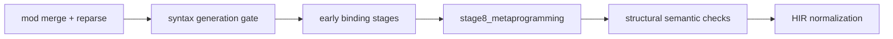
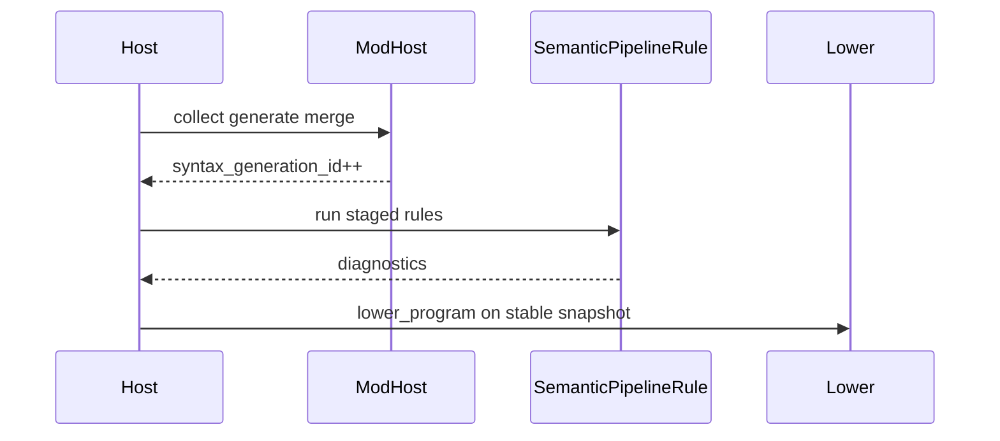

<!-- migrated from the legacy platform spec; canonical OpenSpec source -->
# Rules pipeline contract Specification

## Purpose

Feature hub for the rules pipeline contract in the reference compiler.

## Requirements

### Requirement: Feature hub authority: Decision [D-COMP-SEM-0010]
The Beskid standard SHALL enforce the following migrated contract section. Accepted ADR decisions are binding; uppercase requirement keywords retain their BCP-14 meaning.

> This feature hub **owns** normative MUST/SHOULD contract text. Sibling articles **must not** redefine hub requirements and **should** link here for authority.

**Stable ID:** `BSP-REQ-809480875F64`  
**Legacy source:** `site/spec-content/platform-spec/compiler/semantic-pipeline/rules-pipeline-contract/adr/0001-feature-hub-authority/content.md`  
**Source SHA-256:** `212eba3aa88961a87618815dbfcd69827167acdb21812a162a4f8a07157938ea`

#### Scenario: Conformance exercises Decision
- **GIVEN** an implementation claims conformance with this capability
- **WHEN** behavior governed by this contract section is exercised
- **THEN** every MUST, SHALL, REQUIRED, prohibition, and accepted decision in the section is satisfied

### Requirement: Specification over implementation notes: Decision [D-COMP-SEM-0011]
The Beskid standard SHALL enforce the following migrated contract section. Accepted ADR decisions are binding; uppercase requirement keywords retain their BCP-14 meaning.

> Normative platform-spec prose and ADRs under this feature **supersede** informal comments in implementation crates until explicitly migrated into spec text.

**Stable ID:** `BSP-REQ-B78D5A814C00`  
**Legacy source:** `site/spec-content/platform-spec/compiler/semantic-pipeline/rules-pipeline-contract/adr/0002-spec-over-implementation-notes/content.md`  
**Source SHA-256:** `d64db22d56b88ebdeecf3914f4c63ee8e9a6d180ebaf82467d516453c5e68d67`

#### Scenario: Conformance exercises Decision
- **GIVEN** an implementation claims conformance with this capability
- **WHEN** behavior governed by this contract section is exercised
- **THEN** every MUST, SHALL, REQUIRED, prohibition, and accepted decision in the section is satisfied

### Requirement: Staged semantic rules pipeline: Decision [D-COMP-SEM-0012]
The Beskid standard SHALL enforce the following migrated contract section. Accepted ADR decisions are binding; uppercase requirement keywords retain their BCP-14 meaning.

> Semantic rules are grouped in `analysis/rules/staged/` with explicit stage boundaries wired through `services.rs` for CLI and LSP.

**Stable ID:** `BSP-REQ-9E6DAF35ED2B`  
**Legacy source:** `site/spec-content/platform-spec/compiler/semantic-pipeline/rules-pipeline-contract/adr/0003-staged-semantic-rules/content.md`  
**Source SHA-256:** `6846e141791e6a59777b31f9074c7b2f49e0c1b6898303a6e9fc449915cb6d0e`

#### Scenario: Conformance exercises Decision
- **GIVEN** an implementation claims conformance with this capability
- **WHEN** behavior governed by this contract section is exercised
- **THEN** every MUST, SHALL, REQUIRED, prohibition, and accepted decision in the section is satisfied

## Informative Source Provenance

The records below preserve migration history and are not normative except where text was extracted into a requirement above.

### Source Record: Rules pipeline contract

**Authority:** informative provenance  
**Legacy path:** `/platform-spec/compiler/semantic-pipeline/rules-pipeline-contract/`  
**Source:** `site/spec-content/platform-spec/compiler/semantic-pipeline/rules-pipeline-contract/content.md`  
**SHA-256:** `d005c508ea5b82ed7edbb3316e110dd3203ae28a187d23d59eec487140d2b4b2`

<details>
<summary>Migrated source text</summary>

``````markdown
This feature hub defines the normative contract for **rules pipeline contract** and links newcomer-oriented reference articles.

## Implementation anchors
- `compiler/crates/beskid_analysis/src/analysis/rules/` defines staged rule groups.
- `compiler/crates/beskid_analysis/src/analysis/diagnostic_kinds.rs` classifies emitted diagnostics.
- `compiler/crates/beskid_analysis/src/services/` wires semantic services used by CLI/LSP.

## Decisions
<!-- spec:generate:adr-index -->
No open decisions. Closed choices are normative ADRs under **`adr/`** (`D-COMP-SEM-0010` … `D-COMP-SEM-0012`); use the reader **ADRs** tab for expandable detail.
<!-- /spec:generate:adr-index -->
## Articles
<!-- spec:generate:article-index -->
- [Rules pipeline contract - Contracts and edge cases](./articles/contracts-and-edge-cases/)
- [Rules pipeline contract - Design model](./articles/design-model/)
- [Rules pipeline contract - Examples](./articles/examples/)
- [Rules pipeline contract - FAQ and troubleshooting](./articles/faq-and-troubleshooting/)
- [Rules pipeline contract - Flow and algorithm](./articles/flow-and-algorithm/)
- [Rules pipeline contract - Verification and traceability](./articles/verification-and-traceability/)
<!-- /spec:generate:article-index -->
``````

</details>

### Source Record: Feature hub authority

**Authority:** informative provenance  
**Legacy path:** `/platform-spec/compiler/semantic-pipeline/rules-pipeline-contract/adr/0001-feature-hub-authority/`  
**Source:** `site/spec-content/platform-spec/compiler/semantic-pipeline/rules-pipeline-contract/adr/0001-feature-hub-authority/content.md`  
**SHA-256:** `212eba3aa88961a87618815dbfcd69827167acdb21812a162a4f8a07157938ea`

<details>
<summary>Migrated source text</summary>

``````markdown
## Context

Sibling articles under this feature previously restated requirements in inconsistent forms.

## Decision

This feature hub **owns** normative MUST/SHOULD contract text. Sibling articles **must not** redefine hub requirements and **should** link here for authority.

## Consequences

Contract changes start on the hub or in linked ADRs, then propagate to articles and implementation anchors.

## Verification anchors

- `site/website/src/content/docs/platform-spec/compiler/semantic-pipeline/rules-pipeline-contract/index.mdx`
- `article bundle under the same feature directory.`
``````

</details>

### Source Record: Specification over implementation notes

**Authority:** informative provenance  
**Legacy path:** `/platform-spec/compiler/semantic-pipeline/rules-pipeline-contract/adr/0002-spec-over-implementation-notes/`  
**Source:** `site/spec-content/platform-spec/compiler/semantic-pipeline/rules-pipeline-contract/adr/0002-spec-over-implementation-notes/content.md`  
**SHA-256:** `d64db22d56b88ebdeecf3914f4c63ee8e9a6d180ebaf82467d516453c5e68d67`

<details>
<summary>Migrated source text</summary>

``````markdown
## Context

Implementation crates accumulated informal notes that diverged from published contracts.

## Decision

Normative platform-spec prose and ADRs under this feature **supersede** informal comments in implementation crates until explicitly migrated into spec text.

## Consequences

Engineers file spec/ADR updates when behavior changes; crate comments are non-authoritative for conformance arguments.

## Verification anchors

- `compiler/crates/beskid_analysis/src/analysis/rules/`
- `compiler/crates/beskid_analysis/src/analysis/diagnostic_kinds.rs`
- `compiler/crates/beskid_analysis/src/services/`
``````

</details>

### Source Record: Staged semantic rules pipeline

**Authority:** informative provenance  
**Legacy path:** `/platform-spec/compiler/semantic-pipeline/rules-pipeline-contract/adr/0003-staged-semantic-rules/`  
**Source:** `site/spec-content/platform-spec/compiler/semantic-pipeline/rules-pipeline-contract/adr/0003-staged-semantic-rules/content.md`  
**SHA-256:** `6846e141791e6a59777b31f9074c7b2f49e0c1b6898303a6e9fc449915cb6d0e`

<details>
<summary>Migrated source text</summary>

``````markdown
## Context

Monolithic semantic passes blocked incremental invalidation.

## Decision

Semantic rules are grouped in `analysis/rules/staged/` with explicit stage boundaries wired through `services.rs` for CLI and LSP.

## Consequences

New rules declare their stage; cross-stage dependencies are documented in the hub articles.

## Verification anchors

- `compiler/crates/beskid_analysis/src/analysis/rules/`.
``````

</details>

### Source Record: Rules pipeline contract - Contracts and edge cases

**Authority:** informative provenance  
**Legacy path:** `/platform-spec/compiler/semantic-pipeline/rules-pipeline-contract/articles/contracts-and-edge-cases/`  
**Source:** `site/spec-content/platform-spec/compiler/semantic-pipeline/rules-pipeline-contract/articles/contracts-and-edge-cases/content.md`  
**SHA-256:** `3b08e04ef857059d041f23b409db4567570857ae4a6a815b4fa52707b1e5be84`

<details>
<summary>Migrated source text</summary>

``````markdown
This article documents **contracts and edge cases** for **rules pipeline contract** in the reference compiler.

## What this covers
For newcomers, this page explains where the contract shows up in day-to-day compiler work and which code paths are most useful first reads.

## Anchored code paths
- `compiler/crates/beskid_analysis/src/analysis/rules/` defines staged rule groups.
- `compiler/crates/beskid_analysis/src/analysis/diagnostic_kinds.rs` classifies emitted diagnostics.
- `compiler/crates/beskid_analysis/src/services/` wires semantic services used by CLI/LSP.

## Practical notes
- Prefer tracing from CLI/test entry points into analysis/codegen crates before changing internals.
- Treat diagnostics and tests as part of the contract, not optional implementation details.
- If behavior changes, update this article and add/adjust tests in `compiler/crates/beskid_tests` or `compiler/crates/beskid_e2e_tests`.
``````

</details>

### Source Record: Rules pipeline contract - Design model

**Authority:** informative provenance  
**Legacy path:** `/platform-spec/compiler/semantic-pipeline/rules-pipeline-contract/articles/design-model/`  
**Source:** `site/spec-content/platform-spec/compiler/semantic-pipeline/rules-pipeline-contract/articles/design-model/content.md`  
**SHA-256:** `3d3b3b85a763bfc974d0386a10693c0bb0de47e8a6172d201fe15d5fb913145d`

<details>
<summary>Migrated source text</summary>

``````markdown
## Staged pipeline

Semantic rules run as ordered **`SemanticPipelineRule`** stages on the **post-merge** syntax snapshot (`syntax_generation_id`).



## Anchored code paths

- `compiler/crates/beskid_analysis/src/analysis/rules/staged.rs`
- `compiler/crates/beskid_analysis/src/analysis/diagnostic_kinds.rs`
- `compiler/crates/beskid_analysis/src/services/`

## Meta contributions and staged rules

After the mod host merges **emit** contributions into the syntax model and bumps `syntax_generation_id`, the staged semantic pipeline (`SemanticPipelineRule` in `compiler/crates/beskid_analysis/src/analysis/rules/staged.rs`) **must** run on the **post-merge** program snapshot. **`stage8_metaprogramming`** is reserved for meta-specific semantic checks that still belong to ordinary diagnostics (for example validating attributes produced by meta); it **must not** replace the mod host’s collect/generate/analyze/rewrite orchestration.

**Inspector-only meta** that does not emit still runs **before** the semantic diagnostics gate on the same snapshot generation so diagnostics from meta and builtin rules share one ordering pass unless explicitly partitioned by diagnostic phase metadata.

## Practical notes
- Prefer tracing from CLI/test entry points into analysis/codegen crates before changing internals.
- Treat diagnostics and tests as part of the contract, not optional implementation details.
- If behavior changes, update this article and add/adjust tests in `compiler/crates/beskid_tests` or `compiler/crates/beskid_e2e_tests`.
``````

</details>

### Source Record: Rules pipeline contract - Examples

**Authority:** informative provenance  
**Legacy path:** `/platform-spec/compiler/semantic-pipeline/rules-pipeline-contract/articles/examples/`  
**Source:** `site/spec-content/platform-spec/compiler/semantic-pipeline/rules-pipeline-contract/articles/examples/content.md`  
**SHA-256:** `8e7f57162849e3d9781411df7de6bb1adef73c0659067986858f0e818fc35951`

<details>
<summary>Migrated source text</summary>

``````markdown
This article documents **examples** for **rules pipeline contract** in the reference compiler.

## What this covers
For newcomers, this page explains where the contract shows up in day-to-day compiler work and which code paths are most useful first reads.

## Anchored code paths
- `compiler/crates/beskid_analysis/src/analysis/rules/` defines staged rule groups.
- `compiler/crates/beskid_analysis/src/analysis/diagnostic_kinds.rs` classifies emitted diagnostics.
- `compiler/crates/beskid_analysis/src/services/` wires semantic services used by CLI/LSP.

## Practical notes
- Prefer tracing from CLI/test entry points into analysis/codegen crates before changing internals.
- Treat diagnostics and tests as part of the contract, not optional implementation details.
- If behavior changes, update this article and add/adjust tests in `compiler/crates/beskid_tests` or `compiler/crates/beskid_e2e_tests`.
``````

</details>

### Source Record: Rules pipeline contract - FAQ and troubleshooting

**Authority:** informative provenance  
**Legacy path:** `/platform-spec/compiler/semantic-pipeline/rules-pipeline-contract/articles/faq-and-troubleshooting/`  
**Source:** `site/spec-content/platform-spec/compiler/semantic-pipeline/rules-pipeline-contract/articles/faq-and-troubleshooting/content.md`  
**SHA-256:** `1c7c303330e2a4401c7a2f54e5d529bd3541c1d259602b52539559217dd1baae`

<details>
<summary>Migrated source text</summary>

``````markdown
This article documents **faq and troubleshooting** for **rules pipeline contract** in the reference compiler.

## What this covers
For newcomers, this page explains where the contract shows up in day-to-day compiler work and which code paths are most useful first reads.

## Anchored code paths
- `compiler/crates/beskid_analysis/src/analysis/rules/` defines staged rule groups.
- `compiler/crates/beskid_analysis/src/analysis/diagnostic_kinds.rs` classifies emitted diagnostics.
- `compiler/crates/beskid_analysis/src/services/` wires semantic services used by CLI/LSP.

## Practical notes
- Prefer tracing from CLI/test entry points into analysis/codegen crates before changing internals.
- Treat diagnostics and tests as part of the contract, not optional implementation details.
- If behavior changes, update this article and add/adjust tests in `compiler/crates/beskid_tests` or `compiler/crates/beskid_e2e_tests`.
``````

</details>

### Source Record: Rules pipeline contract - Flow and algorithm

**Authority:** informative provenance  
**Legacy path:** `/platform-spec/compiler/semantic-pipeline/rules-pipeline-contract/articles/flow-and-algorithm/`  
**Source:** `site/spec-content/platform-spec/compiler/semantic-pipeline/rules-pipeline-contract/articles/flow-and-algorithm/content.md`  
**SHA-256:** `f288ca39a8ed94056f4d0347421d2afb2a676ec0c368ca5651fbaddb487879d6`

<details>
<summary>Migrated source text</summary>

``````markdown
## Execution order

1. Host finishes **mod collect/generate/merge** and bumps `syntax_generation_id`.
2. **Inspector-only meta** runs (if any) without mutating the merged tree.
3. `SemanticPipelineRule` stages execute in registration order within `staged.rs`.
4. **`stage8_metaprogramming`** validates meta-produced attributes; it does **not** replace mod host orchestration.
5. Diagnostics publish to CLI/LSP snapshot; pipeline continues only if policy allows after error count.
6. HIR normalization, resolution, and **`lower.type_check`** consume the same generation id before codegen lowering (see [Semantic pipeline / Stage ordering](/platform-spec/compiler/semantic-pipeline/stage-ordering/design-model/)).



## Anchored code paths

- `compiler/crates/beskid_analysis/src/analysis/rules/`
- `compiler/crates/beskid_analysis/src/analysis/diagnostic_kinds.rs`
- `compiler/crates/beskid_analysis/src/services/`
``````

</details>

### Source Record: Rules pipeline contract - Verification and traceability

**Authority:** informative provenance  
**Legacy path:** `/platform-spec/compiler/semantic-pipeline/rules-pipeline-contract/articles/verification-and-traceability/`  
**Source:** `site/spec-content/platform-spec/compiler/semantic-pipeline/rules-pipeline-contract/articles/verification-and-traceability/content.md`  
**SHA-256:** `337abee15004a93ed0aa31c6d739c243cb6fb4c4fd87ab65507a4a7035e7854d`

<details>
<summary>Migrated source text</summary>

``````markdown
This article documents **verification and traceability** for **rules pipeline contract** in the reference compiler.

## What this covers
For newcomers, this page explains where the contract shows up in day-to-day compiler work and which code paths are most useful first reads.

## Anchored code paths
- `compiler/crates/beskid_analysis/src/analysis/rules/` defines staged rule groups.
- `compiler/crates/beskid_analysis/src/analysis/diagnostic_kinds.rs` classifies emitted diagnostics.
- `compiler/crates/beskid_analysis/src/services/` wires semantic services used by CLI/LSP.

## Practical notes
- Prefer tracing from CLI/test entry points into analysis/codegen crates before changing internals.
- Treat diagnostics and tests as part of the contract, not optional implementation details.
- If behavior changes, update this article and add/adjust tests in `compiler/crates/beskid_tests` or `compiler/crates/beskid_e2e_tests`.
``````

</details>
