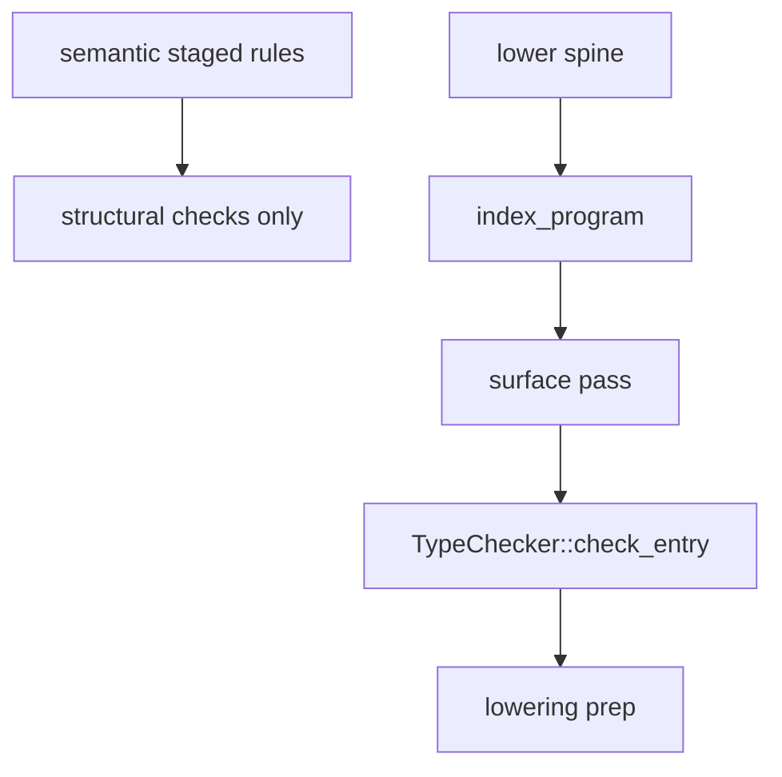

<!-- migrated from the legacy platform spec; canonical OpenSpec source -->
# Semantic pipeline stage ordering Specification

## Purpose

How semantic rule stages relate to lower-spine type checking in the reference compiler.

## Requirements

### Requirement: Single lower-spine type check
Expression and declaration type checking SHALL run exactly once on the lower spine as pipeline phase id `lower.type_check` (`LOWER_TYPE_CHECK`). The reference compiler MUST NOT run a second full body-typing pass under `semantic.type_check`; that phase id is not authoritative for typed HIR or for `E12xx` type diagnostics.

#### Scenario: Type check observed once as lower.type_check
- **GIVEN** a program that requires expression and declaration typing
- **WHEN** the reference compiler runs the production semantic and lower pipeline
- **THEN** full body typing runs under `lower.type_check` and not as a second full pass under `semantic.type_check`

### Requirement: Lower type-check three-pass spine
Within `lower.type_check`, the reference compiler MUST run `index_program` first, then a three-pass spine: surface (`UnitTypeSurface` merge for entry), check (`TypeChecker::check_entry` with constraint solving writing `node_types`), and lowering prep (`LoweringPrep` with `call_kinds` and `cast_intents` keyed by `HirNodeId`). `TypeResult` assembly MUST follow those three passes.

#### Scenario: Index before surface check prep
- **GIVEN** a compilation unit entering `lower.type_check`
- **WHEN** the phase executes
- **THEN** `index_program` completes before the surface, check, and lowering-prep passes assemble `TypeResult`

### Requirement: Structural semantic rules without duplicate typing
Staged semantic rules MAY emit diagnostics that mention types when the check is structural and does not require a completed `TypeResult`, but MUST NOT duplicate full expression typing already performed at `lower.type_check`. CLI analyze, LSP, and `prepare_compilation_diagnostics` MUST surface type errors via the lower spine (or `LowerResolveTypeError::Type` via `emit_type_error`), and consumers MUST treat stable `E12xx` codes as the conformance surface.

#### Scenario: Structural immutability without second type pass
- **GIVEN** staged semantic rule `E1214` immutable-assignment checking
- **WHEN** the semantic pipeline emits that diagnostic
- **THEN** the check remains structural and does not perform a second full expression-typing pass

## Informative Source Provenance

The records below preserve migration history and are not normative except where text was extracted into a requirement above.

### Source Record: Semantic pipeline stage ordering

**Authority:** informative provenance  
**Legacy path:** `/platform-spec/compiler/semantic-pipeline/stage-ordering/`  
**Source:** `site/spec-content/platform-spec/compiler/semantic-pipeline/stage-ordering/content.md`  
**SHA-256:** `c496700437f5877bfad2ab97f1ce99833b40f76db6d92568505dc44041867b7a`

<details>
<summary>Migrated source text</summary>

``````markdown
This feature hub pins **where type checking runs** relative to staged semantic rules. End-to-end compile ordering (parse → mods → semantic → lower → codegen) remains under [Build pipeline / Stage ordering](/platform-spec/compiler/build-pipeline/stage-ordering/).

## Implementation anchors

- `compiler/crates/beskid_pipeline/src/phases.rs` — `lower.type_check` phase id
- `compiler/crates/beskid_analysis/src/services/lower.rs` — typed HIR spine (`typed_hir_from_lowered`, `type_check_lowered_hir`)
- `compiler/crates/beskid_analysis/src/hir/index.rs` — `index_program` before type checking
- `compiler/crates/beskid_analysis/src/types/checker/entry.rs` — `TypeChecker::check_entry` (surface → check → lowering prep)
- `compiler/crates/beskid_analysis/src/analysis/rules/staged/type_checking.rs` — structural immutability only
- `compiler/crates/beskid_tests/src/analysis/type_check_diagnostics.rs` — diagnostic code conformance

- [Design model](./design-model/)
- [Verification and traceability](./verification-and-traceability/)

## Decisions
<!-- spec:generate:adr-index -->
No ADRs published under **`adr/`** yet.
<!-- /spec:generate:adr-index -->
## Articles
<!-- spec:generate:article-index -->
- [Semantic pipeline stage ordering - Design model](./articles/design-model/)
- [Semantic pipeline stage ordering - Verification and traceability](./articles/verification-and-traceability/)
<!-- /spec:generate:article-index -->
``````

</details>

### Source Record: Semantic pipeline stage ordering - Design model

**Authority:** informative provenance  
**Legacy path:** `/platform-spec/compiler/semantic-pipeline/stage-ordering/articles/design-model/`  
**Source:** `site/spec-content/platform-spec/compiler/semantic-pipeline/stage-ordering/articles/design-model/content.md`  
**SHA-256:** `c00b941ca6ec6500c3854ac3f3d5d1538a8d0fd6432bab43e9cdaea0fd9276dd`

<details>
<summary>Migrated source text</summary>

``````markdown
## Type-check authority

**Normative:** Expression and declaration **type checking** runs exactly once on the **lower spine**, observed as pipeline phase id **`lower.type_check`** (`LOWER_TYPE_CHECK` in `beskid_pipeline::phases`).

The reference compiler **must not** run a second full body-typing pass under **`semantic.type_check`**. That phase id is **not** authoritative for typed HIR or for `E12xx` type diagnostics.

Within **`lower.type_check`**, the reference compiler runs **`index_program`** first, then a **three-pass spine**:

1. **Surface** — build or load per-unit `UnitTypeSurface` values and merge for entry
2. **Check** — [`TypeChecker::check_entry`](compiler/crates/beskid_analysis/src/types/checker/entry.rs) body typing with constraint solving; write `node_types`
3. **Lowering prep** — `LoweringPrep` (`call_kinds`, `cast_intents`) keyed by `HirNodeId`

`TypeResult` assembly follows the three passes. See [Type-system pass contract](/platform-spec/compiler/semantic-pipeline/type-system-pass-contract/design-model/) for the full step list.



## What stays in semantic rules

Staged semantic rules (`SemanticPipelineRule` in `staged.rs`) **may** still emit diagnostics that mention types when the check is **structural** and does not require a completed `TypeResult`, for example:

- immutable assignment (`E1214`) in `staged/type_checking.rs`
- invalid `?` shape probes in `staged/error_handling.rs` where resolution alone suffices

Those checks **must not** duplicate full expression typing already performed at **`lower.type_check`**.

## Diagnostic collection

CLI analyze, LSP, and `prepare_compilation_diagnostics` **must** surface type errors by running the lower spine (or collecting `LowerResolveTypeError::Type` into semantic diagnostics via `emit_type_error`). Consumers **must** treat stable **`E12xx`** codes as the conformance surface regardless of whether the error was collected during semantic snapshot assembly or lower failure handling.

## Cross references

- End-to-end phase DAG: [Build pipeline / Stage ordering](/platform-spec/compiler/build-pipeline/stage-ordering/)
- Typed HIR contract: [Type-system pass contract](/platform-spec/compiler/semantic-pipeline/type-system-pass-contract/)
- Staged rule ordering (non-type): [Rules pipeline contract](/platform-spec/compiler/semantic-pipeline/rules-pipeline-contract/)
``````

</details>

### Source Record: Semantic pipeline stage ordering - Verification and traceability

**Authority:** informative provenance  
**Legacy path:** `/platform-spec/compiler/semantic-pipeline/stage-ordering/articles/verification-and-traceability/`  
**Source:** `site/spec-content/platform-spec/compiler/semantic-pipeline/stage-ordering/articles/verification-and-traceability/content.md`  
**SHA-256:** `1be9d922a74f6250b0b9842751c021e6907a99cd21e0e2c5e10fa7b281879ff5`

<details>
<summary>Migrated source text</summary>

``````markdown
## Conformance tests

| Evidence | Location | What it proves |
| --- | --- | --- |
| Lower-spine type codes via prepare | `compiler/crates/beskid_tests/src/analysis/type_check_diagnostics.rs` | `prepare_compilation_diagnostics` still emits stable `E12xx` codes after type-check consolidation |
| Issue kind → code mapping | `compiler/crates/beskid_tests/src/analysis/diagnostics.rs` | `SemanticIssueKind::code()` strings unchanged |
| Lower integration typing | `compiler/crates/beskid_tests/src/analysis/types.rs` | `TypeError` shapes and lower helper behavior |
| Semantic structural rules | `compiler/crates/beskid_tests/src/analysis/pipeline/core.rs` | Non-type semantic diagnostics (resolve, control flow, visibility) |

Tests in **`type_check_diagnostics.rs`** assert **diagnostic code sets only**. They **must not** assert relative ordering of `semantic.*` vs `lower.*` observer phases—ordering may change when mods run or when diagnostics are collected during prepare.

## Manual verification

```bash
cd compiler && CARGO_INCREMENTAL=0 cargo test -p beskid_tests analysis::type_check_diagnostics
```

With pipeline tracing enabled, observers **should** show `lower.type_check` during prepare; they **must not** treat a nested `semantic.type_check` observation (if still emitted for structural work) as a second authoritative type pass.
``````

</details>
