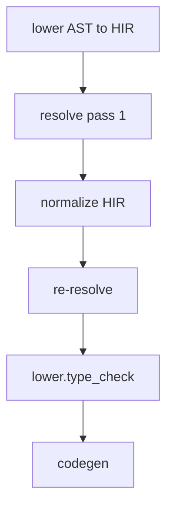

<!-- migrated from the legacy platform spec; canonical OpenSpec source -->
# Type-system pass contract Specification

## Purpose

Feature hub for the type-system pass contract in the reference compiler.

## Requirements

### Requirement: Feature hub authority: Decision [D-COMP-SEM-0013]
The Beskid standard SHALL enforce the following migrated contract section. Accepted ADR decisions are binding; uppercase requirement keywords retain their BCP-14 meaning.

> This feature hub **owns** normative MUST/SHOULD contract text. Sibling articles **must not** redefine hub requirements and **should** link here for authority.

**Stable ID:** `BSP-REQ-A2E9C764AA45`  
**Legacy source:** `site/spec-content/platform-spec/compiler/semantic-pipeline/type-system-pass-contract/adr/0001-feature-hub-authority/content.md`  
**Source SHA-256:** `2a63aa15e622d50263f64f52c5f03e607c0cf2d977bfaab182b9dacd6d758f08`

#### Scenario: Conformance exercises Decision
- **GIVEN** an implementation claims conformance with this capability
- **WHEN** behavior governed by this contract section is exercised
- **THEN** every MUST, SHALL, REQUIRED, prohibition, and accepted decision in the section is satisfied

### Requirement: Specification over implementation notes: Decision [D-COMP-SEM-0014]
The Beskid standard SHALL enforce the following migrated contract section. Accepted ADR decisions are binding; uppercase requirement keywords retain their BCP-14 meaning.

> Normative platform-spec prose and ADRs under this feature **supersede** informal comments in implementation crates until explicitly migrated into spec text.

**Stable ID:** `BSP-REQ-C253CD790C7A`  
**Legacy source:** `site/spec-content/platform-spec/compiler/semantic-pipeline/type-system-pass-contract/adr/0002-spec-over-implementation-notes/content.md`  
**Source SHA-256:** `1b343a99253ba801084ff2d36b3c50630595d7b0459fec9265792e9a893c1aa3`

#### Scenario: Conformance exercises Decision
- **GIVEN** an implementation claims conformance with this capability
- **WHEN** behavior governed by this contract section is exercised
- **THEN** every MUST, SHALL, REQUIRED, prohibition, and accepted decision in the section is satisfied

### Requirement: Primary contract for Type-system pass contract: Decision [D-COMP-SEM-0015]
The Beskid standard SHALL enforce the following migrated contract section. Accepted ADR decisions are binding; uppercase requirement keywords retain their BCP-14 meaning.

> The reference compiler **must** implement Type-system pass contract as documented in this feature hub and its article bundle.

**Stable ID:** `BSP-REQ-6A3E412FCFC0`  
**Legacy source:** `site/spec-content/platform-spec/compiler/semantic-pipeline/type-system-pass-contract/adr/0003-primary-contract-choice/content.md`  
**Source SHA-256:** `4e3ac7548c9b72b0f12682f7f84bb647df8ecde3c6846c75c6a87a2bc9312707`

#### Scenario: Conformance exercises Decision
- **GIVEN** an implementation claims conformance with this capability
- **WHEN** behavior governed by this contract section is exercised
- **THEN** every MUST, SHALL, REQUIRED, prohibition, and accepted decision in the section is satisfied

## Informative Source Provenance

The records below preserve migration history and are not normative except where text was extracted into a requirement above.

### Source Record: Type-system pass contract

**Authority:** informative provenance  
**Legacy path:** `/platform-spec/compiler/semantic-pipeline/type-system-pass-contract/`  
**Source:** `site/spec-content/platform-spec/compiler/semantic-pipeline/type-system-pass-contract/content.md`  
**SHA-256:** `37a4767b7c6f1c89644bdac3aba12c1bf0364a6f78a239b074a947aa38f9a8d8`

<details>
<summary>Migrated source text</summary>

``````markdown
This feature hub defines the normative contract for the authoritative **`lower.type_check`** pass: three internal stages (surface, check, lowering prep), `HirNodeId`-keyed `TypeResult`, per-unit Salsa surfaces, and `EntryOnly` / `FullClosure` dependency typing policy.

## Implementation anchors

| Anchor | Role |
| --- | --- |
| `compiler/crates/beskid_analysis/src/services/lower.rs` | `lower.type_check` orchestration, `DependencyTypingPolicy` |
| `compiler/crates/beskid_analysis/src/services/unit_ops.rs` | `type_entry`, `type_entry_gate` |
| `compiler/crates/beskid_analysis/src/hir/index.rs` | `HirNodeId` assignment |
| `compiler/crates/beskid_analysis/src/types/surface.rs` | Per-unit `UnitTypeSurface` |
| `compiler/crates/beskid_analysis/src/types/checker.rs` | Body typing, `node_types` |
| `compiler/crates/beskid_analysis/src/types/inference/` | Constraint solver |
| `compiler/crates/beskid_analysis/src/types/lowering_prep.rs` | Codegen metadata |
| `compiler/crates/beskid_queries/src/unit.rs` | `unit_type_surface_tracked` |
| `compiler/crates/beskid_tests/src/analysis/type_check_diagnostics.rs` | **E12xx** prepare-spine conformance |
| `compiler/crates/beskid_tests/src/analysis/diagnostics.rs` | Stable issue kind codes |

## Decisions
<!-- spec:generate:adr-index -->
No open decisions. Closed choices are normative ADRs under **`adr/`** (`D-COMP-SEM-0013` … `D-COMP-SEM-0015`); use the reader **ADRs** tab for expandable detail.
<!-- /spec:generate:adr-index -->
## Articles
<!-- spec:generate:article-index -->
- [Type-system pass contract - Contracts and edge cases](./articles/contracts-and-edge-cases/)
- [Type-system pass contract - Design model](./articles/design-model/)
- [Type-system pass contract - Examples](./articles/examples/)
- [Type-system pass contract - FAQ and troubleshooting](./articles/faq-and-troubleshooting/)
- [Type-system pass contract - Flow and algorithm](./articles/flow-and-algorithm/)
- [Type-system pass contract - Verification and traceability](./articles/verification-and-traceability/)
<!-- /spec:generate:article-index -->
``````

</details>

### Source Record: Feature hub authority

**Authority:** informative provenance  
**Legacy path:** `/platform-spec/compiler/semantic-pipeline/type-system-pass-contract/adr/0001-feature-hub-authority/`  
**Source:** `site/spec-content/platform-spec/compiler/semantic-pipeline/type-system-pass-contract/adr/0001-feature-hub-authority/content.md`  
**SHA-256:** `2a63aa15e622d50263f64f52c5f03e607c0cf2d977bfaab182b9dacd6d758f08`

<details>
<summary>Migrated source text</summary>

``````markdown
## Context

Sibling articles under this feature previously restated requirements in inconsistent forms.

## Decision

This feature hub **owns** normative MUST/SHOULD contract text. Sibling articles **must not** redefine hub requirements and **should** link here for authority.

## Consequences

Contract changes start on the hub or in linked ADRs, then propagate to articles and implementation anchors.

## Verification anchors

- `site/website/src/content/docs/platform-spec/compiler/semantic-pipeline/type-system-pass-contract/index.mdx`
- `article bundle under the same feature directory.`
``````

</details>

### Source Record: Specification over implementation notes

**Authority:** informative provenance  
**Legacy path:** `/platform-spec/compiler/semantic-pipeline/type-system-pass-contract/adr/0002-spec-over-implementation-notes/`  
**Source:** `site/spec-content/platform-spec/compiler/semantic-pipeline/type-system-pass-contract/adr/0002-spec-over-implementation-notes/content.md`  
**SHA-256:** `1b343a99253ba801084ff2d36b3c50630595d7b0459fec9265792e9a893c1aa3`

<details>
<summary>Migrated source text</summary>

``````markdown
## Context

Implementation crates accumulated informal notes that diverged from published contracts.

## Decision

Normative platform-spec prose and ADRs under this feature **supersede** informal comments in implementation crates until explicitly migrated into spec text.

## Consequences

Engineers file spec/ADR updates when behavior changes; crate comments are non-authoritative for conformance arguments.

## Verification anchors

- `compiler/crates/beskid_analysis/src/analysis/`
- `compiler/crates/beskid_tests/src/analysis/pipeline/core.rs`
- `compiler/crates/beskid_tests/src/analysis/diagnostics.rs`
``````

</details>

### Source Record: Primary contract for Type-system pass contract

**Authority:** informative provenance  
**Legacy path:** `/platform-spec/compiler/semantic-pipeline/type-system-pass-contract/adr/0003-primary-contract-choice/`  
**Source:** `site/spec-content/platform-spec/compiler/semantic-pipeline/type-system-pass-contract/adr/0003-primary-contract-choice/content.md`  
**SHA-256:** `4e3ac7548c9b72b0f12682f7f84bb647df8ecde3c6846c75c6a87a2bc9312707`

<details>
<summary>Migrated source text</summary>

``````markdown
## Context

This feature hub defines the normative contract for **type-system pass contract** and links newcomer-oriented reference articles.

## Decision

The reference compiler **must** implement Type-system pass contract as documented in this feature hub and its article bundle.

## Consequences

Changes require hub/ADR updates and verification anchor extensions.

## Verification anchors

- `compiler/crates/beskid_analysis/src/analysis/`
- `compiler/crates/beskid_tests/src/analysis/pipeline/core.rs`
- `compiler/crates/beskid_tests/src/analysis/diagnostics.rs`
``````

</details>

### Source Record: Type-system pass contract - Contracts and edge cases

**Authority:** informative provenance  
**Legacy path:** `/platform-spec/compiler/semantic-pipeline/type-system-pass-contract/articles/contracts-and-edge-cases/`  
**Source:** `site/spec-content/platform-spec/compiler/semantic-pipeline/type-system-pass-contract/articles/contracts-and-edge-cases/content.md`  
**SHA-256:** `fb95bf083eb38b484be995f7d4523c69563070eedfe7e5d421985c7423f14cfd`

<details>
<summary>Migrated source text</summary>

``````markdown
## Normative guarantees

| Guarantee | Contract |
| --- | --- |
| Single authoritative pass | Exactly one full type check per prepare spine run, observed as `lower.type_check` |
| Node-keyed expression types | Every typed expression **must** have `node_types[HirNodeId]` after a successful check |
| No span-keyed expr types | `expr_types`, `scoped_expr_types`, and `expr_type_at` **must not** exist on `TypeResult` |
| Id assignment before check | `index_program` **must** run before any sub-pass reads `node.id` |
| Surfaces before bodies | Surface merge **must** complete before entry body checking |
| Lowering prep after check | `call_kinds` and `cast_intents` **must** be produced only from solved `node_types` |
| Cached dependency surfaces | Prefetch units **must** use `unit_type_surface_tracked`, not disk re-parse |
| Policy is explicit | `DependencyTypingPolicy` **must** be passed through prepare; no implicit always-`FullClosure` in IDE |

## `HirNodeId` edge cases

- **Invalid id before index:** `HirNodeId::INVALID` on a node during normalize is expected; consumers **must not** read `node_types` until after `index_program`.
- **Normalize rewrites:** If normalization clones or replaces `Spanned` nodes, ids **must** be preserved or `index_program` **must** re-run. Duplicate ids in one session are a compiler bug.
- **Cross-unit stability:** `HirNodeId` values from unit A are meaningless in unit B. Cross-unit typing uses `UnitTypeSurface` + `ItemId`, not expression ids.

## `EntryOnly` vs `FullClosure` edge cases

| Scenario | Expected behavior |
| --- | --- |
| Entry edits only | `EntryOnly` re-checks entry body; dependency surfaces served from cache |
| Dependency signature change | Surface cache miss → rebuild surface; importers invalidated via reverse-deps |
| Dependency body error under `EntryOnly` | Error may not surface until `FullClosure` prepare (build/test) |
| Executable prepare | **Must** use `FullClosure` so dependency body errors block run/build |
| Stale typed bundle + fresh entry types | `EntryOnly` gate may refresh entry `TypeResult` without re-checking entire closure |

## Inference edge cases

- **Ambiguous `let`:** Multiple satisfiable types → **E1202** at binding span; no default pick.
- **Conflicting constraints:** Solver returns `TypeMismatch` when two equalities disagree.
- **Generic call ambiguity:** No unique substitution → **E1202** or **E1203** / **E1204** per existing arity rules.
- **Numeric unify:** Only the shared `unify_types` promotion applies; no silent widening to unrelated primitives.

## Lowering prep edge cases

- **Missing `node_type`:** Lowering prep **must** treat as a compiler bug (check pass should have failed first).
- **Cast intent span:** `CastIntent.span` is for diagnostics display only; codegen **must** key on `node_id`.
- **Scoped call kinds:** Per-file call kind maps keyed by span are **deleted**; use `lowering.call_kinds[HirNodeId]`.

## Failure modes

| Failure | Surface to consumer |
| --- | --- |
| `TypeError` vector non-empty | `LowerResolveTypeError::Type` → semantic diagnostics with stable **E12xx** codes |
| Surface build failure | Same lower error channel; no partial `TypeResult` with span-keyed fallbacks |
| Salsa cache poisoned | Evict unit token; next query rebuilds surface from HIR + resolution |

## Anti-patterns (forbidden)

- Span-keyed expression type lookup in codegen or LSP
- `value_at_span` fuzzy fallback for type or resolution lookup
- Second full `type_program` under `semantic.type_check`
- Linear scan of `TypeTable` for primitive or array interning
- Structural `infer_expr_type` fallback when `node_types` is missing
``````

</details>

### Source Record: Type-system pass contract - Design model

**Authority:** informative provenance  
**Legacy path:** `/platform-spec/compiler/semantic-pipeline/type-system-pass-contract/articles/design-model/`  
**Source:** `site/spec-content/platform-spec/compiler/semantic-pipeline/type-system-pass-contract/articles/design-model/content.md`  
**SHA-256:** `0b8ba6d32cdf809feffcf13798b5e9f52e080c1fc2e4bec3eec81965c41942ba`

<details>
<summary>Migrated source text</summary>

``````markdown
## What this covers

Persistent entities and boundaries for the authoritative type pass on the lower spine. For stage ordering relative to semantic structural checks, see [Semantic pipeline / Stage ordering](/platform-spec/compiler/semantic-pipeline/stage-ordering/design-model/).

## Type-check placement

**Normative:** Full expression typing runs exactly once under pipeline phase id **`lower.type_check`** (`LOWER_TYPE_CHECK`). Staged semantic rules **must not** duplicate this pass.

Within **`lower.type_check`**, the reference compiler runs, in order:

1. **`index_program`** — assign `HirNodeId` on every typable `Spanned<T>` node
2. **Surface** — build or load per-unit [`UnitTypeSurface`](/platform-spec/language-meta/type-system/types/design-model/) values and merge for entry
3. **Check** — [`TypeChecker`](/platform-spec/language-meta/type-system/type-inference/design-model/) body typing with constraint solving; write `node_types`
4. **Lowering prep** — [`LoweringPrep`](/platform-spec/language-meta/type-system/types/design-model/) (`call_kinds`, `cast_intents`) keyed by `HirNodeId`
5. **Assemble `TypeResult`** — merge surfaces, signatures, and lowering metadata for codegen and IDE


## Anchored code paths

| Path | Role |
| --- | --- |
| `compiler/crates/beskid_analysis/src/services/lower.rs` | Orchestrates `lower.type_check`; `DependencyTypingPolicy` |
| `compiler/crates/beskid_analysis/src/services/unit_ops.rs` | `type_entry` (`FullClosure`), `type_entry_gate` (`EntryOnly`) |
| `compiler/crates/beskid_analysis/src/hir/index.rs` | `HirNodeId` assignment |
| `compiler/crates/beskid_analysis/src/types/surface.rs` | `UnitTypeSurface`, `build_unit_type_surface` |
| `compiler/crates/beskid_analysis/src/types/checker.rs` | Body typing and `node_types` |
| `compiler/crates/beskid_analysis/src/types/inference/` | Constraint solver |
| `compiler/crates/beskid_analysis/src/types/lowering_prep.rs` | Codegen call/cast metadata |
| `compiler/crates/beskid_queries/src/unit.rs` | `unit_type_surface_tracked` Salsa query |
| `compiler/crates/beskid_analysis/src/analysis/rules/staged/type_checking.rs` | Structural immutability only |

## `TypeResult` contract

`TypeResult` is the sole typed-HIR artifact consumed by codegen, LSP hover, and prepare diagnostics.

| Lookup | API | Notes |
| --- | --- | --- |
| Expression type | `node_type(HirNodeId)` or `expr_type(&Spanned<HirExpressionNode>)` | **Primary** — reads `node.id` |
| Local type | `local_types[LocalId]` | Unchanged |
| Item signature | `function_signatures[ItemId]` | Includes merged dependency surfaces |
| Call lowering | `lowering.call_kinds[HirNodeId]` | Not a top-level `TypeResult` field |
| Cast intent | `lowering.cast_intents` filtered by `node_id` | Span on intent is diagnostic-only |

**Deleted (normative):** `expr_types`, `scoped_expr_types`, `TypeResult::expr_type_at`, span-keyed `call_kinds` / `cast_intents`, and disk re-parse prefetch typing (`type_prefetched_source_path`).

## Per-unit Salsa surfaces

Dependency typing **must** use cached per-unit surfaces, not re-parse sibling files during entry type check.

- Salsa query `unit_type_surface_tracked` stores `Arc<UnitTypeSurface>` in `UnitArtifactCache`, keyed by project, grammar, source path, and content fingerprint.
- Invalidation follows `unit_imports` reverse-dependency BFS in `beskid_queries/db.rs` — when unit A changes, surfaces for units that import A are evicted.
- Prefetch paths from [`ModuleIndex::prefetched_paths`](compiler/crates/beskid_analysis/src/projects/assembly/module_index.rs) resolve through the tracked surface query.

## Dependency typing policy

[`DependencyTypingPolicy`](compiler/crates/beskid_analysis/src/services/lower.rs) controls how much of the import closure is body-checked:

| Policy | Dependency bodies | Typical consumer |
| --- | --- | --- |
| **`EntryOnly`** | Surfaces only — signatures and layouts merged; bodies not walked | LSP fast path when typed prepare is stale; `type_entry_gate` |
| **`FullClosure`** | Full body type check across dependency HIR units | `beskid run` / `beskid build`, executable prepare (debounced) |

**Normative:** `prepare_compilation_with_db` **must** thread the policy explicitly. The default CLI spine uses **`FullClosure`**. IDE entry prepare **may** use **`EntryOnly`** when only entry diagnostics are needed and dependency surfaces are still valid in the Salsa cache.

## Cross references

- Language type backbone: [Types / Design model](/platform-spec/language-meta/type-system/types/design-model/)
- Inference and E1202: [Type inference / Design model](/platform-spec/language-meta/type-system/type-inference/design-model/)
- Resolver ids: [Resolver contract / Design model](/platform-spec/compiler/semantic-pipeline/resolver-contract/design-model/)
``````

</details>

### Source Record: Type-system pass contract - Examples

**Authority:** informative provenance  
**Legacy path:** `/platform-spec/compiler/semantic-pipeline/type-system-pass-contract/articles/examples/`  
**Source:** `site/spec-content/platform-spec/compiler/semantic-pipeline/type-system-pass-contract/articles/examples/content.md`  
**SHA-256:** `febf1e796d4213346bfad6741c8df36f19465915756efc5aee9a8300f7ba6479`

<details>
<summary>Migrated source text</summary>

``````markdown
## What this covers

Worked examples that map the three-pass `lower.type_check` contract to real entry points and lookup APIs.

## Example 1 — CLI build uses `FullClosure`

`beskid run` and `beskid build` assemble the import closure, then type-check every dependency body before the entry unit.

```text
assemble_program → lower_normalize_resolve_type_spanned_with_assembly
  → typed_hir_from_lowered(..., DependencyTypingPolicy::FullClosure)
    → lower.type_check: index → surface → check → lowering prep → TypeResult
```

A type error in a dependency module blocks the executable spine the same as an entry error.

## Example 2 — IDE gate uses `EntryOnly`

When only the entry file changed and dependency surfaces are still valid in the Salsa cache, the fast path may skip re-walking dependency bodies:

```text
type_entry_gate(entry_hir, assembly)
  → typed_hir_from_lowered(..., DependencyTypingPolicy::EntryOnly)
```

Dependency units still contribute merged signatures from `unit_type_surface_tracked`; only the entry body is fully checked.

## Example 3 — Reading an expression type in codegen

After a successful check pass, codegen **must** consult `node.id`, not the source span:

```rust
// Preferred: HirNodeId on the Spanned expression node
let ty = type_result.node_type(call.id)?;

// Equivalent sugar
let ty = type_result.expr_type(call)?;
```

Call dispatch and casts use the same id:

```rust
type_result.lowering.call_kind_at(call.id);
type_result.lowering.cast_intents_for_node(call.id);
```

## Example 4 — Ambiguous `let` triggers E1202

Source:

```beskid
let sum = 1 + 2; // no contextual type — numeric metavariable stays ambiguous
```

The check pass introduces an `IsNumeric` constraint; `solve_constraints` leaves the metavariable unbound and emits **E1202** (`MissingTypeAnnotation`) at the binding site. The compiler does not default to `i32` or `i64`.

## Example 5 — Incremental surface invalidation

Given `main.bd` importing `lib.bd`:

1. Edit `lib.bd` → Salsa invalidates `lib` parse/resolution/surface tokens.
2. Reverse-deps BFS evicts `main`'s cached surface because `main` imports `lib`.
3. Next prepare rebuilds `lib` surface, reloads `main` surface from cache or rebuild, then runs check only for dirty bodies per policy.

Prefetch paths from `ModuleIndex::prefetched_paths` follow the same `unit_type_surface_tracked` query — no disk re-parse shortcut.

## Anchored code paths

| Scenario | Start here |
| --- | --- |
| Full closure typing | `compiler/crates/beskid_analysis/src/services/lower.rs` |
| Entry-only gate | `compiler/crates/beskid_analysis/src/services/unit_ops.rs` |
| Salsa surface cache | `compiler/crates/beskid_queries/src/unit.rs` |
| Constraint solver units | `compiler/crates/beskid_analysis/src/types/inference/tests.rs` |
| Codegen node lookup | `compiler/crates/beskid_codegen/src/lowering/locals.rs` |
``````

</details>

### Source Record: Type-system pass contract - FAQ and troubleshooting

**Authority:** informative provenance  
**Legacy path:** `/platform-spec/compiler/semantic-pipeline/type-system-pass-contract/articles/faq-and-troubleshooting/`  
**Source:** `site/spec-content/platform-spec/compiler/semantic-pipeline/type-system-pass-contract/articles/faq-and-troubleshooting/content.md`  
**SHA-256:** `2c1daab3358c642749c16e282b22d209f628a04827b006a41c58287cb6dd747e`

<details>
<summary>Migrated source text</summary>

``````markdown
## Why `HirNodeId` instead of span-keyed maps?

Source spans are not stable across normalize rewrites, multi-unit merges, or incremental re-checks. `HirNodeId` is assigned once per compilation session in `index_program` and carried on every `Spanned<T>` node. `TypeResult.node_types` and `LoweringPrep` both key off this id.

If you see codegen or IDE code calling `expr_type_at(span, path)`, that API is deleted — migrate to `node_type(node.id)`.

## Why three passes inside `lower.type_check`?

| Pass | Purpose |
| --- | --- |
| Surface | Collect per-unit exported shapes (`UnitTypeSurface`) without walking bodies |
| Check | Type bodies, solve constraints, populate `node_types` |
| Lowering prep | Record call dispatch and cast intents for codegen |

Splitting check from lowering prep keeps inference out of codegen metadata collection and lets Salsa cache surfaces independently of body typing.

## When should I use `EntryOnly` vs `FullClosure`?

- **`FullClosure`** — required for `beskid run`, `beskid build`, and executable prepare. Surfaces dependency body errors.
- **`EntryOnly`** — allowed for IDE fast paths (`type_entry_gate`) when dependency surfaces are fresh. Dependency body errors may not appear until a full prepare.

If IDE diagnostics disagree with `beskid build`, check whether the LSP path is still using `FullClosure` everywhere.

## Why does my dependency error show only on build?

Under **`EntryOnly`**, only entry bodies are walked. A broken dependency body can still export a valid surface (signatures parse) while failing body check. Run `cargo test` or `beskid build` to force **`FullClosure`**.

## E1202 at an inference site — what to check

**E1202** (`MissingTypeAnnotation`) means the constraint solver could not pick a unique type. Common fixes:

- Add an explicit type: `let i64 x = ...`
- Provide expected function type for lambdas
- Supply generic arguments at call sites when inference is ambiguous

The solver intentionally does not guess. See [Type inference / Design model](/platform-spec/language-meta/type-system/type-inference/design-model/).

## Surface cache not invalidating

1. Confirm the edited unit's content fingerprint changed in Salsa.
2. Check reverse-deps: importers' surfaces should be evicted via `unit_imports` BFS in `beskid_queries/db.rs`.
3. Run `compiler/crates/beskid_queries/tests/incremental.rs` surface tests locally.

## Pipeline tracing checklist

Enable pipeline tracing and confirm:

- Exactly one `lower.type_check` per prepare run
- No second authoritative pass under `semantic.type_check`
- Nested spans may show index / surface / check / lowering prep inside `lower.type_check`

## Contributor debugging order

1. `compiler/crates/beskid_analysis/src/services/lower.rs` — orchestration and policy
2. `compiler/crates/beskid_analysis/src/types/checker/` — body typing
3. `compiler/crates/beskid_analysis/src/types/inference/solve.rs` — constraint failures
4. `compiler/crates/beskid_codegen/src/lowering/locals.rs` — consumer lookup

Treat `compiler/crates/beskid_tests/src/analysis/type_check_diagnostics.rs` as the diagnostic code contract.
``````

</details>

### Source Record: Type-system pass contract - Flow and algorithm

**Authority:** informative provenance  
**Legacy path:** `/platform-spec/compiler/semantic-pipeline/type-system-pass-contract/articles/flow-and-algorithm/`  
**Source:** `site/spec-content/platform-spec/compiler/semantic-pipeline/type-system-pass-contract/articles/flow-and-algorithm/content.md`  
**SHA-256:** `cc1d7c9f97dfb36a0911e192a8720c1a48d723260d08ccc29fc67066321ac3e1`

<details>
<summary>Migrated source text</summary>

``````markdown
## What this covers

Order-of-operations for **`lower.type_check`** from normalized HIR through `TypeResult`. Entry points: [`typed_hir_from_lowered`](compiler/crates/beskid_analysis/src/services/lower.rs), [`type_entry`](compiler/crates/beskid_analysis/src/services/unit_ops.rs) / [`type_entry_gate`](compiler/crates/beskid_analysis/src/services/unit_ops.rs), [`prepare_compilation_with_db`](compiler/crates/beskid_queries/src/entry.rs).

## Spine placement

Type checking runs **after** HIR normalize and **after** the post-normalize resolution pass on the lower spine. It runs **before** codegen lowering.



## `lower.type_check` algorithm (normative)

### Step 0 — Index HIR nodes

```text
index_program(&mut hir)
```

Assign dense `HirNodeId` values to every typable `Spanned<T>` in pre-order. Nodes created with `Spanned::new` start at `HirNodeId::INVALID` until this step.

### Step 1 — Surface pass

For each unit in the typing scope (entry plus dependencies per policy):

1. If a valid cached surface exists (`unit_type_surface_tracked`), load `Arc<UnitTypeSurface>`.
2. Otherwise run `build_unit_type_surface(hir, resolution)` — one walk collecting struct fields, enum variants, function and method signatures, generic arity, and contract exports.
3. Store the surface in `TypeResult.unit_surfaces` keyed by source path.

Merge dependency surfaces into `MergedTypeEnv` for entry body checking. Cross-unit data flows through **`ItemId`** keys on surfaces, not `HirNodeId`.

### Step 2 — Check pass

Run `TypeChecker::check_entry` (or per-unit `type_unit_body` under **`FullClosure`**) against merged surfaces:

1. Walk statements and expressions; for each node, record `node_types[node.id] = TypeId`.
2. At inference sites (`let`, lambdas, generic calls), push constraints into a `ConstraintSet` and call `solve_constraints`.
3. On solver failure or ambiguity, collect `TypeError` (including **E1202**).
4. Populate `local_types`, item signature maps, and ordered struct/enum layouts on the entry result.

The check pass **must not** write span-keyed expression type maps.

### Step 3 — Lowering prep pass

Run `LoweringPrep::run` on the typed tree:

1. Read resolved types from `node_types`.
2. Record `call_kinds[node.id]` for each call expression.
3. Append `CastIntent { node_id, span, from, to, ... }` for casts codegen must honor.

No inference occurs in this pass.

### Step 4 — Assemble and return

On success, return `(hir, resolution, TypeResult { node_types, unit_surfaces, lowering, ... })`. On any `TypeError`, fail with `LowerResolveTypeError::Type`.

## Policy-specific flows

### `EntryOnly` (IDE fast path)


- Dependency units contribute **surfaces only** via Salsa cache.
- Entry unit body is fully checked; dependency bodies are not re-walked.
- Used when stale typed prepare can still serve codegen/LSP with refreshed entry types.

### `FullClosure` (build / executable prepare)


- Each dependency HIR unit in the assembly closure may be body-checked.
- Surfaces still cached per unit; invalidation evicts dependent caches on edit.

## Incremental invalidation

When a source unit changes:

1. Salsa invalidates that unit's parse, resolution, and type surface tokens.
2. Reverse-deps BFS over `unit_imports` evicts surfaces for importers.
3. Next prepare re-runs surface (and optionally body) passes only for dirty units.

**Normative:** Prefetch typing **must not** read dependency files from disk outside the Salsa unit graph.

## Consumer read order

Codegen and IDE queries **must** consult `TypeResult` in this order:

1. `node_type(expr.id)` for expression types
2. `lowering.call_kind_at(expr.id)` for dispatch
3. `lowering.cast_intents_for_node(expr.id)` for casts
4. Item-keyed maps (`function_signatures`, `struct_fields_ordered`) for declaration metadata

Structural re-inference at codegen time (for example `infer_expr_type` fallbacks) is **forbidden**.
``````

</details>

### Source Record: Type-system pass contract - Verification and traceability

**Authority:** informative provenance  
**Legacy path:** `/platform-spec/compiler/semantic-pipeline/type-system-pass-contract/articles/verification-and-traceability/`  
**Source:** `site/spec-content/platform-spec/compiler/semantic-pipeline/type-system-pass-contract/articles/verification-and-traceability/content.md`  
**SHA-256:** `0fc44a53c80885c93e4dac3a524ae72b9f85fd01fb5f76f6344d99b8847c0207`

<details>
<summary>Migrated source text</summary>

``````markdown
## What this covers

Evidence that the type pass contract is implemented: diagnostic codes, pipeline phase observation, incremental surface invalidation, and `node_types` consumption in codegen.

## Conformance tests

| Test area | Location | Asserts |
| --- | --- | --- |
| Prepare-spine **E12xx** codes | `compiler/crates/beskid_tests/src/analysis/type_check_diagnostics.rs` | Stable diagnostic codes via `prepare_compilation_diagnostics` |
| Issue kind mapping | `compiler/crates/beskid_tests/src/analysis/diagnostics.rs` | `SemanticIssueKind` → code contract |
| Lower typing integration | `compiler/crates/beskid_tests/src/analysis/types.rs` | Typed HIR spine behavior |
| Inference solver units | `compiler/crates/beskid_analysis/src/types/inference/tests.rs` | Constraint solve without legacy `TypeContext` |
| Incremental surface cache | `compiler/crates/beskid_queries/tests/incremental.rs` | Surface invalidation on dependency edit |

Conformance tests assert **diagnostic code sets** and **typed artifact shape**, not duplicate ordering inside semantic sub-phases.

## Pipeline tracing

With pipeline tracing enabled, observers **should** show a single `lower.type_check` observation per prepare run. Internal sub-passes (index, surface, check, lowering prep) may appear as nested spans but **must not** register a second authoritative type pass.

Observers **must not** treat `semantic.type_check` as authoritative for `E12xx` or `TypeResult` population.

## Codegen traceability

Codegen tests and lowering modules **must** read expression types via `node_type(HirNodeId)` or `expr_type(&Spanned<HirExpressionNode>)`. Tests that construct empty `TypeResult` values **must not** populate deleted `expr_types` fields.

Evidence: `compiler/crates/beskid_codegen/tests/`, `compiler/crates/beskid_tests/src/codegen/`.

## Workspace gate

After contract changes, run full `cargo test --workspace` in `compiler/` per platform CI policy.
``````

</details>
