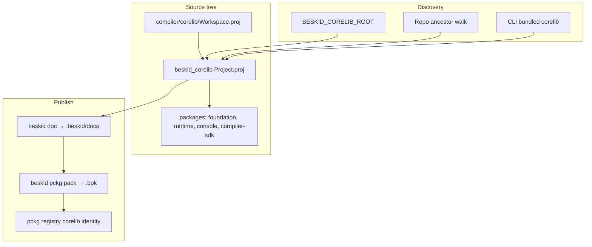
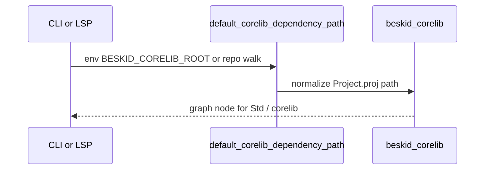

<!-- migrated from the legacy platform spec; canonical OpenSpec source -->
# Corelib discovery and packaging Specification

## Purpose

Compiler/runtime contracts for locating, embedding, and validating the canonical corelib package.

## Requirements

### Requirement: Canonical corelib package identity: Decision [D-CORE-COMP-0001]
The Beskid standard SHALL enforce the following migrated contract section. Accepted ADR decisions are binding; uppercase requirement keywords retain their BCP-14 meaning.

> | Rule | Detail |
> | --- | --- |
> | Identity | Package name **`corelib`**; sources under `beskid_corelib` |
> | Legacy | `standard_library` paths may alias; identity remains **`corelib`** |

**Stable ID:** `BSP-REQ-10A7B7E47DE5`  
**Legacy source:** `site/spec-content/platform-spec/core-library/compiler-integration/corelib-discovery-and-packaging/adr/0001-canonical-corelib-identity/content.md`  
**Source SHA-256:** `bdc3dbbc9997e9ca1a2332f627ea49838e7724792132f1f3d8422815147ecd0e`

#### Scenario: Conformance exercises Decision
- **GIVEN** an implementation claims conformance with this capability
- **WHEN** behavior governed by this contract section is exercised
- **THEN** every MUST, SHALL, REQUIRED, prohibition, and accepted decision in the section is satisfied

### Requirement: Multi-path corelib discovery: Decision [D-CORE-COMP-0002]
The Beskid standard SHALL enforce the following migrated contract section. Accepted ADR decisions are binding; uppercase requirement keywords retain their BCP-14 meaning.

> | Rule | Detail |
> | --- | --- |
> | `BESKID_CORELIB_ROOT` | Points at root containing `beskid_corelib/Project.proj` |
> | Walk | Ancestor search for `compiler/corelib/beskid_corelib` |
> | Bundle | `beskid_cli` `ensure_corelib_ready` materializes embedded tree |

**Stable ID:** `BSP-REQ-418BB5C31FEF`  
**Legacy source:** `site/spec-content/platform-spec/core-library/compiler-integration/corelib-discovery-and-packaging/adr/0002-multi-path-discovery/content.md`  
**Source SHA-256:** `8d7b1c3f617e9da0b263607541d338f35d19f0cc556eb9723fc35e5c2366e59c`

#### Scenario: Conformance exercises Decision
- **GIVEN** an implementation claims conformance with this capability
- **WHEN** behavior governed by this contract section is exercised
- **THEN** every MUST, SHALL, REQUIRED, prohibition, and accepted decision in the section is satisfied

### Requirement: Readme packaging for pckg artifacts: Decision [D-CORE-COMP-0003]
The Beskid standard SHALL enforce the following migrated contract section. Accepted ADR decisions are binding; uppercase requirement keywords retain their BCP-14 meaning.

> | Rule | Detail |
> | --- | --- |
> | Declare | Optional `readme = "path.md"` in Project.proj |
> | Default | `readme.md` at package root when present |
> | Pack | `beskid pckg pack` places resolved file as **`README.md`** |

**Stable ID:** `BSP-REQ-7317EDF8BE88`  
**Legacy source:** `site/spec-content/platform-spec/core-library/compiler-integration/corelib-discovery-and-packaging/adr/0003-readme-packaging-for-pckg/content.md`  
**Source SHA-256:** `df2245f80db6210bce6f3b8875c8a999f66994c836bfeae71a83fec876c38ee1`

#### Scenario: Conformance exercises Decision
- **GIVEN** an implementation claims conformance with this capability
- **WHEN** behavior governed by this contract section is exercised
- **THEN** every MUST, SHALL, REQUIRED, prohibition, and accepted decision in the section is satisfied

### Requirement: Workspace includes console shard: Decision [D-CORE-COMP-0004]
The Beskid standard SHALL enforce the following migrated contract section. Accepted ADR decisions are binding; uppercase requirement keywords retain their BCP-14 meaning.

> | Rule | Detail |
> | --- | --- |
> | Workspace | `compiler/corelib/Workspace.proj` lists `packages/console` |
> | Aggregate | `beskid_corelib` depends on `corelib_console` |

**Stable ID:** `BSP-REQ-8F0A0ECB444C`  
**Legacy source:** `site/spec-content/platform-spec/core-library/compiler-integration/corelib-discovery-and-packaging/adr/0004-workspace-includes-console-shard/content.md`  
**Source SHA-256:** `235cb2e779e3324f16880768183496bbc3dab14b639586d46dc21da9b2d6039d`

#### Scenario: Conformance exercises Decision
- **GIVEN** an implementation claims conformance with this capability
- **WHEN** behavior governed by this contract section is exercised
- **THEN** every MUST, SHALL, REQUIRED, prohibition, and accepted decision in the section is satisfied

## Informative Source Provenance

The records below preserve migration history and are not normative except where text was extracted into a requirement above.

### Source Record: Corelib discovery and packaging

**Authority:** informative provenance  
**Legacy path:** `/platform-spec/core-library/compiler-integration/corelib-discovery-and-packaging/`  
**Source:** `site/spec-content/platform-spec/core-library/compiler-integration/corelib-discovery-and-packaging/content.md`  
**SHA-256:** `f3e291e57207e23a06bc14dec6cd4929e0709648d95f7682dc44ee64adc7d1a0`

<details>
<summary>Migrated source text</summary>

``````markdown
<SpecSection title="What this feature specifies" id="what-this-feature-specifies">
This feature explains how compiler and tooling always load the same canonical corelib package identity and files. It is organized into newcomer-friendly articles that move from model, to flow, to contracts, then practical verification and debugging guidance.
</SpecSection>

<SpecSection title="Implementation anchors" id="implementation-anchors">
- Canonical package root `compiler/corelib/beskid_corelib`
- Canonical package identity `corelib` (`Project.proj`), with `beskid_corelib` as the repository directory name
- Corelib path discovery in `compiler/crates/beskid_analysis/src/projects/graph/resolver.rs`
- CLI embedding/install support in `compiler/crates/beskid_cli/build.rs` and `compiler/crates/beskid_cli/src/corelib_runtime.rs`
- Integration checks in `compiler/crates/beskid_tests/src/projects/corelib`
</SpecSection>

## Decisions
<!-- spec:generate:adr-index -->
No open decisions. Closed choices are normative ADRs under **`adr/`** (`D-CORE-COMP-0001` … `D-CORE-COMP-0004`); use the reader **ADRs** tab for expandable detail.
<!-- /spec:generate:adr-index -->
## Articles
<!-- spec:generate:article-index -->
- [Contracts and edge cases](./articles/contracts-and-edge-cases/)
- [Design model](./articles/design-model/)
- [Examples](./articles/examples/)
- [FAQ and troubleshooting](./articles/faq-and-troubleshooting/)
- [Flow and algorithm](./articles/flow-and-algorithm/)
- [Verification and traceability](./articles/verification-and-traceability/)
<!-- /spec:generate:article-index -->
``````

</details>

### Source Record: Canonical corelib package identity

**Authority:** informative provenance  
**Legacy path:** `/platform-spec/core-library/compiler-integration/corelib-discovery-and-packaging/adr/0001-canonical-corelib-identity/`  
**Source:** `site/spec-content/platform-spec/core-library/compiler-integration/corelib-discovery-and-packaging/adr/0001-canonical-corelib-identity/content.md`  
**SHA-256:** `bdc3dbbc9997e9ca1a2332f627ea49838e7724792132f1f3d8422815147ecd0e`

<details>
<summary>Migrated source text</summary>

``````markdown
## Context

Registry, CLI, and analysis must agree on one package name.

## Decision

| Rule | Detail |
| --- | --- |
| Identity | Package name **`corelib`**; sources under `beskid_corelib` |
| Legacy | `standard_library` paths may alias; identity remains **`corelib`** |

## Consequences

pckg publish, resolver, and docs use the same identity string.

## Verification anchors

`resolver.rs`; `beskid_tests` corelib project fixtures.
``````

</details>

### Source Record: Multi-path corelib discovery

**Authority:** informative provenance  
**Legacy path:** `/platform-spec/core-library/compiler-integration/corelib-discovery-and-packaging/adr/0002-multi-path-discovery/`  
**Source:** `site/spec-content/platform-spec/core-library/compiler-integration/corelib-discovery-and-packaging/adr/0002-multi-path-discovery/content.md`  
**SHA-256:** `8d7b1c3f617e9da0b263607541d338f35d19f0cc556eb9723fc35e5c2366e59c`

<details>
<summary>Migrated source text</summary>

``````markdown
## Context

Developers run from superrepo, installed CLI, or CI without divergent roots.

## Decision

| Rule | Detail |
| --- | --- |
| `BESKID_CORELIB_ROOT` | Points at root containing `beskid_corelib/Project.proj` |
| Walk | Ancestor search for `compiler/corelib/beskid_corelib` |
| Bundle | `beskid_cli` `ensure_corelib_ready` materializes embedded tree |

## Consequences

Missing roots fail fast with resolver diagnostics.

## Verification anchors

`corelib_runtime.rs`; `resolver.rs` tests.
``````

</details>

### Source Record: Readme packaging for pckg artifacts

**Authority:** informative provenance  
**Legacy path:** `/platform-spec/core-library/compiler-integration/corelib-discovery-and-packaging/adr/0003-readme-packaging-for-pckg/`  
**Source:** `site/spec-content/platform-spec/core-library/compiler-integration/corelib-discovery-and-packaging/adr/0003-readme-packaging-for-pckg/content.md`  
**SHA-256:** `df2245f80db6210bce6f3b8875c8a999f66994c836bfeae71a83fec876c38ee1`

<details>
<summary>Migrated source text</summary>

``````markdown
## Context

Registry consumers expect root README.md in `.bpk` artifacts.

## Decision

| Rule | Detail |
| --- | --- |
| Declare | Optional `readme = "path.md"` in Project.proj |
| Default | `readme.md` at package root when present |
| Pack | `beskid pckg pack` places resolved file as **`README.md`** |

## Consequences

pckg documentation ingest uses consistent entry filename.

## Verification anchors

`PackagePublishDocumentation.cs`; pack integration tests.
``````

</details>

### Source Record: Workspace includes console shard

**Authority:** informative provenance  
**Legacy path:** `/platform-spec/core-library/compiler-integration/corelib-discovery-and-packaging/adr/0004-workspace-includes-console-shard/`  
**Source:** `site/spec-content/platform-spec/core-library/compiler-integration/corelib-discovery-and-packaging/adr/0004-workspace-includes-console-shard/content.md`  
**SHA-256:** `235cb2e779e3324f16880768183496bbc3dab14b639586d46dc21da9b2d6039d`

<details>
<summary>Migrated source text</summary>

``````markdown
## Context

Console/ANSI must ship with the aggregate package, not as an orphan.

## Decision

| Rule | Detail |
| --- | --- |
| Workspace | `compiler/corelib/Workspace.proj` lists `packages/console` |
| Aggregate | `beskid_corelib` depends on `corelib_console` |

## Consequences

Publish CI packs the full workspace graph for registry corelib.

## Verification anchors

`Workspace.proj`; corelib CI publish job.
``````

</details>

### Source Record: Contracts and edge cases

**Authority:** informative provenance  
**Legacy path:** `/platform-spec/core-library/compiler-integration/corelib-discovery-and-packaging/articles/contracts-and-edge-cases/`  
**Source:** `site/spec-content/platform-spec/core-library/compiler-integration/corelib-discovery-and-packaging/articles/contracts-and-edge-cases/content.md`  
**SHA-256:** `e9a92fd31a9a87348f50243e75ddb9d8db76fc24b8c240ecaa8400cb27bb52d0`

<details>
<summary>Migrated source text</summary>

``````markdown
## Normative contracts

- Producer crates must emit data in a shape accepted by downstream consumers.
- Consumer crates must not silently reinterpret the contract surface.
- Contract regressions must be captured as compile-time or test-time failures, not hidden runtime drift.

## Edge cases to monitor

- Partial refactors that update only one side of a crate boundary.
- Symbol/name changes that compile locally but break cross-crate integration.
- Fixtures that pass in isolation but fail in end-to-end harnesses.

## Failure handling expectations

When contract checks fail, diagnostics should point contributors to the responsible boundary crate and to the corresponding conformance fixture.
``````

</details>

### Source Record: Design model

**Authority:** informative provenance  
**Legacy path:** `/platform-spec/core-library/compiler-integration/corelib-discovery-and-packaging/articles/design-model/`  
**Source:** `site/spec-content/platform-spec/core-library/compiler-integration/corelib-discovery-and-packaging/articles/design-model/content.md`  
**SHA-256:** `4c6648a15f3c04ca6781ec87f4c9836abb5d509b1cc46b03c7a61b8b58e908c9`

<details>
<summary>Migrated source text</summary>

``````markdown
## Purpose

One canonical **corelib** package identity (`corelib`, sources under `compiler/corelib/beskid_corelib`) must be discoverable by CLI, LSP, CI publish, and local superrepo layouts. This feature covers **where** that tree lives on disk and **how** it is packed for pckg—not symbol injection (see **[Corelib injection and resolution](/platform-spec/core-library/compiler-integration/corelib-injection-and-resolution/)**).

## Discovery and packaging topology



## Primary actors

| Actor | Role |
| --- | --- |
| **Aggregate package** | `beskid_corelib` — declares dependencies on workspace member packages |
| **Workspace** | `compiler/corelib/Workspace.proj` lists shards including `corelib_console` |
| **Toolchain** | `resolver.rs` + `beskid_cli` `corelib_runtime` locate roots |
| **Registry** | CI publishes **`corelib`** via `beskid pckg` + `BESKID_PCKG_KEY` |

## Package readme

Published `.bpk` artifacts **should** expose registry documentation through root **`README.md`**. Producers declare the on-disk source in `Project.proj` or `Workspace.proj`:

- Optional `readme = "relative/path.md"` (POSIX-style path relative to the package or workspace root).
- When omitted, tooling uses **`readme.md`** at that root when the file exists.
- `beskid pckg pack` copies the resolved file into the artifact as **`README.md`** when it is not already a root readme entry.

## Workspace members

`compiler/corelib/Workspace.proj` includes **`packages/console`** (`corelib_console`) alongside `foundation`, `runtime`, and `compiler-sdk`. The aggregate `beskid_corelib` project depends on `corelib_console` for console/ANSI surfaces.

## Implementation anchors

- Canonical package root: `compiler/corelib/beskid_corelib`
- Console package: `compiler/corelib/packages/console`
- Discovery: `compiler/crates/beskid_analysis/src/projects/graph/resolver.rs`
- CLI embedding: `compiler/crates/beskid_cli/build.rs`, `corelib_runtime.rs`
- Tests: `compiler/crates/beskid_tests/src/projects/corelib`
- Server ingest: `compiler/crates/beskid_pckg_server/Services/PackagePublishDocumentation.cs`
``````

</details>

### Source Record: Examples

**Authority:** informative provenance  
**Legacy path:** `/platform-spec/core-library/compiler-integration/corelib-discovery-and-packaging/articles/examples/`  
**Source:** `site/spec-content/platform-spec/core-library/compiler-integration/corelib-discovery-and-packaging/articles/examples/content.md`  
**SHA-256:** `d2d1226965365ee8a9c332323bed562739658f7a937d0f97e7a5754caeafe6c8`

<details>
<summary>Migrated source text</summary>

``````markdown
## Example 1: Happy path

A standard project exercises the expected producer -> consumer handoff with no contract violations. Trace this via:

- `Canonical package root `compiler/corelib/beskid_corelib``
- `CLI embedding/install support in `compiler/crates/beskid_cli/build.rs` and `compiler/crates/beskid_cli/src/corelib_runtime.rs``

## Example 2: Contract mismatch

Intentionally alter a boundary definition (for example, a symbol or structure shape), then run the related conformance suite. The expected result is a deterministic failure that identifies the mismatched boundary.

## Example 3: Regression-proofing a fix

After applying a fix, add or update a focused fixture in the nearest test crate and rerun wider suites so the behavior remains locked for future refactors.
``````

</details>

### Source Record: FAQ and troubleshooting

**Authority:** informative provenance  
**Legacy path:** `/platform-spec/core-library/compiler-integration/corelib-discovery-and-packaging/articles/faq-and-troubleshooting/`  
**Source:** `site/spec-content/platform-spec/core-library/compiler-integration/corelib-discovery-and-packaging/articles/faq-and-troubleshooting/content.md`  
**SHA-256:** `3159c5f5346a5e31f1658f3a42212c54ec65b9dec7d0f692bedae985f04cad0b`

<details>
<summary>Migrated source text</summary>

``````markdown
## Why did a change pass locally but fail in CI?

Most often, one crate boundary changed but the corresponding fixture or downstream consumer was not updated. Re-run the nearest conformance suite and inspect cross-crate handoff points.

## Where should I start debugging?

1. Confirm the target requirement in this feature hub.
2. Step through `Canonical package root `compiler/corelib/beskid_corelib`` and `Corelib path discovery in `compiler/crates/beskid_analysis/src/projects/graph/resolver.rs``.
3. Validate consumer behavior at `CLI embedding/install support in `compiler/crates/beskid_cli/build.rs` and `compiler/crates/beskid_cli/src/corelib_runtime.rs``.
4. Reproduce with `Integration checks in `compiler/crates/beskid_tests/src/projects/corelib``.

## How do I add a new rule safely?

Document the new contract in the relevant article, update implementation in the owning crate, and add a fixture proving both happy-path and failure-path behavior.
``````

</details>

### Source Record: Flow and algorithm

**Authority:** informative provenance  
**Legacy path:** `/platform-spec/core-library/compiler-integration/corelib-discovery-and-packaging/articles/flow-and-algorithm/`  
**Source:** `site/spec-content/platform-spec/core-library/compiler-integration/corelib-discovery-and-packaging/articles/flow-and-algorithm/content.md`  
**SHA-256:** `0154c9f61b7de96236dc1a6b64420f21fc97ae0aa946fa4df5f583b04436c3a1`

<details>
<summary>Migrated source text</summary>

``````markdown
## Local discovery flow



1. Tool starts project resolution.
2. `default_corelib_dependency_path` checks `BESKID_CORELIB_ROOT`, then `discover_repo_corelib_root` walking ancestors for `compiler/corelib/beskid_corelib`.
3. If CLI startup runs `ensure_corelib_ready`, bundled template materialization may populate install dir before step 2.
4. Aggregate manifest pulls workspace members into the compile plan.

## CI publish flow

1. Build / verify corelib workspace in `compiler` CI.
2. `beskid doc` (when enabled) writes `.beskid/docs/api.json` + markdown.
3. `beskid pckg pack` on `beskid_corelib/Project.proj` with publisher credentials.
4. pckg server validates artifact (`PackageArtifactValidator`) and ingests docs for the package browser.
5. Consumers `beskid fetch` pinned versions into `.beskid/packages/` recorded in `Project.lock`.

## Shard cycle avoidance

When resolving manifests under `compiler/corelib/packages/*`, `is_corelib_workspace_shard_manifest` suppresses implicit `Std` back-edges to the aggregate package to prevent `beskid_corelib → shard → beskid_corelib` cycles.

## Algorithm notes

- Trace one `beskid_corelib` compile in tests before editing resolver edge cases.
- Pack and discovery share `parse_manifest` — manifest errors surface identically in CLI and pack.
- Registry listing uses structured **`api.json`** as the docs UI contract when published.

## Tests

`compiler/crates/beskid_tests/src/projects/corelib/` (compile, layout, mod helpers).
``````

</details>

### Source Record: Verification and traceability

**Authority:** informative provenance  
**Legacy path:** `/platform-spec/core-library/compiler-integration/corelib-discovery-and-packaging/articles/verification-and-traceability/`  
**Source:** `site/spec-content/platform-spec/core-library/compiler-integration/corelib-discovery-and-packaging/articles/verification-and-traceability/content.md`  
**SHA-256:** `bbb204359f818e5cfcd17bf6c1a2001fb2152d3ba8e08468ad837b0aa11c35d0`

<details>
<summary>Migrated source text</summary>

``````markdown
## Verification strategy

- Unit-level checks validate local transformations.
- Integration tests validate crate-to-crate contracts.
- End-to-end fixtures validate user-visible behavior.

## Traceability map

- Spec requirement source: `/platform-spec/core-library/compiler-integration/corelib-discovery-and-packaging/`.
- Core implementation anchors:
  - Canonical package root `compiler/corelib/beskid_corelib`
  - Canonical package identity `corelib` in `compiler/corelib/beskid_corelib/Project.proj`
  - Corelib path discovery in `compiler/crates/beskid_analysis/src/projects/graph/resolver.rs`
  - CLI embedding/install support in `compiler/crates/beskid_cli/build.rs` and `compiler/crates/beskid_cli/src/corelib_runtime.rs`
- Conformance anchor:
  - Integration checks in `compiler/crates/beskid_tests/src/projects/corelib`

CI anchors:

- Compiler corelib quality gate in `compiler/.github/workflows/ci.yml` (`corelib-quality`).
- Corelib publish authority and quality checks in `compiler/corelib/.github/workflows/ci.yml`.

## Review checklist

- Requirement text and test expectation describe the same boundary.
- Crate ownership updates are reflected in spec links.
- Newly introduced edge cases include at least one reproducible fixture.
``````

</details>
