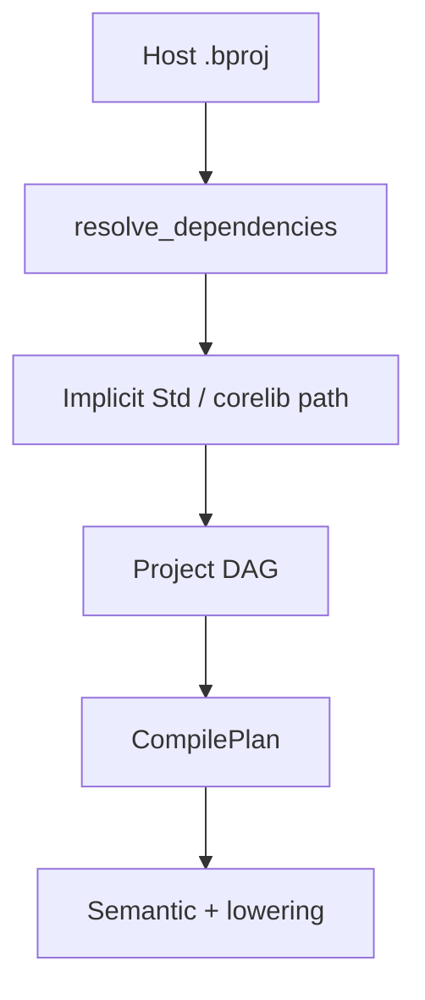
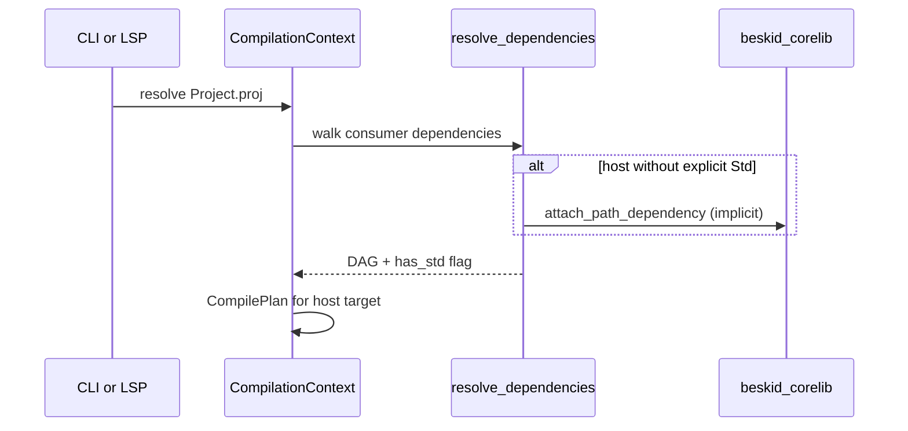

<!-- migrated from the legacy platform spec; canonical OpenSpec source -->
# Corelib injection and resolution Specification

## Purpose

How the compiler discovers, injects, and resolves corelib symbols across analysis and build stages.

## Requirements

### Requirement: Host projects cannot opt out of corelib: Decision [D-CORE-COMP-0005]
The Beskid standard SHALL enforce the following migrated contract section. Accepted ADR decisions are binding; uppercase requirement keywords retain their BCP-14 meaning.

> | Rule | Detail |
> | --- | --- |
> | Forbidden keys | `noCorelib`, `useCorelib: false` rejected at parse |
> | Templates | Scaffolds **must not** emit opt-out keys |

**Stable ID:** `BSP-REQ-66C7666FF544`  
**Legacy source:** `site/spec-content/platform-spec/core-library/compiler-integration/corelib-injection-and-resolution/adr/0005-host-corelib-no-opt-out/content.md`  
**Source SHA-256:** `f590b94d0474fb42f4a7fd0310d461f64c0f86ae2c0a5275c7bb755366ea9e52`

#### Scenario: Conformance exercises Decision
- **GIVEN** an implementation claims conformance with this capability
- **WHEN** behavior governed by this contract section is exercised
- **THEN** every MUST, SHALL, REQUIRED, prohibition, and accepted decision in the section is satisfied

### Requirement: Workspace shard cycle guard: Decision [D-CORE-COMP-0006]
The Beskid standard SHALL enforce the following migrated contract section. Accepted ADR decisions are binding; uppercase requirement keywords retain their BCP-14 meaning.

> | Rule | Detail |
> | --- | --- |
> | Guard | `is_corelib_workspace_shard_manifest` skips implicit back-edge |
> | Host | Only application hosts receive implicit corelib |

**Stable ID:** `BSP-REQ-3640E4F95F9C`  
**Legacy source:** `site/spec-content/platform-spec/core-library/compiler-integration/corelib-injection-and-resolution/adr/0006-workspace-shard-cycle-guard/content.md`  
**Source SHA-256:** `19b964096656ffb8ed1a0c0190b212297e1518df3e405f5a13c80c1e4bdb2a56`

#### Scenario: Conformance exercises Decision
- **GIVEN** an implementation claims conformance with this capability
- **WHEN** behavior governed by this contract section is exercised
- **THEN** every MUST, SHALL, REQUIRED, prohibition, and accepted decision in the section is satisfied

### Requirement: Mod projects exempt from host injection: Decision [D-CORE-COMP-0007]
The Beskid standard SHALL enforce the following migrated contract section. Accepted ADR decisions are binding; uppercase requirement keywords retain their BCP-14 meaning.

> | Rule | Detail |
> | --- | --- |
> | `Mod` | Does not receive implicit host injection |
> | `Host` | Receives implicit corelib per D-CORE-COMP-0005 |

**Stable ID:** `BSP-REQ-B71AD6835E17`  
**Legacy source:** `site/spec-content/platform-spec/core-library/compiler-integration/corelib-injection-and-resolution/adr/0007-mod-projects-exempt/content.md`  
**Source SHA-256:** `cb0bdea9a8be9f9bcfee6ca3fffdeefac78f09a206172279015d57b0e567ddae`

#### Scenario: Conformance exercises Decision
- **GIVEN** an implementation claims conformance with this capability
- **WHEN** behavior governed by this contract section is exercised
- **THEN** every MUST, SHALL, REQUIRED, prohibition, and accepted decision in the section is satisfied

### Requirement: CLI and LSP resolver parity: Decision [D-CORE-COMP-0008]
The Beskid standard SHALL enforce the following migrated contract section. Accepted ADR decisions are binding; uppercase requirement keywords retain their BCP-14 meaning.

> | Rule | Detail |
> | --- | --- |
> | CLI | `ensure_corelib_ready` before commands |
> | LSP | `CompilationContext::try_for_analysis_path_with_graph_options` |

**Stable ID:** `BSP-REQ-8C8B755184BD`  
**Legacy source:** `site/spec-content/platform-spec/core-library/compiler-integration/corelib-injection-and-resolution/adr/0008-cli-lsp-resolver-parity/content.md`  
**Source SHA-256:** `283eaa0f0a2bec5f54169ad3280f3259f19d1731af583c07a98d665e59d5b8fe`

#### Scenario: Conformance exercises Decision
- **GIVEN** an implementation claims conformance with this capability
- **WHEN** behavior governed by this contract section is exercised
- **THEN** every MUST, SHALL, REQUIRED, prohibition, and accepted decision in the section is satisfied

### Requirement: Runtime registration authority: Decision [D-CORE-COMP-0010]
The Beskid standard SHALL enforce the following migrated contract section. Accepted ADR decisions are binding; uppercase requirement keywords retain their BCP-14 meaning.

> | Rule | Detail |
> | --- | --- |
> | Single source | **`Runtime.Abi`** in corelib **must** own dispatch tag constants, envelope types, and runtime status codes for v3 |
> | Attributes | Corelib runtime shims **may** declare `[Runtime(DispatchTag: N, Returns: …)]` on functions; analysis merges these with manifest entries |
> | Init | **`Runtime.Init`** **must** register handlers via `__beskid_register_handlers` before user code ([D-EXEC-ABI-0008](/platform-spec/execution/abi-and-host/extern-dispatch-and-policy/adr/0007-handler-registration-init-order/)) |
> | Rust substrate | `beskid_runtime` **must not** introduce new authoritative status or tag constants that diverge from corelib; Rust reads registration or generated tables |
> | Concurrency / IO | Domain modules (for example concurrency status enums) **must** import from `Runtime.Abi` rather than mirror Rust literals |

**Stable ID:** `BSP-REQ-F999378EFD56`  
**Legacy source:** `site/spec-content/platform-spec/core-library/compiler-integration/corelib-injection-and-resolution/adr/0010-runtime-registration-authority/content.md`  
**Source SHA-256:** `f1e349451283f4f3ae3bd32df55b383a6c5e76f26c63abf82a999a9b0fbd01cd`

#### Scenario: Conformance exercises Decision
- **GIVEN** an implementation claims conformance with this capability
- **WHEN** behavior governed by this contract section is exercised
- **THEN** every MUST, SHALL, REQUIRED, prohibition, and accepted decision in the section is satisfied

## Informative Source Provenance

The records below preserve migration history and are not normative except where text was extracted into a requirement above.

### Source Record: Corelib injection and resolution

**Authority:** informative provenance  
**Legacy path:** `/platform-spec/core-library/compiler-integration/corelib-injection-and-resolution/`  
**Source:** `site/spec-content/platform-spec/core-library/compiler-integration/corelib-injection-and-resolution/content.md`  
**SHA-256:** `e0f339667f1f4b42f74a280d55af88c0df494bb7051a143a11b9f166e5d67901`

<details>
<summary>Migrated source text</summary>

``````markdown
<SpecSection title="What this feature specifies" id="what-this-feature-specifies">
`Corelib injection and resolution` defines one operational contract that a newcomer can follow end-to-end: first the model, then execution flow, then strict guarantees, concrete examples, and verification guidance.
</SpecSection>

<SpecSection title="Implementation anchors" id="implementation-anchors">
- Corelib integration tests in `compiler/crates/beskid_tests/src/projects/corelib/compile.rs`
- Corelib project helpers in `compiler/crates/beskid_tests/src/projects/corelib/mod.rs`
- Analysis services in `compiler/crates/beskid_analysis/src/services/`
- Resolution pipeline in `compiler/crates/beskid_analysis/src/resolve/mod.rs`
</SpecSection>

## Decisions
<!-- spec:generate:adr-index -->
No open decisions. Closed choices are normative ADRs under **`adr/`** (`D-CORE-COMP-0005` … `D-CORE-COMP-0010`); use the reader **ADRs** tab for expandable detail.
<!-- /spec:generate:adr-index -->
## Articles
<!-- spec:generate:article-index -->
- [Contracts and edge cases](./articles/contracts-and-edge-cases/)
- [Design model](./articles/design-model/)
- [Examples](./articles/examples/)
- [FAQ and troubleshooting](./articles/faq-and-troubleshooting/)
- [Flow and algorithm](./articles/flow-and-algorithm/)
- [Verification and traceability](./articles/verification-and-traceability/)
<!-- /spec:generate:article-index -->
``````

</details>

### Source Record: Host projects cannot opt out of corelib

**Authority:** informative provenance  
**Legacy path:** `/platform-spec/core-library/compiler-integration/corelib-injection-and-resolution/adr/0005-host-corelib-no-opt-out/`  
**Source:** `site/spec-content/platform-spec/core-library/compiler-integration/corelib-injection-and-resolution/adr/0005-host-corelib-no-opt-out/content.md`  
**SHA-256:** `f590b94d0474fb42f4a7fd0310d461f64c0f86ae2c0a5275c7bb755366ea9e52`

<details>
<summary>Migrated source text</summary>

``````markdown
## Context

Every host compilation must see the standard library graph.

## Decision

| Rule | Detail |
| --- | --- |
| Forbidden keys | `noCorelib`, `useCorelib: false` rejected at parse |
| Templates | Scaffolds **must not** emit opt-out keys |

## Consequences

Implicit injection in `resolve_dependencies` always attaches corelib.

## Verification anchors

`projects/parser.rs`; template manifest tests.
``````

</details>

### Source Record: Workspace shard cycle guard

**Authority:** informative provenance  
**Legacy path:** `/platform-spec/core-library/compiler-integration/corelib-injection-and-resolution/adr/0006-workspace-shard-cycle-guard/`  
**Source:** `site/spec-content/platform-spec/core-library/compiler-integration/corelib-injection-and-resolution/adr/0006-workspace-shard-cycle-guard/content.md`  
**SHA-256:** `19b964096656ffb8ed1a0c0190b212297e1518df3e405f5a13c80c1e4bdb2a56`

<details>
<summary>Migrated source text</summary>

``````markdown
## Context

Shards under `packages/*` would create cycles if they gained implicit host edges.

## Decision

| Rule | Detail |
| --- | --- |
| Guard | `is_corelib_workspace_shard_manifest` skips implicit back-edge |
| Host | Only application hosts receive implicit corelib |

## Consequences

Building `packages/runtime` alone does not pull beskid_corelib as a hidden parent.

## Verification anchors

`resolver.rs`; corelib workspace compile tests.
``````

</details>

### Source Record: Mod projects exempt from host injection

**Authority:** informative provenance  
**Legacy path:** `/platform-spec/core-library/compiler-integration/corelib-injection-and-resolution/adr/0007-mod-projects-exempt/`  
**Source:** `site/spec-content/platform-spec/core-library/compiler-integration/corelib-injection-and-resolution/adr/0007-mod-projects-exempt/content.md`  
**SHA-256:** `cb0bdea9a8be9f9bcfee6ca3fffdeefac78f09a206172279015d57b0e567ddae`

<details>
<summary>Migrated source text</summary>

``````markdown
## Context

Mods are not end-user hosts; injecting corelib would distort mod graphs.

## Decision

| Rule | Detail |
| --- | --- |
| `Mod` | Does not receive implicit host injection |
| `Host` | Receives implicit corelib per D-CORE-COMP-0005 |

## Consequences

Mod SDK projects declare their own dependency closure.

## Verification anchors

Mod project tests in `beskid_tests`.
``````

</details>

### Source Record: CLI and LSP resolver parity

**Authority:** informative provenance  
**Legacy path:** `/platform-spec/core-library/compiler-integration/corelib-injection-and-resolution/adr/0008-cli-lsp-resolver-parity/`  
**Source:** `site/spec-content/platform-spec/core-library/compiler-integration/corelib-injection-and-resolution/adr/0008-cli-lsp-resolver-parity/content.md`  
**SHA-256:** `283eaa0f0a2bec5f54169ad3280f3259f19d1731af583c07a98d665e59d5b8fe`

<details>
<summary>Migrated source text</summary>

``````markdown
## Context

IDE analysis must match CLI compilation attachment.

## Decision

| Rule | Detail |
| --- | --- |
| CLI | `ensure_corelib_ready` before commands |
| LSP | `CompilationContext::try_for_analysis_path_with_graph_options` |

## Consequences

Diagnostic drift between CLI and LSP indicates a resolver bug.

## Verification anchors

LSP workspace tests; `corelib/compile.rs`.
``````

</details>

### Source Record: Prelude leaf reexports (superseded)

**Authority:** informative provenance  
**Legacy path:** `/platform-spec/core-library/compiler-integration/corelib-injection-and-resolution/adr/0009-prelude-leaf-reexports/`  
**Source:** `site/spec-content/platform-spec/core-library/compiler-integration/corelib-injection-and-resolution/adr/0009-prelude-leaf-reexports/content.md`  
**SHA-256:** `3ee87efc10afdcab27099006c50c31b7e8fbbb0fb64a267a7c3dc7274aa19cc5`

<details>
<summary>Migrated source text</summary>

``````markdown
## Status

**Superseded by [D-TOOL-MAN-0006 — Explicit use, no prelude](/platform-spec/tooling/manifests-and-lockfiles/adr/0006-explicit-use-no-prelude/)** on 2026-06-07.

Aggregate corelib no longer ships `Prelude.bd`; shard modules are consumed via explicit dependencies and `use` imports.

## Context (historical)

Shard preludes partially overlapped the aggregate `beskid_corelib` prelude. Loader-side denylists (for example skipping `Console`) papered over units that were not valid standalone compilation files.

## Decision (historical)

1. Aggregate and shard `Prelude.bd` files **must** list **leaf** public API surfaces via `pub mod` (for example `Ansi`, `Console` submodules re-exported as documented paths—not opaque marker comments).
2. Every `pub mod` line in a prelude **must** resolve to a `.bd` unit that parses and lowers as a standalone module (fix packaging when closure seeding pulls a file).
3. The compiler **must not** maintain loader-side module denylists to compensate for prelude or packaging mistakes.

## Consequences (historical)

Corelib packaging changes preceded assembly union seeding (D-COMP-BUILD-0022). Console and other terminal modules shipped as valid standalone units or were removed from prelude `pub mod` lists until prelude retirement.

## Verification anchors (historical)

Verification responsibility transferred to D-TOOL-MAN-0006.
``````

</details>

### Source Record: Runtime registration authority

**Authority:** informative provenance  
**Legacy path:** `/platform-spec/core-library/compiler-integration/corelib-injection-and-resolution/adr/0010-runtime-registration-authority/`  
**Source:** `site/spec-content/platform-spec/core-library/compiler-integration/corelib-injection-and-resolution/adr/0010-runtime-registration-authority/content.md`  
**SHA-256:** `f1e349451283f4f3ae3bd32df55b383a6c5e76f26c63abf82a999a9b0fbd01cd`

<details>
<summary>Migrated source text</summary>

``````markdown
## Context

Runtime status codes and dispatch metadata lived in parallel Rust constants (`beskid_runtime::status`) and corelib modules. v3 registration moves authority to Beskid sources so the manifest, corelib, and generated tables stay aligned.

## Decision

| Rule | Detail |
| --- | --- |
| Single source | **`Runtime.Abi`** in corelib **must** own dispatch tag constants, envelope types, and runtime status codes for v3 |
| Attributes | Corelib runtime shims **may** declare `[Runtime(DispatchTag: N, Returns: …)]` on functions; analysis merges these with manifest entries |
| Init | **`Runtime.Init`** **must** register handlers via `__beskid_register_handlers` before user code ([D-EXEC-ABI-0008](/platform-spec/execution/abi-and-host/extern-dispatch-and-policy/adr/0007-handler-registration-init-order/)) |
| Rust substrate | `beskid_runtime` **must not** introduce new authoritative status or tag constants that diverge from corelib; Rust reads registration or generated tables |
| Concurrency / IO | Domain modules (for example concurrency status enums) **must** import from `Runtime.Abi` rather than mirror Rust literals |

## Consequences

Corelib compile tests and ABI contract tests cross-check tag and status parity. Rust `status.rs` shrinks over time as modules migrate.

## Verification anchors

`compiler/corelib/packages/runtime/src/Runtime/`; `compiler/crates/beskid_tests/src/abi/contracts.rs`; `compiler/crates/beskid_analysis/src/builtins.rs`.
``````

</details>

### Source Record: Contracts and edge cases

**Authority:** informative provenance  
**Legacy path:** `/platform-spec/core-library/compiler-integration/corelib-injection-and-resolution/articles/contracts-and-edge-cases/`  
**Source:** `site/spec-content/platform-spec/core-library/compiler-integration/corelib-injection-and-resolution/articles/contracts-and-edge-cases/content.md`  
**SHA-256:** `88390046b89cc4cbbec9c1fbcc7c32b656c400feeb7bc1c0f66d716a86339440`

<details>
<summary>Migrated source text</summary>

``````markdown
## Contracts

- **No opt-out** — Host manifests **must not** disable corelib; parser rejects forbidden keys.
- **Single aggregate identity** — Implicit attachment targets `beskid_corelib` / package name **`corelib`**, not arbitrary forks, unless explicitly overridden by a declared `Std` path dependency in advanced layouts.
- **Transitive closure** — Host compilations **must** see the full corelib workspace member packages required by the aggregate manifest.
- **Mod projects** — `Mod` packages do not receive implicit host injection rules; they compile as mod carriers, not application hosts.
- **Template output** — Instantiated host projects from templates follow host rules (implicit corelib).

## Edge cases

| Case | Behavior |
| --- | --- |
| Explicit `Std` dependency | Used instead of fallback path when `path` provided |
| `beskid_corelib` building itself | `is_std_project` / manifest path checks avoid self-cycle |
| Shard under `packages/runtime` | No implicit back-link to aggregate |
| Missing `BESKID_CORELIB_ROOT` in CI | Repo discovery or bundled CLI corelib materialization |
| Legacy `standard_library` paths | Tooling may accept aliases; canonical identity remains **`corelib`** |

## Relationship to discovery feature

Packaging, readme, and pckg publish rules live under **[Corelib discovery and packaging](/platform-spec/core-library/compiler-integration/corelib-discovery-and-packaging/)**; injection assumes those roots exist on disk or in cache.
``````

</details>

### Source Record: Design model

**Authority:** informative provenance  
**Legacy path:** `/platform-spec/core-library/compiler-integration/corelib-injection-and-resolution/articles/design-model/`  
**Source:** `site/spec-content/platform-spec/core-library/compiler-integration/corelib-injection-and-resolution/articles/design-model/content.md`  
**SHA-256:** `9a60a049783d28fa48adf0d719bdba874617abbb7d9d70face55ee4e972cbf33`

<details>
<summary>Migrated source text</summary>

``````markdown
## Purpose

Host projects (`Host`, including template output) **always** receive an implicit dependency on the canonical **corelib** aggregate (`beskid_corelib`, package identity **`corelib`**, manifest **`corelib.bproj`**, `type = Aggregate`). Injection happens during DAG construction in `resolve_dependencies`, not via optional manifest flags. **Graph attachment is unchanged**; reachable symbols require manifest dependencies and explicit **`use`** imports—see **[Explicit use, no prelude](/platform-spec/tooling/manifests-and-lockfiles/adr/0006-explicit-use-no-prelude/)**.

## Injection model



| Input | Resolution |
| --- | --- |
| `BESKID_CORELIB_ROOT` | Points at workspace or install root containing `beskid_corelib/corelib.bproj` |
| Repo discovery | Walk ancestors for `compiler/corelib/beskid_corelib` |
| Explicit `Std` / `corelib` path dep | Honored when declared; path fallback uses `default_corelib_dependency_path()` |
| Corelib workspace shards | `compiler/corelib/packages/*` **must not** get implicit back-edge (cycle guard) |

The aggregate **`corelib`** node is **dependency-only** (`type = Aggregate`): it groups shard path dependencies and **must not** contribute a prelude or implicit module seed list to assembly.

## Manifest prohibitions

`beskid_analysis` `projects/parser.rs` rejects `noCorelib` and `useCorelib: false` at parse time. Templates and scaffolds **must not** emit opt-out keys.

## Symbol resolution

After the graph attaches corelib nodes, semantic resolution treats corelib types and builtins like any other dependency assembly: same `CompilationContext`, same diagnostic catalog. Modules become visible only through **`use`** paths declared against effective dependency roots—no automatic prelude union seeding. User-visible names defer to language-meta; this feature covers **graph attachment only**.

## CLI and LSP parity

`ensure_corelib_ready` in `beskid_cli` materializes bundled corelib before commands run. LSP uses the same resolver paths via `CompilationContext::try_for_analysis_path_with_graph_options`.

## Implementation anchors

- `compiler/crates/beskid_analysis/src/projects/graph/resolver.rs` — `default_corelib_dependency_path`, `is_corelib_workspace_shard_manifest`
- `compiler/crates/beskid_analysis/src/projects/parser.rs` — opt-out rejection
- `compiler/crates/beskid_cli/src/corelib_runtime.rs`, `build.rs`
- Tests: `compiler/crates/beskid_tests/src/projects/corelib/compile.rs`
``````

</details>

### Source Record: Examples

**Authority:** informative provenance  
**Legacy path:** `/platform-spec/core-library/compiler-integration/corelib-injection-and-resolution/articles/examples/`  
**Source:** `site/spec-content/platform-spec/core-library/compiler-integration/corelib-injection-and-resolution/articles/examples/content.md`  
**SHA-256:** `d44b9cab602d88902a7db2c8832682b4b7e6920b0a3078c432e7bccb27fc328b`

<details>
<summary>Migrated source text</summary>

``````markdown
## Superrepo host app (implicit corelib)

A minimal `Project.proj` with only app dependencies still resolves standard prelude types (including Option types), strings, and fibers because `resolve_dependencies` attaches `beskid_corelib` without an explicit `Std` block.

## Explicit corelib path override

```text
dependency {
  name = Std
  source = path
  path = "../../compiler/corelib/beskid_corelib"
}
```

Used in compiler dogfood projects; must point at aggregate `Project.proj`.

## CI environment

```bash
export BESKID_CORELIB_ROOT=/path/to/compiler/corelib
beskid build --project apps/demo/Project.proj
```

Ensures consistent corelib root when not using bundled install artifacts.

## Rejected manifest (parse error)

```text
project {
  name = bad
  noCorelib = true
}
```

Fails structural validation in `reject_corelib_opt_out_keys`.
``````

</details>

### Source Record: FAQ and troubleshooting

**Authority:** informative provenance  
**Legacy path:** `/platform-spec/core-library/compiler-integration/corelib-injection-and-resolution/articles/faq-and-troubleshooting/`  
**Source:** `site/spec-content/platform-spec/core-library/compiler-integration/corelib-injection-and-resolution/articles/faq-and-troubleshooting/content.md`  
**SHA-256:** `b74f7e229644c5dfffe488bcf41de3ac706f578fdfd1e98734f48f9ef4597211`

<details>
<summary>Migrated source text</summary>

``````markdown
## Can I disable corelib for a micro-benchmark?

No. Host projects always load corelib. Isolate benchmarks in `Mod` or non-host tooling paths that do not claim to be full language hosts.

## `Std` not found despite submodule checkout

Initialize `compiler/corelib` submodule and set `BESKID_CORELIB_ROOT` to the directory containing `beskid_corelib/Project.proj`.

## Duplicate corelib in graph

Usually caused by both implicit injection and an explicit `Std` path to a different tree. Align paths to one aggregate root.

## LSP missing prelude types

Focused project must be a host under the same corelib root the CLI uses. Rescan workspace after changing `BESKID_CORELIB_ROOT`.

## Mod project pulls corelib twice

Mods depend on host graphs; they should not redeclare aggregate corelib unless packaging tests require it—follow **[Project manifest contract](/platform-spec/tooling/manifests-and-lockfiles/project-manifest-contract/)** `Mod` rules.
``````

</details>

### Source Record: Flow and algorithm

**Authority:** informative provenance  
**Legacy path:** `/platform-spec/core-library/compiler-integration/corelib-injection-and-resolution/articles/flow-and-algorithm/`  
**Source:** `site/spec-content/platform-spec/core-library/compiler-integration/corelib-injection-and-resolution/articles/flow-and-algorithm/content.md`  
**SHA-256:** `d5846b43d2bb1cbc5f56db59ea1271b64836b2f4ee7cb27535d157b969e4bd5a`

<details>
<summary>Migrated source text</summary>

``````markdown
## Graph build sequence



1. Load consumer `ProjectManifest`.
2. For each declared dependency, attach path or registry materialization per **[Workspace and lock contracts](/platform-spec/tooling/manifests-and-lockfiles/workspace-and-lock-contracts/)**.
3. If consumer is a host project, not a corelib shard, and lacks `Std`, call `default_corelib_dependency_path()` and attach as path dependency.
4. Recurse into corelib aggregate and its workspace package shards (`foundation`, `runtime`, `console`, `compiler-sdk`).
5. Build `CompilePlan`; semantic pipeline resolves symbols across all assemblies.

## Environment and install paths

`BESKID_CORELIB_ROOT` may be the aggregate package directory or the parent workspace root (nested `beskid_corelib/Project.proj` detection in `corelib_aggregate_project_dir`).

## Failure modes

| Failure | Stage |
| --- | --- |
| Corelib root not found | Graph validation — manifest band diagnostics |
| Cycle via shard back-link | Prevented by `is_corelib_workspace_shard_manifest` guard |
| Opt-out manifest keys | Structural parse error before graph |

## Verification

`compiler/crates/beskid_tests/src/projects/corelib/compile.rs` and `mod.rs` assert compile success with implicit injection; layout tests ensure workspace shards do not create cycles.
``````

</details>

### Source Record: Verification and traceability

**Authority:** informative provenance  
**Legacy path:** `/platform-spec/core-library/compiler-integration/corelib-injection-and-resolution/articles/verification-and-traceability/`  
**Source:** `site/spec-content/platform-spec/core-library/compiler-integration/corelib-injection-and-resolution/articles/verification-and-traceability/content.md`  
**SHA-256:** `09ca9190556598ab48e750819c129386e278e7dfb7ba8d60f8dab4a4dbbcbd82`

<details>
<summary>Migrated source text</summary>

``````markdown
## Test matrix

| Requirement | Location |
| --- | --- |
| Host compile with implicit corelib | `compiler/crates/beskid_tests/src/projects/corelib/compile.rs` |
| Workspace layout / shards | `compiler/crates/beskid_tests/src/projects/corelib/layout.rs`, `mod.rs` |
| Parser opt-out rejection | `projects/parser.rs` tests |
| Resolver path fallback | `resolver.rs` + graph integration tests |

## Traceability

Changes to `ENV_CORELIB_ROOT`, discovery walk, or shard cycle guards **must** update this bundle and **[Corelib discovery and packaging](/platform-spec/core-library/compiler-integration/corelib-discovery-and-packaging/)** together.

## CI

Compiler pipeline publishes **`corelib`** to pckg using the same aggregate tree injection relies on—publish failures often indicate layout drift before host apps break.
``````

</details>
