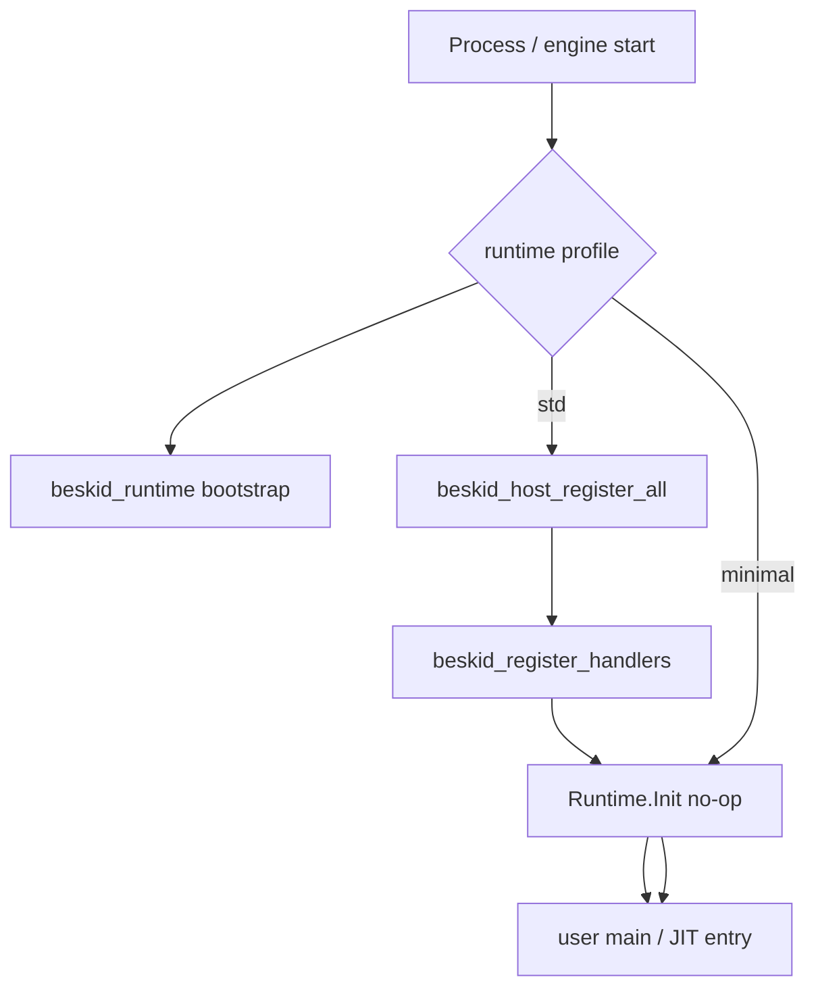

<!-- migrated from the legacy platform spec; canonical OpenSpec source -->
# Runtime registration Specification

## Purpose

Host registration, Runtime.Init, and status-code single source in corelib.

## Requirements

### Requirement: Host registration before user entry
Process-start registration for host-backed dispatch MUST complete before user static init and user `main` / JIT entry. Under the default `std` runtime profile, `beskid_host_register_all()` MUST register host handlers before user entry. The `minimal` profile MUST NOT perform that host registration step.

#### Scenario: std profile registers host handlers first
- **GIVEN** a process started under the `std` runtime profile
- **WHEN** user static init or user entry begins
- **THEN** host-owned dispatch registration via `beskid_host_register_all()` has already completed

### Requirement: Host-owned vs language-owned registration authority
Host-owned dispatch rows (`fs_*`, `env_*`, `process_*`, `tty_winsize`) MUST be registered by `beskid_host_register_all()` and MUST NOT be registered by `Runtime.Init`. `Runtime.Init` MUST remain a documented no-op stub in ABI v4. Language-owned soft-dispatch entries MAY use the `[Runtime]` attribute and static runtime fallback independently of the host table.

#### Scenario: Host-owned tags skip Runtime.Init
- **GIVEN** a host-owned dispatch tag such as `fs_*`
- **WHEN** registration authority is applied at process start
- **THEN** the tag is registered by `beskid_host_register_all()` and not by `Runtime.Init`

### Requirement: Deterministic trap without host table
When no host handler table is registered, host-owned tags MUST trap deterministically. Language-owned tags MAY still use the static runtime fallback.

#### Scenario: Unregistered host tag traps
- **GIVEN** a process with no host handler table registered
- **WHEN** a call targets a host-owned dispatch tag
- **THEN** the call traps deterministically rather than falling through to undefined behavior

### Requirement: Runtime.Abi status-code single source
Concurrency and IO modules MUST import runtime status constants from `Runtime.Abi` and MUST NOT duplicate those literals from `beskid_runtime::status` as a second source of truth. Envelope layouts, dispatch tag constants, and status codes in `Runtime.Abi` MUST be the single source for domain packages.

#### Scenario: Domain modules import Runtime.Abi constants
- **GIVEN** a concurrency or IO corelib module that needs a runtime status code
- **WHEN** the module references that constant
- **THEN** the constant is imported from `Runtime.Abi` rather than duplicated from Rust runtime literals

## Informative Source Provenance

The records below preserve migration history and are not normative except where text was extracted into a requirement above.

### Source Record: Runtime registration

**Authority:** informative provenance  
**Legacy path:** `/platform-spec/core-library/compiler-integration/runtime-registration/`  
**Source:** `site/spec-content/platform-spec/core-library/compiler-integration/runtime-registration/content.md`  
**SHA-256:** `9b1b549f517d331a54550716b6196e7f912024ebf0c66903bd67735626239cc9`

<details>
<summary>Migrated source text</summary>

``````markdown
## Purpose

ABI v4 keeps **dispatch tag assignment**, **envelope types**, and **runtime status codes** in corelib Beskid sources, while moving process-start registration authority for host-backed dispatch to `beskid_host`.

The Rust runtime remains the dispatch substrate. The default `std` runtime profile registers host handlers before user entry; the `minimal` profile does not.

## Corelib modules

| Module | Role |
| --- | --- |
| **`Runtime.Abi`** | Envelope layouts, dispatch tag constants, status codes — single source for domain packages |
| **`Runtime.Init`** | Documented no-op stub in ABI v4; retained as a stable corelib module |
| Domain shims | Public facades such as `System.*` continue to call the same injected `__*` paths |

## `[Runtime]` attribute

Corelib functions that back language-owned soft dispatch **may** declare:

```beskid
[Runtime(DispatchTag: 0, Returns: Usize)]
pub i64 __str_len(BeskidStr s) { ... }
```

Analysis merges attributed entries with manifest rows. Codegen routes calls through `interop_dispatch_*` using the declared return group.

Host-owned rows (`fs_*`, `env_*`, `process_*`, `tty_winsize`) are not registered by `Runtime.Init`; they are registered by `beskid_host_register_all()`.

## Init hook flow



Registration **must** complete before user static init ([D-CORE-COMP-0010](/platform-spec/core-library/compiler-integration/corelib-injection-and-resolution/adr/0010-runtime-registration-authority/)). In ABI v4, this means host/link startup, not a Beskid corelib-generated handler table, performs registration for host-owned dispatch.

When no host table is registered, host-owned tags trap deterministically. Language-owned tags may still use the static runtime fallback.

## Status code migration

Concurrency and IO modules import status constants from **`Runtime.Abi`** instead of duplicating Rust literals in `beskid_runtime::status`. Contract tests assert corelib constants match runtime behavior.

## Related topics

- [Runtime manifest](/platform-spec/language-meta/interop/rust-abi-profile/runtime-manifest/) — manifest schema
- [Kernel and dispatch](/platform-spec/language-meta/interop/rust-abi-profile/kernel-and-dispatch/) — call paths
- [ABI v4 runtime/host split](/platform-spec/language-meta/interop/rust-abi-profile/adr/0017-runtime-host-split-v4/) — host registration authority
- [Handler registration init order](/platform-spec/execution/abi-and-host/extern-dispatch-and-policy/adr/0007-handler-registration-init-order/)

## Decisions
<!-- spec:generate:adr-index -->
No ADRs published under **`adr/`** yet.
<!-- /spec:generate:adr-index -->
## Articles
<!-- spec:generate:article-index -->
_No articles in this bundle yet._
<!-- /spec:generate:article-index -->
``````

</details>
