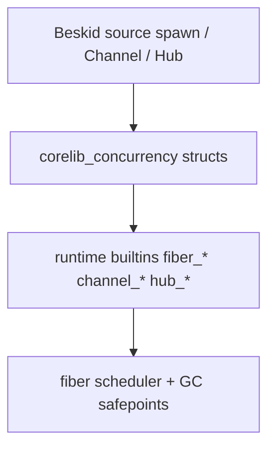

<!-- migrated from the legacy platform spec; canonical OpenSpec source -->
# Concurrency package Specification

## Purpose

Normative corelib shapes for Fiber, Channel, Hub, Mutex, and WaitGroup—thin builtins wrappers only.

## Requirements

### Requirement: Channel default capacity is unbounded: Decision [D-CORE-CONC-0001]
The Beskid standard SHALL enforce the following migrated contract section. Accepted ADR decisions are binding; uppercase requirement keywords retain their BCP-14 meaning.

> | Rule | Detail |
> | --- | --- |
> | Default | **Unbounded** when `ChannelOptions` is omitted or no bounded capacity is set |
> | Bounded | `ChannelOptions.Bounded(n)` with `` `n > 0` `` |
> | Unbounded | `ChannelOptions.Unbounded` (equivalent to default) |
> | Factory | `` `Channel<T>.Create(options: ChannelOptions = default)` `` |

**Stable ID:** `BSP-REQ-97154AB51A83`  
**Legacy source:** `site/spec-content/platform-spec/core-library/concurrency/concurrency-package/adr/0001-channel-default-unbounded/content.md`  
**Source SHA-256:** `83650205eeec69e4bd2e46dce5e8a2aa580085fb8698fb2bf6255ab560ded3d7`

#### Scenario: Conformance exercises Decision
- **GIVEN** an implementation claims conformance with this capability
- **WHEN** behavior governed by this contract section is exercised
- **THEN** every MUST, SHALL, REQUIRED, prohibition, and accepted decision in the section is satisfied

### Requirement: Fiber cancellation via Cancel and OnCancelled: Decision [D-CORE-CONC-0002]
The Beskid standard SHALL enforce the following migrated contract section. Accepted ADR decisions are binding; uppercase requirement keywords retain their BCP-14 meaning.

> | Rule | Detail |
> | --- | --- |
> | Signal | `Fiber.Cancel()` sets runtime cancellation flag |
> | Event | Each `` `Fiber<T>` `` declares ``event OnCancelled()``; runtime raises on **child** before unblocking parked ops |
> | Join | ``Join`` → `` `Result<T, FiberError::Cancelled>` `` after cancellation observed |
> | Channels | Parked **Send** / **Receive** → `ChannelError::Cancelled` |
> | Ordering | **OnCancelled** runs **before** **Join** / channel errors; handlers **must not** block on **Join** of self |

**Stable ID:** `BSP-REQ-A5E85E461CB0`  
**Legacy source:** `site/spec-content/platform-spec/core-library/concurrency/concurrency-package/adr/0002-fiber-cancellation/content.md`  
**Source SHA-256:** `32439c4ee437df40a4a470c65b96a63c66c097c84ea172061b1a9517823d9b40`

#### Scenario: Conformance exercises Decision
- **GIVEN** an implementation claims conformance with this capability
- **WHEN** behavior governed by this contract section is exercised
- **THEN** every MUST, SHALL, REQUIRED, prohibition, and accepted decision in the section is satisfied

### Requirement: Hub WaitReceive uses round-robin fairness: Decision [D-CORE-CONC-0003]
The Beskid standard SHALL enforce the following migrated contract section. Accepted ADR decisions are binding; uppercase requirement keywords retain their BCP-14 meaning.

> | Rule | Detail |
> | --- | --- |
> | Algorithm | **Round-robin** among channels with a ready **Receive** |
> | Cursor | Per-`Hub` index advanced after each successful **WaitReceive** |
> | v1 scope | **WaitReceive** only — no **WaitSend** |

**Stable ID:** `BSP-REQ-0FC9ED4EEC06`  
**Legacy source:** `site/spec-content/platform-spec/core-library/concurrency/concurrency-package/adr/0003-hub-round-robin-fairness/content.md`  
**Source SHA-256:** `a7cc9d1031dd8927e89d27824001a99aaca451785958f9b90a666d8c965dae1f`

#### Scenario: Conformance exercises Decision
- **GIVEN** an implementation claims conformance with this capability
- **WHEN** behavior governed by this contract section is exercised
- **THEN** every MUST, SHALL, REQUIRED, prohibition, and accepted decision in the section is satisfied

### Requirement: Main fiber and process shutdown: Decision [D-CORE-CONC-0004]
The Beskid standard SHALL enforce the following migrated contract section. Accepted ADR decisions are binding; uppercase requirement keywords retain their BCP-14 meaning.

> | Rule | Detail |
> | --- | --- |
> | Main | `main()` runs on fiber **0** |
> | Shutdown | When `main` returns, runtime **Join**s spawned fibers that were **not** **Detach**ed |
> | Detach | **Detach** waives parent **Join**; child panic still **aborts process** |
> | Leak | Spawn without **Join** or **Detach** before `main` ends → conformance **warning** in v0.2 tests |

**Stable ID:** `BSP-REQ-2A7B6B98D32F`  
**Legacy source:** `site/spec-content/platform-spec/core-library/concurrency/concurrency-package/adr/0004-main-fiber-shutdown/content.md`  
**Source SHA-256:** `e1e2ed89de65ee2ebde87d898773dedd70defbb80db66f862f5555b3a08966ec`

#### Scenario: Conformance exercises Decision
- **GIVEN** an implementation claims conformance with this capability
- **WHEN** behavior governed by this contract section is exercised
- **THEN** every MUST, SHALL, REQUIRED, prohibition, and accepted decision in the section is satisfied

### Requirement: Channel and fiber errors use Result not panic: Decision [D-CORE-CONC-0005]
The Beskid standard SHALL enforce the following migrated contract section. Accepted ADR decisions are binding; uppercase requirement keywords retain their BCP-14 meaning.

> | Surface | Rule |
> | --- | --- |
> | Channel | **Send** / **Receive** → `Result`; **TrySend** / **TryReceive** → `Option` |
> | Fiber | **Join** → `` `Result<T, FiberError>` ``; stack overflow → ``FiberError::StackOverflow`` at **Join** |
> | Mutex | **Lock** → `` `Result<MutexGuard, MutexError>` ``; **TryLock** → ``Option`` (``None`` = would block) |

**Stable ID:** `BSP-REQ-4DA3BD50C58C`  
**Legacy source:** `site/spec-content/platform-spec/core-library/concurrency/concurrency-package/adr/0005-result-not-panic-errors/content.md`  
**Source SHA-256:** `c519a7dc53ee7da0c7abbae040c802d45d09befe04f70221eb61acd0ffe8369c`

#### Scenario: Conformance exercises Decision
- **GIVEN** an implementation claims conformance with this capability
- **WHEN** behavior governed by this contract section is exercised
- **THEN** every MUST, SHALL, REQUIRED, prohibition, and accepted decision in the section is satisfied

### Requirement: spawn keyword; async and await reserved: Decision [D-CORE-CONC-0006]
The Beskid standard SHALL enforce the following migrated contract section. Accepted ADR decisions are binding; uppercase requirement keywords retain their BCP-14 meaning.

> | Rule | Detail |
> | --- | --- |
> | Keyword | `spawn` required for new fibers; no `go` alias in v1 |
> | Reserved | `async` and `await` are **parse errors** (reserved, not implemented) |
> | Data transfer | **Channel** only between fibers for data; **Mutex** / **WaitGroup** for coordination |
> | Handles | `` `Fiber<T>` `` and `` `Channel<T>` `` are **move-only** |

**Stable ID:** `BSP-REQ-1B389240A570`  
**Legacy source:** `site/spec-content/platform-spec/core-library/concurrency/concurrency-package/adr/0006-spawn-keyword-reserved-async/content.md`  
**Source SHA-256:** `6748c306bb82793635aa4306fd9c3f71bff5e8deffaf896c918d22cee075baf9`

#### Scenario: Conformance exercises Decision
- **GIVEN** an implementation claims conformance with this capability
- **WHEN** behavior governed by this contract section is exercised
- **THEN** every MUST, SHALL, REQUIRED, prohibition, and accepted decision in the section is satisfied

### Requirement: GC phase A single mutator: Decision [D-CORE-CONC-0007]
The Beskid standard SHALL enforce the following migrated contract section. Accepted ADR decisions are binding; uppercase requirement keywords retain their BCP-14 meaning.

> | Phase | Rule |
> | --- | --- |
> | A (ship) | Many fibers, **one GC mutator**; `gc_write_barrier` no-op |
> | B (documented) | Parallel mutators + real barriers; no corelib API break |

**Stable ID:** `BSP-REQ-940953D8F302`  
**Legacy source:** `site/spec-content/platform-spec/core-library/concurrency/concurrency-package/adr/0007-gc-phase-a-single-mutator/content.md`  
**Source SHA-256:** `56192987dc3b339b6375b91208f7dc2fde7a3803e93e31919b5208e823a3646f`

#### Scenario: Conformance exercises Decision
- **GIVEN** an implementation claims conformance with this capability
- **WHEN** behavior governed by this contract section is exercised
- **THEN** every MUST, SHALL, REQUIRED, prohibition, and accepted decision in the section is satisfied

### Requirement: Scheduler and stack defaults: Decision [D-CORE-CONC-0008]
The Beskid standard SHALL enforce the following migrated contract section. Accepted ADR decisions are binding; uppercase requirement keywords retain their BCP-14 meaning.

> | Setting | Default |
> | --- | --- |
> | `ProcessorCount` | Host logical CPU count at init |
> | Stacks | 64 KiB initial, 8 MiB max |
> | Arena | Phase A: **one process arena**; pool threads run Beskid mutator code under scheduler rules |

**Stable ID:** `BSP-REQ-765789E63BF5`  
**Legacy source:** `site/spec-content/platform-spec/core-library/concurrency/concurrency-package/adr/0008-scheduler-defaults/content.md`  
**Source SHA-256:** `86c47eab05ec76895b7cc0bae9b2e31fd39b5fe444369dc7dff190f92bca685c`

#### Scenario: Conformance exercises Decision
- **GIVEN** an implementation claims conformance with this capability
- **WHEN** behavior governed by this contract section is exercised
- **THEN** every MUST, SHALL, REQUIRED, prohibition, and accepted decision in the section is satisfied

### Requirement: Channel runtime delivery semantics: Decision [D-CORE-CONC-0009]
The Beskid standard SHALL enforce the following migrated contract section. Accepted ADR decisions are binding; uppercase requirement keywords retain their BCP-14 meaning.

> | Rule | Detail |
> | --- | --- |
> | Receivers | Multiple allowed; each message delivered to **exactly one** successful **Receive** (FIFO) |
> | Senders | Multiple allowed unless **SingleWriter** hint (hint only v1) |
> | Close | Any handle holder may **Close**; idempotent writer shutdown |
> | void spawn | `` `Fiber<Unit>` `` when entry returns no value |

**Stable ID:** `BSP-REQ-FD5C40D623FB`  
**Legacy source:** `site/spec-content/platform-spec/core-library/concurrency/concurrency-package/adr/0009-channel-runtime-semantics/content.md`  
**Source SHA-256:** `4d373548f5291c0ef9f929984fe31d8ac0ada82601d496c66b2f1022d80152dd`

#### Scenario: Conformance exercises Decision
- **GIVEN** an implementation claims conformance with this capability
- **WHEN** behavior governed by this contract section is exercised
- **THEN** every MUST, SHALL, REQUIRED, prohibition, and accepted decision in the section is satisfied

### Requirement: Homogeneous Hub in v1: Decision [D-CORE-CONC-0010]
The Beskid standard SHALL enforce the following migrated contract section. Accepted ADR decisions are binding; uppercase requirement keywords retain their BCP-14 meaning.

> | Rule | Detail |
> | --- | --- |
> | Fairness | Round-robin (see D-CORE-CONC-0003) |
> | Max registrations | **256** per hub (`HubError::Limit` possible) |
> | Element type | **Homogeneous** — one `` `Hub<T>` `` wraps only `` `Channel<T>` `` with same ``T`` |
> | Heterogeneous | **Not v1** — use multiple hubs or `` `Channel<HubMessage>` `` |
> | Result | ``HubReceiveResult { index: i64, value: T }`` |

**Stable ID:** `BSP-REQ-8CA09EA18363`  
**Legacy source:** `site/spec-content/platform-spec/core-library/concurrency/concurrency-package/adr/0010-hub-homogeneous-v1/content.md`  
**Source SHA-256:** `60e701c5e01d652eedb6ecc52beb1af33fe9ad93c15295302f1dd490bdee8f1c`

#### Scenario: Conformance exercises Decision
- **GIVEN** an implementation claims conformance with this capability
- **WHEN** behavior governed by this contract section is exercised
- **THEN** every MUST, SHALL, REQUIRED, prohibition, and accepted decision in the section is satisfied

### Requirement: OnCancelled on Fiber handle only: Decision [D-CORE-CONC-0011]
The Beskid standard SHALL enforce the following migrated contract section. Accepted ADR decisions are binding; uppercase requirement keywords retain their BCP-14 meaning.

> | Rule | Detail |
> | --- | --- |
> | Placement | **OnCancelled** on `` `Fiber<T>` `` handle from ``spawn`` only |
> | Spawn entry | Ordinary `` `fn(...) -> T` ``; **does not** declare **OnCancelled** |
> | Handle | `` `Fiber<T>` `` struct wrapping runtime builtins |

**Stable ID:** `BSP-REQ-CB858CCC189B`  
**Legacy source:** `site/spec-content/platform-spec/core-library/concurrency/concurrency-package/adr/0011-fiber-handle-oncancelled/content.md`  
**Source SHA-256:** `9348e1a6c85af0ba99c5f85667d2917f5c05d8807f3c690f6a8763d6e57d71a8`

#### Scenario: Conformance exercises Decision
- **GIVEN** an implementation claims conformance with this capability
- **WHEN** behavior governed by this contract section is exercised
- **THEN** every MUST, SHALL, REQUIRED, prohibition, and accepted decision in the section is satisfied

### Requirement: Mutex TryLock and Lock cancellation: Decision [D-CORE-CONC-0012]
The Beskid standard SHALL enforce the following migrated contract section. Accepted ADR decisions are binding; uppercase requirement keywords retain their BCP-14 meaning.

> | Rule | Detail |
> | --- | --- |
> | TryLock | **In v1** — returns `` `Option<MutexGuard>` `` |
> | Lock | Parks until acquired or **Cancelled** |

**Stable ID:** `BSP-REQ-A8A7B382442B`  
**Legacy source:** `site/spec-content/platform-spec/core-library/concurrency/concurrency-package/adr/0012-mutex-trylock-v1/content.md`  
**Source SHA-256:** `e8e4103dc139d589f7e5a7c6ad0f9da65e8929e6267bc6086e923829ae035f7a`

#### Scenario: Conformance exercises Decision
- **GIVEN** an implementation claims conformance with this capability
- **WHEN** behavior governed by this contract section is exercised
- **THEN** every MUST, SHALL, REQUIRED, prohibition, and accepted decision in the section is satisfied

### Requirement: Concurrency.NowMillis monotonic clock: Decision [D-CORE-CONC-0013]
The Beskid standard SHALL enforce the following migrated contract section. Accepted ADR decisions are binding; uppercase requirement keywords retain their BCP-14 meaning.

> `` `Concurrency.NowMillis() -> i64` `` in concurrency package replaces legacy `rt_now_millis`. Wall clock deferred to future `Core.Time`.

**Stable ID:** `BSP-REQ-5D64C12355DB`  
**Legacy source:** `site/spec-content/platform-spec/core-library/concurrency/concurrency-package/adr/0013-monotonic-clock/content.md`  
**Source SHA-256:** `3dd4187e8c46c71515609a6ecf1251f74023c60f9d85a0c431382b111e8de45d`

#### Scenario: Conformance exercises Decision
- **GIVEN** an implementation claims conformance with this capability
- **WHEN** behavior governed by this contract section is exercised
- **THEN** every MUST, SHALL, REQUIRED, prohibition, and accepted decision in the section is satisfied

### Requirement: Forbidden child Join of ancestor: Decision [D-CORE-CONC-0014]
The Beskid standard SHALL enforce the following migrated contract section. Accepted ADR decisions are binding; uppercase requirement keywords retain their BCP-14 meaning.

> Child **Join** parent → compile-time diagnostic **JoinWouldDeadlock**. Parent **Join** child and sibling **Join** remain allowed.

**Stable ID:** `BSP-REQ-6ACA0426EB98`  
**Legacy source:** `site/spec-content/platform-spec/core-library/concurrency/concurrency-package/adr/0014-join-ancestor-forbidden/content.md`  
**Source SHA-256:** `c872474f63ff8d06bfc134fd10fa1feb5287cac369de9f475e071b466529c8df`

#### Scenario: Conformance exercises Decision
- **GIVEN** an implementation claims conformance with this capability
- **WHEN** behavior governed by this contract section is exercised
- **THEN** every MUST, SHALL, REQUIRED, prohibition, and accepted decision in the section is satisfied

## Informative Source Provenance

The records below preserve migration history and are not normative except where text was extracted into a requirement above.

### Source Record: Concurrency package

**Authority:** informative provenance  
**Legacy path:** `/platform-spec/core-library/concurrency/concurrency-package/`  
**Source:** `site/spec-content/platform-spec/core-library/concurrency/concurrency-package/content.md`  
**SHA-256:** `8f86d810bf35a2980a19654e3ff92f9e2f482ccde49c60b0cd82c9e00834980d`

<details>
<summary>Migrated source text</summary>

``````markdown
<SpecSection title="Layer diagram" id="layer-diagram">



The package is a **thin wrapper** layer only — no duplicate channel abstractions or async state machines.

</SpecSection>

<SpecSection title="What this feature specifies" id="what-this-feature-specifies">
Normative **corelib** shapes for cooperative concurrency: `Fiber<T>`, `Channel<T>`, homogeneous `Hub<T>`, `Mutex`, and `WaitGroup` as thin wrappers over stable runtime builtins. `spawn` lowering returns a move-only fiber handle with `OnCancelled` on the handle; channel and join failures use `Result` / `Option`, not panic.
</SpecSection>

<SpecSection title="Implementation anchors" id="implementation-anchors">
- Workspace package `compiler/corelib/packages/concurrency/` (`corelib_concurrency`)
- Runtime symbols: `compiler/crates/beskid_abi/src/symbols.rs`, `BUILTIN_SPECS`
- Corelib tests: `compiler/corelib/beskid_corelib/tests/corelib_tests/src/concurrency/`
- Runtime integration: `compiler/crates/beskid_runtime/tests/concurrency.rs` plus `compiler/crates/beskid_tests/src/runtime/jit.rs` spawn smoke coverage
</SpecSection>

<SpecSection title="Contract statement" id="contract-statement">
The `corelib_concurrency` workspace package provides the only supported user-facing API for cooperative fibers and channel communication. Public types are **structs** whose methods call **stable runtime builtins** (`fiber_*`, `channel_*`, `hub_*`, `mutex_*`, `wait_group_*`). The package **must not** introduce secondary abstraction layers (no builder stacks, no implicit async state machines, no duplicated channel interfaces).

All fiber operations that can fail **must** return `Core.Results.Result` (or `Option` where absence is ordinary). **Panics are not** the error path for channel or join failures.
</SpecSection>

<SpecSection title="Inputs and outputs" id="inputs-and-outputs">
| Surface | Role |
| --- | --- |
| `Fiber<T>` | Opaque handle wrapping `fiber_*` builtins; `T` is the spawn entry return type |
| `Channel<T>` | **Unbounded by default**; `ChannelOptions.Bounded(n)` for bounded queues |
| `Hub<T>` | Homogeneous multichannel **WaitReceive** (round-robin); unlike types use `Channel<HubMessage>` or multiple hubs |
| `Mutex` | Mutual exclusion between fibers on shared state |
| `WaitGroup` | Fork–join counter for batches of fibers |
| `Concurrency.Yield()` | Cooperative reschedule (`fiber_yield`) |
| `Concurrency.NowMillis()` | Monotonic milliseconds (`fiber_now_millis` / clock builtin) |
| `Concurrency.Spawn` | Used by lowering of `spawn`; returns `Fiber<T>` with **OnCancelled** on handle |
| `Fiber.Join` | `Result<T, FiberError>` |
| `Fiber.Detach` | Fire-and-forget; unjoined panic still aborts process unless recovered at runtime policy |
| `Fiber.Cancel` | Sets cancel flag; runs child `event OnCancelled()`; **Join** → `FiberError::Cancelled` |
</SpecSection>

<SpecSection title="State model" id="state-model">
- `Fiber<T>` — runtime handle + metadata (id, cancellation flag). Not copyable unless spec later allows handle duplication; **move-only** preferred.
- `Channel<T>` — holds runtime queue id; **Close** marks writer end closed; **Receive** after drain returns `ChannelError::Closed` in `Result`.
- `Hub` — registered set of channel endpoints with cached readiness index updated by runtime on send/receive.
- Phase A (see scheduler spec): many fibers, **single GC mutator thread** documented; Phase B adds parallel mutators without API break.
</SpecSection>

<SpecSection title="Algorithms and flow" id="algorithms-and-flow">
1. `spawn entry` lowers to `fiber_spawn_with_cancel_slot(entry, env, onCancelledSlot)`; parent gets a `Fiber<T>` backed by the runtime `i64` fiber id.
2. **Send** — if queue full, **park current fiber** (not OS thread); on success establishes happens-before edge to receiver.
3. **Receive** — if empty and open, park; if closed and empty, return `Result::Err(Closed)`.
4. **TrySend** / **TryReceive** — non-blocking; `Option` for empty/full.
5. **Hub.WaitReceive** — runtime waits until any registered channel can satisfy Receive; returns which member completed.
6. Blocking **syscall** paths in `Core.Syscall` **should** park the calling fiber and delegate blocking work to the thread pool (runtime), not stall the whole scheduler.
</SpecSection>

<SpecSection title="Edge cases and errors" id="edge-cases-and-errors">
- **Send** after **Close** → `Result::Err(ChannelError::Closed)` (no panic).
- **Cancel** on joined fiber → `FiberError::Cancelled` on **Join**.
- **Detach** child panic → process abort after diagnostic unless runtime policy adds domain recovery later.
- Fibers **must not** share pointers to another fiber's stack; **Channel** is the **only** approved cross-fiber communication (language + memory model).
</SpecSection>

<SpecSection title="Compatibility and versioning" id="compatibility-and-versioning">
New builtins require `beskid_runtime_abi_version` bump and entries in `BUILTIN_SPECS` / `define_builtins!`. Deprecated v0.1 `rt_yield` / `rt_now_millis` (`sched` feature) are superseded by `fiber_yield` and monotonic clock builtins—remove legacy doc references to async/await.
</SpecSection>

<SpecSection title="Security and performance notes" id="security-and-performance-notes">
- Default fiber stack: **64 KiB**, growable cap **8 MiB** (runtime).
- Unbounded channels are opt-in; documentation **must** warn about memory growth.
- **Hub** registration count should be bounded in UI scenarios (console) to avoid linear scans on hot paths.
</SpecSection>

<SpecSection title="Examples" id="examples">
See **[examples](./examples/)** article: spawn + **Join**, bounded **Channel**, **Hub** for stdin/resize multiplexing sketch.
</SpecSection>

<SpecSection title="Verification and traceability" id="verification-and-traceability">
- Corelib compile tests under `compiler/corelib/beskid_corelib/tests/corelib_tests/src/concurrency/`
- Runtime integration: canonical primitive coverage in `compiler/crates/beskid_runtime/tests/concurrency.rs`; JIT smoke in `compiler/crates/beskid_tests/src/runtime/jit.rs`
- Conformance: bounded/closed **Channel**, **Cancel**, **Hub** readiness ordering, **Mutex**, **WaitGroup**, and syscall parking
</SpecSection>

<SpecSection title="Decisions" id="decisions">
No open decisions. Closed choices are normative ADRs under **`adr/`** (`D-CORE-CONC-0001` … `D-CORE-CONC-0014`); use the reader **ADRs** tab for expandable detail. Legacy [decisions record](./decisions-record/) is a migration index only.
</SpecSection>

<SpecSection title="Related features" id="related-features">
- **[Core.Threading](/platform-spec/core-library/concurrency/core-threading/)** — OS threads (preemptive), not fibers
- **[Console terminal events](/platform-spec/core-library/terminal-and-console/console-terminal-events/)** — delivers via **Channel**
</SpecSection>

## Decisions
<!-- spec:generate:adr-index -->
No open decisions. Closed choices are normative ADRs under **`adr/`** (`D-CORE-CONC-0001` … `D-CORE-CONC-0014`); use the reader **ADRs** tab for expandable detail.
<!-- /spec:generate:adr-index -->
## Articles
<!-- spec:generate:article-index -->
- [Concurrency package - Contracts and edge cases](./articles/contracts-and-edge-cases/)
- [Concurrency package - Decisions record (legacy index)](./articles/decisions-record/)
- [Concurrency package - Design model](./articles/design-model/)
- [Concurrency package - Examples](./articles/examples/)
<!-- /spec:generate:article-index -->
``````

</details>

### Source Record: Channel default capacity is unbounded

**Authority:** informative provenance  
**Legacy path:** `/platform-spec/core-library/concurrency/concurrency-package/adr/0001-channel-default-unbounded/`  
**Source:** `site/spec-content/platform-spec/core-library/concurrency/concurrency-package/adr/0001-channel-default-unbounded/content.md`  
**SHA-256:** `83650205eeec69e4bd2e46dce5e8a2aa580085fb8698fb2bf6255ab560ded3d7`

<details>
<summary>Migrated source text</summary>

``````markdown
## Context

Authors need predictable queue semantics without implicit blocking on the default channel.

## Decision

| Rule | Detail |
| --- | --- |
| Default | **Unbounded** when `ChannelOptions` is omitted or no bounded capacity is set |
| Bounded | `ChannelOptions.Bounded(n)` with `` `n > 0` `` |
| Unbounded | `ChannelOptions.Unbounded` (equivalent to default) |
| Factory | `` `Channel<T>.Create(options: ChannelOptions = default)` `` |

## Consequences

Documentation **must** warn about memory growth on unbounded channels. Bounded queues park senders when full.

## Verification anchors

Corelib concurrency tests; runtime channel builtins.
``````

</details>

### Source Record: Fiber cancellation via Cancel and OnCancelled

**Authority:** informative provenance  
**Legacy path:** `/platform-spec/core-library/concurrency/concurrency-package/adr/0002-fiber-cancellation/`  
**Source:** `site/spec-content/platform-spec/core-library/concurrency/concurrency-package/adr/0002-fiber-cancellation/content.md`  
**SHA-256:** `32439c4ee437df40a4a470c65b96a63c66c097c84ea172061b1a9517823d9b40`

<details>
<summary>Migrated source text</summary>

``````markdown
## Context

Fibers need cooperative cancellation without panics on join or parked channel ops.

## Decision

| Rule | Detail |
| --- | --- |
| Signal | `Fiber.Cancel()` sets runtime cancellation flag |
| Event | Each `` `Fiber<T>` `` declares ``event OnCancelled()``; runtime raises on **child** before unblocking parked ops |
| Join | ``Join`` → `` `Result<T, FiberError::Cancelled>` `` after cancellation observed |
| Channels | Parked **Send** / **Receive** → `ChannelError::Cancelled` |
| Ordering | **OnCancelled** runs **before** **Join** / channel errors; handlers **must not** block on **Join** of self |

## Consequences

Unhandled panic in **OnCancelled** aborts process in v1 (same as other unhandled event paths).

## Verification anchors

Corelib + runtime concurrency tests; cancel/join fixtures.
``````

</details>

### Source Record: Hub WaitReceive uses round-robin fairness

**Authority:** informative provenance  
**Legacy path:** `/platform-spec/core-library/concurrency/concurrency-package/adr/0003-hub-round-robin-fairness/`  
**Source:** `site/spec-content/platform-spec/core-library/concurrency/concurrency-package/adr/0003-hub-round-robin-fairness/content.md`  
**SHA-256:** `a7cc9d1031dd8927e89d27824001a99aaca451785958f9b90a666d8c965dae1f`

<details>
<summary>Migrated source text</summary>

``````markdown
## Context

FIFO registration order starves late channels when an early channel is always ready.

## Decision

| Rule | Detail |
| --- | --- |
| Algorithm | **Round-robin** among channels with a ready **Receive** |
| Cursor | Per-`Hub` index advanced after each successful **WaitReceive** |
| v1 scope | **WaitReceive** only — no **WaitSend** |

## Consequences

Console hubs should keep registration count small (under 16 typical).

## Verification anchors

Hub integration tests in runtime and corelib suites.
``````

</details>

### Source Record: Main fiber and process shutdown

**Authority:** informative provenance  
**Legacy path:** `/platform-spec/core-library/concurrency/concurrency-package/adr/0004-main-fiber-shutdown/`  
**Source:** `site/spec-content/platform-spec/core-library/concurrency/concurrency-package/adr/0004-main-fiber-shutdown/content.md`  
**SHA-256:** `e1e2ed89de65ee2ebde87d898773dedd70defbb80db66f862f5555b3a08966ec`

<details>
<summary>Migrated source text</summary>

``````markdown
## Context

Process lifetime must be defined when main returns while child fibers still run.

## Decision

| Rule | Detail |
| --- | --- |
| Main | `main()` runs on fiber **0** |
| Shutdown | When `main` returns, runtime **Join**s spawned fibers that were **not** **Detach**ed |
| Detach | **Detach** waives parent **Join**; child panic still **aborts process** |
| Leak | Spawn without **Join** or **Detach** before `main` ends → conformance **warning** in v0.2 tests |

## Consequences

Future recovery policies require a new ADR; v1 aborts on undetached child panic.

## Verification anchors

Runtime shutdown tests; conformance warnings catalog.
``````

</details>

### Source Record: Channel and fiber errors use Result not panic

**Authority:** informative provenance  
**Legacy path:** `/platform-spec/core-library/concurrency/concurrency-package/adr/0005-result-not-panic-errors/`  
**Source:** `site/spec-content/platform-spec/core-library/concurrency/concurrency-package/adr/0005-result-not-panic-errors/content.md`  
**SHA-256:** `c519a7dc53ee7da0c7abbae040c802d45d09befe04f70221eb61acd0ffe8369c`

<details>
<summary>Migrated source text</summary>

``````markdown
## Context

Panics as control flow for expected failure modes break contracts and LSP stability.

## Decision

| Surface | Rule |
| --- | --- |
| Channel | **Send** / **Receive** → `Result`; **TrySend** / **TryReceive** → `Option` |
| Fiber | **Join** → `` `Result<T, FiberError>` ``; stack overflow → ``FiberError::StackOverflow`` at **Join** |
| Mutex | **Lock** → `` `Result<MutexGuard, MutexError>` ``; **TryLock** → ``Option`` (``None`` = would block) |

## Consequences

v1: **Lock** may return `Cancelled` when fiber cancelled—no .NET-style poison.

## Verification anchors

Corelib API signatures; runtime integration tests.
``````

</details>

### Source Record: spawn keyword; async and await reserved

**Authority:** informative provenance  
**Legacy path:** `/platform-spec/core-library/concurrency/concurrency-package/adr/0006-spawn-keyword-reserved-async/`  
**Source:** `site/spec-content/platform-spec/core-library/concurrency/concurrency-package/adr/0006-spawn-keyword-reserved-async/content.md`  
**SHA-256:** `6748c306bb82793635aa4306fd9c3f71bff5e8deffaf896c918d22cee075baf9`

<details>
<summary>Migrated source text</summary>

``````markdown
## Context

Aligns with inception ADR D-INC-0008; avoids dual concurrency models in v1.

## Decision

| Rule | Detail |
| --- | --- |
| Keyword | `spawn` required for new fibers; no `go` alias in v1 |
| Reserved | `async` and `await` are **parse errors** (reserved, not implemented) |
| Data transfer | **Channel** only between fibers for data; **Mutex** / **WaitGroup** for coordination |
| Handles | `` `Fiber<T>` `` and `` `Channel<T>` `` are **move-only** |

## Consequences

Parser and semantic tests reject async/await; spawn lowering returns `` `Fiber<T>` ``.

## Verification anchors

Parser fixtures; [Fibers and spawn](/platform-spec/language-meta/evaluation/fibers-and-spawn/).
``````

</details>

### Source Record: GC phase A single mutator

**Authority:** informative provenance  
**Legacy path:** `/platform-spec/core-library/concurrency/concurrency-package/adr/0007-gc-phase-a-single-mutator/`  
**Source:** `site/spec-content/platform-spec/core-library/concurrency/concurrency-package/adr/0007-gc-phase-a-single-mutator/content.md`  
**SHA-256:** `56192987dc3b339b6375b91208f7dc2fde7a3803e93e31919b5208e823a3646f`

<details>
<summary>Migrated source text</summary>

``````markdown
## Context

Parallel GC mutators require write barriers not ready for initial ship.

## Decision

| Phase | Rule |
| --- | --- |
| A (ship) | Many fibers, **one GC mutator**; `gc_write_barrier` no-op |
| B (documented) | Parallel mutators + real barriers; no corelib API break |

## Consequences

Scheduler and memory specs must stay consistent with phase A barriers.

## Verification anchors

Runtime GC tests; memory-and-gc-runtime-contract feature.
``````

</details>

### Source Record: Scheduler and stack defaults

**Authority:** informative provenance  
**Legacy path:** `/platform-spec/core-library/concurrency/concurrency-package/adr/0008-scheduler-defaults/`  
**Source:** `site/spec-content/platform-spec/core-library/concurrency/concurrency-package/adr/0008-scheduler-defaults/content.md`  
**SHA-256:** `86c47eab05ec76895b7cc0bae9b2e31fd39b5fe444369dc7dff190f92bca685c`

<details>
<summary>Migrated source text</summary>

``````markdown
## Context

Hosts need predictable defaults without per-program scheduler tuning.

## Decision

| Setting | Default |
| --- | --- |
| `ProcessorCount` | Host logical CPU count at init |
| Stacks | 64 KiB initial, 8 MiB max |
| Arena | Phase A: **one process arena**; pool threads run Beskid mutator code under scheduler rules |

## Consequences

Fiber scheduler design model article details syscall parking.

## Verification anchors

[Fiber scheduler and stacks](/platform-spec/execution/runtime/fiber-scheduler-and-stacks/).
``````

</details>

### Source Record: Channel runtime delivery semantics

**Authority:** informative provenance  
**Legacy path:** `/platform-spec/core-library/concurrency/concurrency-package/adr/0009-channel-runtime-semantics/`  
**Source:** `site/spec-content/platform-spec/core-library/concurrency/concurrency-package/adr/0009-channel-runtime-semantics/content.md`  
**SHA-256:** `4d373548f5291c0ef9f929984fe31d8ac0ada82601d496c66b2f1022d80152dd`

<details>
<summary>Migrated source text</summary>

``````markdown
## Context

Authors need defined fan-in/fan-out and close idempotence.

## Decision

| Rule | Detail |
| --- | --- |
| Receivers | Multiple allowed; each message delivered to **exactly one** successful **Receive** (FIFO) |
| Senders | Multiple allowed unless **SingleWriter** hint (hint only v1) |
| Close | Any handle holder may **Close**; idempotent writer shutdown |
| void spawn | `` `Fiber<Unit>` `` when entry returns no value |

## Consequences

Close after drain returns `ChannelError::Closed` in `Result`.

## Verification anchors

Runtime concurrency.rs; corelib channel tests.
``````

</details>

### Source Record: Homogeneous Hub in v1

**Authority:** informative provenance  
**Legacy path:** `/platform-spec/core-library/concurrency/concurrency-package/adr/0010-hub-homogeneous-v1/`  
**Source:** `site/spec-content/platform-spec/core-library/concurrency/concurrency-package/adr/0010-hub-homogeneous-v1/content.md`  
**SHA-256:** `60e701c5e01d652eedb6ecc52beb1af33fe9ad93c15295302f1dd490bdee8f1c`

<details>
<summary>Migrated source text</summary>

``````markdown
## Context

Heterogeneous select requires tagged unions or multiple hubs in v1.

## Decision

| Rule | Detail |
| --- | --- |
| Fairness | Round-robin (see D-CORE-CONC-0003) |
| Max registrations | **256** per hub (`HubError::Limit` possible) |
| Element type | **Homogeneous** — one `` `Hub<T>` `` wraps only `` `Channel<T>` `` with same ``T`` |
| Heterogeneous | **Not v1** — use multiple hubs or `` `Channel<HubMessage>` `` |
| Result | ``HubReceiveResult { index: i64, value: T }`` |

## Consequences

UI/console hubs should stay well below 256 registrations.

## Verification anchors

Hub builtin tests; examples article.
``````

</details>

### Source Record: OnCancelled on Fiber handle only

**Authority:** informative provenance  
**Legacy path:** `/platform-spec/core-library/concurrency/concurrency-package/adr/0011-fiber-handle-oncancelled/`  
**Source:** `site/spec-content/platform-spec/core-library/concurrency/concurrency-package/adr/0011-fiber-handle-oncancelled/content.md`  
**SHA-256:** `9348e1a6c85af0ba99c5f85667d2917f5c05d8807f3c690f6a8763d6e57d71a8`

<details>
<summary>Migrated source text</summary>

``````markdown
## Context

Authors should not declare cancellation events on arbitrary spawn closures.

## Decision

| Rule | Detail |
| --- | --- |
| Placement | **OnCancelled** on `` `Fiber<T>` `` handle from ``spawn`` only |
| Spawn entry | Ordinary `` `fn(...) -> T` ``; **does not** declare **OnCancelled** |
| Handle | `` `Fiber<T>` `` struct wrapping runtime builtins |

## Consequences

Lowering wires cancel slot from handle metadata.

## Verification anchors

Semantic + lowering tests for spawn.
``````

</details>

### Source Record: Mutex TryLock and Lock cancellation

**Authority:** informative provenance  
**Legacy path:** `/platform-spec/core-library/concurrency/concurrency-package/adr/0012-mutex-trylock-v1/`  
**Source:** `site/spec-content/platform-spec/core-library/concurrency/concurrency-package/adr/0012-mutex-trylock-v1/content.md`  
**SHA-256:** `e8e4103dc139d589f7e5a7c6ad0f9da65e8929e6267bc6086e923829ae035f7a`

<details>
<summary>Migrated source text</summary>

``````markdown
## Context

TryLock supports non-blocking attempts; Lock parks with cancel path.

## Decision

| Rule | Detail |
| --- | --- |
| TryLock | **In v1** — returns `` `Option<MutexGuard>` `` |
| Lock | Parks until acquired or **Cancelled** |

## Consequences

No poison semantics in v1.

## Verification anchors

Mutex corelib tests.
``````

</details>

### Source Record: Concurrency.NowMillis monotonic clock

**Authority:** informative provenance  
**Legacy path:** `/platform-spec/core-library/concurrency/concurrency-package/adr/0013-monotonic-clock/`  
**Source:** `site/spec-content/platform-spec/core-library/concurrency/concurrency-package/adr/0013-monotonic-clock/content.md`  
**SHA-256:** `3dd4187e8c46c71515609a6ecf1251f74023c60f9d85a0c431382b111e8de45d`

<details>
<summary>Migrated source text</summary>

``````markdown
## Context

Legacy `rt_now_millis` and scattered clock builtins confuse package boundaries.

## Decision

`` `Concurrency.NowMillis() -> i64` `` in concurrency package replaces legacy `rt_now_millis`. Wall clock deferred to future `Core.Time`.

## Consequences

Wall-clock ADR required before exposing civil time in corelib.

## Verification anchors

Builtin spec table; corelib clock smoke tests.
``````

</details>

### Source Record: Forbidden child Join of ancestor

**Authority:** informative provenance  
**Legacy path:** `/platform-spec/core-library/concurrency/concurrency-package/adr/0014-join-ancestor-forbidden/`  
**Source:** `site/spec-content/platform-spec/core-library/concurrency/concurrency-package/adr/0014-join-ancestor-forbidden/content.md`  
**SHA-256:** `c872474f63ff8d06bfc134fd10fa1feb5287cac369de9f475e071b466529c8df`

<details>
<summary>Migrated source text</summary>

``````markdown
## Context

Parent/child Join cycles deadlock the scheduler.

## Decision

Child **Join** parent → compile-time diagnostic **JoinWouldDeadlock**. Parent **Join** child and sibling **Join** remain allowed.

## Consequences

Diagnostic registry documents **JoinWouldDeadlock**.

## Verification anchors

Semantic analyzer tests for join graph.
``````

</details>

### Source Record: Concurrency package - Contracts and edge cases

**Authority:** informative provenance  
**Legacy path:** `/platform-spec/core-library/concurrency/concurrency-package/articles/contracts-and-edge-cases/`  
**Source:** `site/spec-content/platform-spec/core-library/concurrency/concurrency-package/articles/contracts-and-edge-cases/content.md`  
**SHA-256:** `2885a2a14616177318d50a84012e07eeff5465e998d1a2db0229b65372dfb0d4`

<details>
<summary>Migrated source text</summary>

``````markdown
## `Channel<T>`

### Construction

- `Channel<T>.Create(options: ChannelOptions = default)` — **default is unbounded**.
- `ChannelOptions.Bounded(n)` — `n > 0`; **Send** parks when full (Wait mode).
- `ChannelOptions.Unbounded` — equivalent to default; queue grows until OOM (documented risk).
- `ChannelOptions.SingleReader()` / `SingleWriter()` — unbounded factories that set optimization hints without changing queue semantics.
- Optional capacity field inside options **must not** contradict `Bounded` / `Unbounded` variant; bounded wins when `Bounded(n)` is chosen.

### Send and Receive (full names required)

| Method | Contract |
| --- | --- |
| **Send** | `Result<(), ChannelError>`; blocks/parks fiber when full (bounded + Wait mode) |
| **Receive** | `Result<T, ChannelError>`; parks when empty and open |
| **TrySend** | `Option<()>` — `None` if would block |
| **TryReceive** | `Option<T>` — `None` if would block |
| **Close** | Idempotent writer close; no panic |

### ChannelError (closed set)

- `Closed` — endpoint closed
- `Cancelled` — owning fiber cancelled (**Cancel** / **OnCancelled** path)

**TrySend** / **TryReceive** use `Option` only (`None` = would block); no `ChannelError::Full`.

### ChannelOptions (.NET-inspired, sync-only)

- **SingleReader** / **SingleWriter** — optimization hints; behavior unchanged if violated but may enable faster paths
- **BoundedChannelFullMode::Wait** — default; sender parks
- No `AllowSynchronousContinuations` (async-only .NET concept)

## `Fiber<T>`

`Fiber<T>` is a corelib **struct** (runtime handle) that **must** declare:

```beskid
event OnCancelled();
```

The **spawn entry** function does **not** declare **OnCancelled** — only the handle type does.

| Method | Contract |
| --- | --- |
| **Join** | `Result<T, FiberError>` — `Ok(value)`, `Cancelled`, `StackOverflow`, `Panicked` |
| **Detach** | void; parent waives **Join**; child panic aborts process |
| **Cancel** | void; raises **OnCancelled** on child fiber, then unblocks parked ops with **Cancelled** |

**OnCancelled** runs on the child fiber. Unhandled failure in a handler **aborts the process**. Handlers **must not** **Join** self, **Join** an ancestor, or block indefinitely.

**Join** from a child fiber to a parent (or ancestor) handle is a **compile error** (`JoinWouldDeadlock`).

M3 completion requires generated code to import the ABI symbol `fiber_spawn_with_cancel_slot`, pass the handle's **OnCancelled** event slot, and treat the returned handle as an **`i64` fiber id** rather than a pointer.

### FiberError (closed set)

- `Cancelled`
- `StackOverflow`
- `Panicked` — carries diagnostic handle / message policy per runtime

## `Hub<T>`

- **Homogeneous only in v1** — `Hub<T>` registers only `Channel<T>` instances
- **Register(index, channel)** / **Unregister(index)** — `index` is user-chosen `i64` key in **WaitReceive** result
- **WaitReceive** → `Result<HubReceiveResult, HubError>` where `HubReceiveResult` carries member index and received value
- **Round-robin** fairness among ready channels (see **[decisions record](./decisions-record/)**)
- Multiplexing unlike types: use `Channel<HubMessage>` (enum/union) or multiple hubs — **not** mixed-type **Hub** in v1
- **WaitSend** — **not in v1**
- Replaces language-level `select` for v1

## Mutex and WaitGroup

- **Mutex.Lock** → `Result<MutexGuard, MutexError>`
- **Mutex.TryLock** → `Option<MutexGuard>` (`None` if would block)
- **Mutex.Unlock** — explicit in v1 (no `defer` required for spec)
- **WaitGroup.Wait** parks until counter zero; **Add**/**Done** follow Go semantics

## Console integration

`Console.OnResize` and control `onTick` paths **must** publish into a `Channel<T>` (or **Hub** member) so UI fibers **Receive** events without multicast **event** invocation across fibers. Language **event** syntax may remain for single-fiber use; cross-fiber UI **must** use **Channel** (see console-terminal-events).
``````

</details>

### Source Record: Concurrency package - Decisions record (legacy index)

**Authority:** informative provenance  
**Legacy path:** `/platform-spec/core-library/concurrency/concurrency-package/articles/decisions-record/`  
**Source:** `site/spec-content/platform-spec/core-library/concurrency/concurrency-package/articles/decisions-record/content.md`  
**SHA-256:** `7e3480acafb91a6d4fd8d4fae6c8bc7cba139731e7682639bba91e523f1b3660`

<details>
<summary>Migrated source text</summary>

``````markdown
## Purpose

This article is a **legacy URL** retained for bookmarks. Normative decision text **must** be read from **`adr/`** files (`D-CORE-CONC-0001` through `D-CORE-CONC-0014`) and the feature hub **ADRs** reader tab.

## Canonical ADR index

| adrId | Title |
| --- | --- |
| D-CORE-CONC-0001 | [Channel default unbounded](./adr/0001-channel-default-unbounded/) |
| D-CORE-CONC-0002 | [Fiber cancellation](./adr/0002-fiber-cancellation/) |
| D-CORE-CONC-0003 | [Hub round-robin fairness](./adr/0003-hub-round-robin-fairness/) |
| D-CORE-CONC-0004 | [Main fiber shutdown](./adr/0004-main-fiber-shutdown/) |
| D-CORE-CONC-0005 | [Result not panic errors](./adr/0005-result-not-panic-errors/) |
| D-CORE-CONC-0006 | [spawn keyword; reserved async](./adr/0006-spawn-keyword-reserved-async/) |
| D-CORE-CONC-0007 | [GC phase A single mutator](./adr/0007-gc-phase-a-single-mutator/) |
| D-CORE-CONC-0008 | [Scheduler defaults](./adr/0008-scheduler-defaults/) |
| D-CORE-CONC-0009 | [Channel runtime semantics](./adr/0009-channel-runtime-semantics/) |
| D-CORE-CONC-0010 | [Homogeneous Hub v1](./adr/0010-hub-homogeneous-v1/) |
| D-CORE-CONC-0011 | [OnCancelled on handle](./adr/0011-fiber-handle-oncancelled/) |
| D-CORE-CONC-0012 | [Mutex TryLock v1](./adr/0012-mutex-trylock-v1/) |
| D-CORE-CONC-0013 | [Monotonic clock](./adr/0013-monotonic-clock/) |
| D-CORE-CONC-0014 | [Forbidden ancestor Join](./adr/0014-join-ancestor-forbidden/) |
``````

</details>

### Source Record: Concurrency package - Design model

**Authority:** informative provenance  
**Legacy path:** `/platform-spec/core-library/concurrency/concurrency-package/articles/design-model/`  
**Source:** `site/spec-content/platform-spec/core-library/concurrency/concurrency-package/articles/design-model/content.md`  
**SHA-256:** `b35ced9a425ebb52f106677c960265fee53b0d3e42761ea1166e79a6fbfebf99`

<details>
<summary>Migrated source text</summary>

``````markdown
## Package layout

Workspace package **`corelib_concurrency`** (directory `compiler/corelib/packages/concurrency/`) with one primary module file per public type (match existing corelib style: `System/Syscall/` split).

| Module path | Responsibility |
| --- | --- |
| `Concurrency.Fiber` | `Fiber<T>` struct; **`event OnCancelled()`** on handle; **Join**, **Detach**, **Cancel** |
| `Concurrency.Channel` | `Channel<T>`; **Send**, **Receive**, **TrySend**, **TryReceive**, **Close** |
| `Concurrency.ChannelOptions` | `Bounded(capacity)`, `Unbounded`, optional **SingleReader** / **SingleWriter** flags |
| `Concurrency.Hub` | `Hub<T>` homogeneous; **Register**, **WaitReceive** (round-robin) |
| `Concurrency.HubReceiveResult` | `index` + `value: T` |
| `Concurrency.Mutex` | **Lock**, **TryLock**, **Unlock** |
| `Concurrency.WaitGroup` | **Add**, **Done**, **Wait** |
| `Concurrency` | **Yield**, **NowMillis**, **ProcessorCount**, **SetProcessorCount** |

Prelude re-exports (optional, versioned): only what most apps need—avoid dumping the whole package into `Prelude.bd` until stable.

## Status code layout

Runtime status values are split by namespace. `Concurrency.Status` is only for channel, hub, mutex, and wait-group paths: `Ok = 0`, `Closed = 1`, `Cancelled = 2`, `WouldBlock = 3`, `HubEmpty = 4`, `HubLimit = 5`, `HubNotFound = 6`, and `MutexBusy = 1` for try-lock. `Concurrency.FiberJoinStatus` is a separate join namespace: `Ok = 0`, `Cancelled = 1`, `Panicked = 2`, `StackOverflow = 3`, and `NotDone = 4`.

Fiber **Join** mappings must never compare join results against channel/hub status constants. Hub **Register** and **WaitReceive** map only hub-specific statuses to `HubError`.

## Thin-wrapper rule

Each public method maps **1:1** to a runtime builtin or a small inline sequence documented in **[Channels and synchronization](/platform-spec/execution/runtime/channels-and-synchronization/)**. No intermediate “scheduler interface” trait hierarchy in Beskid source.

## Reference implementation note

Runtime fiber switching may follow a **stack-switching coroutine** design (see [Building lightweight coroutines in Rust (fibers)](https://medium.com/@ksaritek/building-lightweight-coroutines-in-rust-introducing-rust-fibers-53b91625a9de) for engineering patterns). The **normative contract** remains this platform spec and ABI symbols, not the article.

## Anti-patterns (forbidden)

- Parallel .NET-style stacks (`Task`, `ValueTask`, `ChannelReader`/`ChannelWriter` split types in user API)
- Hidden `async`/`await` lowering
- Second channel abstraction in `System.*` outside this package
``````

</details>

### Source Record: Concurrency package - Examples

**Authority:** informative provenance  
**Legacy path:** `/platform-spec/core-library/concurrency/concurrency-package/articles/examples/`  
**Source:** `site/spec-content/platform-spec/core-library/concurrency/concurrency-package/articles/examples/content.md`  
**SHA-256:** `d0f330dd3dcb7bad6f561cf52197d6f88e16241d806ece2536323292cb44bf09`

<details>
<summary>Migrated source text</summary>

``````markdown
Informative sketches (syntax may evolve with `spawn` lowering):

```beskid
use Concurrency.Channel;
use Concurrency.Fiber;
use Core.Results.Result;

// spawn keyword lowers to Fiber handle; Join for result
Fiber<i64> worker = spawn Compute();
Result<i64, FiberError> outcome = worker.Join();

Channel<string> log = Channel(ChannelOptions.Bounded(64));
log.Send("ready");
Result<string, ChannelError> line = log.Receive();
```

**Hub** (homogeneous multichannel wait):

```beskid
`Hub<ConsoleMessage>` hub = `Hub<ConsoleMessage>`.Create();
hub.Register(0, resizeChannel);
hub.Register(1, inputChannel);
Result<HubReceiveResult, HubError> ready = hub.WaitReceive();
// ready.value.index + ready.value.value
```

Unlike payload types: use `enum ConsoleMessage { Resize(ConsoleSize), Key(KeyEvent) }` and `Channel<ConsoleMessage>`, or separate hubs per type.

Console resize path should **Send** into a channel consumed by the UI fiber rather than invoking **event** handlers on arbitrary fibers.
``````

</details>
