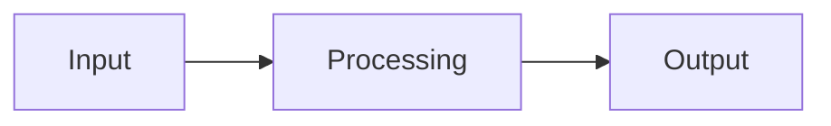

<!-- migrated from the legacy platform spec; canonical OpenSpec source -->
# Core.Threading Specification

## Purpose

OS-thread primitives via syscalls—preemptive parallelism separate from cooperative fibers.

## Requirements

### Requirement: Core.Threading is the OS-thread surface: Decision [D-CORE-SYST-0001]
The Beskid standard SHALL enforce the following migrated contract section. Accepted ADR decisions are binding; uppercase requirement keywords retain their BCP-14 meaning.

> | Rule | Detail |
> | --- | --- |
> | API | `Core.Threading` is the only supported **preemptive** OS-thread module |
> | Fibers | Cooperative APIs stay in the concurrency package |

**Stable ID:** `BSP-REQ-DEC34B7C1AC5`  
**Legacy source:** `site/spec-content/platform-spec/core-library/concurrency/core-threading/adr/0001-os-thread-surface-only/content.md`  
**Source SHA-256:** `441b70913768b6081efb83b2989d343e6af4ba7de39f77dee16f7e603828fc09`

#### Scenario: Conformance exercises Decision
- **GIVEN** an implementation claims conformance with this capability
- **WHEN** behavior governed by this contract section is exercised
- **THEN** every MUST, SHALL, REQUIRED, prohibition, and accepted decision in the section is satisfied

### Requirement: Do not build fibers on OS threads: Decision [D-CORE-SYST-0002]
The Beskid standard SHALL enforce the following migrated contract section. Accepted ADR decisions are binding; uppercase requirement keywords retain their BCP-14 meaning.

> | Rule | Detail |
> | --- | --- |
> | Forbidden | Fiber scheduler emulation via `Core.Threading` in corelib |
> | Required | Use [Concurrency package](/platform-spec/core-library/concurrency/concurrency-package/) |

**Stable ID:** `BSP-REQ-349E1984227B`  
**Legacy source:** `site/spec-content/platform-spec/core-library/concurrency/core-threading/adr/0002-no-fibers-on-threading/content.md`  
**Source SHA-256:** `4de890713ed375b7ba646299abe6ff8150c1b61ad332b70e9193c6cfa2994e6c`

#### Scenario: Conformance exercises Decision
- **GIVEN** an implementation claims conformance with this capability
- **WHEN** behavior governed by this contract section is exercised
- **THEN** every MUST, SHALL, REQUIRED, prohibition, and accepted decision in the section is satisfied

### Requirement: Distinct Thread.Yield and Concurrency.Yield: Decision [D-CORE-SYST-0003]
The Beskid standard SHALL enforce the following migrated contract section. Accepted ADR decisions are binding; uppercase requirement keywords retain their BCP-14 meaning.

> | Rule | Detail |
> | --- | --- |
> | `Thread.Yield` | OS-level yield |
> | `Concurrency.Yield` | `fiber_yield` cooperative reschedule |

**Stable ID:** `BSP-REQ-C17452B2CF6C`  
**Legacy source:** `site/spec-content/platform-spec/core-library/concurrency/core-threading/adr/0003-distinct-yield-entry-points/content.md`  
**Source SHA-256:** `f8d475eed71e3f2cd32489667b96a561fe54e967550a52a0513b3fd6afa661f1`

#### Scenario: Conformance exercises Decision
- **GIVEN** an implementation claims conformance with this capability
- **WHEN** behavior governed by this contract section is exercised
- **THEN** every MUST, SHALL, REQUIRED, prohibition, and accepted decision in the section is satisfied

### Requirement: Per-thread GC session on entry: Decision [D-CORE-SYST-0004]
The Beskid standard SHALL enforce the following migrated contract section. Accepted ADR decisions are binding; uppercase requirement keywords retain their BCP-14 meaning.

> | Rule | Detail |
> | --- | --- |
> | Entry | Thread start **must** establish runtime heap session |
> | FFI | `extern "C"` stays pinned to calling OS thread for call duration |

**Stable ID:** `BSP-REQ-9059C3DF2D90`  
**Legacy source:** `site/spec-content/platform-spec/core-library/concurrency/core-threading/adr/0004-per-thread-gc-session/content.md`  
**Source SHA-256:** `b8c6134b96e5bd4c2b3eca6c5f56488b4740959812f25fb8e8c7c93e17ad6ef3`

#### Scenario: Conformance exercises Decision
- **GIVEN** an implementation claims conformance with this capability
- **WHEN** behavior governed by this contract section is exercised
- **THEN** every MUST, SHALL, REQUIRED, prohibition, and accepted decision in the section is satisfied

## Informative Source Provenance

The records below preserve migration history and are not normative except where text was extracted into a requirement above.

### Source Record: Core.Threading

**Authority:** informative provenance  
**Legacy path:** `/platform-spec/core-library/concurrency/core-threading/`  
**Source:** `site/spec-content/platform-spec/core-library/concurrency/core-threading/content.md`  
**SHA-256:** `1f0961547e9ef0a8850056550a79c173a39ec251c7d68b87da38af26b605c2aa`

<details>
<summary>Migrated source text</summary>

``````markdown
<SpecSection title="What this feature specifies" id="what-this-feature-specifies">
**`Core.Threading`** is the only supported **preemptive OS-thread** surface in `corelib_concurrency`. It wraps syscall-backed **Spawn**, **Join**, and **Yield** for kernel-scheduled threads. Cooperative fibers (`Fiber<T>`, **Channel**) **must** use the **[Concurrency package](/platform-spec/core-library/concurrency/concurrency-package/)**, not threads built in user code on top of this module.
</SpecSection>

<SpecSection title="Implementation anchors" id="implementation-anchors">
- Module prefix `Core.Threading` under `compiler/corelib/packages/foundation/src/Core/Threading/`
- Syscall and extern targets documented in **[Panic, IO, and syscalls](/platform-spec/execution/runtime/panic-io-and-syscalls/)**
- Per-thread GC session rules: **[Extern dispatch and policy](/platform-spec/execution/abi-and-host/extern-dispatch-and-policy/)**
</SpecSection>

<SpecSection title="Contract statement" id="contract-statement">
**`Core.Threading`** lives in the **`corelib_concurrency`** package under module prefix **`Core.Threading`**. It wraps **OS threads** (preemptive, kernel-scheduled) using **syscalls** and/or documented **extern** targets—not fiber stack switching.

Cooperative concurrency **must** use **[Concurrency package](/platform-spec/core-library/concurrency/concurrency-package/)** (`Fiber<T>`, **Channel**). Do not implement fibers on top of `Core.Threading` in corelib.
</SpecSection>

<SpecSection title="Responsibilities" id="responsibilities">
| API (illustrative) | Role |
| --- | --- |
| `Thread.Spawn` | Start OS thread with entry function; returns `Result<Thread, ThreadError>` |
| `Thread.Join` | Wait for OS thread completion |
| `Thread.Yield` | OS-level yield (distinct from `Concurrency.Yield`) |

Fiber scheduler worker pool may **use** OS threads internally; user code should not confuse the two **Yield** entry points.
</SpecSection>

<SpecSection title="FFI and GC" id="ffi-and-gc">
OS thread entry points **must** establish a runtime heap session and GC root attachment per thread before calling Beskid code. **extern "C"** from any fiber or thread **must** stay pinned to the calling OS thread for the call duration (see **[Extern dispatch and policy](/platform-spec/execution/abi-and-host/extern-dispatch-and-policy/)**).
</SpecSection>

<SpecSection title="Phase alignment" id="phase-alignment">
Phase A: fiber scheduler may use a **fixed pool** of OS threads with **one GC mutator**; `Core.Threading` documents raw thread creation for libraries that truly need preemptive threads. Phase B: parallel GC mutators—thread module and fiber pool coordination updated in scheduler spec without renaming public **Thread** APIs.
</SpecSection>
## Decisions
<!-- spec:generate:adr-index -->
No open decisions. Closed choices are normative ADRs under **`adr/`** (`D-CORE-SYST-0001` … `D-CORE-SYST-0004`); use the reader **ADRs** tab for expandable detail.
<!-- /spec:generate:adr-index -->
## Articles
<!-- spec:generate:article-index -->
_No articles in this bundle yet._
<!-- /spec:generate:article-index -->
``````

</details>

### Source Record: Core.Threading is the OS-thread surface

**Authority:** informative provenance  
**Legacy path:** `/platform-spec/core-library/concurrency/core-threading/adr/0001-os-thread-surface-only/`  
**Source:** `site/spec-content/platform-spec/core-library/concurrency/core-threading/adr/0001-os-thread-surface-only/content.md`  
**SHA-256:** `441b70913768b6081efb83b2989d343e6af4ba7de39f77dee16f7e603828fc09`

<details>
<summary>Migrated source text</summary>

``````markdown
## Context

Cooperative and preemptive concurrency need distinct entry points.

## Decision

| Rule | Detail |
| --- | --- |
| API | `Core.Threading` is the only supported **preemptive** OS-thread module |
| Fibers | Cooperative APIs stay in the concurrency package |

## Consequences

User code must not implement fibers atop `Thread.Spawn`.

## Verification anchors

`packages/foundation/src/Core/Threading/` sources; runtime syscall docs.
``````

</details>

### Source Record: Do not build fibers on OS threads

**Authority:** informative provenance  
**Legacy path:** `/platform-spec/core-library/concurrency/core-threading/adr/0002-no-fibers-on-threading/`  
**Source:** `site/spec-content/platform-spec/core-library/concurrency/core-threading/adr/0002-no-fibers-on-threading/content.md`  
**SHA-256:** `4de890713ed375b7ba646299abe6ff8150c1b61ad332b70e9193c6cfa2994e6c`

<details>
<summary>Migrated source text</summary>

``````markdown
## Context

Mixing models breaks GC safepoints and scheduler invariants.

## Decision

| Rule | Detail |
| --- | --- |
| Forbidden | Fiber scheduler emulation via `Core.Threading` in corelib |
| Required | Use [Concurrency package](/platform-spec/core-library/concurrency/concurrency-package/) |

## Consequences

Documentation and examples steer authors to spawn/fiber APIs.

## Verification anchors

Concurrency integration tests; core-threading module docs.
``````

</details>

### Source Record: Distinct Thread.Yield and Concurrency.Yield

**Authority:** informative provenance  
**Legacy path:** `/platform-spec/core-library/concurrency/core-threading/adr/0003-distinct-yield-entry-points/`  
**Source:** `site/spec-content/platform-spec/core-library/concurrency/core-threading/adr/0003-distinct-yield-entry-points/content.md`  
**SHA-256:** `f8d475eed71e3f2cd32489667b96a561fe54e967550a52a0513b3fd6afa661f1`

<details>
<summary>Migrated source text</summary>

``````markdown
## Context

Kernel scheduling differs from cooperative fiber reschedule.

## Decision

| Rule | Detail |
| --- | --- |
| `Thread.Yield` | OS-level yield |
| `Concurrency.Yield` | `fiber_yield` cooperative reschedule |

## Consequences

Names and docs must not alias the two yields.

## Verification anchors

Runtime tests distinguishing syscall vs fiber_yield.
``````

</details>

### Source Record: Per-thread GC session on entry

**Authority:** informative provenance  
**Legacy path:** `/platform-spec/core-library/concurrency/core-threading/adr/0004-per-thread-gc-session/`  
**Source:** `site/spec-content/platform-spec/core-library/concurrency/core-threading/adr/0004-per-thread-gc-session/content.md`  
**SHA-256:** `b8c6134b96e5bd4c2b3eca6c5f56488b4740959812f25fb8e8c7c93e17ad6ef3`

<details>
<summary>Migrated source text</summary>

``````markdown
## Context

Parallel OS threads require independent GC attachment rules in Phase A.

## Decision

| Rule | Detail |
| --- | --- |
| Entry | Thread start **must** establish runtime heap session |
| FFI | `extern "C"` stays pinned to calling OS thread for call duration |

## Consequences

Violations risk root loss or cross-thread heap corruption.

## Verification anchors

[Extern dispatch and policy](/platform-spec/execution/abi-and-host/extern-dispatch-and-policy/); GC phase ADRs.
``````

</details>

### Source Record: Core.Threading - Contracts and edge cases

**Authority:** informative provenance  
**Legacy path:** `/platform-spec/core-library/concurrency/core-threading/articles/contracts-and-edge-cases/`  
**Source:** `site/spec-content/platform-spec/core-library/concurrency/core-threading/articles/contracts-and-edge-cases/content.md`  
**SHA-256:** `b291d577b3f3a1ac8c36ebd1b9d50b42e187425cfe13818e3f3ebd89c09c004f`

<details>
<summary>Migrated source text</summary>

``````markdown
## Hard requirements

The normative specification in this capability's Requirements section defines the hard requirements for this feature. This article documents edge cases and contract-level guarantees.

## Edge cases

Edge cases are documented as they are discovered during implementation. Key edge cases include:

- Interactions with other features that may produce unexpected results
- Boundary conditions at the limits of defined behavior
- Error paths and diagnostic conditions

## Invariants

The following invariants must hold across all implementations:

1. The normative specification takes precedence over implementation behavior
2. Diagnostic codes are registered in the diagnostic code registry and must not be reused
3. Conformance tests must pass at the declared conformance level

## Contract guarantees

Implementations must satisfy the contracts defined in this capability's Requirements section. Violations must be surfaced through the diagnostic system.
``````

</details>

### Source Record: Core.Threading - Design model

**Authority:** informative provenance  
**Legacy path:** `/platform-spec/core-library/concurrency/core-threading/articles/design-model/`  
**Source:** `site/spec-content/platform-spec/core-library/concurrency/core-threading/articles/design-model/content.md`  
**SHA-256:** `8ed532fcc8c8797954a487a1686e242836b9061c1af150e37309f0a6fa781c76`

<details>
<summary>Migrated source text</summary>

``````markdown
## Design overview

This article describes the conceptual model and design decisions behind the feature. The normative specification lives in this capability's Requirements section (and related OpenSpec sibling capabilities); this article expands on the rationale, subsystem boundaries, and architectural choices.

## Key design decisions

- Decision details are recorded as ADRs under the hub's `adr/` directory when formal record-keeping is needed.
- Design rationale here is informative; normative contract language lives in this capability's Requirements section.

## Subsystem boundaries

Refer to this capability's Requirements section for the authoritative specification. This article provides supplementary design context.

## Related articles

- [Contracts and edge cases](../contracts-and-edge-cases/)
- [Verification and traceability](../verification-and-traceability/)
``````

</details>

### Source Record: Core.Threading - Examples

**Authority:** informative provenance  
**Legacy path:** `/platform-spec/core-library/concurrency/core-threading/articles/examples/`  
**Source:** `site/spec-content/platform-spec/core-library/concurrency/core-threading/articles/examples/content.md`  
**SHA-256:** `bd5a280dc5a0dea35878305e31dd868cf08dc936fddcdb61c570100a5217a89e`

<details>
<summary>Migrated source text</summary>

``````markdown
## Basic usage

```beskid
// TODO: Add basic usage example for this feature
```

## Common patterns

```beskid
// TODO: Add common usage patterns
```

## Edge case examples

```beskid
// TODO: Add edge case examples
```

> **Note:** Full code examples for this feature are being developed. See this capability's Requirements section for the normative specification.
``````

</details>

### Source Record: Core.Threading - FAQ and troubleshooting

**Authority:** informative provenance  
**Legacy path:** `/platform-spec/core-library/concurrency/core-threading/articles/faq-and-troubleshooting/`  
**Source:** `site/spec-content/platform-spec/core-library/concurrency/core-threading/articles/faq-and-troubleshooting/content.md`  
**SHA-256:** `34e3b25674c8339ea8a873ebb592b4d0a2a26d82970eaa0613fab63a5da935e8`

<details>
<summary>Migrated source text</summary>

``````markdown
## Frequently asked questions

### Is this feature stable?

This capability's status metadata indicates the maturity level. Articles marked `Proposed` are under active development.

### How does this interact with other features?

See the "Related articles" section in each article and the `related.json` files for cross-feature links.

### Where can I find implementation details?

Implementation anchors are listed under Implementation anchors in this capability's Requirements or Informative Source Provenance.

## Troubleshooting

### Diagnostic codes

Refer to this capability's Requirements section for feature-specific diagnostic codes. All codes are registered in the [Diagnostic code registry](/platform-spec/compiler/semantic-pipeline/diagnostic-code-registry/).

### Common errors

- **Spec violation:** If behavior contradicts this capability's Requirements section, the capability specification takes precedence.
- **Missing conformance:** If a test case is missing, add it to the `articles/verification-and-traceability/` article.
``````

</details>

### Source Record: Core.Threading - Flow and algorithm

**Authority:** informative provenance  
**Legacy path:** `/platform-spec/core-library/concurrency/core-threading/articles/flow-and-algorithm/`  
**Source:** `site/spec-content/platform-spec/core-library/concurrency/core-threading/articles/flow-and-algorithm/content.md`  
**SHA-256:** `f39b6304ca6eb027a431325baf4e1a6467ef7e0eaa97c9122fb182e4183af956`

<details>
<summary>Migrated source text</summary>

``````markdown
## Processing steps

The normative algorithm for this feature is defined in the compiler implementation. This article provides an informative overview of the processing flow.

## Data flow



## Algorithm outline

1. Parse the relevant syntax from the source
2. Resolve names and types according to the rules in this capability's Requirements section
3. Lower to intermediate representation
4. Code generation

> **Note:** Detailed flow documentation is being developed. Refer to the compiler implementation for the authoritative algorithm.
``````

</details>

### Source Record: Core.Threading - Verification and traceability

**Authority:** informative provenance  
**Legacy path:** `/platform-spec/core-library/concurrency/core-threading/articles/verification-and-traceability/`  
**Source:** `site/spec-content/platform-spec/core-library/concurrency/core-threading/articles/verification-and-traceability/content.md`  
**SHA-256:** `9439acab42fb1b051e86501fb13de418795f864d4e431a2d1b99d4e02e271fbe`

<details>
<summary>Migrated source text</summary>

``````markdown
## Conformance evidence

Conformance to this specification is verified through:

1. **Compiler test suite** — Unit and integration tests in the compiler workspace
2. **Corelib conformance** — Published corelib packages must conform to the specification
3. **End-to-end tests** — E2E tests validate the full pipeline

## Test coverage

Test coverage for this feature is tracked in the compiler's test suite. Key test areas include:

- Syntax validation
- Semantic analysis (type checking, name resolution)
- Code generation and lowering
- Runtime behavior

## Verification anchors

Implementation anchors are listed under Implementation anchors in this capability's Requirements or Informative Source Provenance.

## Traceability

Each normative statement in this capability's Requirements section should be traceable to:
- A test case in the compiler test suite
- An ADR documenting the decision
- A diagnostic code in the diagnostic registry
``````

</details>
