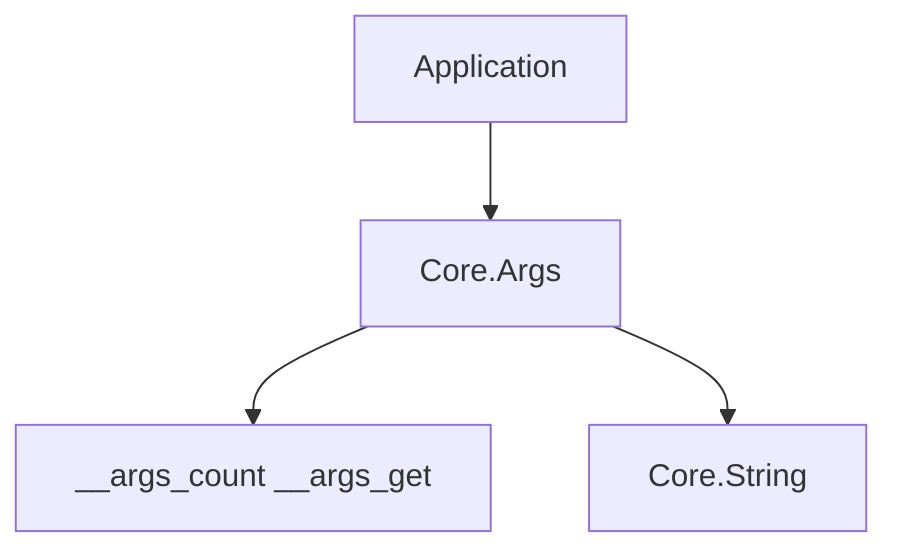

<!-- migrated from the legacy platform spec; canonical OpenSpec source -->
# Core.Args Specification

## Purpose

Command-line argument access with bounds-checked indexing, flag detection, and value extraction supporting both `--flag=value` and `--flag value` forms.

## Requirements

### Requirement: Core.Args command-line argument access: Decision [D-CORE-PRIM-0050]
The Beskid standard SHALL enforce the following migrated contract section. Accepted ADR decisions are binding; uppercase requirement keywords retain their BCP-14 meaning.

> `Core.Args` wraps `__args_count` and `__args_get` builtins. `All()` returns all args including argv[0]; `Count()` returns the count including argv[0]; `ProgramName()` returns argv[0]; `Get(i64)` returns `Result<string, ArgsError>` with bounds checking; `HasFlag(string)` checks for exact match (`--verbose` or `-v`); `ValueOf(string)` supports both `--flag=value` (prefix match via `String.IndexOfFrom`) and `--flag value` (next-arg) forms. Negative indices on `Get` return `IndexOutOfRange`.

**Stable ID:** `BSP-REQ-CB142E9E339E`
**Legacy source:** `site/spec-content/platform-spec/core-library/foundation-and-primitives/core-args/content.md`
**Source SHA-256:** `0000000000000000000000000000000000000000000000000000000000000000`

#### Scenario: Conformance exercises Decision
- **GIVEN** an implementation claims conformance with this capability
- **WHEN** behavior governed by this contract section is exercised
- **THEN** every MUST, SHALL, REQUIRED, prohibition, and accepted decision in the section is satisfied

## Informative Source Provenance

The records below preserve migration history and are not normative except where text was extracted into a requirement above.

### Source Record: Core.Args

**Authority:** informative provenance
**Legacy path:** `/platform-spec/core-library/foundation-and-primitives/core-args/`
**Source:** `site/spec-content/platform-spec/core-library/foundation-and-primitives/core-args/content.md`
**SHA-256:** `0000000000000000000000000000000000000000000000000000000000000000`

<details>
<summary>Migrated source text</summary>

``````markdown
<SpecSection title="What this feature specifies" id="what-this-feature-specifies">
`Core.Args` provides typed access to command-line arguments via `__args_count` and `__args_get` builtins. All functions include argv[0] (the program name) in indexing. Bounds-checked access returns `Result<string, ArgsError>`. Flag detection supports both long (`--verbose`) and short (`-v`) forms. `ValueOf` handles `--flag=value` (prefix matching) and `--flag value` (next-argument) conventions.
</SpecSection>

<SpecSection title="Scope" id="scope">
- **In scope:** Argument enumeration, bounds-checked access, flag detection, value extraction.
- **Out of scope:** POSIX getopt-style option parsing (bundled short flags, `--` terminator), subcommand routing, environment variable fallback.
</SpecSection>

<SpecSection title="Implementation anchors" id="implementation-anchors">
- `compiler/corelib/packages/foundation/src/Core/Args/Args.bd`
- `compiler/corelib/packages/foundation/src/Core/Args/ArgsError.bd`
- Corelib tests: `compiler/corelib/beskid_corelib/tests/corelib_tests/src/core/ArgsTests.bd`
- System tests: `compiler/corelib/beskid_corelib/tests/corelib_tests/src/system/ArgsTests.bd`
</SpecSection>

<SpecSection title="Contract statement" id="contract-statement">
| Surface | Rule |
| --- | --- |
| `All()` | Returns `string[]` of all args including argv[0] |
| `Count()` | Returns count including argv[0] |
| `ProgramName()` | Returns `__args_get(0)` or `""` if no args |
| `Get(i64)` | Returns `Result<string, ArgsError>`; negative index or index >= count → `IndexOutOfRange` |
| `HasFlag(string)` | Exact string match against each arg |
| `ValueOf(string)` | Checks `flag + "="` prefix first, then `flag` as standalone arg with next-arg value |
| Error enum | `ArgsError { IndexOutOfRange, FlagNotFound }` |
| Tier | `@tier(supported)` |
</SpecSection>

## Decisions
<!-- spec:generate:adr-index -->
No open decisions. Closed choices are normative ADRs under **`adr/`** (`D-CORE-PRIM-0050`); use the reader **ADRs** tab for expandable detail.
<!-- /spec:generate:adr-index -->
## Articles
<!-- spec:generate:article-index -->
- [Contracts and edge cases](./articles/contracts-and-edge-cases/)
- [Design model](./articles/design-model/)
- [Verification and traceability](./articles/verification-and-traceability/)
<!-- /spec:generate:article-index -->
``````

</details>

### Source Record: Contracts and edge cases

**Authority:** informative provenance
**Legacy path:** `/platform-spec/core-library/foundation-and-primitives/core-args/articles/contracts-and-edge-cases/`
**Source:** `site/spec-content/platform-spec/core-library/foundation-and-primitives/core-args/articles/contracts-and-edge-cases/content.md`
**SHA-256:** `0000000000000000000000000000000000000000000000000000000000000000`

<details>
<summary>Migrated source text</summary>

``````markdown
## Normative requirements

| ID | Requirement |
| --- | --- |
| **ARGS-001** | `Count()` **must** delegate to `__args_count()` and include argv[0]. |
| **ARGS-002** | `All()` **must** return a `string[]` of all arguments including argv[0]. |
| **ARGS-003** | `ProgramName()` **must** return `__args_get(0)` or `""` when count < 1. |
| **ARGS-004** | `Get(i64)` **must** return `IndexOutOfRange` for negative indices and indices >= count. |
| **ARGS-005** | `HasFlag(string)` **must** perform exact string comparison against each argument. |
| **ARGS-006** | `ValueOf(string)` **must** support `--flag=value` (prefix match) and `--flag value` (adjacent arg) forms, returning `FlagNotFound` when absent. |

## Edge cases

| Case | Behavior |
| --- | --- |
| `Get(-1)` | Returns `Error(IndexOutOfRange)` |
| `Get(99999)` | Returns `Error(IndexOutOfRange)` |
| `HasFlag("--nonexistent")` | Returns `false` |
| `ValueOf` with flag present but no value | Returns `FlagNotFound` |
| Empty arg list | `Count()` returns 0; `ProgramName()` returns `""` |

## Implementation anchors

- `compiler/corelib/packages/foundation/src/Core/Args/Args.bd`
- `compiler/corelib/packages/foundation/src/Core/Args/ArgsError.bd`
``````

</details>

### Source Record: Design model

**Authority:** informative provenance
**Legacy path:** `/platform-spec/core-library/foundation-and-primitives/core-args/articles/design-model/`
**Source:** `site/spec-content/platform-spec/core-library/foundation-and-primitives/core-args/articles/design-model/content.md`
**SHA-256:** `0000000000000000000000000000000000000000000000000000000000000000`

<details>
<summary>Migrated source text</summary>

``````markdown
## Module layout

| Module | Role |
| --- | --- |
| `Core.Args` | Hub exposing all argument access functions |
| `Core.Args.ArgsError` | `ArgsError` enum (`IndexOutOfRange`, `FlagNotFound`) |

## Dependencies

- `Core.Optional.Option` — for `TryGet` soft-lookup variant
- `Core.Results.Result` — for error-enveloped accessors
- `Core.String` — for `IndexOfFrom`, `SubSlice`, `Len` in `ValueOf` prefix matching

## Layering


``````

</details>

### Source Record: Verification and traceability

**Authority:** informative provenance
**Legacy path:** `/platform-spec/core-library/foundation-and-primitives/core-args/articles/verification-and-traceability/`
**Source:** `site/spec-content/platform-spec/core-library/foundation-and-primitives/core-args/articles/verification-and-traceability/content.md`
**SHA-256:** `0000000000000000000000000000000000000000000000000000000000000000`

<details>
<summary>Migrated source text</summary>

``````markdown
| Requirement | Test anchor |
| --- | --- |
| **ARGS-001**, **ARGS-002** | `ArgsTests.bd` — `args_count_at_least_one`, `args_all_returns_array` |
| **ARGS-003** | `ArgsTests.bd` — `args_program_name_non_empty`, `args_get_zero_is_program_name` |
| **ARGS-004** | `ArgsTests.bd` — `args_get_out_of_range`, `args_get_negative_index` |
| **ARGS-005** | `ArgsTests.bd` — `args_has_flag_absent`, `args_has_flag_returns_false_for_absent` |

Harness: `compiler/corelib/beskid_corelib/tests/corelib_tests/src/core/ArgsTests.bd`
System harness: `compiler/corelib/beskid_corelib/tests/corelib_tests/src/system/ArgsTests.bd`
``````

</details>
