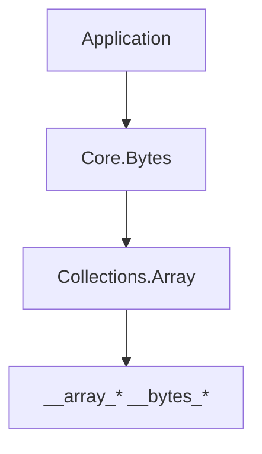

<!-- migrated from the legacy platform spec; canonical OpenSpec source -->
# Core.Bytes Specification

## Purpose

Byte buffer primitives over u8[] and runtime array builtins.

## Requirements

### Requirement: u8 array canonical buffer: Decision [D-CORE-PRIM-0010]
The Beskid standard SHALL enforce the following migrated contract section. Accepted ADR decisions are binding; uppercase requirement keywords retain their BCP-14 meaning.

> `u8[]` with `__array_new(1, len)` is the canonical byte buffer. No separate `Bytes` heap type in v1.

**Stable ID:** `BSP-REQ-83F740FF4888`  
**Legacy source:** `site/spec-content/platform-spec/core-library/foundation-and-primitives/core-bytes/adr/0010-u8-array-canonical-buffer/content.md`  
**Source SHA-256:** `bd757e92a2d44a2043752cfadd2b65fb7c30f2b1b49d39f354eec3177fe00412`

#### Scenario: Conformance exercises Decision
- **GIVEN** an implementation claims conformance with this capability
- **WHEN** behavior governed by this contract section is exercised
- **THEN** every MUST, SHALL, REQUIRED, prohibition, and accepted decision in the section is satisfied

## Informative Source Provenance

The records below preserve migration history and are not normative except where text was extracted into a requirement above.

### Source Record: Core.Bytes

**Authority:** informative provenance  
**Legacy path:** `/platform-spec/core-library/foundation-and-primitives/core-bytes/`  
**Source:** `site/spec-content/platform-spec/core-library/foundation-and-primitives/core-bytes/content.md`  
**SHA-256:** `921952a14b8da95f8493898b02f8653838d70d8aa170e202acc54fc2eb83c893`

<details>
<summary>Migrated source text</summary>

``````markdown
<SpecSection title="What this feature specifies" id="what-this-feature-specifies">
`Core.Bytes` provides allocation-explicit byte buffer operations on `u8[]` handles backed by `BeskidArray` and `__array_*` / `__bytes_*` runtime builtins. It **must not** call syscalls directly.
</SpecSection>

<SpecSection title="Implementation anchors" id="implementation-anchors">
- `compiler/corelib/packages/foundation/src/Core/Bytes/`
- `compiler/crates/beskid_runtime/src/builtins/arrays.rs`
</SpecSection>

## Decisions
<!-- spec:generate:adr-index -->
No open decisions. Closed choices are normative ADRs under **`adr/`** (`D-CORE-PRIM-0010`); use the reader **ADRs** tab for expandable detail.
<!-- /spec:generate:adr-index -->
## Articles
<!-- spec:generate:article-index -->
- [Contracts and edge cases](./articles/contracts-and-edge-cases/)
- [Design model](./articles/design-model/)
- [Verification and traceability](./articles/verification-and-traceability/)
<!-- /spec:generate:article-index -->
``````

</details>

### Source Record: u8 array canonical buffer

**Authority:** informative provenance  
**Legacy path:** `/platform-spec/core-library/foundation-and-primitives/core-bytes/adr/0010-u8-array-canonical-buffer/`  
**Source:** `site/spec-content/platform-spec/core-library/foundation-and-primitives/core-bytes/adr/0010-u8-array-canonical-buffer/content.md`  
**SHA-256:** `bd757e92a2d44a2043752cfadd2b65fb7c30f2b1b49d39f354eec3177fe00412`

<details>
<summary>Migrated source text</summary>

``````markdown
## Decision

`u8[]` with `__array_new(1, len)` is the canonical byte buffer. No separate `Bytes` heap type in v1.

## Verification anchors

`Core.Bytes.Slice.New`, `compiler/crates/beskid_runtime/src/builtins/arrays.rs`
``````

</details>

### Source Record: Contracts and edge cases

**Authority:** informative provenance  
**Legacy path:** `/platform-spec/core-library/foundation-and-primitives/core-bytes/articles/contracts-and-edge-cases/`  
**Source:** `site/spec-content/platform-spec/core-library/foundation-and-primitives/core-bytes/articles/contracts-and-edge-cases/content.md`  
**SHA-256:** `1e8c0da589c1a09d4ce925be5bd5265e77a0c6860158e5339af9f86b64120147`

<details>
<summary>Migrated source text</summary>

``````markdown
## Normative requirements

| ID | Requirement |
| --- | --- |
| **BYTES-001** | `u8[]` **must** be the canonical byte buffer type; allocation uses `__array_new(1, len)`. |
| **BYTES-002** | Out-of-bounds index on `Get`/`Set` **must** trap (same policy as `string[index]`). |
| **BYTES-003** | `Core.Bytes` **must not** embed OS or syscall semantics. |
| **BYTES-004** | `Copy`, `Compare`, and `Fill` **must** be deterministic; allocation for `SubSlice` **must** be explicit. |
| **BYTES-005** | String ↔ bytes conversion **must** route through `Core.Encoding` (not ad-hoc UTF-8 in `Core.Bytes`). |
| **BYTES-006** | Empty buffers **must** be representable with length zero. |
| **BYTES-007** | `Len` **must** delegate to `__array_len`. |
| **BYTES-008** | Hot paths **may** use `__bytes_copy` / `__bytes_compare` builtins when registered. |
| **BYTES-009** | Module tier **must** be `@tier(standard)` for prelude re-export. |

## Edge cases

| Case | Behavior |
| --- | --- |
| Zero-length copy | No-op; returns without error |
| `SubSlice` past end | Clamps to buffer end per runtime contract |
| Null backing (test builds) | `Len` returns 0; indexed access traps |

## Implementation anchors

- `compiler/corelib/packages/foundation/src/Core/Bytes/`
- `compiler/corelib/beskid_corelib/tests/corelib_tests/src/core/BytesTests.bd`
``````

</details>

### Source Record: Design model

**Authority:** informative provenance  
**Legacy path:** `/platform-spec/core-library/foundation-and-primitives/core-bytes/articles/design-model/`  
**Source:** `site/spec-content/platform-spec/core-library/foundation-and-primitives/core-bytes/articles/design-model/content.md`  
**SHA-256:** `a75ca127a3d831bbf73ea69e399154e3b581131de406f1e21e7ab3434c222e4f`

<details>
<summary>Migrated source text</summary>

``````markdown
## Module layout

| Module | Role |
| --- | --- |
| `Core.Bytes` | Re-export hub |
| `Core.Bytes.Errors` | `BytesError` variants |
| `Core.Bytes.Slice` | `Len`, `Get`, `Set`, `Copy`, `Compare`, `Fill`, `SubSlice`, `New` |
| `Core.Bytes.Convert` | Thin helpers delegating to `Core.Encoding.Utf8` |

## Layering



## Related topics

- [Contracts and edge cases](./contracts-and-edge-cases/)
- [Core.Encoding](/platform-spec/core-library/foundation-and-primitives/core-encoding/)
``````

</details>

### Source Record: Verification and traceability

**Authority:** informative provenance  
**Legacy path:** `/platform-spec/core-library/foundation-and-primitives/core-bytes/articles/verification-and-traceability/`  
**Source:** `site/spec-content/platform-spec/core-library/foundation-and-primitives/core-bytes/articles/verification-and-traceability/content.md`  
**SHA-256:** `0de77624b6cc09e62697e96b15ca0863db99804bdcd5c3792d0eb456bf1d6eb1`

<details>
<summary>Migrated source text</summary>

``````markdown
| Requirement | Test anchor |
| --- | --- |
| **BYTES-001**, **BYTES-007** | `BytesTests.bd` — `bytes_new_has_length` |
| **BYTES-003** | `BytesTests.bd` — `bytes_from_str_builtin_smoke` |
| **BYTES-002** | Runtime trap on OOB `__bytes_get` / `__bytes_set` (integration) |
| **BYTES-005** | `EncodingUtf8Tests.bd` — `utf8_from_str_builtin_round_trip` |

Harness: `compiler/corelib/beskid_corelib/tests/corelib_tests/src/core/BytesTests.bd`
``````

</details>
