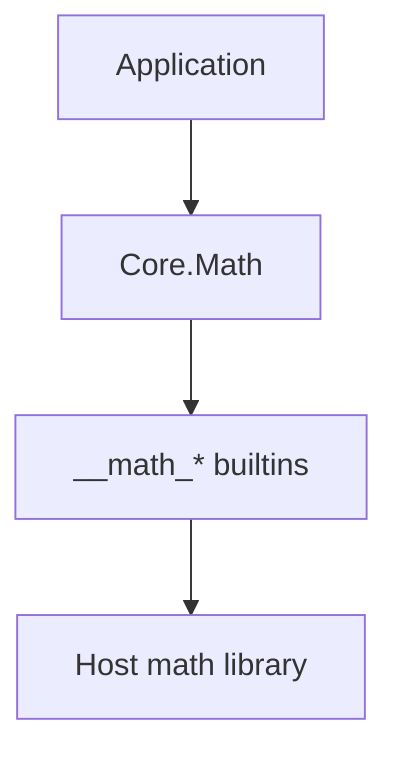

<!-- migrated from the legacy platform spec; canonical OpenSpec source -->
# Core.Math Specification

## Purpose

Numeric operations and transcendental functions over i64 and f64, backed by runtime builtins for floor, ceil, sqrt, log, and trig.

## Requirements

### Requirement: Core.Math numeric operations: Decision [D-CORE-PRIM-0030]
The Beskid standard SHALL enforce the following migrated contract section. Accepted ADR decisions are binding; uppercase requirement keywords retain their BCP-14 meaning.

> `Core.Math` provides integer arithmetic (Abs, Min, Max, Clamp, Pow) and floating-point transcendental functions (Floor, Ceil, Round, RoundTo, Sqrt, Log, Log2, Log10, Sin, Cos, Tan, Atan2, Pi, E, DegreesToRadians, RadiansToDegrees). Domain errors (negative input to Sqrt, non-positive input to Log/Log2/Log10, negative exponent to Pow) silently saturate to 0.0 or 0 rather than trapping. Floating-point builtins delegate to `__math_*` intrinsics.

**Stable ID:** `BSP-REQ-289E136A7F48`
**Legacy source:** `site/spec-content/platform-spec/core-library/foundation-and-primitives/core-math/content.md`
**Source SHA-256:** `0000000000000000000000000000000000000000000000000000000000000000`

#### Scenario: Conformance exercises Decision
- **GIVEN** an implementation claims conformance with this capability
- **WHEN** behavior governed by this contract section is exercised
- **THEN** every MUST, SHALL, REQUIRED, prohibition, and accepted decision in the section is satisfied

## Informative Source Provenance

The records below preserve migration history and are not normative except where text was extracted into a requirement above.

### Source Record: Core.Math

**Authority:** informative provenance
**Legacy path:** `/platform-spec/core-library/foundation-and-primitives/core-math/`
**Source:** `site/spec-content/platform-spec/core-library/foundation-and-primitives/core-math/content.md`
**SHA-256:** `0000000000000000000000000000000000000000000000000000000000000000`

<details>
<summary>Migrated source text</summary>

``````markdown
<SpecSection title="What this feature specifies" id="what-this-feature-specifies">
`Core.Math` provides integer arithmetic (Abs, Min, Max, Clamp, Pow) and floating-point transcendental functions (Floor, Ceil, Round, RoundTo, Sqrt, Log, Log2, Log10, Sin, Cos, Tan, Atan2, Pi, E, DegreesToRadians, RadiansToDegrees). Integer `Pow` uses iterative multiplication; negative exponent and domain violations saturate silently. Floating-point builtins (`__math_floor`, `__math_ceil`, `__math_sqrt`, `__math_log`, `__math_log2`, `__math_log10`, `__math_sin`, `__math_cos`, `__math_tan`, `__math_atan2`) are backed by the host math library.
</SpecSection>

<SpecSection title="Scope" id="scope">
- **In scope:** Integer arithmetic, rounding, exponentiation, sqrt, log, trig, constants, degree/radian conversion.
- **Out of scope:** Complex numbers, arbitrary-precision arithmetic, vector/matrix math, `MathError` results (errors are not surfaced to callers — domain violations saturate).
</SpecSection>

<SpecSection title="Implementation anchors" id="implementation-anchors">
- `compiler/corelib/packages/foundation/src/Core/Math/Math.bd`
- `compiler/corelib/packages/foundation/src/Core/Math/MathError.bd`
- Corelib tests: `compiler/corelib/beskid_corelib/tests/corelib_tests/src/core/MathTests.bd`
</SpecSection>

<SpecSection title="Contract statement" id="contract-statement">
| Surface | Rule |
| --- | --- |
| Domain errors | Silently saturate: Sqrt of negative → 0.0; Log/Log2/Log10 of non-positive → 0.0; Pow with negative exp → 0 |
| MathError enum | Defined (`DomainError`, `Overflow`, `Underflow`) but not returned by any v1 function |
| Round ties | Away from zero: `Round(3.5) == 4.0`, `Round(-3.5) == -4.0` |
| Builtins | `Floor`, `Ceil`, `Sqrt`, `Log`, `Log2`, `Log10`, `Sin`, `Cos`, `Tan`, `Atan2` delegate to `__math_*` intrinsics |
| Tier | `@tier(supported)` |
</SpecSection>

## Decisions
<!-- spec:generate:adr-index -->
No open decisions. Closed choices are normative ADRs under **`adr/`** (`D-CORE-PRIM-0030`); use the reader **ADRs** tab for expandable detail.
<!-- /spec:generate:adr-index -->
## Articles
<!-- spec:generate:article-index -->
- [Contracts and edge cases](./articles/contracts-and-edge-cases/)
- [Design model](./articles/design-model/)
- [Verification and traceability](./articles/verification-and-traceability/)
<!-- /spec:generate:article-index -->
``````

</details>

### Source Record: Contracts and edge cases

**Authority:** informative provenance
**Legacy path:** `/platform-spec/core-library/foundation-and-primitives/core-math/articles/contracts-and-edge-cases/`
**Source:** `site/spec-content/platform-spec/core-library/foundation-and-primitives/core-math/articles/contracts-and-edge-cases/content.md`
**SHA-256:** `0000000000000000000000000000000000000000000000000000000000000000`

<details>
<summary>Migrated source text</summary>

``````markdown
## Normative requirements

| ID | Requirement |
| --- | --- |
| **MATH-001** | `Abs(i64)` **must** return the absolute value; `Abs(i64.MIN_VALUE)` wraps via two's-complement. |
| **MATH-002** | `Min(i64, i64)` and `Max(i64, i64)` **must** return the smaller/larger of two i64 values. |
| **MATH-003** | `Clamp(i64, i64, i64)` **must** constrain value to [min, max] inclusive. |
| **MATH-004** | `Pow(i64, i64)` **must** compute value^exp iteratively; exp < 0 returns 0; exp == 0 returns 1. |
| **MATH-005** | `Floor(f64)`, `Ceil(f64)` **must** delegate to `__math_floor`/`__math_ceil` builtins. |
| **MATH-006** | `Round(f64)` **must** round ties away from zero using Floor/Ceil composition. |
| **MATH-007** | `RoundTo(f64, i64)` **must** scale, round, and descale to the given decimal places. |
| **MATH-008** | `Sqrt(f64)` **must** return `__math_sqrt` for non-negative input; 0.0 for negative input. |
| **MATH-009** | `Log(f64)`, `Log2(f64)`, `Log10(f64)` **must** return 0.0 for non-positive input, else delegate to `__math_log*`. |
| **MATH-010** | `Sin(f64)`, `Cos(f64)`, `Tan(f64)`, `Atan2(f64, f64)` **must** delegate to `__math_sin`, `__math_cos`, `__math_tan`, `__math_atan2`. |
| **MATH-011** | `Pi()` **must** return 3.141592653589793; `E()` **must** return 2.718281828459045. |
| **MATH-012** | `DegreesToRadians(f64)` **must** multiply by π/180; `RadiansToDegrees(f64)` **must** multiply by 180/π. |
| **MATH-013** | `MathError` enum **must** exist with `DomainError`, `Overflow`, `Underflow` variants but is not returned by v1 functions. |
| **MATH-014** | Module tier **must** be `@tier(supported)`. |

## Edge cases

| Case | Behavior |
| --- | --- |
| `Pow(value, -5)` | Returns 0 (negative exponent saturation) |
| `Sqrt(-1.0)` | Returns 0.0 |
| `Log(0.0)` | Returns 0.0 |
| `Log2(-1.0)` | Returns 0.0 |
| `Abs(i64.MIN_VALUE)` | Wraps in two's-complement (i64.MIN_VALUE negated) |
| `Clamp(15, 0, 10)` | Returns 10 (capped to max) |
| `Round(3.5)` | Returns 4.0 (ties away from zero) |

## Implementation anchors

- `compiler/corelib/packages/foundation/src/Core/Math/Math.bd`
- `compiler/corelib/packages/foundation/src/Core/Math/MathError.bd`
``````

</details>

### Source Record: Design model

**Authority:** informative provenance
**Legacy path:** `/platform-spec/core-library/foundation-and-primitives/core-math/articles/design-model/`
**Source:** `site/spec-content/platform-spec/core-library/foundation-and-primitives/core-math/articles/design-model/content.md`
**SHA-256:** `0000000000000000000000000000000000000000000000000000000000000000`

<details>
<summary>Migrated source text</summary>

``````markdown
## Module layout

| Module | Role |
| --- | --- |
| `Core.Math` | Hub exposing all functions |
| `Core.Math.MathError` | `MathError` enum (DomainError, Overflow, Underflow) |

## Layering



## Related topics

- [Contracts and edge cases](./contracts-and-edge-cases/)
- [Core.Random](/platform-spec/core-library/foundation-and-primitives/core-random/)

## Implementation anchors

- `compiler/corelib/packages/foundation/src/Core/Math/Math.bd`
``````

</details>

### Source Record: Verification and traceability

**Authority:** informative provenance
**Legacy path:** `/platform-spec/core-library/foundation-and-primitives/core-math/articles/verification-and-traceability/`
**Source:** `site/spec-content/platform-spec/core-library/foundation-and-primitives/core-math/articles/verification-and-traceability/content.md`
**SHA-256:** `0000000000000000000000000000000000000000000000000000000000000000`

<details>
<summary>Migrated source text</summary>

``````markdown
| Requirement | Test anchor |
| --- | --- |
| **MATH-001** | `MathTests.bd` — `abs_positive`, `abs_negative`, `abs_zero` |
| **MATH-002** | `MathTests.bd` — `min_standard`, `max_standard` |
| **MATH-003** | `MathTests.bd` — `clamp_within_range`, `clamp_below_range`, `clamp_above_range` |
| **MATH-004** | `MathTests.bd` — `pow_zero_exponent`, `pow_one_exponent`, `pow_small` |
| **MATH-005**, **MATH-006** | `MathTests.bd` — `floor_positive`, `ceil_positive`, `round_down`, `round_up` |
| **MATH-008** | `MathTests.bd` — `sqrt_perfect`, `sqrt_negative_saturates` |
| **MATH-009** | `MathTests.bd` — `log_positive`, `log_nonpositive_saturates` |
| **MATH-011** | `MathTests.bd` — `pi_constant_positive`, `e_constant_positive` |
| **MATH-012** | `MathTests.bd` — `degrees_to_radians`, `radians_to_degrees` |

Harness: `compiler/corelib/beskid_corelib/tests/corelib_tests/src/core/MathTests.bd`
``````

</details>
